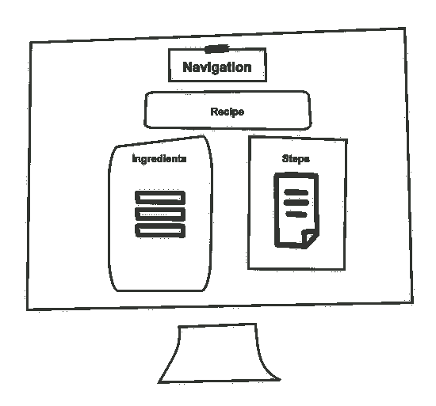

# React 项目的目录结构

> 原文：<https://itnext.io/a-directory-structure-for-react-projects-99fb084c61f1?source=collection_archive---------8----------------------->


我已经回答了问题“你如何在一个 *React* 项目中组织你的组件？”在过去几个月的内部邮件列表中出现过几次。我想分享我在上一个项目中使用的结构。

我有一个[小项目](https://github.com/sirech/cookery2-frontend)作为例子。它基于两个简单的概念:

*   文件夹是功能
*   使用`index.ts`来区分公共和私有组件。

# 文件夹是功能

我以前叫这个*垂直结构化组件*，但是这个名字更朗朗上口！这个想法是远离功能结构，在那里你有像`controllers`、`models`或`services`这样的东西。相反，您应该围绕特性对代码进行分组。文件夹包含理解应用程序中特定功能所需的全部内容。代码更紧密地映射了域。如果你喜欢[领域驱动设计](https://en.wikipedia.org/wiki/Domain-driven_design)，那对你来说应该是美妙的。

让我们看一个例子。我有一个视图来显示食谱的细节，包括配料和步骤列表。数据是通过服务从后端获取的。页面大致如下所示:



在我的代码中，我将把整个特性放在一个文件夹中，如下所示:

```
recipe-details
├── Ingredients.tsx
├── RecipeDetails.test.tsx
├── RecipeDetails.tsx
├── Steps.tsx
├── __mocks__ 
│ └── recipeDetails.service.ts 
├── index.ts 
└── recipeDetails.service.ts
```

主要成分是`RecipeDetails`。还有其他更小的组件，`Ingredients`和`Steps`。有一个服务可以与 API、一些测试和模拟对话。通过查看这个文件夹，我能够理解这个特性，而不必梳理我的应用程序的多个部分。

# 扩大规模

随着应用程序变得越来越复杂，这些文件夹可能会增长到一个文件夹中有太多文件的程度。提取组件有助于保持组件较小。

我们在一个项目中做的另一个优化是引入了`pages`的概念。页面就像一个功能，但是与一个 URL 相关联。将你的代码分成几个页面符合用户对你的应用的看法，并且有助于代码的拆分。

# 使用 index.ts 来区分公共组件和私有组件

有了 *TypeScript* ，你就无法像在 *Kotlin* 中那样将代码分组到包中。不过，您可以用文件夹来模拟它。我喜欢使用文件夹的`index.ts`作为入口点。如果部件被出口到那里，您只能从外部**进口部件。回到我们的`recipe-details`，我唯一想要导出的组件是`RecipeDetails`，所以我的`index.ts`看起来是这样的:**

```
export { default } from './RecipeDetails'
```

我从主`App.tsx`进口的是这样的:

```
import RecipeDetails from 'recipe-details'
```

在 [eslint-plugin-import](https://github.com/benmosher/eslint-plugin-import/blob/master/docs/rules/no-internal-modules.md) 插件的帮助下，使用 [eslint](https://eslint.org/) 来执行这个约定。这不是一个合适的包系统，但在实践中它工作得很好。

`Ingredients`和`Steps`都是私有组件。它们旨在仅用于该文件夹的上下文中，以确保所有组件保持较小。他们没有专门的测试，而是按照 [React 测试库](https://github.com/testing-library/react-testing-library)的原则，作为整个特性的一部分进行测试。

# 对公共组件使用绝对导入

这使得重构变得更加容易。

```
import Navigation from 'navigation'
```

这是通过在`tsconfig.json`中进行小调整来完成的:

```
{
   "include": ["src"]
}
```

# `components`下的通用组件

当心过度抽象！不要试图创建过于通用的组件。它最终会带来更多的复杂性。如果你确实有一些可以重用的组件，我喜欢把它们放在一个`components`文件夹中:

```
components 
├── adapter-link 
│ ├── AdapterLink.tsx 
│ └── index.ts 
└── recipe
  ├── Recipe.test.tsx
  ├── Recipe.tsx
  ├── index.ts
  └── types.ts
```

# 不要害怕修补

没有什么是一成不变的。保持元件小。不要让文件夹变得太大。有意义的时候把他们分组。并且给[有效的打字稿](https://hceris.com/book-review-effective-typescript/)读一读，真的是一本好书。

*原载于 2020 年 7 月 19 日*[*https://hceris.com*](https://hceris.com/a-directory-structure-for-react-projects/)*。*