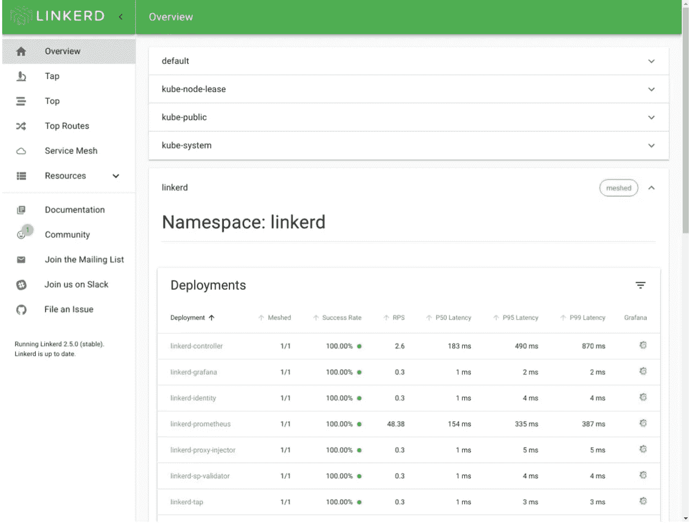
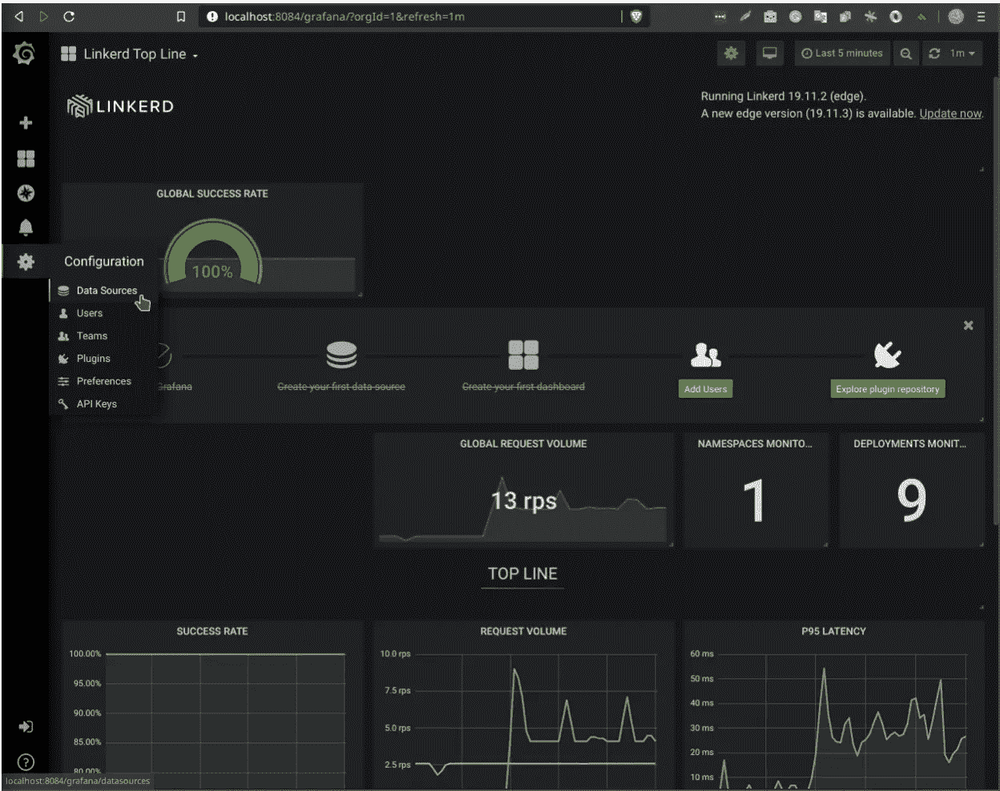
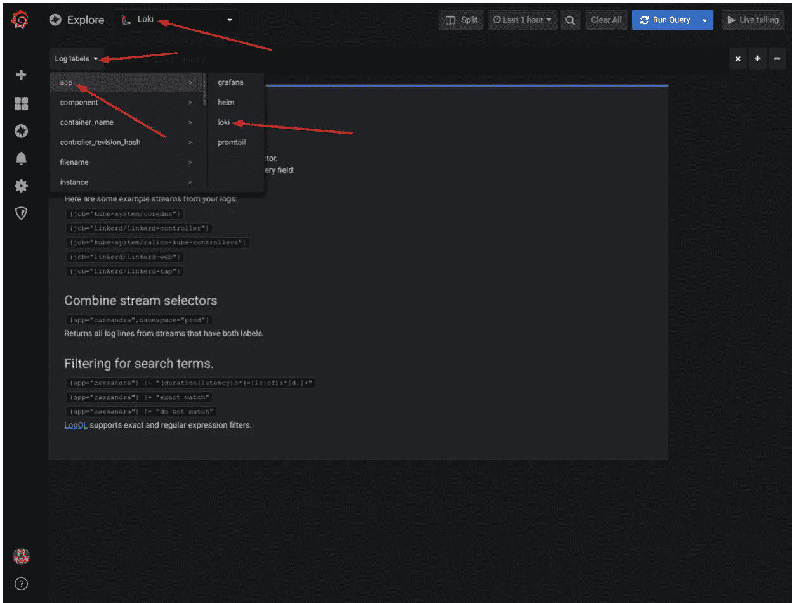

# 几十行代码

> 原文：<https://itnext.io/a-few-dozen-lines-of-code-4068a863cf20?source=collection_archive---------5----------------------->

# 第 1 部分:Kubernetes 平台


*关于如何使用基于 Kubernetes 的平台轻松获得集中式日志记录、更好的安全性、性能指标和身份验证的深入系列。*

# 介绍

这篇文章标志着我们关于创建在云原生平台上运行的云原生应用的系列文章的开始。我们所说的“云原生平台”不仅仅指 Kubernetes，而是一个功能全面的解决方案，包括不同的应用程序，可以帮助您管理日志、安全性和基于微服务的解决方案的可观察性。

我们将一步步向您展示如何在 Go from scratch 中创建微服务应用程序。这将说明无需修改您的应用程序即可获得云原生堆栈的所有优势，因此它也可以轻松应用于现有应用程序。

在本教程中，我们想给你一个平台和代码的完整概述。我们的目标是用尽可能少的工具获得应用程序的企业操作属性。

*   我们将首先创建一个开发环境，引入我们想要使用的云原生应用程序堆栈。
*   然后，我们将向您展示创建一个可以从该设置中受益的应用程序是多么容易。
*   稍后，我们将转到应用程序的部署，向您展示我们如何利用云原生特性解决多个问题。
*   完成后，我们将探索我们创建的平台的功能，并向您展示如何将它们用于运营。

# Kubernetes 作为企业应用程序的平台

在这个系列中，我想更多地关注我们可以在 Kubernetes 之上构建的平台以及我们需要编写的代码。但是，不能忽略 Kubernetes 本身提供的一些元素。所以，让我介绍一下我们故事中的英雄，我们与云原生世界的接口，既有来自 Kubernetes API 的，也有来自社区的其他工具。

下面列出了一些我们会特别感兴趣的 Kubernetes 本地特性:

**部署** 部署是 Kubernetes 的一个概念，它允许您运行特定数量的应用程序容器副本(称为 pod)。它会观察这个数字，并重新创建任何失败的 pod，无论是由于软件还是硬件问题。它还允许您滚动发布新版本的软件。

我们在之前的[博客文章](https://blog.giantswarm.io/understanding-basic-kubernetes-concepts-using-deployments-manage-services-declaratively/)中写到了这一点。你也可以从[官方文件](https://kubernetes.io/docs/concepts/workloads/controllers/deployment/)中了解更多。

**服务** 服务充当一组 pod 的软件负载平衡器。它通常针对单个部署，并向外部用户公开其 pod。

我们在另一篇博客文章中有更多的细节，你也可以阅读[服务](https://kubernetes.io/docs/concepts/services-networking/service/)的概念解释。

**网络策略** 网络策略定义了您的 pod 可以通过网络与谁对话。基本上，它们是 Kubernetes 的一种防火墙形式。我们需要它们来提供网络层安全。

查看[网络政策](https://kubernetes.io/docs/concepts/services-networking/network-policies/)解释器了解更多细节。

**Pod 安全策略** PSP 是一种权限控制框架。它允许您设置和执行规则，禁止您的 pod 执行一些会带来安全风险且对您的 pod 不必要的特权系统操作。

如果您想了解更多信息，请探索 [Pod 安全策略](https://kubernetes.io/docs/concepts/policy/pod-security-policy/)。

**基于角色的访问控制(RBAC)** RBAC 是一组规则，控制哪些 Kubernetes API 对象(如部署、服务、PSP)可以被您的 pod 访问。我们的应用程序不需要任何 Kubernetes API 访问，但是我们需要一组简单的 RBAC 规则，允许应用程序访问我们需要设置的 PSP 对象。

深入研究这个主题，将它添加到您的书签中:[基于角色的访问控制](https://kubernetes.io/docs/reference/access-authn-authz/rbac/)。

现在，让我介绍一下我们将在 Kubernetes 基础上创建微服务平台的项目:

**Linkerd** 是一个服务网格。这是一款让您能够更好地了解和控制微服务设置的工具。我们将使用 Linkerd 来提供更好的安全性([服务到服务通信的自动 TLS 加密](https://linkerd.io/2/features/automatic-mtls/))，获取[基本性能指标](https://linkerd.io/2/features/dashboard/)，以及[执行跟踪](https://linkerd.io/2/features/distributed-tracing/)。Linkerd 最大的一个优点就是用起来真的很简单。

Loki 仍然是一个相当新的日志管理系统。这是弹性搜索领域的一个新项目。尽管如此，我们将使用 Loki，因为它易于设置，并且与 Grafana 集成，无论如何我们都需要它用于 Linkerd。

我们在[之前的博客文章](https://blog.giantswarm.io/grafana-logging-using-loki/)中写过洛基。

**Grafana** 是一款数据可视化工具。我们将使用它来绘制来自 Linkerd 的性能指标，并显示来自 Loki 的日志。

# 准备开发平台

我们希望我们的应用程序具有生产级的特性，但是我们需要在某个地方开发和测试它。正如我在介绍中提到的，设置和运行 Kubernetes 平台本身就是一个话题。在这里，我们设置了一个开发环境，它将允许我们运行并查看我们的应用程序。

让我们从查看这个博客条目的存储库开始。完成后，让我们切换到“基本”分支:

```
git clone https://github.com/giantswarm/giantswarm-todo-app.git cd giantswarm-todo-app git checkout blog_v1
```

# 发展环境

我们的应用程序将用 Go 编写，所以请访问[安装文档](https://golang.org/doc/install)并安装 Go，如果你还没有的话。我将使用 Go 1.13.1。

对于代码编辑，使用任何适合你的，但是如果你正在寻找一个好的开始，我推荐使用 [Go 插件](https://code.visualstudio.com/docs/languages/go)的 [VS 代码](https://code.visualstudio.com/)。我们还将使用 Makefiles 来构建我们的代码，所以要确保安装了`make`工具。

# Kubernetes 工具

有几个很好的项目可以让你建立一个开发 Kubernetes 环境，Minikube 可能是最受欢迎的一个。请按照本指南[为您的操作系统安装`minikube`。我们还需要`kubectl`——如果你没有，看看这里的](https://kubernetes.io/docs/tasks/tools/install-minikube/)。也请安装 VirtualBox 作为 minikube 的虚拟化平台。要安装这个，请遵循此处的说明。

暂时不要启动任何集群。只要确保以下工具是可操作的:

*   VirtualBox(我用的是 6.1.4 版)
*   Kubectl(我用的是 v1.17.0)
*   Minikube(我用的是 v1.9.0)

此外，我们需要再安装两个工具:

实际上，Docker 已经被 Minikube 安装为一个容器运行时，但是它将在一个虚拟机中运行。为了让我们的生活更容易，我们也直接在我们的开发机器上安装 Docker(我使用的是 Docker Engine — Community v19.03.6)。

Helm 就像是你在 Kubernetes 上运行的包管理器或软件安装器。我们将使用它来部署我们的 Kubernetes 平台的组件(我使用的是 Helm v 2 . 16 . 5；注意现在不要使用头盔 3，我们仍然使用头盔 2)。

# Kubernetes 平台环境

准备好所有工具后，我们可以开始创建 Kubernetes 安装，Minikube 运行在一个具有 4 GB 内存和 2 个 CPU 内核(这是本教程的推荐大小)的虚拟机上。

```
minikube start --kubernetes-version='v1.17.0' --memory='4g' --network-plugin='cni' --vm-driver='virtualbox' --cpus='4'
```

现在，等到 Minikube 启动虚拟机。

Minikube 完成后，我们需要向`kube-system`名称空间添加一个标签——稍后将使用它来选择去往该名称空间的网络流量:

```
kubectl label ns kube-system name=kube-system
```

Kubernetes 没有任何默认的网络(CNI)驱动程序，所以我们需要自己安装一个。我们用[印花布](https://github.com/projectcalico/cni-plugin)做这个。运行:

```
kubectl apply -f [https://docs.projectcalico.org/v3.13/manifests/calico.yaml](https://docs.projectcalico.org/v3.13/manifests/calico.yaml)
```

现在，开始:

```
kubectl -n kube-system get pods -w
```

并且等到一切都有了“状态:正在运行”和“就绪:1/1”。

现在我们的 Kubernetes 已经准备好了，我们使用 Helm 部署 Linkerd、Loki 和 Grafana。首先，让我们初始化 Helm:

然后，确认名称以`tiller-deploy`开头的 pod 处于“就绪:1/1”和“状态:运行”状态:

```
kubectl -n kube-system get po
```

最后，我们需要添加巨虫群的头盔库到我们的头盔配置中。我们用它们来安装我们团队准备的应用程序，包括 Loki、Grafana 和 Linkerd。我们添加了主要的“巨人温暖”目录，以及“游乐场”目录。您可以点击了解更多关于我们的应用目录[。在这里，我们把它们作为普通的舵图表库。](https://docs.giantswarm.io/basics/app-catalog/)

```
$ helm repo add giantswarm https://giantswarm.github.io/giantswarm-catalog $ helm repo add giantswarm-playground https://giantswarm.github.io/giantswarm-playground-catalog $ helm repo update
```

如上所述，Linkerd 可以通过引入 [mTLS](https://linkerd.io/2/features/automatic-mtls/) 来提供更好的安全性。不过，它需要加密证书来做到这一点。

为了更简单，我们将安装一个名为`cert-manager`的应用程序，它将为 Linkerd 动态创建证书。我们安装了:

```
helm install --namespace kube-system -n cert-manager --version=1.0.6 giantswarm/cert-manager-app
```

现在我们可以安装 Linkerd 了。

我们需要在安装过程中设置两个选项。第一个将图表配置为使用由`cert-manager`创建的证书。

第二个是在 Grafana 中创建一个 admin 级别(而不是只读)的帐户，它包含在图表中，所以我们可以在以后定制 Grafana。

为了使它更容易，存储库包含一个随时可用的配置文件，用于使用 Helm 部署的 Linkerd 我们只需要指向”。/helm/configs/linkerd.yaml ":

```
helm install --namespace linkerd -n linkerd -f ./helm/configs/linkerd.yaml --version 0.2.1 giantswarm-playground/linkerd2-app
```

给它几分钟时间进行初始化，然后检查 Linkerd 名称空间中的所有 pod 是否都准备好了:

```
kubectl -n linkerd get po
```

检查您是否可以访问 Linkerd web dashboard。在您的终端中运行以下命令:

```
kubectl -n linkerd port-forward service/linkerd-web 8084
```

现在，在你的浏览器中访问[http://localhost:8084/overview](http://localhost:8084/overview)。

您应该会看到一个默认的仪表板，如下所示。在仪表板中，单击“Grafana”列中的任何图标。您将被重定向到 grafana web 界面。

在终端中保持端口转发，让我们转到下一个应用程序。



# 安装 Loki

出于开发目的安装带有 Helm 的 Loki 非常容易。部署 Loki 后，我们需要 Grafana 作为 web UI 来显示 Loki 的日志。Grafana 已经被 Linkerd 部署了，所以我们将重用它。通过运行以下命令安装 Loki:

```
helm install --namespace loki -n loki --version 0.2.0 giantswarm-playground/loki-stack-app
```

等待命名空间 Loki 中的 pod 启动:

```
kubectl -n loki get po
```

现在，在 Linkerd 设置步骤中仍然启用端口转发，请访问[http://localhost:8084/grafana。](http://localhost:8084/grafana.)

在最左侧的菜单中，选择 cog 图标，然后转到“配置->数据源”。



单击绿色的“添加数据源按钮”并选择“Loki”。

仅在 URL 字段中填入`http://loki.loki:3100`，然后点击“添加并测试”。

我们的 Loki 现在应该可以作为数据源使用了。要进行检查，请从左侧菜单中选择指南针图标，然后单击“探索”。确保顶部的数据源类型设置为“Loki”，然后从“日志标签”值中选择“app -> loki”:



您应该会看到显示在 Grafana 中的 Loki 日志。如果一切正常，用 Ctrl+c 终止终端中的“port-forward”命令。

我们的开发平台现在已经 100%准备好了，让我们来写一些代码吧！在本系列的第 2 部分中，我们将创建实际的微服务应用程序，敬请关注！

# 我们的平台和巨型蜂群

[在 Giant Swarm](https://www.giantswarm.io/) ，我们体会到了开发环境和企业级生产环境之间的巨大差异。我们的使命是为您弥合这一鸿沟，这样您就不必独自面对这一复杂性。

我们可以在几分钟内让您启动并运行生产级 Kubernetes 集群。如果在 AWS 上运行，上面提到的 cert manager 已经是内置的了。Giant Swarm 的客户也已经在[游乐场目录](https://docs.giantswarm.io/basics/app-catalog/)中提供了 Loki、LinkerD 和 Grafana。

由[尤卡兹·piątkowski](https://twitter.com/piontec)撰写:Kubernetes 平台架构师@ [巨型蜂群](https://twitter.com/giantswarm)

[](https://twitter.com/piontec) [## 皮翁泰克

### 来自 piontec (@piontec)的最新推文:“验证我自己:我是 https://t.co/VALQh9fW3B…上的 piontec

twitter.com](https://twitter.com/piontec)