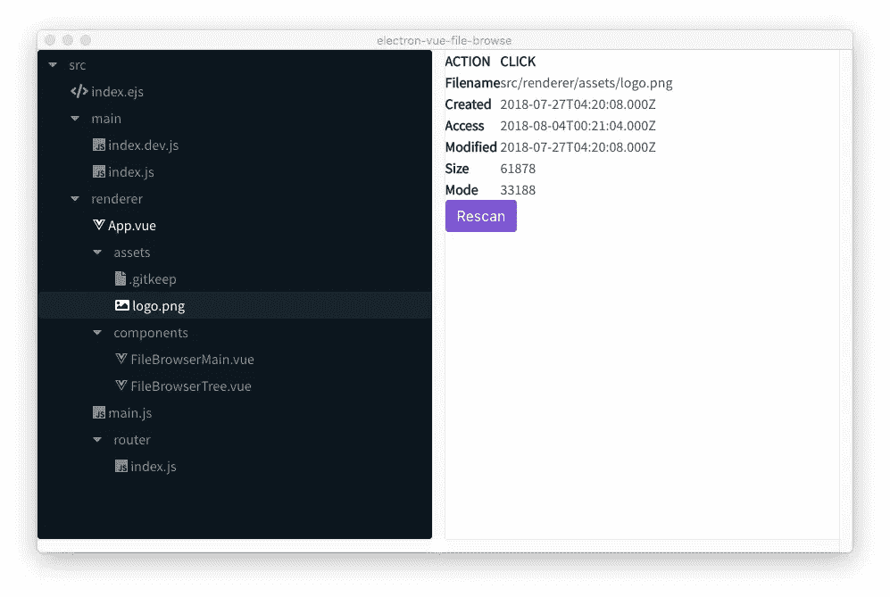

# 用于 Electron/Vue.js 应用程序的文件系统浏览器组件

> 原文：<https://itnext.io/a-file-system-browser-component-for-electron-vue-js-applications-eab285fbb3cb?source=collection_archive---------0----------------------->

许多应用程序需要浏览文件系统中的文件。例如，大多数程序员的文本编辑器(我是用微软的 Visual Studio 代码写的)包括一个显示文件系统的侧边栏。因此，在 Electron/Vue.js 应用程序中使用这样的组件非常重要。在本文中，我们将研究实现这种组件的一种方法。


本文转载自:[https://techsparx . com/nodejs/electron/file-browser-component . html](https://techsparx.com/nodejs/electron/file-browser-component.html)

按照本文，克隆以下存储库:

*   [https://github.com/robogeek/vue-file-tree-demo](https://github.com/robogeek/vue-file-tree-demo)—示范应用
*   [https://github.com/robogeek/vue-file-tree](https://github.com/robogeek/vue-file-tree)—显示文件树的组件

让我们初始化应用程序:

```
$ vue init simulatedgreg/electron-vue electron-vue-file-browse? Application Name electron-vue-file-browse
? Project description Electron/Vue.js file browser
? Select which Vue plugins to install vue-electron, vue-router
? Use linting with ESLint? No
? Set up unit testing with Karma + Mocha? No
? Set up end-to-end testing with Spectron + Mocha? No
? What build tool would you like to use? builder
? author David Herron <david@davidherron.com> vue-cli · Generated "electron-vue-file-browse".---All set. Welcome to your new electron-vue project!Make sure to check out the documentation for this boilerplate at
https://simulatedgreg.gitbooks.io/electron-vue/content/.Next Steps: $ cd electron-vue-file-browse
  $ yarn (or `npm install`)
  $ yarn run dev (or `npm run dev`)
```

位于`simulatedgreg/electron-vue`的工作区包括一个非常有用的框架，用于使用 Vue.js 开发电子应用程序。我已经将它配置为使用`vue-electron`和`vue-router`，但不使用其他组件，并且不包含任何 ESLint 或单元测试特性。你可能会发现用不同的方式回答这些问题很有用。该框架同时支持`electron-builder`和`electron-packager`，我选择了前者。

接下来，我们设置依赖关系:

```
$ cd electron-vue-file-browse
$ npm install buefy walkdir path-directories vue-awesome sl-vue-tree --save
$ npm install
$ npm run dev
```

最后一步现在有点没用，因为我们还没有进行配置。

选择的依赖项包括:

*   *Buefy* 是使用布尔玛作为组件的 Vue.js 包
*   *Walkdir* 支持跟踪给定目录下文件的变化
*   *路径目录*有助于拆分目录名，这对构建文件浏览器对象树很有用
*   vue-awesome 将字体 awesome 图标封装成 Vue.js 组件
*   sl-vue-tree 是一个不错的树形视图组件。我们将使用它来存储文件系统内容

让我们开始骨骼应用程序的手术。

# `src/main/main.js` -主流程中的主模块

我们将在`main.js`中做一些有选择的修改来调整应用程序的启动方式。

```
import { 
  app, BrowserWindow, ipcMain, dialog 
} from 'electron';
import path from 'path';
import walkdir from 'walkdir';
```

如图所示更改导入。

在提供的`createWindow`函数的末尾添加这行代码:

```
scanDirectory();
```

然后添加这个函数的实现:

```
const rootdir = '/Volumes/Extra/akasha-tools/electron-vue-file-browse';function scanDirectory() {
  walkdir('src', {})
  .on('file', (fn, stat) => {
    mainWindow.webContents.send('file', fn.slice(rootdir.length + 1), stat);
  })
  .on('directory', (fn, stat) => {
    mainWindow.webContents.send('directory', fn.slice(rootdir.length + 1), stat);
  })
  .on('error', (fn, err) => {
    console.error(`!!!! ${fn} ${err}`);
  });
}
```

其思想是“遍历”一个选定的目录树，发送出关于该树中文件的信息。因为这是一个测试应用程序，所以有一些硬编码的值。对于一个真正的应用程序，我们需要一个文件浏览器对话框来选择一个目录。

walkdir 模块([https://www.npmjs.com/package/walkdir](https://www.npmjs.com/package/walkdir))"*遍历目录树，根据找到的内容发出事件。*“当它遍历目录树时，它发出关于它所发现的事件。我们只是将这些事件转发给呈现器进程。

`fn`参数是找到的完整路径名。在研究这个应用程序时，似乎更有用的不是发送完整的路径名，而是发送正在扫描的根目录后面的段。因此，我们使用`slice`函数来适当地修剪字符串。

```
ipcMain.on('rescan-directory', () => {
  scanDirectory();
});
```

此消息可以从呈现器进程发送，以使主进程重新扫描目录结构。

```
process.on('unhandledRejection', (reason, p) => {
  console.error(`Unhandled Rejection at: ${util.inspect(p)} reason: ${reason}`);
});
```

这将捕获任何未处理的承诺拒绝错误。参见:[处理未处理的承诺拒绝，避免应用程序崩溃](https://techsparx.com/nodejs/esnext/unhandled-promises.html)

# `src/renderer/main.js` -渲染器进程中的主模块

将`main.js`更改为以下内容

```
import Vue from 'vue'import { ipcRenderer } from 'electron';import App from './App';
import router from './router';
import Buefy from 'buefy';
import 'buefy/lib/buefy.css';Vue.use(Buefy);if (!process.env.IS_WEB) Vue.use(require('vue-electron'))
Vue.config.productionTip = falseexport const messageBus = new Vue({
});/* eslint-disable no-new */
new Vue({
  components: { App },
  router,
  template: '<App/>'
}).$mount('#app') ipcRenderer.on('file', (event, fn, stat) => {
  messageBus.$emit('file', fn, stat);
});ipcRenderer.on('directory', (event, fn, stat) => {
  messageBus.$emit('directory', fn, stat);
});
```

其中一些是从框架继承来的，其余的初始化对我们加载的一些依赖项以及有用对象的支持。

我们初始化 Buefy(UI 工具包)、`sl-tree-vue`(树查看器)和`vue-awesome`(字体真棒)。

`messageBus`对象是一个额外的 Vue 实例，我们将使用它在应用程序中发送消息。Vue.js 非常支持子组件向其父组件发送消息。但是开箱即用，它不直接支持在任何两个组件之间发送消息。我们将使用`messageBus`来这样做——因为所有的 Vue 实例都包含发送和监听消息的功能。

我们看到两条这样的消息——从主进程接收到`file`和`directory`事件，然后在`messageBus`上发出。

# `src/renderer/router/index.js` -路由器

对于这个应用程序，路由器并不是真正必需的，但是我在上面说了“是”，所以代码在这里。在这个模块中，您可以处理多个应用程序页面。目前，`/` URL 只有一个路由，它引用了一个`LandingPage`组件。改成这样:

```
export default new Router({
  routes: [
    {
      path: '/',
      name: 'file-browser-page',
      component: require('@/components/FileBrowserMain').default
    },
    {
      path: '*',
      redirect: '/'
    }
  ]
});
```

# `src/renderer/components/FileBrowserMain.vue`

到目前为止，我们所做的是将该组件定位为应用程序的主窗口。我们将把它实现为一个单文件模板，它将依次演示如何使用面向文件系统的树浏览器。

在`src/renderer/components`中删除所有提供的文件。这些文件组成了演示应用程序，我们不需要任何代码。

创造`FileBrowserTree.vue`来遏制这种:

```
<template>
  <div id="wrapper" class="columns is-gapless is-mobile">
    <file-browser-tree 
          id="file-tree"
          ref="filetree"
          class="column"
          @nodeClick="nodeClick"
          @nodeDoubleClick="nodeDoubleClick"
          @nodeDrop="nodeDrop"> <template slot="context-menu">
        <div @click="doDashboard">Dashboard</div>
        <div @click="doCustomers">Customers</div>
    </template> </file-browser-tree> <div id="file-info-view" class="column">
        <span v-html="fileInfo"></span>
        <button class="button is-primary" @click="rescan">Rescan</button>
    </div>
  </div>
</template><script>const path = require('path');
const util = require('util');
import { messageBus } from '../main.js';
import { ipcRenderer } from 'electron';import FileBrowserTree from 'vue-file-tree';export default {
  name: 'file-browser-main',
  components: {
    'file-browser-tree': FileBrowserTree,
  },
  data() {
    return {
      fileInfo: "",
      nodes: []
    }
  },
  methods: {
    nodeClick(event, node) {
      this.fileInfo = `
        <table>
        <tr><th>ACTION</th><th>CLICK</th></tr>
        <tr><th>Filename</th><td>${node.data.pathname}</td></tr>
        <tr><th>Created</th><td>${node.data.stat.ctime}</td></tr>
        <tr><th>Access</th><td>${node.data.stat.atime}</td></tr>
        <tr><th>Modified</th><td>${node.data.stat.mtime}</td></tr>
        <tr><th>Size</th><td>${node.data.stat.size}</td></tr>
        <tr><th>Mode</th><td>${node.data.stat.mode}</td></tr>
        </table>
        `;
    },
    nodeDoubleClick(node) {
      this.fileInfo = `
        <table>
        <tr><th>ACTION</th><th>DOUBLE-CLICK</th></tr>
        <tr><th>Filename</th><td>${node.data.pathname}</td></tr>
        <tr><th>Created</th><td>${node.data.stat.ctime}</td></tr>
        <tr><th>Access</th><td>${node.data.stat.atime}</td></tr>
        <tr><th>Modified</th><td>${node.data.stat.mtime}</td></tr>
        <tr><th>Size</th><td>${node.data.stat.size}</td></tr>
        <tr><th>Mode</th><td>${node.data.stat.mode}</td></tr>
        </table>
        `;
    },
    nodeDrop(node) {
      this.fileInfo = `
        <table>
        <tr><th>ACTION</th><th>DROP</th></tr>
        <tr><th>Filename</th><td>${node[0].data.pathname}</td></tr>
        <tr><th>Created</th><td>${node[0].data.stat.ctime}</td></tr>
        <tr><th>Access</th><td>${node[0].data.stat.atime}</td></tr>
        <tr><th>Modified</th><td>${node[0].data.stat.mtime}</td></tr>
        <tr><th>Size</th><td>${node[0].data.stat.size}</td></tr>
        <tr><th>Mode</th><td>${node[0].data.stat.mode}</td></tr>
        </table>
        `;
    },
    doCustomers() {
        console.log(`doCustomers`);
        this.$refs.filetree.contextMenuIsVisible = false;
    },
    doDashboard() {
        console.log(`doDashboard`);
        this.$refs.filetree.contextMenuIsVisible = false;
    },
    rescan() {
      this.nodes = [];
      ipcRenderer.send('rescan-directory');
    }
  },
  created: function() {
    console.log(util.inspect(path));
      messageBus.$on('file', (fn, stat) => { 
        this.$refs.filetree.addPathToTree(fn, stat, false);
      });
      messageBus.$on('directory', (fn, stat) => { 
        this.$refs.filetree.addPathToTree(fn, stat, true);
      });
  }
}
</script><style>
  @import url('https://fonts.googleapis.com/css?family=Source+Sans+Pro'); * {
    box-sizing: border-box;
    margin: 0;
    padding: 0;
  } body { font-family: 'Source Sans Pro', sans-serif; } #wrapper {
    height: 100vh;
    width: 100vw;
  } #file-tree, #file-info-view {
    height: 100%;
    overflow: scroll;
  }</style>
```

在`<template>`中我们有一个简单的 Buefy `columns`组件。左侧栏是文件浏览器，右侧是显示信息的区域。右侧还包括一个按钮，用于重新扫描目录内容。

*重新扫描*按钮会向主进程发送一条消息。如果你回头看主进程，你会看到这个消息导致所选的目录被扫描。

当选择的目录被扫描时，一系列的消息从主进程被发送到这里。这些消息或者是`file`或者是`directory`事件，并且包含路径名和对应于文件的`stat`对象。这些消息在事件处理程序中被处理，并转化为将路径名添加到树对象的`addPathToTree`调用。我们稍后会谈到这一点。

注意:`<file-browser-tree ... ref="filetree" ...></file-browser-tree>`

`ref=`属性允许我们这样引用组件的对象:`this.$refs.filetree.addPathToTree(fn, stat, false);`

Vue.js 确保`$refs`对象有对应于每个具有`ref=`属性的组件的字段。该组件将在本文中进一步讨论。

该组件发出的事件有三个处理程序:

*   `nodeClick`处理项目上的点击
*   `nodeDoubleClick`处理项目上的双击
*   `nodeDrop`处理项目上的拖放操作

在这个演示应用程序中，每个都在信息窗格中打印信息。

文件树组件还支持右键单击激活的上下文菜单。我们使用`<template slot-name="context-menu">`将菜单选项注入菜单。它会在鼠标指针的位置自动弹出。演示应用程序中的上下文菜单项只是简单的例子，每个菜单项都调用一个处理程序方法。这些处理程序方法的一个重要步骤是:

```
this.$refs.filetree.contextMenuIsVisible = false;
```

这行代码指示文件树组件关闭菜单。

# `vue-file-tree`组件

我们已经多次提到这个组件，现在是时候研究它了。

组件的存储库有一个完整的构建配置和其他脚本。看见

[https://github.com/robogeek/vue-file-tree](https://github.com/robogeek/vue-file-tree)了解详情。在本文中，我们将只研究`.vue`文件。

要在您的应用程序中使用该组件，请将以下内容添加到应用程序中`package.json`的`dependencies`部分:`"vue-file-tree": "github:robogeek/vue-file-tree",`。然后按照自述文件中的进一步说明进行操作，或者根据前面给出的代码进行操作。

此组件的模板:

```
<template>
    <span>
    <sl-vue-tree
            id="vue-file-tree"
            ref="slvuetree"
            :value="nodes"
            :allowMultiselect="false"
            @nodeclick="nodeClick"
            @nodedblclick="nodeDoubleClick"
            @select="nodeSelect"
            @toggle="nodeToggle"
            @drop="nodeDrop"
            @nodecontextmenu="nodeContextMenu"
            @externaldrop.prevent="onExternalDropHandler"> <template slot="toggle" slot-scope="{ node }">
            <span v-if="!node.isLeaf">
                <font-awesome-icon 
                    icon="caret-right" 
                    v-if="!node.isExpanded"></font-awesome-icon>
                <font-awesome-icon 
                    icon="caret-down"
                    v-else-if="node.isExpanded"></font-awesome-icon>
            </span>
        </template> <template slot="title" slot-scope="{ node }">
            <font-awesome-icon 
                :icon="[ 'fab', 'js' ]" 
                v-if='node.data.type === "application/javascript"'></font-awesome-icon>
            <font-awesome-icon 
                icon="table" 
                v-else-if='node.data.type === "application/json"'></font-awesome-icon>
            <font-awesome-icon 
                icon="image" 
                v-else-if='node.data.type === "IMAGE"'></font-awesome-icon>
            <font-awesome-icon 
                icon="code" 
                v-else-if='node.data.type === "EJS"'></font-awesome-icon>
            <font-awesome-icon 
                :icon="[ 'fab', 'vuejs' ]" 
                v-else-if='node.data.type === "VUEJS"'></font-awesome-icon>
            <font-awesome-icon 
                icon="file" 
                v-else-if="node.isLeaf"></font-awesome-icon>
            {{ node.title }} </template> <template slot="sidebar" slot-scope="{ node }">
            <font-awesome-icon 
                icon="circle" 
                v-if="node.data.isModified"></font-awesome-icon>
        </template>
    </sl-vue-tree> <aside class="menu vue-file-tree-contextmenu" 
            ref="contextmenu" 
            v-show="contextMenuIsVisible">
        <slot name="context-menu"></slot>
    </aside> </span>
</template>
```

我们正在做的是实现另一个组件的包装器，它的库是:[https://github.com/holiber/sl-vue-tree](https://github.com/holiber/sl-vue-tree)

我们实现了许多事件处理程序和其他配置来配置默认行为，这些默认行为作为显示文件系统中文件的树组件是有意义的。

sl-vue-tree 组件支持许多可以注入 HTML 的*槽*。我们添加了以下内容:

*   `toggle`这决定了对于展开的目录节点和关闭的目录节点，显示哪个箭头按钮。
*   `title`这描述了树组件的一行。我们希望根据文件类型显示一个图标。我们有办法选择这些代码来选择正确的图标。
*   `sidebar`这描述了出现在树显示最右边的图标。

我们也有自己的槽`context-menu`，这是上下文菜单 HTML 到达的地方。在这种情况下，我们使用一个 Buefy 菜单组件。该组件的显示由`contextMenuIsVisible`数据项控制。

显然，我们使用的是字体真棒图标集。

接下来，我们添加`<script>`标签:

```
<script>import path from 'path';
import util from 'util';
import splitter from './path-splitdirs';import mime from 'mime';import slVueTree from 'sl-vue-tree';
// import 'sl-vue-tree/dist/sl-vue-tree-dark.css';import { library } from '@fortawesome/fontawesome-svg-core';
import {
  faCaretRight, faCaretDown, faTable, faImage, faFile, faCircle, faCode
} from '@fortawesome/free-solid-svg-icons';
import { faJs, faVuejs } from '@fortawesome/free-brands-svg-icons';
import { FontAwesomeIcon } from '@fortawesome/vue-fontawesome';library.add(faJs, faVuejs, faCaretRight, faCaretDown, faTable, faImage, faFile, faCircle, faCode); /* var nodes = [
    {title: 'Item1', isLeaf: true},
    {title: 'Item2', isLeaf: true, data: { visible: false }},
    {title: 'Folder1'},
    {
      title: 'Folder2', isExpanded: true, children: [
        {title: 'Item3', isLeaf: true},
        {title: 'Item4', isLeaf: true, data: { isModified: true }}
      ]
    }
]; */export default { data() {
        return {
            nodes: [],
            contextMenuIsVisible: false
        }
    },
    components: {
        'sl-vue-tree': slVueTree,
        'font-awesome-icon': FontAwesomeIcon
    },
    created() {
        /*
         * Derived from Buefy's b-dropdown
         * https://github.com/buefy/buefy/blob/dev/src/components/dropdown/Dropdown.vue
         */
        if (typeof window !== 'undefined') {
            document.addEventListener('click', this.clickedOutside)
        }
    },
    methods: {
        nodeClick(node, event) {
            this.$emit('nodeClick', event, node);
        },
        nodeDoubleClick(node, event) {
            console.log(`nodeDoubleClick ${node.title} ${node.data.type} isLeaf ${node.isLeaf} ${util.inspect(node)}`);
            if (!node.isLeaf) {
                this.$refs.slvuetree.onToggleHandler(event, node);
                return;
            }
            this.$emit('nodeDoubleClick', node);
        },
        nodeSelect(node) {
            console.log(`nodeSelect ${util.inspect(node)}`);
        },
        nodeToggle(node) {
            console.log(`nodeToggle ${util.inspect(node)}`);
        },
        nodeDrop(node) {
            console.log(`nodeDrop ${util.inspect(node)}`);
            this.$emit('nodeDrop', node);
        },
        nodeContextMenu(node, event) {
            console.log(`nodeContextMenu ${util.inspect(node)}`);
            this.contextMenuIsVisible = true;
            const $contextMenu = this.$refs.contextmenu;
            $contextMenu.style.left = event.clientX + 'px';
            $contextMenu.style.top = event.clientY + 'px';
        },
        /**
         * Close dropdown if clicked outside.
         * Derived from Buefy's b-dropdown
         * https://github.com/buefy/buefy/blob/dev/src/components/dropdown/Dropdown.vue
         */
        clickedOutside(event) {
            if (!this.isInWhiteList(event.target)) this.contextMenuIsVisible = false;
        },
        // If the "clickOutside" is on a target where we should ignore the click
        // then we should ignore this.  
        // See: https://github.com/buefy/buefy/blob/dev/src/components/dropdown/Dropdown.vue
        isInWhiteList(el) { return false; },
        onExternalDropHandler(cursorPosition, event) {
            console.log('external drop', cursorPosition, util.inspect(event));
        },
        addPathToTree(fn, stat, isDir) {
            console.log(`addPathToTree ${fn} ${util.inspect(stat)} ${isDir}`);
            console.log(`addPathToTree ${util.inspect(process)}`);
            console.log(util.inspect(path));
            fn = path.normalize(fn);
            console.log(`addPathToTree NORMALIZED ${fn}`);
            const basenm = path.basename(fn);
            console.log(`addPathToTree BASENAME ${basenm}`); const split = splitter(fn); console.log(`addPathToTree dirs ${util.inspect(split)}`);
            let curnodes = this.nodes;
            for (let dir of split.dirs) {
                if (dir === '.') continue;
                let found = undefined;
                for (let cur of curnodes) {
                    if (cur.isLeaf === false && cur.title === dir) {
                        found = cur;
                        break;
                    }
                }
                if (!found) {
                    let newnode = {
                        title: dir, 
                        isLeaf: false, 
                        children: [], 
                        data: { 
                            type: "DIRECTORY",
                            pathname: fn, 
                            stat 
                        }
                    };
                    console.log(`addPathToTree !found push newnode ${util.inspect(newnode)}`);
                    curnodes.push(newnode);
                    curnodes = newnode.children;
                } else {
                    curnodes = found.children;
                }
            }
            let newnode = {
                title: basenm, 
                isLeaf: !isDir, 
                data: { 
                    type: mime.getType(fn),
                    pathname: fn,
                    stat
                }
            };
            if (!newnode.data.type) newnode.data.type = "text/plain";
            if (newnode.data.type.startsWith('image/')) newnode.data.type = "IMAGE";
            if (fn.endsWith('.ejs')) newnode.data.type = "EJS";
            if (fn.endsWith('.vue')) newnode.data.type = "VUEJS";
            if (!newnode.isLeaf) newnode.children = [];
            console.log(`addPathToTree FINAL push newnode ${util.inspect(newnode)}`);
            curnodes.push(newnode);
        }
    }
}</script>
```

在顶部，我们导入各种必需的模块。这包括`sl-vue-tree`组件，和一些字体很棒的图标。这两个组件都成为该组件可用的 Vue.js 组件。

`sl-vue-tree`组件期望特定数据结构中的数据项。入乡随俗，所以我们必须给这个组件一个正确的数据结构。数据结构的一个例子在这里显示的注释中。

`addPathToTree`函数接收前面描述的`file`和`directory`消息。它接收一个简单的路径名字符串和一个 Stat 对象。这里的任务是将信息转换成`sl-vue-tree`所需的结构。

我在开发这个组件时遇到了一个问题。创建目录结构要求是将路径名字符串分割成段。以独立于操作系统的方式做到这一点需要仔细考虑。

起初使用了*路径目录*模块(`https://github.com/jy95/path-directories`)。它接受一个路径名，并根据 Windows 或 POSIX 文件路径约定将其可靠地分割成段。不幸的是，正如所写的那样，它在 Node.js 上运行得很好，但是这个`vue-file-tree`组件是打包的，假设它在 web 浏览器中运行。其中*路径目录*假设一个`path`模块与 Node.js 兼容，打包的 Vue.js 组件接收一个`path`模块，该模块提供 Node.js 功能的一个子集。

因此，对替换进行了编码:

```
const _path = require('path');
const normalize = require('normalize-path');
const parsePath = require('parse-filepath');let isWin32 = false;
let isPosix = true;module.exports = function(path2split) {
    path2split = normalize(path2split);
    if (path2split.match(/^[a-zA-Z]\:/)) { isWin32 = true; isPosix = false; }
    if (path2split.indexOf('\\') >= 0) { isWin32 = true; isPosix = false; }
    let path = isWin32 ? _path.win32 : _path.posix;
    if (!path) path = _path;
    let parsed = path.parse ? path.parse(path2split) : parsePath(path2split);
    if (parsed.root === '') parsed.root = '.';
    let dir = parsed.dir;
    let dirz = [];
    do {
        dirz.unshift(path.basename(dir));
        dir = path.dirname(dir);
    } while (dir !== parsed.root);
    parsed.dirs = dirz;
    return parsed;
}
```

该模块处理路径名规范化，并健壮地分割路径，而不管文件系统约定如何。它返回由`path.parse`函数提供的对象，增加了一个`dirs`属性，包含路径名的目录部分，但是被分成一个数组。

`addPathToTree`所做的就是将文件路径名的每一段添加到`sl-vue-tree`所要求的数据结构中。然后 Vue.js 安排将这个结构交给`sl-vue-tree`,这导致文件系统树显示。

其他方法处理来回的各种事件。

最后我们到了`<style>`部分:

```
<style>
.vue-file-tree-contextmenu {
    position: absolute;
    background-color: white;
    color: black;
    border-radius: 2px;
    cursor: pointer;
}.vue-file-tree-contextmenu > div {
    padding: 10px;
}.vue-file-tree-contextmenu > div:hover {
    background-color: rgba(100, 100, 255, 0.5);
}#vue-file-tree {
    height: 100%;
}.sl-vue-tree {
    position: relative;
    cursor: default;
    user-select: none;
}.sl-vue-tree.sl-vue-tree-root {
    border: 1px solid rgb(9, 22, 29);
    background-color: rgb(9, 22, 29);
    color: rgba(255, 255, 255, 0.5);
    border-radius: 3px;
}.sl-vue-tree-root > .sl-vue-tree-nodes-list {
    overflow: hidden;
    position: relative;
    padding-bottom: 4px;
}.sl-vue-tree-selected > .sl-vue-tree-node-item {
    background-color: #13242d;
    color: white;
}.sl-vue-tree-node-item:hover,
.sl-vue-tree-node-item.sl-vue-tree-cursor-hover {
    color: white;
}.sl-vue-tree-node-item {
    position: relative;
    display: flex;
    flex-direction: row; padding-left: 10px;
    padding-right: 10px;
    line-height: 28px;
    border: 1px solid transparent;
} .sl-vue-tree-node-item.sl-vue-tree-cursor-inside {
    border: 1px solid rgba(255, 255, 255, 0.5);
}.sl-vue-tree-gap {
    width: 25px;
    min-height: 1px;}.sl-vue-tree-toggle {
    display: inline-block;
    text-align: left;
    width: 20px;
}.sl-vue-tree-sidebar {
    margin-left: auto;
}.sl-vue-tree-cursor {
    position: absolute;
    border: 1px solid rgba(255, 255, 255, 0.5);
    height: 1px;
    width: 100%;
}.sl-vue-tree-drag-info {
    position: absolute;
    background-color: rgba(0,0,0,0.5);
    opacity: 0.5;
    margin-left: 20px;
    padding: 5px 10px;
}
</style>
```

这些 CSS 声明处理两个任务:a)上下文菜单，b)文件树组件的样式

# 运行应用程序

我们现在一切就绪，准备出发。`electron-vue`框架使这变得容易:

```
$ npm run dev> electron-vue-file-browse@0.0.0 dev /Volumes/Extra/akasha-tools/electron-vue-file-browse
> node .electron-vue/dev-runner.js ___                      __                                                                
   __   /\_ \       __     ___   /\ \__    _ __    ___     ___              __  __  __  __     __   
 / ,.`\ \//\ \    / ,.`\  /'___\ \ \ ,_\  /\` __\ / __`\ /' _ `\   _______ /\ \/\ \/\ \/\ \  / ,.`\ 
/\  __/   \_\ \_ /\  __/ /\ \__/  \ \ \/  \ \ \/ /\ \_\ \/\ \/\ \ /\______\\ \ \/ |\ \ \_\ \/\  __/ 
\ \____\  /\____\\ \____\\ \____\  \ \ \_  \ \_\ \ \____/\ \_\ \_\\/______/ \ \___/ \ \____/\ \____\
 \/____/  \/____/ \/____/ \/____/   \ \__\  \/_/  \/___/  \/_/\/_/           \/__/   \/___/  \/____/
                                     \/__/                                                          
  getting ready...┏ Main Process --------------- compiling...┗ ----------------------------┏ Renderer Process ----------- Hash: b470657ee609c4cee744
  Version: webpack 3.12.0
  Time: 8084ms
        Asset       Size  Chunks                    Chunk Names
  renderer.js    1.13 MB       0  [emitted]  [big]  renderer
   styles.css     304 kB       0  [emitted]  [big]  renderer
   index.html  508 bytes          [emitted]         
     [0] ./node_modules/vue/dist/vue.esm.js 292 kB {0} [built]
     [1] ./node_modules/vue-hot-reload-api/dist/index.js 6.24 kB {0} [built]
     [5] ./src/renderer/main.js 623 bytes {0} [built]
     [6] external "electron" 42 bytes {0} [not cacheable]
    [12] multi ./.electron-vue/dev-client ./src/renderer/main.js 40 bytes {0} [built]
    [13] ./.electron-vue/dev-client.js 731 bytes {0} [built]
    [14] (webpack)-hot-middleware/client.js?noInfo=true&reload=true 7.77 kB {0} [built]
    [16] external "querystring" 42 bytes {0} [not cacheable]
    [19] (webpack)-hot-middleware/client-overlay.js 2.21 kB {0} [built]
    [25] ./src/renderer/App.vue 1.84 kB {0} [built]
    [29] ./src/renderer/router/index.js 273 bytes {0} [built]
    [37] external "buefy" 42 bytes {0} [not cacheable]
    [38] ./node_modules/buefy/lib/buefy.css 41 bytes {0} [built]
    [39] external "vue-electron" 42 bytes {0} [not cacheable]
    [41] ./node_modules/style-loader/lib/addStyles.js 8.7 kB [built]
      + 28 hidden modules
  Child html-webpack-plugin for "index.html":
           Asset     Size  Chunks  Chunk Names
      index.html  1.45 MB       0  
         [0] ./node_modules/html-webpack-plugin/lib/loader.js!./src/index.ejs 1.3 kB {0} [built]
         [1] ./node_modules/lodash/lodash.js 540 kB {0} [built]
         [2] (webpack)/buildin/module.js 517 bytes {0} [built]
  Child extract-text-webpack-plugin node_modules/extract-text-webpack-plugin/dist node_modules/css-loader/index.js!node_modules/buefy/lib/buefy.css:
         [0] ./node_modules/css-loader!./node_modules/buefy/lib/buefy.css 318 kB {0} [built]
         [1] ./node_modules/css-loader/lib/css-base.js 2.26 kB {0} [built]┗ ----------------------------
```

当应用程序在 *dev* 模式下运行时，框架支持热重新加载。

扫描目录树时，会打印以下消息:

```
┏ Electron ------------------- walkdir sending FILE /Volumes/Extra/akasha-tools/electron-vue-file-browse/src/index.ejs
  walkdir sending DIR /Volumes/Extra/akasha-tools/electron-vue-file-browse/src/main
  walkdir sending DIR /Volumes/Extra/akasha-tools/electron-vue-file-browse/src/renderer

┗ ----------------------------┏ Electron ------------------- walkdir sending FILE /Volumes/Extra/akasha-tools/electron-vue-file-browse/src/main/index.dev.js

┗ ----------------------------
```



这是应用程序在执行过程中的样子。