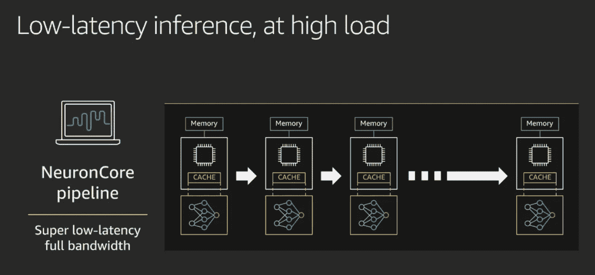
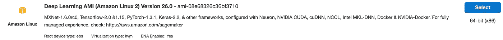
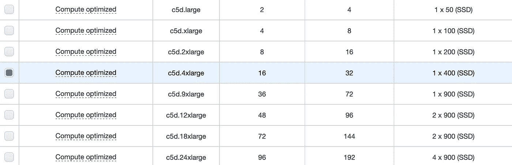
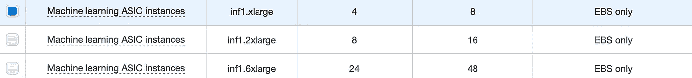
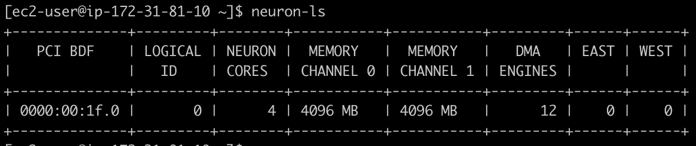
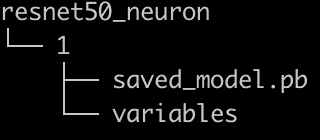

# 自动气象站推理初探

> 原文：<https://itnext.io/a-first-look-at-aws-inferentia-b9672e8f8b8f?source=collection_archive---------1----------------------->

在 AWS re:Invent 2019 上推出， [AWS Inferentia](https://aws.amazon.com/machine-learning/inferentia/) 是一款高性能机器学习推理芯片，由 AWS 定制设计:其目的是提供经济高效、低延迟的大规模预测。推理出现在[亚马逊 EC2 inf1](https://aws.amazon.com/ec2/instance-types/inf1/) 实例中，一个新的实例家族也在 re:Invent 上[推出](https://aws.amazon.com/blogs/aws/amazon-ec2-update-inf1-instances-with-aws-inferentia-chips-for-high-performance-cost-effective-inferencing/)。

在这篇文章中，我将向你展示如何开始使用推理和张量流。请注意，也支持 [Apache MXNet](https://mxnet.apache.org) 、 [PyTorch](https://pytorch.org) 和 [ONNX](https://onnx.ai) 。

## 推理入门

[CMP324](https://www.youtube.com/watch?v=17r1EapAxpk) 分组会议是对推理的一个很好的介绍，Alexa 用例是一个难得的引擎盖下的一瞥。它非常值得你花时间。

简而言之，每个推理芯片拥有 4 个神经元。其中的每一个都实现了一个“高性能[脉动阵列](https://en.wikipedia.org/wiki/Systolic_array)矩阵乘法引擎”(说得好，Gadi)，并且还配备了一个大的片上高速缓存。


芯片相互连接，这使得:

*   将一个模型划分到多个内核(和推理芯片，如果有几个可用的话)，将它 100%存储在缓存内存中。
*   通过内核管道全速传输数据流，无需应对外部存储器访问造成的延迟。



或者，您可以在同一个推理芯片上运行不同模型的推理。这是通过将神经元分成神经元组，并在不同的组上加载不同的模型来实现的。

## 神经元 SDK

为了在推理上运行，首先需要将模型编译成硬件优化的表示。然后，可以使用特定的运行时来加载、执行和分析它们。这些操作可以通过 [AWS Neuron SDK](https://github.com/aws/aws-neuron-sdk) 中可用的命令行工具来执行，或者通过框架 API 来执行。

[](https://github.com/aws/aws-neuron-sdk) [## aws/aws-neuron-sdk

### AWS Neuron 概述入门 AWS Neuron 是一个软件开发工具包(SDK ),支持高性能的深度…

github.com](https://github.com/aws/aws-neuron-sdk) 

我们开始吧！

## 为模型编译启动 EC2 实例

这第一步不需要一个 *inf1* 实例。事实上，您应该使用一个**计算优化实例**来进行快速且经济的编译。为了避免任何软件配置，你还应该使用 [**深度学习 AMI**](https://aws.amazon.com/machine-learning/amis/) ，它预装了 Neuron SDK 和最新的框架。

在撰写本文时，最新的深度学习 AMI for Amazon Linux 2 为 26.0 版本，其标识符为[*AMI-08e 68326 c 36 BF 3710*](https://aws.amazon.com/marketplace/search/results?x=0&y=0&searchTerms=ami-08e68326c36bf3710)。



使用这个 AMI，我启动了一个 *c5d.4xlarge* 实例。不需要特殊设置:只需确保在安全组中允许 SSH 访问。



系列、实例名称、vCPUs、RAM、存储

一旦实例启动，我对它使用 ssh，我会看到熟悉的深度学习 AMI 横幅，告诉我 [Conda](https://docs.conda.io/en/latest/) 环境可用于 TensorFlow 和 Apache MXNet。

```
====================================================================
 __|  __|_  )
 _|  (     / Deep Learning AMI (Amazon Linux 2) Version 26.0
___|\___|___|
====================================================================Please use one of the following commands to start the required environment with the framework of your choice:
for MXNet(+Keras2) with Python3 (CUDA 10.1 and Intel MKL-DNN) 
source activate mxnet_p36
for MXNet(+Keras2) with Python2 (CUDA 10.1 and Intel MKL-DNN) 
source activate mxnet_p27
**for MXNet(+AWS Neuron) with Python3 
source activate aws_neuron_mxnet_p36**
for TensorFlow(+Keras2) with Python3 (CUDA 10.0 and Intel MKL-DNN) source activate tensorflow_p36
for TensorFlow(+Keras2) with Python2 (CUDA 10.0 and Intel MKL-DNN) source activate tensorflow_p27
**for TensorFlow(+AWS Neuron) with Python3
source activate aws_neuron_tensorflow_p36**
for TensorFlow 2(+Keras2) with Python3 (CUDA 10.0 and Intel MKL-DNN) ssource activate tensorflow2_p36
for TensorFlow 2(+Keras2) with Python2 (CUDA 10.0 and Intel MKL-DNN) ssource activate tensorflow2_p27
for PyTorch with Python3 (CUDA 10.1 and Intel MKL) 
source activate pytorch_p36
for PyTorch with Python2 (CUDA 10.1 and Intel MKL)
source activate pytorch_p27
for Chainer with Python2 (CUDA 10.0 and Intel iDeep)
source activate chainer_p27
for Chainer with Python3 (CUDA 10.0 and Intel iDeep)
source activate chainer_p36
for base Python2 (CUDA 10.0)
source activate python2
for base Python3 (CUDA 10.0) 
source activate python3Official Conda User Guide: [https://docs.conda.io/projects/conda/en/latest/user-guide/](https://docs.conda.io/projects/conda/en/latest/user-guide/)
AWS Deep Learning AMI Homepage: [https://aws.amazon.com/machine-learning/amis/](https://aws.amazon.com/machine-learning/amis/)
Developer Guide and Release Notes: [https://docs.aws.amazon.com/dlami/latest/devguide/what-is-dlami.html](https://docs.aws.amazon.com/dlami/latest/devguide/what-is-dlami.html)
Support: [https://forums.aws.amazon.com/forum.jspa?forumID=263](https://forums.aws.amazon.com/forum.jspa?forumID=263)
For a fully managed experience, check out Amazon SageMaker at [https://aws.amazon.com/sagemaker](https://aws.amazon.com/sagemaker)
**When using INF1 type instances, please update regularly using the instructions at:** [**https://github.com/aws/aws-neuron-sdk/tree/master/release-notes**](https://github.com/aws/aws-neuron-sdk/tree/master/release-notes)
====================================================================
```

我激活适当的环境，它提供了所有需要的依赖项。

> F 或者这篇文章的其余部分，任何以*(AWS _ neuron _ tensor flow _ p36)*为前缀的 shell 命令都应该在 Conda 环境中运行。

```
$ source activate aws_neuron_tensorflow_p36
(aws_neuron_tensorflow_p36) $
```

接下来，我升级了 *tensorflow-neuron* 包。

```
(aws_neuron_tensorflow_p36) $ conda install numpy=1.17.2 --yes
(aws_neuron_tensorflow_p36) $ conda update tensorflow-neuron
```

我们现在准备获取一个模型并编译它。

## 编译模型

下面的代码抓取了一个在 [ImageNet](http://image-net.org) 数据集上预先训练的 [ResNet50](https://arxiv.org/abs/1512.03385) 图像分类模型，并将其存储在 *resnet50* 目录中。

然后，它编译它进行推理。我强调了所需的一行代码:其他的都是普通的 TensorFlow。然后，编译后的模型保存在 *ws_resnet50* 目录中，并保存在一个 ZIP 文件中，以便于复制到 *inf1* 实例中。

```
import os
import time
import shutil
import tensorflow as tf
**import tensorflow.neuron as tfn**
import tensorflow.compat.v1.keras as keras
from tensorflow.keras.applications.resnet50 import ResNet50
from tensorflow.keras.applications.resnet50 import preprocess_input

# Create a workspace
WORKSPACE = './ws_resnet50'
os.makedirs(WORKSPACE, exist_ok=True)

# Prepare export directory (old one removed)
model_dir = os.path.join(WORKSPACE, 'resnet50')
compiled_model_dir = os.path.join(WORKSPACE, 'resnet50_neuron')
shutil.rmtree(model_dir, ignore_errors=True)
shutil.rmtree(compiled_model_dir, ignore_errors=True)

# Instantiate Keras ResNet50 model
keras.backend.set_learning_phase(0)
keras.backend.set_image_data_format('channels_last')

model = ResNet50(weights='imagenet')

# Export SavedModel
tf.saved_model.simple_save(
    session            = keras.backend.get_session(),
    export_dir         = model_dir,
    inputs             = {'input': model.inputs[0]},
    outputs            = {'output': model.outputs[0]})

**# Compile using Neuron
tfn.saved_model.compile(model_dir, compiled_model_dir)** 

# Prepare SavedModel for uploading to Inf1 instance
shutil.make_archive('./resnet50_neuron', 'zip', WORKSPACE, 'resnet50_neuron')
```

那一个 [API](https://github.com/aws/aws-neuron-sdk/blob/master/docs/tensorflow-neuron/api-compilation-python-api.md) 就够了！令人印象深刻。

> 超级用户会喜欢阅读关于 CLI 编译器的文章。

运行这段代码会产生预期的输出。

```
(aws_neuron_tensorflow_p36) $ python compile_resnet.py<output removed>
Downloading data from [https://github.com/keras-team/keras-applications/releases/download/resnet/resnet50_weights_tf_dim_ordering_tf_kernels.h5](https://github.com/keras-team/keras-applications/releases/download/resnet/resnet50_weights_tf_dim_ordering_tf_kernels.h5)
102973440/102967424 [==============================] - 2s 0us/step
<output removed>
INFO:tensorflow:fusing subgraph neuron_op_d6f098c01c780733 with neuron-cc
INFO:tensorflow:Number of operations in TensorFlow session: 4638
INFO:tensorflow:Number of operations after tf.neuron optimizations: 556
INFO:tensorflow:Number of operations placed on Neuron runtime: 554
INFO:tensorflow:Successfully converted ./ws_resnet50/resnet50 to ./ws_resnet50/resnet50_neuron
```

然后，我简单地将 ZIP 文件复制到亚马逊 S3 桶中，这可能是与用于推理的 *inf1* 实例共享它的最简单方式。

```
$ ls *.zip
resnet50_neuron.zip
$ aws s3 mb s3://jsimon-inf1-useast1 
$ aws s3 cp resnet50_neuron.zip s3://jsimon-inf1-useast1
upload: ./resnet50_neuron.zip to s3://jsimon-inf1-useast1/resnet50_neuron.zip
```

好吧，让我们点燃其中一个。

## 用张量流预测推理

使用与上面相同的 AMI，我启动了一个*in f1 . xlage*实例。



系列、实例名称、vCPUs、RAM、存储

一旦这个实例启动，我就 ssh 到它，并更新 Neuron CLI 工具。

```
$ sudo yum install aws-neuron-tools aws-neuron-runtime-base aws-neuron-runtime -y
```

例如，我可以使用 [*neuron-ls*](https://github.com/aws/aws-neuron-sdk/tree/master/docs/neuron-tools) 查看硬件属性。



4 个神经核心，如预期的那样。“东”和“西”列显示了与其他推理芯片的连接:因为这个实例只有一个，所以它们是空的。

接下来，我从我的 S3 桶中检索编译后的模型，并提取它。我还下载了一个测试图像。

```
$ aws s3 cp s3://jsimon-inf1-useast1/resnet50_neuron.zip .
download: s3://jsimon-inf1-useast1/resnet50_neuron.zip to resnet50_neuron.zip
$ unzip resnet50_neuron.zip
Archive: resnet50_neuron.zip
 creating: resnet50_neuron/
 creating: resnet50_neuron/variables/
 inflating: resnet50_neuron/saved_model.pb
$ curl -O [https://raw.githubusercontent.com/awslabs/mxnet-model-server/master/docs/images/kitten_small.jpg](https://raw.githubusercontent.com/awslabs/mxnet-model-server/master/docs/images/kitten_small.jpg)
```

使用下面的代码，我加载并转换测试图像。然后，我加载编译后的模型，并使用它对图像进行分类。

```
import os
import time
import numpy as np
import tensorflow as tf
from tensorflow.keras.preprocessing import image
from tensorflow.keras.applications import resnet50

tf.keras.backend.set_image_data_format('channels_last')

# Create input from image
img_sgl = image.load_img('kitten_small.jpg', target_size=(224, 224))
img_arr = image.img_to_array(img_sgl)
img_arr2 = np.expand_dims(img_arr, axis=0)
img_arr3 = resnet50.preprocess_input(img_arr2)

# Load model
COMPILED_MODEL_DIR = './resnet50_neuron/'
predictor_inferentia = tf.contrib.predictor.from_saved_model(COMPILED_MODEL_DIR)

# Run inference
model_feed_dict={'input': img_arr3}
infa_rslts = predictor_inferentia(model_feed_dict);

# Display results
print(resnet50.decode_predictions(infa_rslts["output"], top=5)[0])
```

您能猜出这里有多少行特定于推理的代码吗？答案是**零**。我们无缝地使用[*TF . contrib . predictor*](https://www.tensorflow.org/versions/r1.15/api_docs/python/tf/contrib/predictor)API。呜哇！

运行这段代码产生了预期的输出，我们看到了图像的前 5 个类。

```
(aws_neuron_tensorflow_p36) $ python infer_resnet50.py<output removed>
[('n02123045', 'tabby', 0.6918919), ('n02127052', 'lynx', 0.12770271), ('n02123159', 'tiger_cat', 0.08277027), ('n02124075', 'Egyptian_cat', 0.06418919), ('n02128757', 'snow_leopard', 0.009290541)]
```

现在，让我们看看如何使用 [TensorFlow Serving，](https://www.tensorflow.org/tfx/guide/serving)加载编译后的模型，这对于生产部署来说是一个非常好的选择。

## 用张量流服务进行推理预测

首先，我们需要正确地打包模型，并将其移动到反映其版本的目录中。我们这里只有一个，所以让我们将保存的模型移动到名为“1”的目录中。

```
$ pwd
/home/ec2-user/resnet50_neuron
$ mkdir 1
$ mv * 1
```

TensorFlow 服务的第一次用户经常会对文件布局感到困惑，所以它应该是这样的。这个目录是您应该使用 *model_base_path* 参数传递给 TensorFlow 服务器的目录。



现在，我们可以启动 TensorFlow 服务，并加载编译后的模型。再说一次，这是香草张量流。

```
(aws_neuron_tensorflow_p36) $ tensorflow_model_server_neuron 
--model_name=resnet50 
--model_base_path=/home/ec2-user/resnet50_neuron 
--port=85002019–12–13 16:16:27.704882: I tensorflow_serving/core/loader_harness.cc:87] **Successfully loaded servable version {name: resnet50 version: 1}**
2019–12–13 16:16:27.706241: I tensorflow_serving/model_servers/server.cc:353] Running gRPC ModelServer at 0.0.0.0:8500
```

一旦 TensorFlow 服务启动并运行，我们可以使用下面的脚本来加载测试图像，并发送它进行预测。冒着重复我自己的风险…这是香草张量流:)

```
import numpy as np
import grpc
import tensorflow as tf
from tensorflow.keras.preprocessing import image
from tensorflow.keras.applications.resnet50 import preprocess_input
from tensorflow.keras.applications.resnet50 import decode_predictions
from tensorflow_serving.apis import predict_pb2
from tensorflow_serving.apis import prediction_service_pb2_grpc

if __name__ == '__main__':
    chan = grpc.insecure_channel('localhost:8500')
    stub = prediction_service_pb2_grpc.PredictionServiceStub(chan) img_file="kitten_small.jpg"      
    img = image.load_img(img_file, target_size=(224, 224))
    img_array = preprocess_input(image.img_to_array(img)[None, ...]) request = predict_pb2.PredictRequest()
    request.model_spec.name = 'resnet50'
    request.inputs['input'].CopyFrom(
        tf.contrib.util.make_tensor_proto(
            img_array, shape=img_array.shape)
    ) result = stub.Predict(request)
    prediction = tf.make_ndarray(result.outputs['output'])
    print(decode_predictions(prediction))
```

运行这段代码产生了预期的输出，我们看到了图像的前 5 个类。

```
(aws_neuron_tensorflow_p36) $ python tfserving_resnet50.py<output removed>
[[(‘n02123045’, ‘tabby’, 0.6918919), (‘n02127052’, ‘lynx’, 0.12770271), (‘n02123159’, ‘tiger_cat’, 0.08277027), (‘n02124075’, ‘Egyptian_cat’, 0.06418919), (‘n02128757’, ‘snow_leopard’, 0.009290541)]]
```

我录了这个演示，可以在 YouTube 上看到。

## 潜得更深

今天到此为止。希望我给你介绍清楚了 AWS 推理，以及它有多好用！编译我们的模型只需要一行代码。

如果你想深入了解，我强烈推荐我的同事叶在 re:Invent 举办的精彩的[工作坊](https://github.com/awshlabs/reinvent19Inf1Lab)。其中一个实验向您展示了如何将 32 位浮点(FP32) ResNet50 模型编译为 16 位浮点(FP16)。众所周知，通过降低算术复杂度，这种技术可以在保持准确性的同时提高性能。事实上，在一个 *inf1.2xlarge* 的实例中，FP16 模型提供了令人印象深刻的**每秒 1500 个图像分类**！

一如既往的感谢您的阅读。很乐意在这里或者在 [Twitter](https://twitter.com/julsimon) 上回答问题。

推理神经核心完全是硬核。他们破坏一切\m/