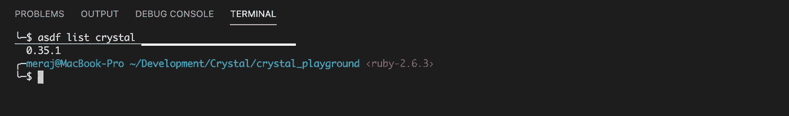
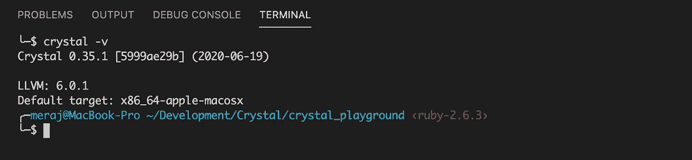
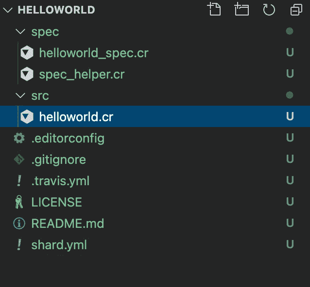
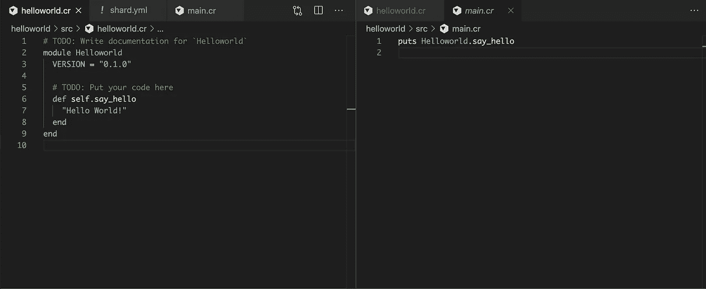
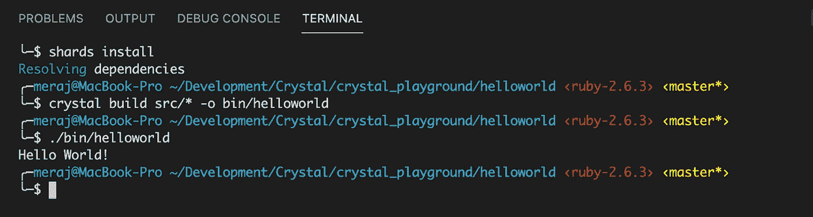
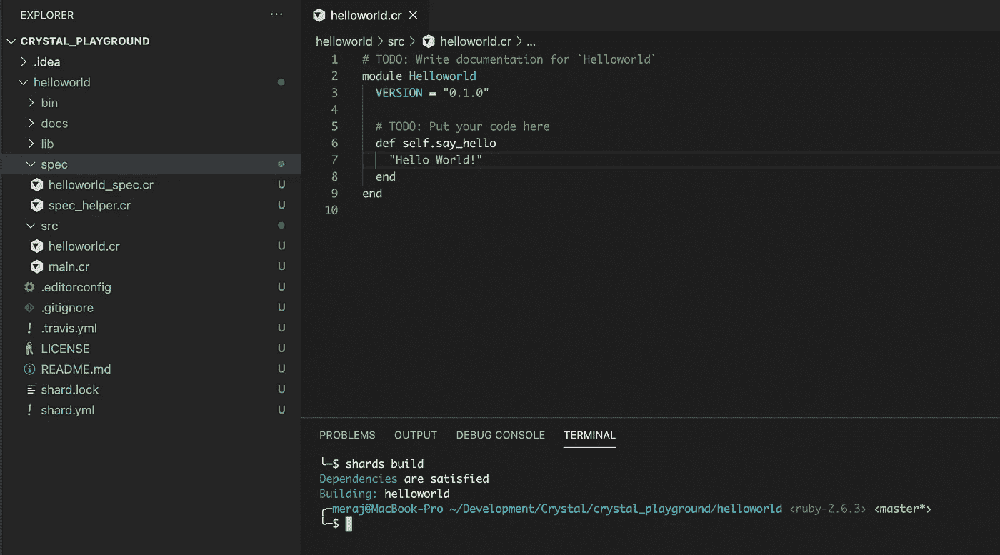
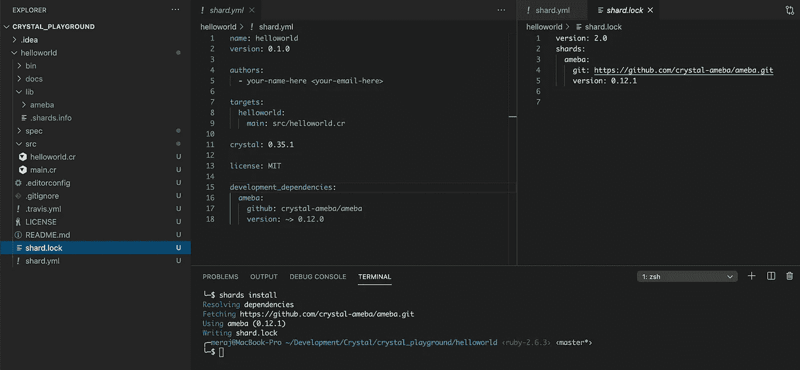
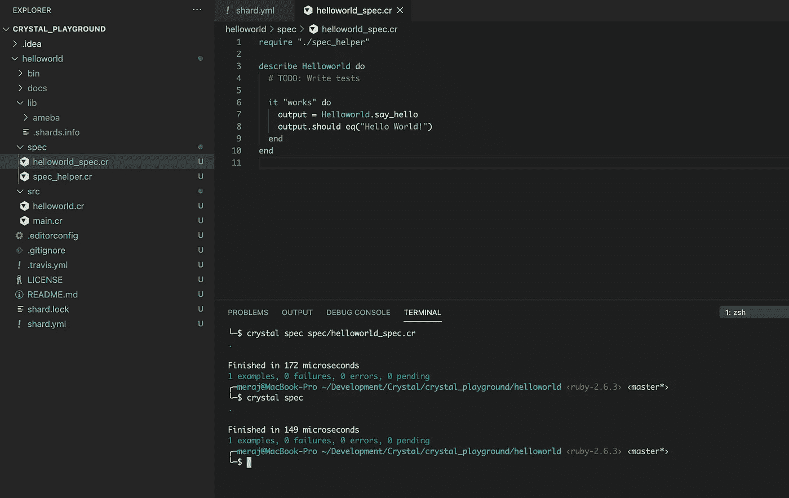
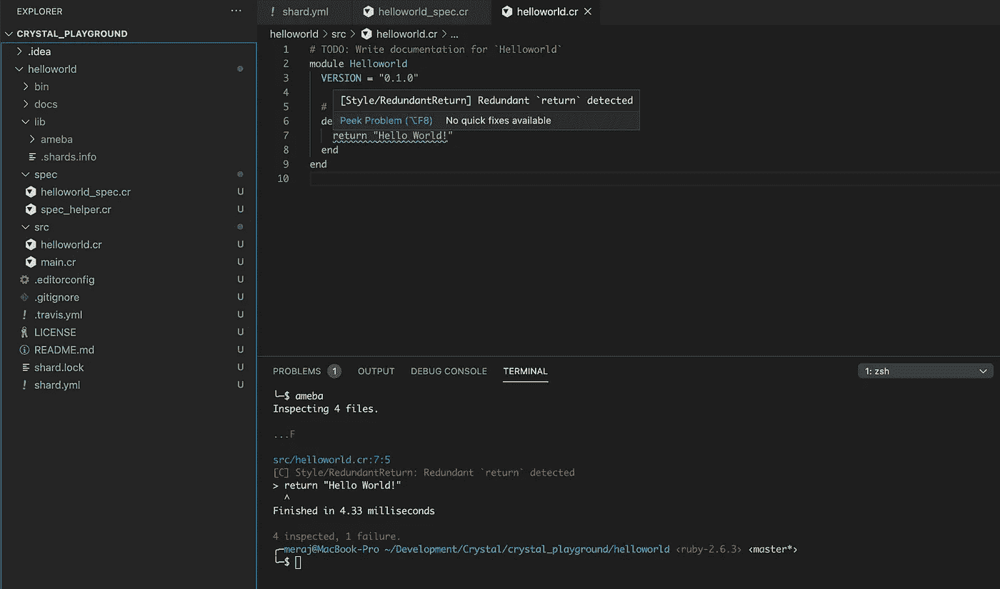
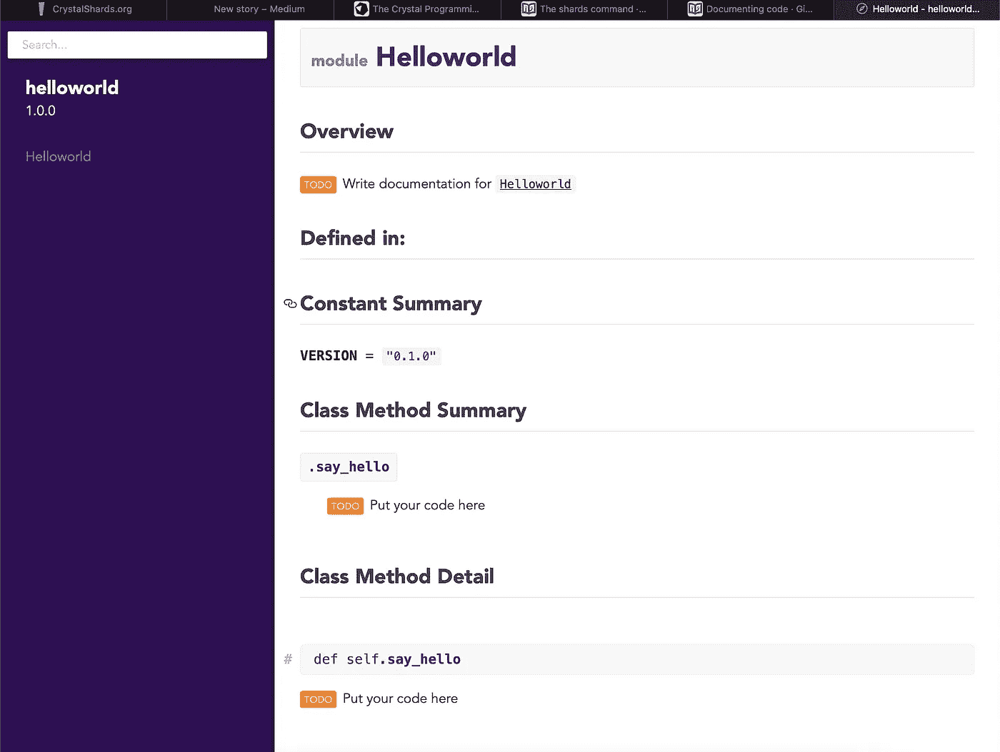

# 水晶编程语言及其生态系统初探

> 原文：<https://itnext.io/a-first-look-at-crystal-programming-language-and-its-ecosystem-efab042fbc07?source=collection_archive---------0----------------------->

[Crystal](https://crystal-lang.org/) 是来自 [Manas Tech](https://manas.tech/projects/crystal/) 的通用、静态类型、面向对象、编译的编程语言。该语言自 2014 年开始开发(至今已有 6 年)，最新的语言版本是 0.35.1。在大家翘首以待 Crystal 1.0 版本正式发布的时候，我偶然发现了这种语言，想先看看。这篇文章是对 Crystal 几个小时的第一次观察的结果。来自 Ruby/Rails 和 Elixir/Phoenix 的背景，我很自然地倾向于把这种 Ruby 看作一种巧妙的编程语言。


正如 Crystal 的 [github 页面](https://github.com/crystal-lang/crystal)上提到的，语言开发背后的主要动机是

*   我们喜欢 Ruby 写代码的效率。
*   我们喜欢 C 运行代码的效率。
*   我们希望两全其美。
*   我们希望编译器理解我们的意思，而不必到处指定类型。
*   *我们想要完全面向对象。*

*哦，而且我们也不想写 C 代码让代码跑得更快。*

在本文中，我想表达我花几个小时与 Crystal 及其生态系统相处的经历。我认为这种语言的主要受众是来自 Ruby/Rails 背景的 web 开发人员。由于我接触的内容有限，我不会在本文中涉及任何 web 框架，但是确实已经存在一些 web 框架，最值得注意的是

*   琥珀色—[https://amberframework.org](https://amberframework.org/)
*   幸运—[https://www.luckyframework.org](https://www.luckyframework.org/)
*   凯末尔—[https://kemalcr.com](https://kemalcr.com/)

# 安装晶体

可以使用以下命令在 Mac OS 上安装 Crystal

> $ brew 更新
> 
> $ brew 安装水晶

但是我更喜欢使用 [asdf](https://github.com/asdf-vm/asdf) 版本管理器来安装，以防由于某种原因需要安装多个版本。asdf 有一个水晶的插件—[https://github.com/asdf-community/asdf-crystal](https://github.com/asdf-community/asdf-crystal)

我使用下面的命令来安装插件—

> $ asdf 插件-添加水晶[https://github.com/asdf-community/asdf-crystal.git](https://github.com/asdf-community/asdf-crystal.git)->-**为 asdf**-
> 安装插件$ asdf 安装水晶 0 . 35 . 1->-**安装水晶 0 . 35 . 1**-
> $ asdf 全局水晶 0 . 35 . 1->-**设置水晶的全局版本为 0.35。**

我们可以看到使用以下命令安装的 Crystal 编译器的版本—



一旦安装成功，我们也可以用下面的命令检查编译器版本



# 设置 IDE/编辑器

我做的下一件事是用适当的扩展设置 Visual Studio 代码**来添加晶体支持。我添加了以下扩展—**

*   水晶语—[https://github.com/crystal-lang-tools/vscode-crystal-lang](https://github.com/crystal-lang-tools/vscode-crystal-lang)
*   晶体格式器—[https://marketplace.visualstudio.com/items?itemName = thedadferryman . crystal-fmt](https://marketplace.visualstudio.com/items?itemName=TheDeadFerryman.crystal-fmt)[**稍后再详细介绍**
*   水晶阿米巴—[https://github.com/crystal-ameba/vscode-crystal-ameba](https://github.com/crystal-ameba/vscode-crystal-ameba)(提供阿米巴棉绒/静态分析仪的接口)[ **稍后将详细介绍** ]

# 编写第一个水晶程序

难怪我的第一个水晶程序是 Hello World 程序，它是你学习的任何语言中的第一个程序:)。可以在**中输入代码。cr** 文件并编译/运行它，如下图所示—[https://crystal-lang.org/reference/getting_started/](https://crystal-lang.org/reference/getting_started/)。但是我决定用下面的命令创建一个合适的水晶应用程序

```
# crystal init app helloworld **--> crystal init app <name> is used for an application, crystal init lib <name> for a library**
```

这将创建一个项目 **helloworld** ，其目录结构如下-



**这里**—

*   src —包含应用程序源文件
*   规格—包含应用程序测试规格
*   shard . yml——用于添加任何依赖项(就像 Elixir 的 mix.exs 或 Rail 的 Gemfile)

我在 **src** 目录下的 **helloworld.cr** 和 **main.cr** 文件中输入以下代码——



代码非常简单明了。我定义了一个 **Helloworld** 模块，它有一个类方法 **say_hello** ，我从 **main.cr** 中调用了那个方法。

在构建代码之前，我安装了依赖于**碎片的——**,这是 Crystal 的依赖管理器(稍后会有**更多关于这个**)



***注:*** *看到* ***水晶打造*** *居然没有打造项目，我有点失望。我不得不使用* ***src/*、*** *作为程序文件名来运行构建命令。通常，我希望 build 命令足够智能，能够构建完整的项目。同样，****bin****目录也不是自动创建的。我不得不首先手动创建它，这是不应该的。*

***更新*** :有人在[Reddit.com](https://www.reddit.com/r/crystal_programming/comments/hvlv95/a_first_look_at_crystal_programming_language_and/?utm_source=share&utm_medium=ios_app&utm_name=iossmf)上指出，‘**碎片构建**’实际上构建了**碎片. yml** 中指定的任何目标。



# 依赖性管理

Crystal 伴随着它的依赖管理器— [shards](https://crystal-lang.org/reference/the_shards_command/) 。碎片就像红宝石，可以从 https://crystalshards.org 下载。

只是为了演示，我修改了 **shard.yml** 文件以包含[Ameba](https://crystalshards.org/shards/github/crystal-ameba/ameba)——一个针对 Crystal 的静态代码分析工具。我的 **shard.yml** 修改后的样子如下—



运行**碎片安装**后，它将**阿米巴**库拉入 lib **文件夹。**这个过程还创建了一个 **shard.lock** 文件(如上图右侧所示)。这个文件类似于 Rails 中的 Gemfile.lock。

# 写作测试

测试规范位于规范目录下。我在自动生成的 **helloworld_spec.cr** 中编写了一个小的测试规范来测试我的 **Helloworld** 模块。



如终端输出所示—

*   测试成功运行
*   **crystal spec spec/hello world _ spec . Cr**-从单个文件运行测试
*   **晶体规格** —运行应用程序中的所有测试

# **静态分析仪/棉绒机**

我使用下面的命令安装了前面讨论的 Ameba 静态分析器—

> $ brew tap veelenga/tap
> 
> $ brew 安装阿米巴

我还为 Visual Studio 代码安装了 **vscode-crystal-ameba** 扩展，如上面 IDE/Editor 设置部分所述。

安装了扩展后，我们可以直观地看到任何 linter 违规，或者我们也可以从我们的项目内部运行 **ameba** 命令，如下所示



这里我在代码中有一个多余的**返回**语句，由**阿米巴**指出。

# **代码格式化程序**

Crystal 附带了一个代码格式化程序，可以用下面的命令格式化任何源文件或整个 src 目录

> $ crystal 工具格式文件. cr
> 
> $ crystal 工具格式 src/

但是我也安装了 Crystal Formatter 扩展，正如上面 IDE/Editor 设置部分提到的，它可以自动格式化任何保存的文件。这对于以标准方式格式化所有项目非常方便。

# 证明文件

Crystal 支持从源代码注释自动生成文档—[https://crystal-lang . org/reference/conventions/documenting _ code . html](https://crystal-lang.org/reference/conventions/documenting_code.html)

我使用下面的命令为 **helloworld** 应用程序生成了文档—

> crystal docs 项目-版本 1.0.0

这将在项目根目录下创建一个 **docs/** 文件夹。因为我的代码不在版本控制之下，所以我必须传递一个参数— **project-version** 和想要的版本。生成的 **Helloworld** 模块 doc 如下图所示—



# Crystal 交互式控制台

最后但同样重要的是，我们许多人习惯在日常生活中使用 irb(红宝石)或 iex(长生不老药)。虽然 Crystal 没有内置的，但我发现这个项目为 Crystal 实现了 REPL—[https://github.com/crystal-community/icr](https://github.com/crystal-community/icr)

我没有深入研究过它，但是感兴趣的读者可以查阅它们的安装和使用文档。

一些在线水晶游乐场也值得一试—

*   晶振播放(**本地打开端口 8080 默认为**)
*   [https://carc.in/#/cr](https://carc.in/#/cr)
*   [https://play.crystal-lang.org/#/cr](https://play.crystal-lang.org/#/cr)

# 结论

总之，我对与 Crystal 的短暂会面印象深刻。语言语法(*虽然我需要更深入的研究*)看起来非常适合来自 Ruby 背景。更不用说，它是编译静态类型的。因此它可以在编译时捕捉许多错误(并避免 bug)。在我发表评论之前，我还没有研究过 web 框架。但总的来说，这个生态系统看起来相当令人满意，因为这种语言还没有达到 1.0 版本。只有在那之后，我认为 API 才会足够稳定，能够被广泛应用于生产环境。向 Manas Tech 致敬，他提出了这种看似伟大的编程语言。

# 参考

1.  https://www.crystalforrubyists.com
2.  [https://www . Amazon . ca/Programming-Crystal-Create-High-Performance-Concurrent/DP/1680502867](https://www.amazon.ca/Programming-Crystal-Create-High-Performance-Concurrent/dp/1680502867)

示例 **helloworld** 项目的源代码可以从这里克隆—[https://github . com/imeraj/crystal _ playground/tree/master/hello world](https://github.com/imeraj/crystal_playground/tree/master/helloworld)

*如需更多详细和深入的未来技术帖子，请关注我这里或上*[*Twitter*](https://twitter.com/meraj_enigma)*。*