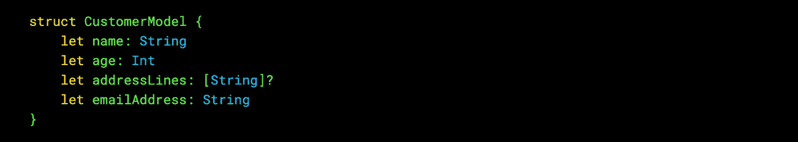
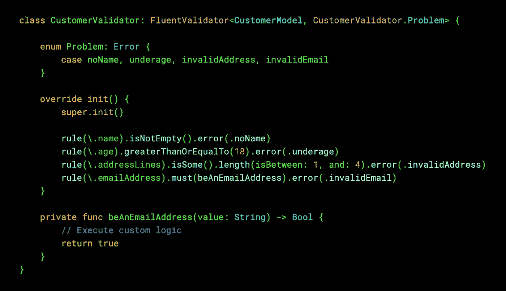
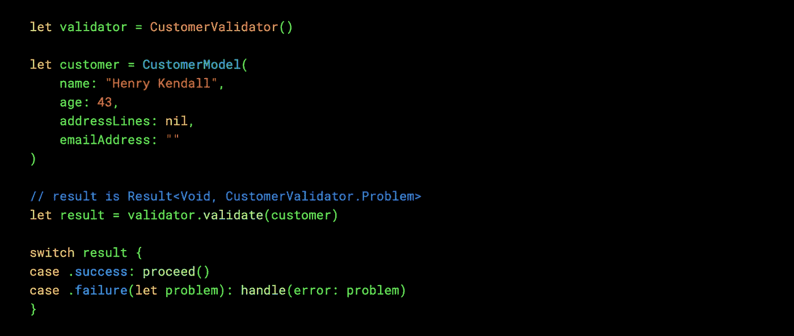
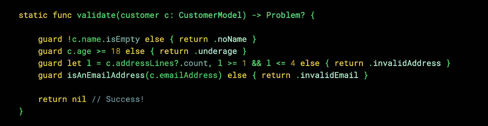
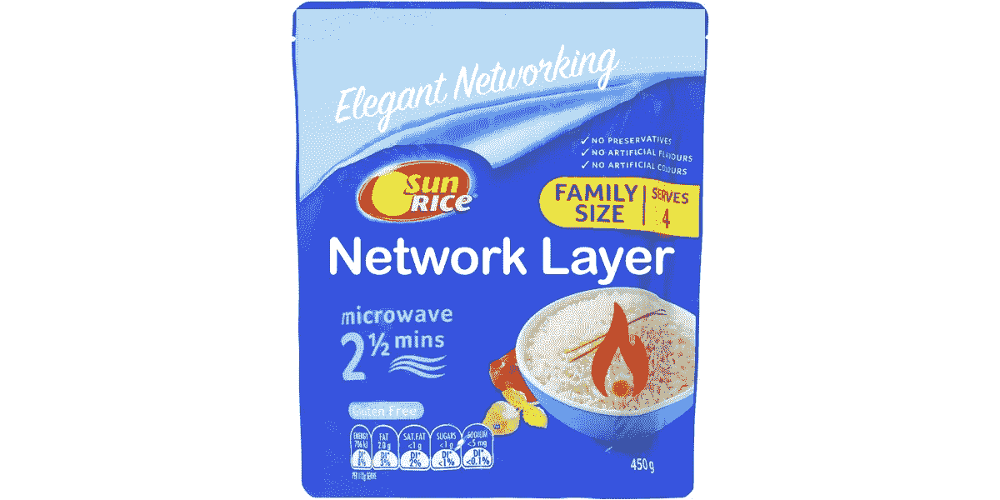
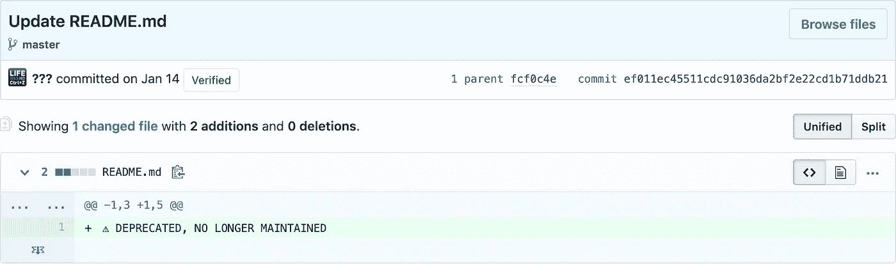
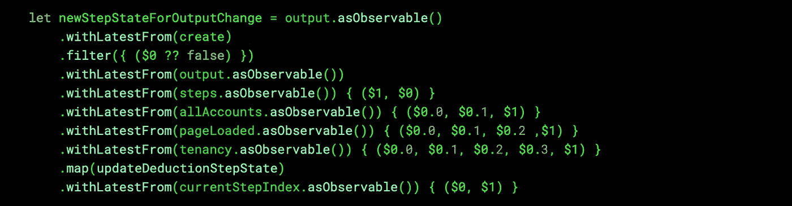

# 我写的一个框架(以及为什么你不应该使用它)

> 原文：<https://itnext.io/a-framework-i-wrote-and-why-you-shouldnt-use-it-276f25a39529?source=collection_archive---------3----------------------->

## 最近向我展示了`FluentValidation`，这是。NET——我决定用 Swift 重写框架。它很好用…但是你应该使用它吗？

# 流畅验证

[这里的](https://github.com/JeremySkinner/FluentValidation)是原文。NET 框架(这里的[是我的版本)。该框架背后的思想是，您可以使用“流畅的”规则来验证实例的属性，从而确定整个实例是否可以被视为“有效”。假设你有一个`CustomerModel`比如:](https://github.com/maxchuquimia/SwiftFluentValidation)

您可以简单地通过`import FluentValidation`和子类`FluentValidator`为`CustomerModel`构建一个验证器。由于`KeyPath`将规则的输入值限制为通用模型的有效属性，它完全是强类型的。最后，我认为 Swift 框架比。网一！

❤仿制药。那是一件 t 恤吗？

然后，验证器可以被实例化和重用:

很漂亮吧？由于泛型的强大功能，当规则失败时返回的错误也是强类型的。如果您喜欢简单地使用字符串消息，如。NET 版本，你可以[在`String`上创建一个扩展](https://i.imgur.com/cw5vxX5.png)，使其符合`Error`协议…

# 你真的需要一个框架来验证吗？

考虑以下静态函数:

它完成与验证器相同的任务:给定一个`CustomerModel`，如果它有问题，将返回一个错误。可以自己做，不用框架！

## 营养价值

随着 Cocoapods 逐渐进入正常状态，iOS 开发人员的思维方式发生了转变:通过[Pod]文件中的一行代码，可以导入多个 progress spinnerss，这些 spinner 可以根据您的喜好进行实例化(您知道我说的这个库)。外包整个网络层的开发也变得可能(同样，你确切地知道我在说什么)。但是营养价值在哪里呢？对我来说，我选择编码的原因是..因为我喜欢编码。您可以从构建自己的网络层以及在下一个项目中对其进行改进中学到很多东西。但是，在让自己依赖第三方之前，你应该三思而行，还有许多其他原因。

方便，但从长远来看可能对你不健康

## 信心

当为客户做一个项目时，不可避免地会有错误出现的时候。午餐是不可能的日子。在这段艰难时期，你最不需要的就是回答这个问题:

> 这个 bug 是我/我的团队创造的还是我们使用的库创造的？

假设你导入了我的框架，你的应用程序中出现了一个关于验证不能正常工作的错误。是我的错，还是你的错？您可能已经手动下载了我的框架并运行了单元测试:如果您这样做了，您将看到我有 40+次通过测试，导致 100%的代码覆盖率。你单独阅读所有的测试了吗？如果不是，您如何确定其中一个过程不是假阳性？如果您使用了一个静态函数进行对象验证，比如本文前面显示的函数，那么您可以立即确定是您引入了这个 bug。

有时候问题是错误*没有*在应该发生的时候发生。在开发过程中应用程序崩溃是发现你做错了什么，你需要在提交代码之前修复它的重要部分。我见过一个布局框架，如果一个视图没有超级视图，它就什么也不做:这给我们造成了很多困惑，因为我们没有意识到我们忘记了将目标视图添加到层次结构中，所以我们不知道哪里出了问题。默认情况下，如果您试图在无效环境中进行约束，Autolayout 会导致崩溃——非常有用！

我们在 Objective C 项目中使用的另一个框架是将所有对委托方法的调用包装在一个`@try { }`块中。这意味着回调触发的所有代码都不会崩溃，即使访问数组中的无效范围。通过带有断点的代码，可以看到一个函数无法执行它的某些行。

## 维护

这件事发生在我发表这篇文章之前的工作中，所以我决定附上一张截图。

新版 Swift 发布后会发生什么？我可能太忙了，没时间更新`FluentValidation`，所以你的团队可能在下一次冲刺中无法下载最新版本的 Xcode。或者，我可能会重命名一些方法，导致下次更新依赖项时构建失败。我似乎记得一年前我打开一个项目时，在我可以编译之前，必须用`.distinctUntilChanged({ $0, $1 })`替换每个`.distinctUntilChanged()`的[。](https://github.com/ReactiveX/RxSwift/issues/1611#issuecomment-379213750)

或者，更糟糕的是，也许你去了 Github 并注意到一个新的提交:

这种情况最近发生在我们身上:我们放入导航结构的框架将不再更新。祝我们好运告诉客户这件事。

接下来会发生什么？你要么需要熟悉我在两个工作日晚上写的代码，因为我想证明一个观点，要么你需要从你的应用程序中取出`FluentValidation`并重新编写你所有的验证。

## 入职

同样重要的是要考虑一个新的开发人员如何容易地进入代码并理解正在发生的事情。他们是否需要在开始理解如何实现一个特性或修复一个 bug 之前学习一个全新的范例？

这是…第一次看的时候很有面子。

# 结论

当然，有些情况下第三方框架是有用的。当然，我并不讨厌开源项目:我喜欢分享知识和想法——这就是为什么你可以免费阅读这篇文章！

要从中吸取的信息是:不要因为 Github 上有 15，267 颗星，或者因为它的 ReadMe 文件顶部有一个花哨的徽标和闪亮的徽章，就诱使自己导入一个框架。事实上，尽量不要把它想成“导入一个框架”——把它想成“让自己依赖一个陌生人的代码”。

自己写代码。相信你写的代码。下次改进它。

不要让 iOS 社区将自己导向一个 npm 式的厌恶者。