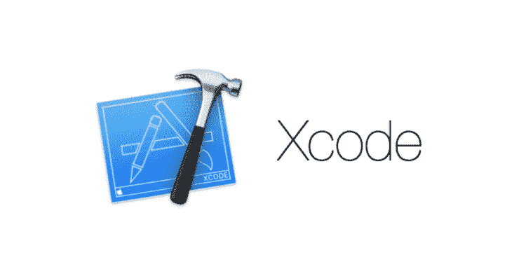
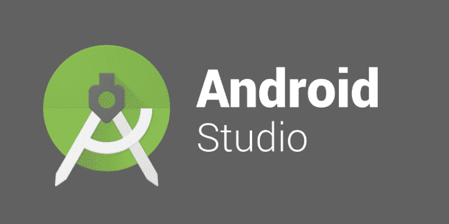

# XCode vs Android Studio:哪个更好？

> 原文：<https://itnext.io/a-frustrated-developers-review-of-xcode-android-studio-e2841f8c7a5d?source=collection_archive---------4----------------------->

# 我凭什么有资格审查！

我在这个行业已经超过 11 年了。我的职业生涯始于黑莓(BlackBerry)开发。我已经觉得老了！

***Eclipse*** 是我们当时移动开发最好的朋友。我在黑莓著名的 [Zagat](https://zagat.com/) 应用上实习。总的来说，这是一次很好的学习经历。

为了我的全职工作，我转到了一家名为 [Spinlet](https://www.linkedin.com/company/spinlet/) 的初创公司，我希望这家公司仍将保持强劲。我一开始是黑莓开发者，但最终转到了 iOS 开发。

在最初的几年里，我的 iOS 体验非常令人兴奋。最终，我和一个朋友开了自己的公司，提供手机设计开发。

经过大约 4 年的 iOS 开发，我找到了进入 Android 开发的方法。我也有相当多的 Android 开发经验，准确地说是 3 年左右。

从那时起，我们一直在全栈工作。那时我才意识到移动开发工具有多可怕。

闲聊到此为止。这里是对移动开发工具和技术的一个诚实的回顾。

# XCode

过去它是一个很好的工具。但是最近变得很糟糕。以下是 15 年后所有问题的清单:

*   **自动完成**:首先，谁会把 Esc 设置为建议键。其次，自动补全功能经常不起作用，或者给出与上下文无关的奇怪建议。
*   **构建时间**:创建一个归档文件或第一次在设备上运行会花费很多时间。最好[设置一个 CI/CD](https://arjavdave.com/2021/03/11/continuous-integration-cicd-for-ios-on-azure-devops-part-1/) 来归档和上传构建。
*   **签署&部署:**有了最新版本的就更容易了。但是，对于初学者来说，它仍然会与签名证书和配置文件相混淆。
*   **内存占用**:不知何故 XCode 一直占用内存。对于需要运行构建的每个新设备，它占用 3 GB。档案占了很大一块，模拟器也是如此。总的来说，如果我不定期清理，它会占用大约 50GB。
*   **更新**:每次更新大约 10-12GB，即使是小升级。更糟糕的是，它需要超过 40GB 的可用空间来安装。最后但同样重要的是，XCode 占用大约 12GB 的空间。
*   **设计**:最初的 UI 设计是 struts & springs，然后是 Autolayout，现在是 SwiftUI。令人担忧的是，方法在不断变化。
*   **Cocoapods** :因为回购变得如此之大，情况一天比一天糟糕。其次，它大大增加了构建时间。
*   **摄像头**:可能由于硬件限制，模拟器不支持摄像头。但是，现在已经有一段时间了。如果位置可以模拟，为什么摄像机不行？

# 安卓工作室

早期一直没机会用。但从我所看到的来看，这并不美好。以下是一些令人沮丧的问题:

*   我觉得这可能是每个人最想做的事情。支持数量惊人的设备可能会让任何人不知所措。
*   哦，我的上帝！Gradle 运行构建需要很长时间。有优化可以帮助缓解这个问题，但它仍然是一个问题。
*   **RAM 霍格**:模拟器和 IDE 一起运行，组合需要大约 10-12GB 的 RAM。这比他们的官方文档所说的要多得多: ***4GB*** 。
*   **签名密钥**:您丢失了您的签名密钥，并且您不能再次上传到同一个应用程序。你必须创建一个新的应用程序，并再次获得评论和下载。最近这方面有所改善。
*   我总是觉得基于 Java 的 IDE 很笨拙。这包括 IntelliJ(Android Studio 基于它)、Eclipse 或 NetBeans。它的响应速度不像 XCode 或 VS Code 等其他工具。

# XCode vs Android Studio 回顾

尽管它可能觉得 Android 问题较少，但它确实有一些严重的问题。碎片化和**格雷迪**可能足以让安卓看起来很糟糕。

就我个人而言，与 Android 相比，我更喜欢使用 XCode，因为我有一台 Mac，可能我更习惯使用它。

# 结论

总的来说，这两个平台都有庞大的用户群。我感觉这些工具还有很长的路要走。

举个例子，我非常喜欢微软是如何将 dotnet 修改为 [dotnet core](https://dotnet.microsoft.com/download) 以及将 IDE 修改为 [VS Code](https://code.visualstudio.com/) 的。

在下面的评论中写下你的挫折。

在这里阅读我的其他文章:

*   [为 iOS 设置 CI-CD](https://arjavdave.com/2021/03/11/continuous-integration-cicd-for-ios-on-azure-devops-part-1/)
*   [为 Android 设置 CI-CD](https://arjavdave.com/2021/03/16/how-to-setup-ci-cd-pipelines-for-android-with-azure-devops/)
*   [学习整合测试。与...交往。TDD](https://arjavdave.com/2021/04/14/learn-test-driven-development-with-integration-tests-in-net-5-0/)
*   [提供无密码登录](https://arjavdave.com/2021/04/05/going-password-less-with-dotnet/)