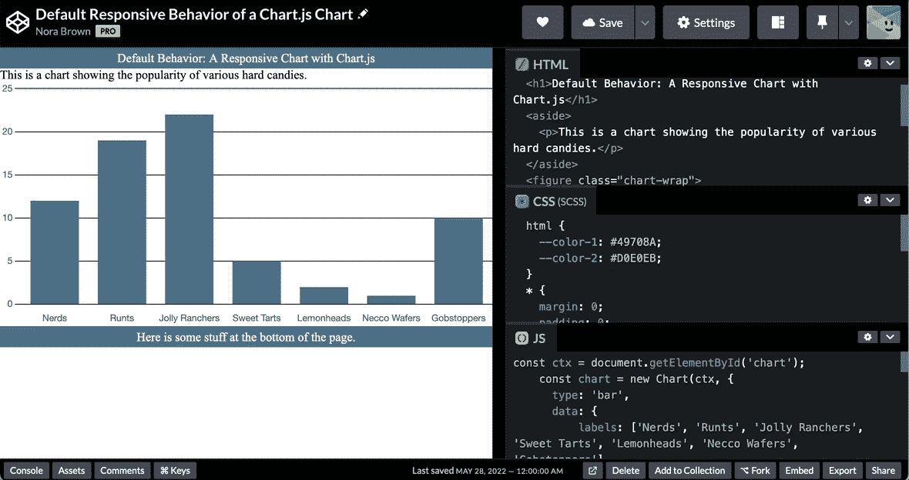
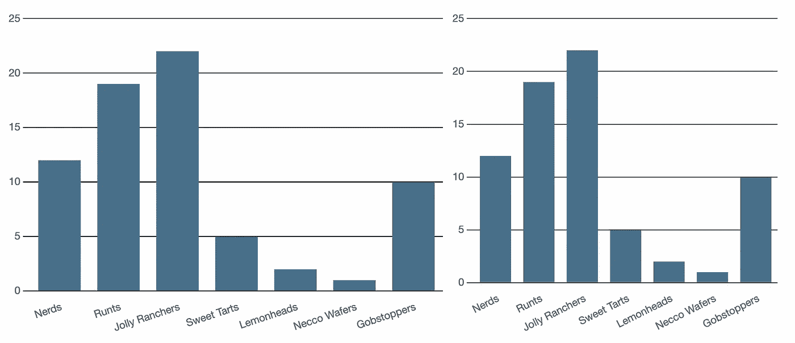
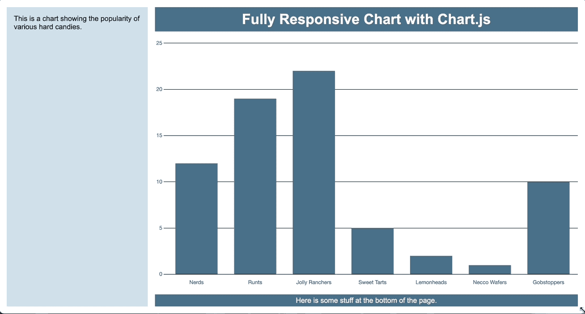
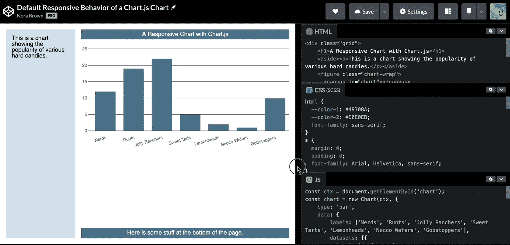
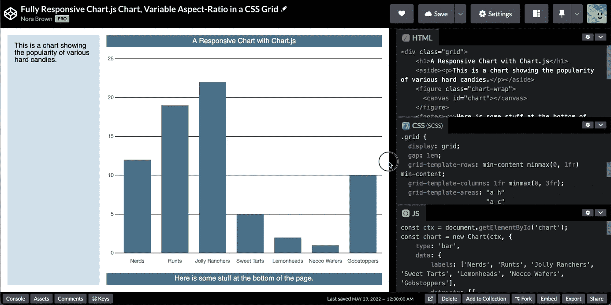

# 完全响应的 Chart.js 图表

> 原文：<https://itnext.io/a-fully-responsive-chart-js-chart-91a72ef5e2c?source=collection_archive---------0----------------------->

一点 CSS 网格知识让我们构建一个图表，在两个方向上填充可用空间。

[Chart.js](https://www.chartjs.org/) 是一个功能全面但易于使用的 Javascript 库，用于创建许多类型的图表和图形，它在画布元素上绘制这些图表和图形。因为画布与图像相似，都具有内在(渲染)像素大小和显示大小，所以使其具有响应性并不是一件简单的事情。 [Chart.js 文档简洁地描述了问题](https://www.chartjs.org/docs/latest/configuration/responsive.html):

> 当谈到根据窗口大小改变图表大小时，一个主要的限制是画布*渲染*大小(`canvas.width`和`.height`)可以**而不是**用相对值表示，与*显示*大小(`canvas.style.width`和`.height`)相反。此外，这些尺寸彼此独立，因此画布*渲染*尺寸不会根据*显示*尺寸自动调整，使得渲染不准确。

有关更深入的解释，以及调整画布大小的一般解决方案，请阅读 [WebGL 调整画布大小](https://webglfundamentals.org/webgl/lessons/webgl-resizing-the-canvas.html)。

如果您曾经阅读过那篇文章，您就会知道调整画布的大小有点复杂。幸运的是，Chart.js 为我们完成了大部分复杂的工作！Chart.js 图表在默认情况下是响应性的，但是有一个限制:它保持其纵横比。下面是一个几乎没有应用任何样式的示例:



[见此笔](https://codepen.io/noraspice/pen/GRQQmaY)自己试试。

你可能会想“如果画布就像一幅图像，这不正是我们想要的吗？”。毕竟，如果你随意改变图像的长宽比，它会显得扭曲和怪异:


那是一只被压扁的鸟。长宽比对图像很重要！

但是通过图表或图形，我们的数据通常可以在一系列纵横比下清晰呈现:



大多数图表可以很容易地调整到不同的长宽比。

在我工作的情况下，界面有一些围绕图表的数据和控件面板。我们不知道浏览器的大小，也不知道用户是否会调整浏览器的大小，甚至折叠其中一个面板。但是(几乎)无论发生什么，我们都希望图表占据所有可用的空间:



我们的目标是:一个可以扩展以填充可用空间的图表，并在两个方向上响应视口的大小调整。

# 以二维方式调整图表的大小

使用 Chart.js 的默认行为，图表根据可用宽度而不是高度调整大小，始终保持其初始纵横比。

那么，我们如何让图表在二维空间中调整大小呢？我们绝对不希望一开始就计算出图表的可用空间，然后手动设置纵横比。即使我们做到了这一点，一旦图表绘制完成,`chart.options.aspectRatio`也不能被改变。

用 CSS 网格给我们的布局增加了一点结构，如下所示:

```
.grid {
 display: grid;
 gap: 1em;
 grid-template-rows: min-content 1fr min-content;
 grid-template-columns: 1fr 3fr;
 grid-template-areas: "a h"
                      "a c"
                      "a f";
 height: calc(100vh - 2em);
 width: calc(100vw - 2em); /* not necessary, but just to be explicit */
 margin: 1em;
}
```

下面是图表的默认行为:



[查看钢笔。](https://codepen.io/noraspice/pen/GRQQmaY)

您会注意到，当视窗变大时，图表会调整大小(保持纵横比)，但当视窗变小时，图表不会调整大小。我们希望图表能够:

*   填充垂直和水平空间
*   如果视口在任一方向上变小，则调整大小

第一项任务很简单。如果我们将`maintainAspectRatio`设置为 false，图表将在第一次加载时填充水平和垂直的可用空间。此外，它还可以根据可变的纵横比调整大小。这让我们离我们想要的更近了一点:


[自己试试这支笔](https://codepen.io/noraspice/pen/YzeeLLy)。

但是同样，你会注意到图表只会变得更大！这是因为 Chart.js 在其包含的元素改变尺寸时重新呈现画布[:](https://www.chartjs.org/docs/latest/configuration/responsive.html#important-note)

> 检测画布大小何时改变不能直接从 canvas 元素中完成。Chart.js 使用其父容器来更新画布渲染和显示大小。

使用我们当前的 CSS 网格设置，当视窗变小时，图表的容器元素(它是一个网格项)不会调整大小；*图表本身阻止了它这样做*。因此，永远不会触发重新渲染。您可能会发现这种行为有些出乎意料。毕竟，我们设置了网格的高度和宽度，包含图表的网格项的轨道高度为`1fr`，宽度为`3fr`。那是可用宽度的三分之一，对吗？算是吧。

`3fr`其实是`minmax(auto, 3fr)`的简称。而网格项的`auto`维度是由其内容决定的[。网格项目不会变得比其内容小，除非:](https://www.w3.org/TR/css3-grid-layout/#min-size-auto)

*   它将溢出设置为可视之外的内容
*   它或它的网格轨迹具有确定的(不是分数的)宽度
*   它的网格轨迹的最小宽度是显式设置的

我们可以使用以上任何一种方法来解决我们的问题，但最简单的是最后一种方法。我们可以用`minmax(0, 3fr)`代替`3fr`。现在我们有:

```
.grid {
 display: grid;
 gap: 1em;
 grid-template-rows: min-content minmax(0, 1fr) min-content;
 grid-template-columns: 1fr minmax(0, 3r);
 grid-template-areas: "a h"
                      "a c"
                      "a f";
 height: calc(100vh - 2em);
 width: calc(100vw - 2em); /* not necessary, but just to be explicit */
 margin: 1em;
}
```

这允许栅格轨迹收缩到 0 宽度。因此，图表的父元素(在本例中是网格项目的`figure`元素)会调整大小，并触发图表的重新呈现:



[这是 CodePen](https://codepen.io/noraspice/pen/GRQQdzW) 上的全面响应解决方案。


# 结论

这是一个非常具体的问题，但是追踪解决方案让我更好地理解了网格项目是如何调整大小的，以及为什么有时会导致意外的溢出行为。关于这方面的更多内容，请参阅戴夫·鲁伯特的文章[打破网格](https://daverupert.com/2017/09/breaking-the-grid/)，以及[这支带有一堆网格示例的笔](https://codepen.io/noraspice/pen/oNEoKYj?editors=1100)。