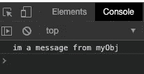
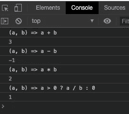

# JavaScript 函数式编程的简明介绍

> 原文：<https://itnext.io/a-gentle-introduction-to-functional-programming-in-javascript-21ce4988af73?source=collection_archive---------6----------------------->

本·怀特在 [Unsplash](https://unsplash.com?utm_source=medium&utm_medium=referral) 上的照片

对于那些用非函数式语言开始软件之旅的人来说，函数式编程可能具有挑战性。我知道那是我的经历。我学会了用 C#编程，虽然你可以用 C#做一些功能性的东西，但是大多数入门书籍和教程都没有涉及到以功能性的方式使用这种语言，也没有教你如何用功能性的方式思考。

JavaScript 是一种避开了基于对象和基于函数之间界限的语言，无论以哪种方式使用都非常有效。也可以将这两种方法结合起来使用。既然如此，我们将在本文中使用 JavaScript 来提供一些函数式编程概念的简单介绍。

我怀疑大多数来自非函数式语言的程序员会和我刚入门时一样纠结于同样的概念。这些是:

1.  函数是对象，可以像其他对象一样传递。
2.  函数可以有自己的属性和方法。他们毕竟只是物品。
3.  函数可以返回其他函数。
4.  函数可以将函数作为参数。

这绝不是一个确定的列表，但我记得在阅读这些概念时挠头。让我们看看这些。

第一项和第二项密切相关。在 JavaScript 中，函数是一级对象，所以它们有自己的属性和方法是有意义的。事实上，JavaScript 中的函数自带默认的方法和属性。

你可能听说过其中的一些:call()、apply()、bind()、toString()。JavaScript 中的每个函数都有这些方法。关于附加到每个函数对象的属性和方法的完整列表，[在这里查看 MDN 文档](https://developer.mozilla.org/en-US/docs/Web/JavaScript/Reference/Global_Objects/Function)。

当第一次使用这些方法时，感觉和看起来都有点怪异。让我们看一个代码示例。

在这段代码中，我们在第 1–3 行创建了一个带有消息属性的简单对象。然后在第 5 行，我们定义了一个名为 printIt()的简单函数。

通过定义这个函数，我们现在有了一个完整的函数对象。

最后，在第 9 行，我们使用*对象点符号*来执行 printIt()函数上的 call()方法，将 myObj 作为对象传递给函数上下文。这意味着我们在函数中设置这个指向的*。以下是我们在控制台中看到的内容:*

printIt()的输出

当然，这不是最实际的例子，但要记住的一点是，JavaScript 中的 ***函数是对象，它们有自己的方法和属性*** 。让这一点深入你的大脑灰质(我知道对我来说是这样)可能很有挑战性，所以*我觉得这一点怎么强调都不为过*。

现在让我们继续，看一看以其他函数作为参数的函数和返回函数的函数。做这些事情的函数被称为 [***高阶函数***](https://en.wikipedia.org/wiki/First-class_function) 。

让我们从一个简单的例子开始。

在这段代码中，我们首先使用类似于 [lambda 符号](http://en.wikipedia.org/wiki/Lambda_calculus#Lambda_calculus_and_programming_languages)的文本定义了 4 个函数。以这种方式编写函数并不比更正规的方法优越，但是它确实节省了我们大量的击键次数。*使用这个语法*时，花括号和 return 语句是隐式的。每个函数接受 2 个参数，并返回简单数学运算的结果。

接下来，在第 6 行，我们定义了一个名为 execute()的函数，它接受 3 个参数。两个数字和一个函数。在函数内部，我们利用了在*所有函数对象*上可用的 toString()方法，并将函数的实际文本写入控制台。然后，我们使用传递的参数执行传递的函数，并将结果写入控制台。结果如下:

我们的 execute()方法的输出

到目前为止，一切顺利。接下来，让我们看看我们如何开始更多的功能性思考。看看这段代码。

首先，我们定义一组宠物。每个宠物都有一个名字和一个类型属性。然后我们定义 printPets()函数。这个函数接受一个数组和一个宠物类型(狗或猫)作为参数。然后我们遍历数组，检查每个对象的 type 属性，看它是否与传递的 petType 匹配。如果匹配，我们将宠物的名字打印到控制台。

这段代码没有错。它按预期运行和工作。第 22 行对 printPets 的函数调用将只打印 dog 类型的宠物。

让我们重写这段代码，使它更实用。

我们从定义同一个数组开始。一切都好。接下来，我们再次使用 printPets()函数，只是这次它使用不同的参数。pets 数组、过滤器函数和打印机函数。

第 24 行和第 25 行定义了过滤函数。我们再次使用 lambda 符号，它允许我们创建一个谓词，告诉我们是否有合适的宠物。

这种方法的美妙之处在于，我们可以定义尽可能多的过滤器，并以任何方式过滤数据。我们的演示宠物对象只有两个属性，但是如果你正在处理的对象有 10 或 20 个属性呢？想写多少个过滤函数就写多少个，然后只把它们作为参数传递，这很简单。在以前的命令式代码版本中，我们必须进入循环代码并修改它以满足我们的需求。这样更容易，也更优雅。

我们还将打印代码从循环中取出，放入它自己的函数中。现在我们可以传递一个我们想做什么就做什么的打印函数。写入控制台、日志、弹出警报等。

通过传递一个函数而不是在我们的循环中编写它，可以很容易地修改行为。

您可能还注意到，我们用 array.forEach()替换了命令式 for 循环。向更多功能代码迈进了一步，现在您可以在 JavaScript 中利用这一点。只要有可能，就开始远离 for 循环。它会改进你的代码。

如果你花些时间研究一下代码的功能版本与第一个版本，我想你会发现它更优雅，更具扩展性和可重用性。这些都是我们在软件开发中一直努力追求的好东西。

就我们能做的而言，我们只是触及了皮毛。有大量的资源可以帮助你继续你的功能之旅。

这里有几个链接

[http://reactivex.io/learnrx/](http://reactivex.io/learnrx/)

 [## 到底什么是函数式编程？

### 解密一个看似复杂的概念

itnext.io](/what-exactly-is-functional-programming-ea02c86753fd) 

感谢阅读！