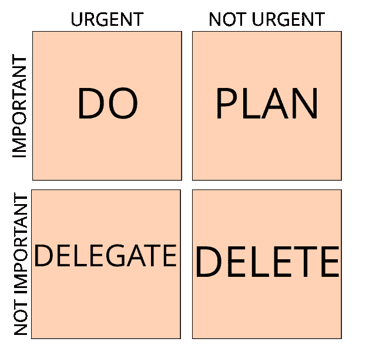

# 新线索指南—第 1 部分

> 原文：<https://itnext.io/a-guide-for-the-new-lead-part-1-4799ec698632?source=collection_archive---------4----------------------->

## 5 分钟内从技术走向领先

开始一个新的角色并不总是容易的，尤其是对于新的领导。未来的不确定性，不知道将会发生什么，不知道你是否能够交付是无法忍受的。所以你决定在网上搜索并阅读如何从正确的方面开始。

首先，让我从陈述显而易见的事实开始——你太棒了！这个机会太棒了！做一些新的、具有挑战性的事情，是你能要求的最好的事情。这是一个全新的实验领域，尝试新事物，学习并变得更好。

## 开始之前

最重要的是要有正确的心态。开始前什么都不用做，只要放松，从右侧开始。你知道如何做这项工作，否则，你不会在这里。

放松点。呼吸。

我采访过的许多资深经理的建议是，知道你第一天要做什么。搜索和阅读关于管理的文章，寻求建议并认真思考。我同意，这是有益的，但由于我在实现一个新功能之前不会重温数学理论，所以我不想阅读互联网上所有关于管理的内容。之前已经看过很多遍了。

## 沟通

人们不喜欢不确定性，无论如何都要减少不确定性。我们更喜欢做出错误的选择，而不是留在不确定性中。我们宁愿知道将要发生什么，即使这是一个糟糕的选择，也不愿无法预测。

> 不确定性并不表明领导能力差；它强调了领导力的必要性。

例如，如果你有机会替换他的现有领导，并且你想在头几周学习技术和新环境。这很好，这样你可以更好地管理你的团队，这对你、你的团队和你的经理都有好处。你所需要做的就是与团队沟通，确保他们可以向你提出任何要求，但重点是进入。

向团队传达你所做的每一个决定，但也让他们成为决策者。从管理策略到任务分配，团队拥有发言权是很重要的，这使他们承担责任并增加他们的归属感需求。

## 时间管理

积极整理你的日历，不要给你的日历留出很短的空闲时间，这是浪费时间，因为你没有时间集中注意力。取消或移动会议以腾出一段空闲时间。你可能不得不在这里说不，你可能无法移动，但至少要努力。

安排时间进入状态，除了紧急事件，不要让任何人打扰你。更重要的是，与你周围的人、团队和同事交流，确保每个人都知道你在做什么，为什么这对你和他们都很重要和有益。这样你就给了你的团队自己解决问题的机会。

进入焦点。

要进入状态，你可以戴上耳机，站着倒计时，这样别人就能知道你什么时候有空，然后进入你的任务状态，不管是技术任务还是管理任务。

确保交流中断时间，这样别人就可以带着不舒服的感觉随意问或说任何事情。

## 泛滥

作为团队领导，你应该做的不仅仅是实现特性。除此之外，你还需要管理团队，制定个人发展计划，规划团队路线图，分配任务和后续工作等。承受起来会很沉重。

首先，我建议以正念开始你的一天。在你开始每天的比赛之前，冥想或做任何能让你平静下来的事情。以正确的方式开始你的一天，保持冷静，不仅仅是做，而是思考。

> 管理你的一天不要让你的一天管理你。

确保你总是使用正确的工具做正确的事情。你不可能记住所有要做的事情，然后继续做下去，这太疯狂了。一个可以帮助你的工具是**艾森豪威尔决策矩阵**——你可以以一种方式组织你的任务，你总能知道你应该关注什么，并向团队反映这一点。不要害羞，在你身后的板上画一个矩阵。

如何优先处理你的待办事项？

这是一个决策工具，而不是任务管理。

## 任务管理

你应该管理好你的任务——不要害怕事事都要票。您应该花时间设置您正在使用的票证跟踪工具。以正确的方式思考，建立正确的董事会，这样你就可以轻松地跟踪一切。

一个很好的衡量标准是，你可以很容易地将你所有的任务从你的笔记转移到跟踪工具中。你能看到高层次和低层次的任务，并能概括每件事。

## 每周团队会议

周报对于让每个人同步了解团队正在做什么和团队的发展方向是很重要的。可以是每周一次，也可以是每两周一次，这并不重要。这是一个伟大的工具，但很容易被滥用。

我的周刊目标是:

1.  让团队与团队变化同步——让团队感觉自己是更大团队的一部分。
2.  谈论团队的变化，例如改变我们管理任务的方式。
3.  回顾团队任务。

周报被认为是经理做的事情，TL 说了很多，其他人都在听。我希望它有所不同，我希望给团队一个选择，让他们说出他们想说的话。这就是为什么我创建了一个带有议程的共享文档，这样每个人都可以从议程中添加内容。当我们讨论议程时，作为一个团队，我们可以投票决定是否要讨论这个主题。

合作愉快的团队。

这是我尝试并试图让自己参与的地方。我对它将如何发生感到兴奋，如果我们要回顾任务或只是谈论其他不重要的事情。这两种情况对我来说都是可以接受的，因为我可以得到任何我需要的信息，会议也有希望变得更快乐，气氛更好。

## 尝试和学习

不要忘记花时间去学习和调整，享受这个过程。尝试新事物，对重要的部分进行回顾。

> 如果你做你一直做的，你会得到你一直得到的。

找一个导师或者可以帮助你从他的经历中学习的人。不要以为你知道什么，因为你不知道你不知道的。保持谦逊，不断从你能学到的任何东西中学习。

祝你好运！