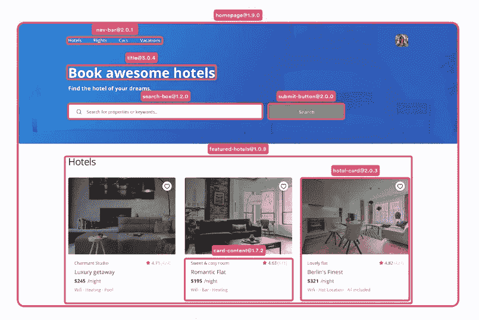
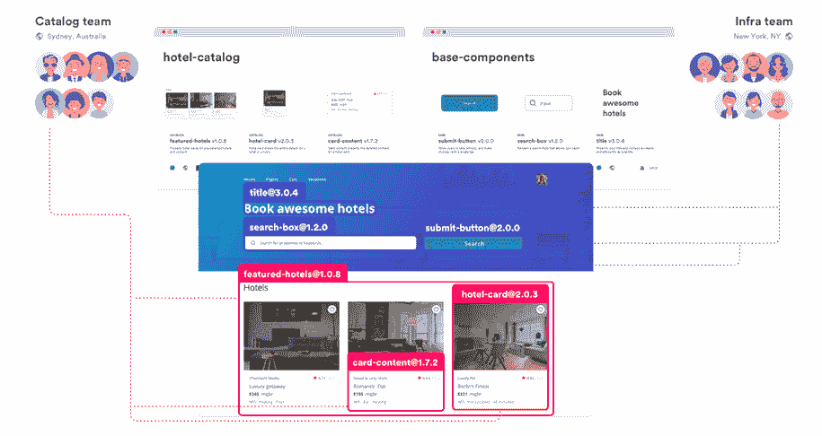
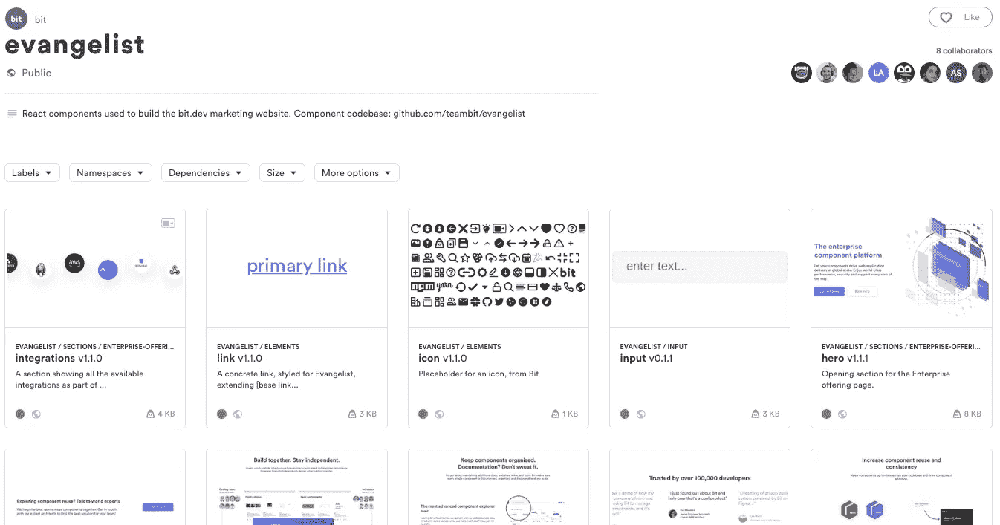
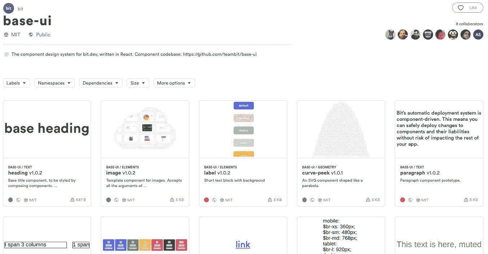

# 组件驱动开发指南(CDD)

> 原文：<https://itnext.io/a-guide-to-component-driven-development-cdd-1516f65d8b55?source=collection_archive---------0----------------------->

## 让组件驱动应用程序的开发。

请访问 Bit 的主页，观看 CDD 的现场演示

世界上几乎每一家公司，从科技巨头到服务提供商，都依靠 web 应用程序开发向数十亿人运送和营销他们的产品。一个组织创建和维护数十或数百个 web 应用程序来构建产品、管理工作、吸引客户、推动营销和增加收入。

像组件这样的现代 web 技术允许组织加速和扩展 web 应用程序的开发，为自治团队创建简单和分离的代码库，允许平滑集成，增加独立团队发布的数量和页数，并允许更多的代码重用。

组件驱动的开发意味着将组件作为 web 的新原语，并利用它们的模块化能力来为 web 应用程序开发实现更好的速度、可伸缩性和标准化。

要了解如何更好地构建组件，请查看“[我们如何构建我们的设计系统](https://blog.bitsrc.io/how-we-build-our-design-system-15713a1f1833)”和“[我们如何构建微前端](https://blog.bitsrc.io/how-we-build-micro-front-ends-d3eeeac0acfc)”:

 [## 我们如何建立一个设计系统

### 用组件构建一个设计系统来标准化和扩展我们的 UI 开发过程。

blog.bitsrc.io](https://blog.bitsrc.io/how-we-build-our-design-system-15713a1f1833)  [## 我们如何构建微前端

### 构建微前端来加速和扩展我们的 web 开发过程。

blog.bitsrc.io](https://blog.bitsrc.io/how-we-build-micro-front-ends-d3eeeac0acfc) 

# 组件驱动开发的优势

简单地说，组件驱动开发意味着通过构建松散耦合的独立组件来设计你的[软件应用](https://en.wikipedia.org/wiki/Component-based_software_engineering)。康威定律表明，这也意味着以类似的方式设计你的组织。

就像解耦的微服务实现后端开发的规模和效率一样，组件驱动开发的概念可以为使用 React、Vue、Angular 或类似技术构建现代 web 应用程序的团队带来类似的优势。

通过组件驱动的开发，组织可以实现战略目标，使他们的 web 开发更快、更具伸缩性和更高效:

*   **自主团队—** 拥有明确定义的功能或产品。
*   **简单、分离的代码库—** 团队可以开发他们自己的组件，而不会被其他人延迟或复杂化。
*   **增量升级—** 团队可以利用它以快速和模块化的方式更新应用程序中的独立组件。
*   **快速发布—****让团队独立且持续地交付产品升级和修复，无需等待或争夺主控权。**

**[Addy Osmani](https://medium.com/u/2508e4c7a8ec?source=post_page-----1516f65d8b55--------------------------------) 列出了 CDD 对软件质量的一些关键好处，正如他的[首要原则](https://addyosmani.com/first/)中所述:**

*   ****更快的开发**:将开发分解成组件，让您可以用专注的 API 构建模块化部件。这意味着构建每个组件并了解它何时足够好会更快。**
*   ****更简单的维护**:当你需要修改或更新应用程序的一部分时，你可以扩展或更新组件，而不必重构应用程序的更大部分。把它想象成对一个特定的器官进行手术，而不是对身体的整个系统进行手术。**
*   ****更好的可重用性**:通过关注点的分离，组件可以被重用和扩展来构建多个应用程序，而不必一遍又一遍地重写它们(参见:[共享(组件)是关怀](https://blog.bitsrc.io/sharing-components-is-caring-f8235cf1a0c))。**
*   ****更好的 TDD** :当构建模块化组件时，实现单元测试来验证每个组件的功能变得更加容易。更大的系统更容易测试，因为更容易理解和分离系统每个部分的职责。**
*   ****更短的学习曲线**:当开发人员不得不投入到一个新项目中时，学习和理解一个已定义组件的结构比投入到整个应用程序中要容易得多。**
*   ****更好的系统建模**:当一个系统由模块化组件组成时，更容易掌握、理解和操作。**

# **组件驱动开发工具**

**当打算采用组件驱动开发时，有几个工具值得了解，每个工具对于不同的用例都很有价值。**

# **bit——组件驱动的平台**

**如果你 [**看一下 Bit 的主页**](https://bit.dev) **，**你会注意到一些很酷的东西——每当你将鼠标悬停在一个组件上，你就可以看到它作为一个完全模块化的单元被不体面地集成到页面中。**

**

点击查看 bit.dev 上的现场演示** 

**而且，您可以看到这些组件发布在两个不同的集合中，每个集合来自不同的代码库，由不同的团队拥有和开发。**

**首先是 [**Evanagislt**](https://bit.dev/bit/evangelist) — Bit 的营销网站的组成部分。这些组件由 Bit 的市场开发人员在他们自己的代码库中拥有和开发，并通过 bit.dev 平台公开。**

**

点击查看 bit.dev 上的这些组件** 

**第二个是 [**base-ui**](https://bit.dev/bit/base-ui) — Bit 的基础组件，用来组成 web 平台 ui 本身的很多部分。这些组件也是由 Bit 的平台开发者在自己的代码库中自主拥有和开发的。**

**

点击查看 bit.dev 上的这些组件** 

**Bit 包括两个关键部分—**

**a) [一套开源工具](https://github.com/teambit/bit)，让开发人员构建孤立的组件，解析它们的依赖关系，将它们组合成应用程序，控制独立的构建过程，版本化和发布每个组件，等等。**

**b)一个[云平台](https://bit.dev)，其中所有发布的组件都被共享、记录、发现，并且可以安装到不同的应用程序中。通过云平台，团队可以获得和发布特定组件的更新，并了解每个变化如何影响不同应用程序中的相关组件。**

**通过促进组件驱动的开发，Bit 为现代 web 应用程序的开发提供了更高的速度、规模和效率。**

**它通过组件的模块化创建和组合加速了开发过程，增加了团队发布的数量和速度，通过关注点的分离降低了维护成本和开销，并且为开发过程和组织结构提供了更好的可伸缩性。**

**Bit 在提高 web 开发效率方面的主要优势包括:**

****加速网络开发****

**Bit 大大加快了组织的 web 开发速度。它为团队提供了在他们的应用程序中快速创建、组合、升级和管理组件的工具。它帮助团队相互公开和集成组件，以更快地一起构建，并使组件重用率达到 100%，以节省重叠的工作。因此，组织可以缩短上市时间，加快交付速度。**

****标准化和治理****

**Bit 有助于标准化组件的开发过程。它为组织提供工具，如可定制的组件开发环境和自动化工作流，以定义和管理所有不同团队和所有不同应用程序开发、构建、测试和记录组件的方式。**

****自主团队****

**Bit 让组织定义一个灵活的团队结构，让团队从开发到生产对他们的特性或产品拥有真正的自主权。团队可以在自己的代码库中独立开发组件，不断发布创新，并顺利地相互公开和集成组件。**

****可扩展、分离的代码库****

**每个团队在自己的代码库中独立工作，与其他团队分离，关注点完全分离，使得每个代码库更容易构建、测试和维护。这使得组织能够更好地扩展 web 开发，就像微服务能够扩展后端开发一样。**

****更多产品发布****

**Bit 帮助团队增加产品发布的数量和速度。它利用组件将团队的持续交付过程从彼此中解放出来，这样每个团队可以在一天内多次不断地发布升级、变更或补丁。它为团队提供了确保他们不会破坏任何东西或任何人的工具。基准测试显示，产品团队向生产环境发布了多达 X30 个版本。**

****增量升级****

**Bit 防止版本膨胀、主分支战争和延迟的交付周期。相反，它利用组件来允许生产中模块化升级的增量发布。与传统技术不同，Bit 不会对整个整体进行改变。相反，它只在组件依赖图上运行，跨越所有应用程序。**

****结构化创新****

**一个小团队能够做出决策并坚持不懈地朝着他们的目标前进，将比一个大团队更快地交付结果和见解。毕竟，谁比拥有产品的团队更了解产品的用户和问题呢？**

**然而，尽管产品团队应该自主地交付创新，他们仍然需要一起工作，并且遵守组织的标准、工具和指导方针。**

**Bit 为组织提供了组织创新的工具。它使产品团队能够快速独立地发布产品特性和升级。在 sme 时代，它为组织提供了工具来标准化、规范和监控跨所有不同团队和应用程序的组件的开发和状态。**

****100%的组件重用和一致性****

**Bit 使组织中的每个组件都可以重用。它为开发人员提供了工具，可以非常容易地与他人共享他们的组件，并重用他人共享的组件以应用到他们自己的应用程序中。它为大规模的独立组件提供可发现性、协作和管理，以确保重用和一致性。**

****改进的弹性和可维护性****

**Bit 让组织享受构建模块化软件的好处。如果某个东西坏了，它不会破坏整个应用程序，而且替换、更改或修复它要容易得多。当组件驱动的软件以模块化和可管理的方式构建时，维护或更改变得更容易、更便宜，执行起来也不那么痛苦。**

****消除生产中的错误和故障****

**Bit 提供了一些工具来确保所有组件都通过一个标准化的自动化管道来完成构建、测试等常见任务。不符合组织标准的组件将永远无法投入生产。由于 Bit 的组件驱动的构建机制，开发人员可以准确地知道每一个变化将如何影响组织中所有应用程序的所有相关组件。**

****降低成本、资源和工作量****

**Bit 为组织节省了大量的开发时间、资源和 web 开发成本。它减少了组织中重复代码的数量，加快了新功能的交付，降低了修复或更改的维护成本，并消除了在遗留问题和挫折上浪费的大量工具和资源。**

# **UI 组件资源管理器:StoryBook 和 Styleguidist**

**Storybook 和 Styleguidist 是 React 中快速 UI 开发的环境。两者都是加速组件开发的好工具。**

**这里有一个简短的纲要。**

**[**故事书**](https://storybook.js.org/)**

** [## 故事书/故事书

### 故事书——交互式 UI 组件开发和测试:React，React Native，Vue，Angular

github.com](https://github.com/storybooks/storybook) 

[Storybook](https://github.com/storybooks/storybook) 是一个 UI 组件的快速开发环境。

它允许您浏览组件库，查看每个组件的不同状态，并以交互方式开发和测试组件。

StoryBook 帮助你开发独立于应用程序的组件，这也鼓励你的组件有更好的可重用性和可测试性。

你可以从你的库中浏览组件，摆弄它们的属性，并通过网络上的热重装获得即时印象。你可以在这里找到一些流行的例子[。](https://storybook.js.org/examples/)

不同的插件可以让你的开发过程更快，所以你可以缩短代码调整到可视化输出的周期。StoryBook 还支持 [React Native](https://facebook.github.io/react-native/) 和 [Vue.js](https://vuejs.org/) 。

[Styleguidist](https://react-styleguidist.js.org/)

 [## React Styleguidist:隔离的 React 组件开发环境，带有生活方式指南

### 隔离的 React 组件开发环境，带有生活方式指南

react-styleguidist.js.org](https://react-styleguidist.js.org/) 

React [Styleguidist](https://github.com/styleguidist/react-styleguidist) 是一个组件开发环境，带有热重装开发服务器和一个生活方式指南，该指南列出了组件`propTypes`并显示了基于。md 文件。

它支持 ES6、Flow 和 TypeScript，并与 Create React 应用程序一起使用。自动生成的使用文档可以帮助 Styleguidist 作为团队不同组件的可视化文档门户。

*   也请查看由强大实验室制作的 [**React Live**](https://github.com/FormidableLabs/react-live) 。

**故事书和 StyleGuidist 的区别**

使用 Storybook，您可以在 JavaScript 文件中编写*故事*。使用 Styleguidist，您可以在 Markdown 文件中编写*示例*。Storybook 一次显示一个组件的一个变体，而 Styleguidist 可以显示不同组件的多个变体。Storybook 非常适合显示组件的状态，Styleguidist 对于不同组件的文档和演示非常有用。

# CDD 对开发团队的好处

当利用 CDD 开发团队享受更快的开发时间，更多的代码重用，更好的 TDD 和统一一致的 UI 设计系统。

人们可以通过访问已经编写好的组件进行编码，并协作进行修改。新的功能或应用程序只是意味着调整和调整你的基本组件，并防止后来在生产中发现的错误。

代码共享也意味着需要维护的代码更少，因此您可以专注于构建新的东西。当您从组件开始构建时，您还可以使用相同的构建块让每个人都在同一个页面上保持一致，因此您的整个开发工作流变得标准化，同时保持灵活性。

一些团队报告说，通过基于作为 React 组件实现的 UI 组件设计系统的模块化组件，开发速度提高了 60%。一些组织发现，通过采用 CDD，他们可以删除大约 30%代码库。[优步、Airbnb、Shopify](https://blog.bitsrc.io/building-a-consistent-ui-design-system-4481fb37470f) &更多的正在转向组件。

# 结论

个人觉得 CDD5 更有效并不奇怪。正如布拉德·弗罗斯特在《原子设计》中所说，模块化和组合是物理、生物、经济等领域效率的基础。在软件中，模块化孕育了同样的优势:速度、可靠性、简单性、可重用性、可测试性、可扩展性和可组合性。这样更好。

在我们应用程序的前端，通过 CDD，我们也为[的用户提供了一致的用户界面和体验](https://blog.bitsrc.io/building-a-consistent-ui-design-system-4481fb37470f)。这让他们喜欢我们所建造的东西，并感到更加快乐。每个人都赢了。

感谢阅读！🍻

# 了解更多信息

 [## 我们如何构建微前端

### 构建微前端来加速和扩展我们的 web 开发过程。

blog.bitsrc.io](https://blog.bitsrc.io/how-we-build-micro-front-ends-d3eeeac0acfc)  [## 我们如何建立一个设计系统

### 用组件构建一个设计系统来标准化和扩展我们的 UI 开发过程。

blog.bitsrc.io](https://blog.bitsrc.io/how-we-build-our-design-system-15713a1f1833)  [## 设计系统:开发人员和设计人员协作

### 你的设计系统是什么，Sketch 还是 GitHub？未来有什么承诺？

medium.com](https://medium.com/sketch-app-sources/what-is-your-design-system-really-c7a927d7bf92)**