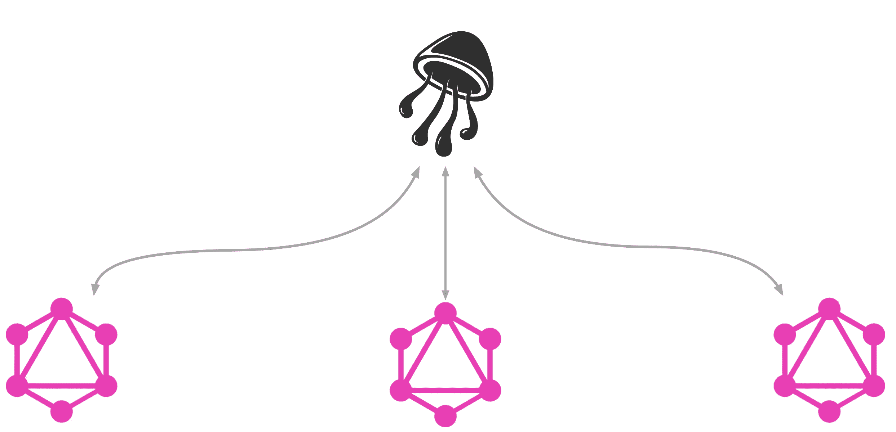

# GraphQL 模式联邦指南，第 2 部分

> 原文：<https://itnext.io/a-guide-to-graphql-schema-federation-part-2-872a820510ff?source=collection_archive---------5----------------------->

## 批准



欢迎阅读构建分布式 GraphQL API 系列指南的第二部分。在这篇文章中，我们将为用户添加一个非常简单的登录和退出系统的机制。然后，我们将看看 nautilus gateway 如何允许我们向我们的`Query`类型的根添加字段，我们将使用这些字段来查询当前用户。

请记住，这篇文章中的代码示例对于生产来说不够安全。我尽我最大的努力尽可能地代表“真实世界”,而不损害例子的清晰性。

本教程要求在您的计算机上安装 Go 和 Node。如果你在设置时遇到困难，请随时联系我们！

# 我们的服务

像以前一样，我们将从起始项目的两个服务开始:

```
git clone https://github.com/alecaivazis/schema-federation-demo && git checkout auth
```

我们的核心应用程序由两个服务组成，一个管理我们的猫照片，另一个负责我们的拍卖。这两个服务被合并到第三个服务中，称为“网关”，作为我们应用程序的单一入口点。在本文中，我们还有第四个服务，负责验证用户。在我们的设置中，每个服务负责其特定的授权逻辑。网关只负责从用户请求中提取信息，并将其转发给其他服务。

由于我们的例子很小，auth 服务只需要向我们的 API 添加一个突变:`login`。正如预期的那样，`login`接受`username`和`password`，如果组合有效，则返回一个令牌，客户机以后可以用它来标识自己。一旦客户机拥有了这个令牌，它将把它包含在对 API 的所有请求的头中。网关将把这个值转发给其他服务，这些服务负责根据它们的域施加任何授权约束。例如，由照片服务来定义用户 1 是否可以解决`User.favoritePhoto`。

# 构建自定义网关

默认情况下，nautilus 网关在解析查询时不会将任何头转发给后端服务。为了实现这一点，我们必须构建一个定制的二进制文件，这需要编写一些 Go。如果你以前从未写过围棋，不要担心！如果你懂 JavaScript，读起来应该很简单。

如果你看一下`gateway.go`,你会看到很多创建网关实例所必需的样板文件已经就绪。我们首先必须自省我们的远程后端，用结果实例化网关，并将其连接到我们的 http 路由器。

在我们走得太远之前，让我们验证一切都在工作。按照自述文件中的说明启动其他服务，然后用`go run gateway.go`运行网关。现在，您应该会看到一条带有 URL 的消息，您可以访问我们的系统并与之交互。使用以下查询以用户 1 的身份登录，并保留返回的身份验证令牌:

# 将用户信息转发到我们的后端

现在客户机有了一个要求身份的令牌，我们必须在网关中处理它，并向服务发送它们执行任何类型的授权检查所需的信息。为此，我们将定义一个`nautilus.RequestMiddleware`，它根据请求上下文中的某个值向出站请求添加一个头。要做到这一点，我们首先必须从传入的请求中获取头的值，并将其保存在执行上下文中。让我们首先定义一个中间件，它将包装我们的操场路由，并将提取传入的`Authorization`头的值，将其保存在请求上下文的`"user-id"`键下，并调用下一个处理程序:

不要忘记用这个中间件包装我们之前定义的路线:

既然我们在请求上下文中有了授权头的值，我们就可以定义一个`gateway.RequestMiddleware`,提取我们之前设置的`"user-id"`键的值，并在网关和其他服务之间发出的内部网络请求上设置一个头:

将中间件包含到我们对`gateway.New`的调用中:

既然我们的网关将用户的 ID 和他们的请求一起转发，剩下唯一要做的事情就是转到我们的后端服务，用那个值做一些事情。例如，让我们让您看不到另一个用户的`photoGallery`。为此，打开`photoService.js`并修改`User.photoGallery`解析器，如下所示:

有了这些，您应该能够验证预期的行为。取之前写下的 token，设置为操场中`Authorization` 头的值。现在，当您尝试启动这个查询时，您应该会看到一个错误，因为您是以用户“1”的身份登录的，并且正在查找用户“2”的`photoGallery`:

# 查询当前用户

虽然分布式 API 中的大部分逻辑和计算发生在网关“背后”的服务中，但在某些情况下，由网关本身解析字段是有意义的。在具有授权的 API 中，一个非常常见的实例是查询当前用户的能力。按照惯例，这个字段被称为`Query.viewer`，它允许当前用户要求自己的东西:

将这些类型的字段添加到 nautilus 网关只需要几行代码:

剩下的唯一一件事就是告诉网关将这个字段与我们之前的中间件一起使用:

我们现在应该能够使用以下查询来查询我们最喜欢的照片:

# 结论

在这篇博文中，我们构建了一个定制网关，它接受由 mutation 提供的 auth 令牌，并将底层用户的 ID 转发到我们的后端。然后，我们在服务中使用这些信息来定义特定于域的授权逻辑。最后，我们看到，我们还可以使用这个令牌在网关上定义一个字段，该字段解析为当前用户，而不需要额外的网络跳跃来解析服务级别的字段。

虽然这个例子被精简为简单的必需品，但希望它说明了不同的运动部件是如何一起工作的。请记住，验证密码、创建和验证令牌等细节并不意味着展示最佳做法，而是行业标准的占位符。如果你不确定更好的解决方案是什么，你可以随时在 gopher's slack 上找到我。

暂时就这样吧！非常感谢你陪我走了这么远。

不幸的是，我还没有准备好这个系列的下一篇文章。然而，我知道它很可能包含一个性能技巧，我们可以用它来加快网关的查询时间。敬请期待！

一如既往，如果这是我们分手的地方，我希望你有一个美好的一天休息。

*原载于【https://alec.aivazis.com】[](https://alec.aivazis.com/blog/schema-federation/auth)**。***