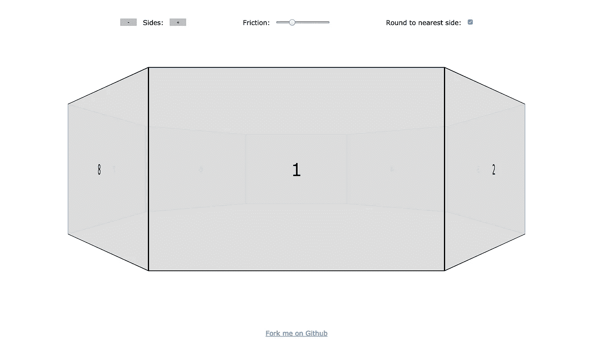
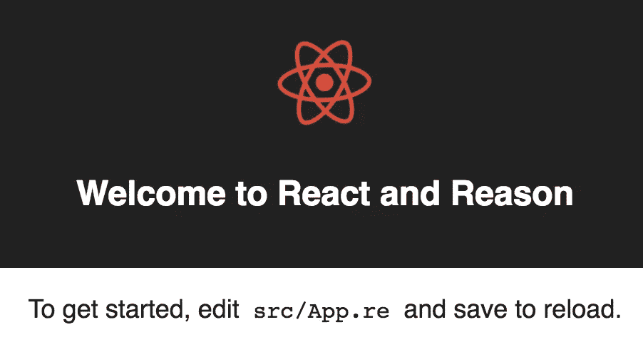
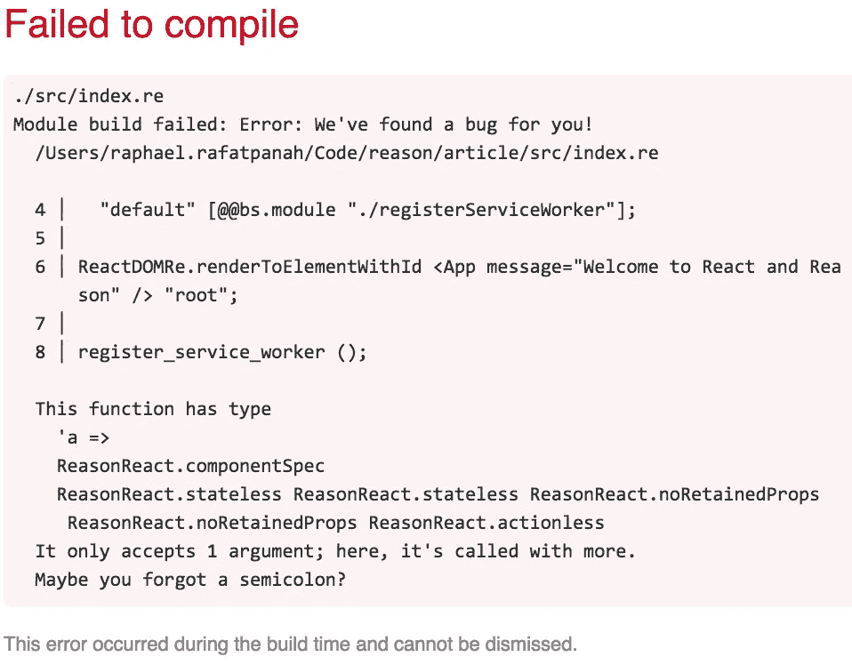

# 理性之旅

> 原文：<https://itnext.io/a-journey-to-reason-c408a87a54de?source=collection_archive---------1----------------------->

让我们建立一个三维旋转木马

> 注意:这是从反应过渡到理性的“理性之旅”系列的一部分。敬请关注。还会有更多这样的事情发生！
> [<上一个](https://medium.com/netscape/a-journey-to-reason-2c2c4cddc012) | [< <从第 1 部分开始](https://medium.com/netscape/a-journey-to-reason-2c2c4cddc012) | [下一个>](https://medium.com/@RRafatpanah/a-reasonml-tutorial-building-an-app-shell-dd7cc617d0c5)


照片由 [Pixabay](https://www.pexels.com/u/pixabay/) 提供

[*点击这里在 LinkedIn 上分享这篇文章*](https://www.linkedin.com/cws/share?url=https%3A%2F%2Fitnext.io%2Fa-journey-to-reason-c408a87a54de)

** *更新原因 3 语法***

在本系列的第一篇文章中，我们介绍了 Reason，以及为什么像我这样的前端工程师会对探索它感兴趣。

很高兴和大家分享我的第一个 Reason 项目: [reason-3d-carousel](https://persianturtle.github.io/reason-3d-carousel/build/) 。



[原因-3d-旋转木马](https://persianturtle.github.io/reason-3d-carousel/build/)

本文的目标是双重的。

1.  为了证明这一点，使用[reason ml](https://reasonml.github.io/)/[react](https://reasonml.github.io/reason-react/)，我们可以构建 web 应用程序来完成一些非常酷的 DOM 操作和动画。在学习了基础知识之后，与使用 JavaScript / ReactJS / etc 相比，我不觉得*受到了理性的限制。*
2.  为那些有 JavaScript / ReactJS 经验的人提供一个构建他们的第一个推理 web 应用程序的指南。我们将一起重现 3D 旋转木马，并一路解释 ReasonReact 概念。

> 在继续之前，我想说一声“谢谢！”感谢[不和谐频道](https://discord.gg/reasonml)的每一个人帮助我完成这个项目。非常感谢你们创造了这样一个热情和博学的社区！

# 设置我们的开发人员环境

您可以通过几种不同的方式开始使用 Reason 构建 web 应用程序。每种方式都需要 [**bsb**](https://bucklescript.github.io/bucklescript/Manual.html#_bucklescript_build_system_code_bsb_code) 。现在让我们来看看:

```
$ npm install -g bs-platform
```

接下来，让我们创建一个项目模板。**出于本教程的目的，让我们使用*创建-反应-应用*选项**，但是要注意其他选项。

## 选项 1: [纯理性](https://reasonml.github.io/guide/javascript/quickstart)

```
bsb -init my-first-app -theme basic-reason
```

## 选项 2: [最小原因反应](https://reasonml.github.io/reason-react/gettingStarted.html)

```
bsb -init my-react-app -theme react
```

## 选项 3: [创建 React 应用](https://github.com/reasonml-community/reason-scripts)(为本指南选择)

```
yarn create react-app <app-name> -- --scripts-version reason-scripts
```

## 编辑器工具

如果你在 macOS / Linux 上，让我们设置你的编辑器。请遵循此处的说明[(安装](https://reasonml.github.io/guide/editor-tools/editors-plugins)[原因-cli](https://reasonml.github.io/guide/editor-tools/global-installation/) 后)。

刚开始时，我对静态类型的函数式语言没有多少经验。我第一次尝试纯粹理性地创建 3D carousel(没有 React 的原因),很快就陷入了使用 DOM 的困境。ReasonReact 的一个优点是它允许 DOM 从我们这里抽象出来。实际上，这意味着不用担心 DOM 类型，我只需使用 Bucklescript 提供的类型 Reason/react&即可。

# 探索我们的项目模板

使用选项三，我们可以立即运行:

```
$ npm run start
```

看到一个熟悉的欢迎页面。



熟悉的创建-反应-应用程序欢迎页面

# 让我们开始建造吧

虽然我会尽量解释一些重要的概念，但我还是建议先阅读一下[原因和](https://reasonml.github.io/guide/language/overview)[原因和反应的文档。](https://reasonml.github.io/reason-react/)

我们当前的目标:创造一个基本的 3D 旋转木马，它还不会旋转。我们使用 Reason 根据边的数量来计算每个边的 CSS。

将`app.css`替换为:

```
#root {
  height: 100vh;
  width: 100vw;
  overflow: hidden;
  position: relative;
  background: white;
  perspective: 62.5vw; /* hard-coded for now */
}#carousel {
  position: absolute;
  transform-style: preserve-3d;
  backface-visibility: visible;
  display: flex;
  align-items: center;
  justify-content: center;
  width: 50vw;
  height: 60vh;
  top: 0;
  left: 0;
  right: 0;
  bottom: 0;
  margin: auto;
  cursor: pointer;
}#carousel figure {
  font-size: 3vw;
  position: absolute;
  background: rgba(220, 220, 220, 0.95);
  overflow: hidden;
  display: flex;
  align-items: center;
  justify-content: center;
  box-sizing: border-box;
  border: 2px solid black;
  width: 100%;
  height: inherit;
  margin: 0;
  top: 0;
  left: 0;
  user-select: none;
}
```

将`app.re`替换为:

```
[%bs.raw {|require('./app.css')|}];let component = ReasonReact.statelessComponent("App");let create_sides = (sides, radius) =>
  Array.init(
    sides,
    (index) => {
      let css =
        "rotate3d(0, 1, 0,"
        ++ (
          string_of_float(360.0 *. float_of_int(index) /. float_of_int(sides))
          ++ ("0deg) translate3d(0, 0," ++ (string_of_float(radius) ++ "0vw)"))
        );
      <figure key=(string_of_int(index)) style=(ReactDOMRe.Style.make(~transform=css, ()))>
        (ReasonReact.stringToElement(string_of_int(index + 1)))
      </figure>
    }
  );let make = (_children) => {
  ...component,
  render: (_self) => {
    let sides = 8;
    let radius = 25.0 /. Js.Math.tan(180.0 /. float_of_int(sides) *. (Js.Math._PI /. 180.0));
    let transform =
      "translate3d(0, 0, -"
      ++ (string_of_float(radius) ++ ("0vw) rotateY(" ++ (string_of_float(0.0) ++ "0deg)")));
    <section id="carousel" style=(ReactDOMRe.Style.make(~transform, ()))>
      (ReasonReact.arrayToElement(create_sides(sides, radius)))
    </section>
  }
};
```

> 非常感谢[亚瓦尔·阿明](https://medium.com/u/522fd8963882?source=post_page-----c408a87a54de--------------------------------)在[不和谐频道](https://discord.gg/reasonml)中帮助我使用 create_sides 功能。

## `app.re`概述:

*   需要一个 CSS 文件(如果该 CSS 文件不存在，将会抛出编译器错误)
*   声明了一个无状态组件(传递给`ReasonReact.statelessComponent`的字符串仅用于调试目的)
*   声明了一个名为`create_sides`的函数，它使用了`[Array.init](https://reasonml.github.io/api/Array.html)`，类型为`int => float => array ReasonReact.reactElement`，这意味着它有两个参数(`int`和`float`，并返回一个 React 元素数组
*   声明了一个`make`函数，它是当`index.re`调用`<App />`时被调用的函数(类似于 ReactJS 的`class App extends React.Component`，除了它使用组合而不是继承——当你注意到下一行的`…component`时，你可以猜到)
*   `make`功能有一个`render`字段
*   像`vw`和`deg`这样的 CSS 单元以`0`为前缀，因为 floats 总是包含一个小数——`10`变成了`10.`—`10.deg`不是有效的 CSS

## 编译器错误

保存后我们注意到的第一件事是我们得到了一个编译器错误。



编译器给我们发现了一个 bug！

这里的问题是`index.re`在 App 组件上包含了一个`message`道具，但是 App 组件不接受一个`message`道具。删除不用的`message`道具修复了 bug，我们的 3D 旋转木马渲染了！

注意:在 ReactJS 中，未使用的属性不会导致错误或警告。

## Reason 与 JavaScript 的互操作性

当检查`app.re`时，我们看到:

```
[%bs.raw {|require('./app.css')|}];
```

我们可以使用 [Bucklescript](https://bucklescript.github.io/bucklescript/Manual.html) 与 JavaScript 进行互操作。同样在代码中，我们可以看到使用了`Js.Math.tan`和`Js.Math._PI`。Bucklescript 有许多内置的、类型安全的 JavaScript 绑定，但是我们也可以编写自己的绑定——正如我们将在本文后面看到的。

## 一些反应差异

我们已经看到 React 和 react 之间有很多相似之处。在这个无状态组件中，当道具改变时，组件会重新渲染。

当然，在这个例子中，只有一个未使用的`_children`道具。来自[文档](https://reasonml.github.io/reason-react/#reason-react-component-creation-props):

> 最后的道具一定是孩子。如果你不使用它，简单地忽略它，命名为`_`或`_children`。以下划线开头的名字如果没有被使用，不会触发编译器警告。

在撰写本文时，理性的 JSX 需要空格，并且只能包含“元素”——`<div>foo</div>`变成了`<div> (ReasonReact.stringToElement "foo") </div>`。

按理来说，[文件就是模块](https://reasonml.github.io/guide/language/module#every-re-file-is-a-module)。注意在`index.re`中，我们不需要在渲染到 DOM 之前包含`app.re`。`<App />`映射到`app.re`。

设置一个`style`属性也略有不同:

```
<element style=(ReactDOMRe.Style.make(~color="red", ()))
```

注意:`ReactDOMre.Style.make`接受`unit` —也称为`()` —作为它的最后一个参数。来自 JavaScript，一开始对我来说没什么意义。我想通过分析这个函数，我们可以学到很多关于理性的东西。

1.  [单位](https://reasonml.github.io/guide/language/function#no-argument)类似于 JavaScript 中的“无参数”。
2.  所有推理函数都接受单个参数。多参数函数只是[迎合](https://reasonml.github.io/guide/language/function#currying)单参数函数的语法糖。
3.  推理函数可以有[可选的带标签的参数](https://reasonml.github.io/guide/language/function#optional-labeled-arguments)。
4.  `[color](https://github.com/reasonml/reason-react/blob/e508d529fb2c9bf9328498540cd92774fd57315d/src/ReactDOMRe.re#L587)`是一个可选的带标签的参数——事实上，所有 CSS 属性都被实现为可选的带标签的参数。
5.  由于所有 CSS 属性都是可选的`ReasonDOMRe.Style.make`标签参数，有可能它们都没有被使用。
6.  当所有参数都是可选的时，需要将单元传递给`ReasonDOMRe.Style.make`来调用函数。

# 让它旋转起来

请祝贺你自己能走到这一步。我想这就要有回报了。

我们当前的目标:学习有状态组件如何在 ReasonReact 中工作，以及如何处理 DOM 事件。

要旋转转盘，我们只需更改`#carousel`元素上的`rotateY`数量:

`style="transform: translate3d(...) **rotateY**(0deg);"`

## 家政

与其硬编码`sides`、`radius` & `transform`，不如接受他们作为道具吧。

```
let make = (~sides, ~radius, ~transform, _children) => {
  ...component,
  render: (_self) =>
    <section id="carousel" style=(ReactDOMRe.Style.make(~transform, ()))>
      (ReasonReact.arrayToElement(create_sides(sides, radius)))
    </section>
};
```

因为我们之前在`app.css`中硬编码了`perspective`，所以让我们删除`app.css`中`#root`的样式。

让我们将`app.re`重命名为`carousel.re`(类似于`app.css`)。我们将创建`container.re`来管理 3D 转盘的状态。然后，我们将让`index.re`渲染`<Container sides=... friction=... />`而不是`<App />`。

`container.css`

```
#container {
  height: 100vh;
  width: 100vw;
  overflow: hidden;
  position: relative;
  background: white;
}
```

`container.re`

```
[%bs.raw {|require('./container.css')|}];type action =
  | StartInteraction(int)
  | MoveInteraction(int)
  | EndInteraction(int)
  | Spin(float);type values = {
  initial: ref(float),
  final: ref(float),
  current: ref(float),
  previous: ref(float)
};type velocity = {
  current: ref(float),
  list: ref(list(float))
};type css = {
  perspective: string,
  transform: string
};type state = {
  requestAnimationFrameID: ref(int),
  rotation: ref(float),
  radius: float,
  isMouseDown: ref(bool),
  position: values,
  time: values,
  velocity,
  css
};[[@bs](http://twitter.com/bs).val] external requestAnimationFrame : (unit => unit) => int = "requestAnimationFrame";[[@bs](http://twitter.com/bs).val] external cancelAnimationFrame : int => unit = "cancelAnimationFrame";[[@bs](http://twitter.com/bs).val] [[@bs](http://twitter.com/bs).scope "performance"] external now : unit => float = "now";[[@bs](http://twitter.com/bs).val] [[@bs](http://twitter.com/bs).scope "Math"] external abs : float => float = "abs";[[@bs](http://twitter.com/bs).val] [[@bs](http://twitter.com/bs).scope "Math"] external round : float => int = "round";external unsafeAnyToArray : 'a => array('a) = "%identity";let component = ReasonReact.reducerComponent("Container");let findAndFilter = (~list, ~n, ~f) => {
  let rec aux = (list', n', acc) =>
    if (n' == 0) {
      acc
    } else {
      switch list' {
      | [] => []
      | [item, ...rest] =>
        if (f(item)) {
          aux(rest, n' - 1, [item, ...acc])
        } else {
          aux(rest, n', acc)
        }
      }
    };
  aux(list, n, [])
};let rec sum = (list) =>
  switch list {
  | [] => 0.0
  | [item, ...rest] => item +. sum(rest)
  };let averageLatestNonzeroVelocities = (velocities, n) => {
  let latestNonzeroVelocities = findAndFilter(~list=velocities, ~n, ~f=(item) => item != 0.0);
  sum(latestNonzeroVelocities) /. float_of_int(n)
};let spinWithFriction = (state, reduce, friction, sides) => {
  let rec onAnimationFrame = (velocity', ()) => {
    state.velocity.current := velocity';
    if (state.isMouseDown^) {
      Js.log("The carousel has previously been spun.")
    } else if (abs(velocity') < friction) {
      cancelAnimationFrame(state.requestAnimationFrameID^);
      let degreesPerSide = 360.0 /. float_of_int(sides);
      let currentSide =
        if (state.rotation^ < 0.0) {
          round(abs(state.rotation^) /. degreesPerSide) mod sides
        } else {
          (sides - round(abs(state.rotation^) /. degreesPerSide) mod sides) mod sides
        };
      Js.log("You've landed on side " ++ (string_of_int(currentSide + 1) ++ "."))
    } else {
      Js.log(velocity');
      reduce((_) => Spin(velocity'), ());
      state.requestAnimationFrameID :=
        requestAnimationFrame(
          onAnimationFrame(velocity' > 0.0 ? velocity' -. friction : velocity' +. friction)
        )
    }
  };
  state.requestAnimationFrameID := requestAnimationFrame(onAnimationFrame(state.velocity.current^))
};let make = (~sides, ~friction, _children) => {
  ...component,
  initialState: () => {
    let radius = 25.0 /. Js.Math.tan(180.0 /. float_of_int(sides) *. (Js.Math._PI /. 180.0));
    {
      requestAnimationFrameID: ref(0),
      radius,
      rotation: ref(0.0),
      isMouseDown: ref(false),
      position: {initial: ref(0.0), final: ref(0.0), current: ref(0.0), previous: ref(0.0)},
      time: {initial: ref(0.0), final: ref(0.0), current: ref(0.0), previous: ref(0.0)},
      css: {
        perspective: string_of_float(500.0 /. float_of_int(sides)) ++ "0vw",
        transform:
          "translate3d(0, 0, -"
          ++ (string_of_float(radius) ++ ("0vw) rotateY(" ++ (string_of_float(0.0) ++ "0deg)")))
      },
      velocity: {current: ref(0.0), list: ref([])}
    }
  },
  reducer: (action, state) =>
    switch action {
    | StartInteraction(clientX) =>
      state.isMouseDown := true;
      state.position.previous := float_of_int(clientX);
      state.time.initial := now();
      state.time.previous := now();
      state.velocity.current := 0.0;
      state.velocity.list := [];
      ReasonReact.NoUpdate
    | MoveInteraction(clientX) =>
      state.isMouseDown^ ?
        {
          state.position.current := float_of_int(clientX);
          state.time.current := now();
          state.rotation :=
            state.rotation^
            -. (state.position.previous^ -. state.position.current^)
            /. float_of_int(sides * 2);
          let transform =
            "translate3d(0, 0, -"
            ++ (
              string_of_float(state.radius)
              ++ ("0vw) rotateY(" ++ (string_of_float(state.rotation^) ++ "0deg)"))
            );
          let dx = state.position.current^ -. state.position.previous^;
          let dt = state.time.current^ -. state.time.previous^;
          state.velocity.current := dx /. dt;
          state.velocity.list := [state.velocity.current^, ...state.velocity.list^];
          state.position.previous := state.position.current^;
          state.time.previous := state.time.current^;
          ReasonReact.Update({...state, css: {perspective: state.css.perspective, transform}})
        } :
        ReasonReact.NoUpdate
    | EndInteraction(clientX) =>
      state.isMouseDown := false;
      state.position.final := float_of_int(clientX);
      state.time.final := now();
      state.velocity.current := averageLatestNonzeroVelocities(state.velocity.list^, 3);
      ReasonReact.SideEffects(
        ((self) => spinWithFriction(self.state, self.reduce, friction, sides))
      )
    | Spin(velocity) =>
      state.rotation := state.rotation^ +. velocity;
      let transform =
        "translate3d(0, 0, -"
        ++ (
          string_of_float(state.radius)
          ++ ("0vw) rotateY(" ++ (string_of_float(state.rotation^) ++ "0deg)"))
        );
      ReasonReact.Update({...state, css: {perspective: state.css.perspective, transform}})
    },
  render: (self) =>
    <div
      id="container"
      onMouseDown=(self.reduce((event) => StartInteraction(ReactEventRe.Mouse.clientX(event))))
      onMouseMove=(self.reduce((event) => MoveInteraction(ReactEventRe.Mouse.clientX(event))))
      onMouseUp=(self.reduce((event) => EndInteraction(ReactEventRe.Mouse.clientX(event))))
      onTouchStart=(
        self.reduce(
          (event) =>
            StartInteraction(
              unsafeAnyToArray(ReactEventRe.Touch.changedTouches(event))[0]##clientX
            )
        )
      )
      onTouchMove=(
        self.reduce(
          (event) =>
            MoveInteraction(unsafeAnyToArray(ReactEventRe.Touch.changedTouches(event))[0]##clientX)
        )
      )
      onTouchEnd=(
        self.reduce(
          (event) =>
            EndInteraction(unsafeAnyToArray(ReactEventRe.Touch.changedTouches(event))[0]##clientX)
        )
      )
      style=(ReactDOMRe.Style.make(~perspective=self.state.css.perspective, ()))>
      <Carousel sides radius=self.state.radius transform=self.state.css.transform />
    </div>
};
```

`carousel.css`

```
#carousel {
  position: absolute;
  transform-style: preserve-3d;
  backface-visibility: visible;
  display: flex;
  align-items: center;
  justify-content: center;
  width: 50vw;
  height: 60vh;
  top: 0;
  left: 0;
  right: 0;
  bottom: 0;
  margin: auto;
  cursor: pointer;
}
#carousel figure {
  font-size: 3vw;
  position: absolute;
  background: rgba(220, 220, 220, 0.95);
  overflow: hidden;
  display: flex;
  align-items: center;
  justify-content: center;
  box-sizing: border-box;
  border: 2px solid black;
  width: 100%;
  height: inherit;
  margin: 0;
  top: 0;
  left: 0;
  user-select: none;
}
```

`carousel.re`

```
[%bs.raw {|require('./carousel.css')|}];let component = ReasonReact.statelessComponent("Carousel");let create_sides = (sides, radius) =>
  Array.init(
    sides,
    (index) => {
      let css =
        "rotate3d(0, 1, 0,"
        ++ (
          string_of_float(360.0 *. float_of_int(index) /. float_of_int(sides))
          ++ ("0deg) translate3d(0, 0," ++ (string_of_float(radius) ++ "0vw)"))
        );
      <figure key=(string_of_int(index)) style=(ReactDOMRe.Style.make(~transform=css, ()))>
        (ReasonReact.stringToElement(string_of_int(index + 1)))
      </figure>
    }
  );let make = (~sides, ~radius, ~transform, _children) => {
  ...component,
  render: (_self) =>
    <section id="carousel" style=(ReactDOMRe.Style.make(~transform, ()))>
      (ReasonReact.arrayToElement(create_sides(sides, radius)))
    </section>
};
```

`index.re`

```
ReactDOMRe.renderToElementWithId
  <Container sides=8 friction=0.0175 /> "root";
```

在浏览器中，我们可以看到我们可以旋转我们的 3D 旋转木马！

# 逐渐地

我们来分解一下有状态组件:`container.re`。来自[文档](https://reasonml.github.io/reason-react/docs/en/state-actions-reducer.html):

> React 有状态组件类似于 ReactJS 有状态组件，只是内置了“reducer”的概念(如 [Redux](http://redux.js.org/) )。

## 行动

改变状态的唯一方法是通过下面的动作。

```
type action =
  | StartInteraction(int)
  | MoveInteraction(int)
  | EndInteraction(int)
  | Spin(float);
```

## 状态

以下类型用于塑造`container.re's`状态。`[ref](https://reasonml.github.io/guide/language/mutation)`意思是“可变的”

```
type values = {
  initial: ref(float),
  final: ref(float),
  current: ref(float),
  previous: ref(float)
};type velocity = {
  current: ref(float),
  list: ref(list(float))
};type css = {
  perspective: string,
  transform: string
};type state = {
  requestAnimationFrameID: ref(int),
  rotation: ref(float),
  radius: float,
  isMouseDown: ref(bool),
  position: values,
  time: values,
  velocity,
  css
};
```

指出 ReactJS 和 ReasonReact 之间的以下区别很重要。在 ReactJS 中，每次组件的状态改变时，组件都会被重新呈现。由于这个原因，在 ReactJS 中，我们有组件状态之外的变量。从原因反应[文档](https://reasonml.github.io/reason-react/docs/en/instance-variables.html):

> 实际上，这只不过是一种几乎不加掩饰的方式来改变组件的“状态”，而不会触发重新渲染。ReasonReact 要求您正确地将这些实例变量放入组件的`*state*`和 Reason `*ref*`中。

所以，更新`state.isMouseDown`不会触发重新渲染。事实上，**唯一可以触发重新渲染的字段**是`state.radius` & `state.css`。其余的都是实例变量。

## 自定义 JavaScript 绑定

如前所述，使用 Bucklescript，我们可以创建自己的 JavaScript 绑定。我们将很快看到这些是如何使用的。

```
[[@bs](http://twitter.com/bs).val] external requestAnimationFrame : (unit => unit) => int = "requestAnimationFrame";[[@bs](http://twitter.com/bs).val] external cancelAnimationFrame : int => unit = "cancelAnimationFrame";[[@bs](http://twitter.com/bs).val] [[@bs](http://twitter.com/bs).scope "performance"] external now : unit => float = "now";[[@bs](http://twitter.com/bs).val] [[@bs](http://twitter.com/bs).scope "Math"] external abs : float => float = "abs";[[@bs](http://twitter.com/bs).val] [[@bs](http://twitter.com/bs).scope "Math"] external round : float => int = "round";external unsafeAnyToArray : 'a => array('a) = "%identity";
```

最后一个用于将`[TouchList](https://developer.mozilla.org/en-US/docs/Web/API/TouchList)`转换为`array`。我不确定是否有更安全的方法，但是如果有人知道，请分享！

## 初态

来自[文件](https://reasonml.github.io/reason-react/#reason-react-component-creation-state-actions-reducer):

> ReactJS' `getInitialState`在 ReasonReact 中被称为`initialState`。

按理说，函数的最后一条语句返回。这里，返回类型为`state`的记录。它属于`state`类型，因为它与上面定义的`type state`的形状相匹配。按道理，类型是推断出来的。

```
**initialState**: () => {
    let radius = 25.0 /. Js.Math.tan(180.0 /. float_of_int(sides) *. (Js.Math._PI /. 180.0));
    {
      requestAnimationFrameID: ref(0),
      radius,
      rotation: ref(0.0),
      isMouseDown: ref(false),
      position: {initial: ref(0.0), final: ref(0.0), current: ref(0.0), previous: ref(0.0)},
      time: {initial: ref(0.0), final: ref(0.0), current: ref(0.0), previous: ref(0.0)},
      css: {
        perspective: string_of_float(500.0 /. float_of_int(sides)) ++ "0vw",
        transform:
          "translate3d(0, 0, -"
          ++ (string_of_float(radius) ++ ("0vw) rotateY(" ++ (string_of_float(0.0) ++ "0deg)")))
      },
      velocity: {current: ref(0.0), list: ref([])}
    }
  },
```

## 还原剂

reducer [模式匹配所有可能的动作](https://reasonml.github.io/guide/language/pattern-matching)，并定义每个动作应该如何更新状态。这里我们可以看到我们使用的一个定制 JavaScript 绑定，`now`(绑定到`performance.now`)。

`:=`语法用于更新一个`ref`。

```
reducer: (action, state) =>
    switch action {
    | StartInteraction(clientX) =>
      state.isMouseDown := true;
      state.position.previous := float_of_int(clientX);
      state.time.initial := now();
      state.time.previous := now();
      state.velocity.current := 0.0;
      state.velocity.list := [];
      **ReasonReact.NoUpdate
    ...**
```

值得注意的是，每个动作必须返回下列值之一(来自[文档](https://reasonml.github.io/reason-react/docs/en/state-actions-reducer.html)):

*   `ReasonReact.NoUpdate`:不做状态更新。
*   `ReasonReact.Update(state)`:更新状态。
*   `ReasonReact.SideEffects((self) => unit)`:无状态更新，但触发副作用，如`ReasonReact.SideEffects((_self) => Js.log("hello!"))`。
*   `ReasonReact.UpdateWithSideEffects((state, self) => unit)`:更新状态，**然后**触发副作用。

> “副作用”大致意思是“在某处改变了某些东西”。Js.log 是一个副作用，因为它向控制台写入了一些数据。将数据写入数据库也是一个副作用。甚至从数据库中读取数据也是一种副作用，因为运行从数据库中读取数据的函数可能会在多次调用时产生不同的输出。

我们可以有把握地说`StartInteraction`不会触发重新渲染。但是我们如何引发一个行动呢？

## 触发一个动作

向`render`函数传递一个名为`self`的参数。来自[文档](https://reasonml.github.io/reason-react/docs/en/state-actions-reducer.html):

*   当前的`state`值可以通过`self.state`访问，只要`self`作为某个函数的参数传递给你。
*   在`render`中，您将使用`self.reduce`而不是`self.handle`(不允许状态更新)。`reduce`接受一个回调，向它传递事件(或者`onSubmit` / `onClick` / `onFoo`从`MyDialog`给你的任何回调负载)，并请求一个动作作为返回值。

在我们的代码中，回调有效载荷是`clientX`。

记住，`StartInteraction`接受一个`int`。那个`int`就是`clientX`。

```
render: (self) =>
    <div
      id="container"
      onMouseDown=(self.reduce((event) => **StartInteraction**(ReactEventRe.Mouse.clientX(event))))
      onMouseMove=(self.reduce((event) => **MoveInteraction**(ReactEventRe.Mouse.clientX(event))))
      onMouseUp=(self.reduce((event) => **EndInteraction**(ReactEventRe.Mouse.clientX(event))))
      ...
    </div>
```

我也可以有这样的东西:

```
type **clientX** = int;type action =
  | StartInteraction(**clientX)**
  | MoveInteraction(**clientX)**
  | EndInteraction(**clientX)**
  | Spin(float);
```

# 自旋动作是如何触发的？

您可能会注意到，上面只显示了如何触发`StartInteraction`、`MoveInteraction`和`EndInteraction`。

`Spin`用于根据用户拖动运动的计算速度旋转转盘。一旦用户停止与转盘(即`onMouseUp`)的交互，就会触发`Spin`动作。

那么，我们如何将它转化为代码呢？

让我们检查一下`reducer`中的`EndInteraction`箱。

```
| **EndInteraction**(clientX) =>
  state.isMouseDown := false;
  state.position.final := float_of_int(clientX);
  state.time.final := now();
  state.velocity.current := averageLatestNonzeroVelocities(state.velocity.list^, 3);
  ReasonReact.SideEffects(
    ((self) => spinWithFriction(self.state, self.reduce, friction, sides))
  )
```

这里重要的一点是:

```
**ReasonReact.SideEffects**((self) => spinWithFriction(self.state, self.reduce, friction, sides))
```

`Spin`是副作用的结果！一个名为`spinWithFriction`的辅助函数接受`state`(当前状态)和`reduce`(一个可以触发动作的函数，与`render`中使用的相同)。

注意:`ReasonReact.SideEffects`通过`self`，但是`ReasonReact.Update` 没有。因为我们可以访问`self`，所以我们可以在一个助手函数中更新状态。

让我们检查一下`spinWithFriction`助手函数。

注意:

*   我们在这里使用了一些自定义的 JavaScript 绑定，比如`requestAnimationFrame`和`cancelAnimationFrame`
*   `^`语法用于获取`ref`的当前值
*   `[rec](https://reasonml.github.io/guide/language/function#recursive-functions)`用于定义递归函数
*   `velocity'`只是一个变量名(读作 velocity prime)
*   `reduce (() => Spin(velocity’), ());`用于从助手功能中触发一个动作

```
let **spinWithFriction** = (**state**, **reduce**, friction, sides) => {
  let **rec** **onAnimationFrame** = (velocity', ()) => {
    state.velocity.current := velocity';
    if (state.isMouseDown^) {
      Js.log("The carousel has previously been spun.")
    } else if (abs(velocity') < friction) {
      cancelAnimationFrame(state.requestAnimationFrameID^);
      let degreesPerSide = 360.0 /. float_of_int(sides);
      let currentSide =
        if (state.rotation^ < 0.0) {
          round(abs(state.rotation^) /. degreesPerSide) mod sides
        } else {
          (sides - round(abs(state.rotation^) /. degreesPerSide) mod sides) mod sides
        };
      Js.log("You've landed on side " ++ (string_of_int(currentSide + 1) ++ "."))
    } else {
      Js.log(velocity');
      **reduce**((_) => **Spin**(**velocity'**), ());
      state.requestAnimationFrameID :=
        requestAnimationFrame(
          onAnimationFrame(velocity' > 0.0 ? velocity' -. friction : velocity' +. friction)
        )
    }
  };
  state.requestAnimationFrameID := requestAnimationFrame(onAnimationFrame(state.velocity.current^))
};
```

现在让我们检查`reducer`中的`Spin`箱。

```
| Spin(velocity) =>
  state.rotation := state.rotation^ +. velocity;
  let transform =
    "translate3d(0, 0, -"
    ++ (
      string_of_float(state.radius)
      ++ ("0vw) rotateY(" ++ (string_of_float(state.rotation^) ++ "0deg)"))
    );
  **ReasonReact.Update({...state, css: {perspective: state.css.perspective, transform}})**
},
```

我们用新的 CSS 更新`state`！

# 带保留道具

GitHub 上的示例包括第三个组件，用于显示`sides`、`friction`和`roundToNearestSide`的控件。这与`container.re`目前的工作方式非常相似。只是一个`ReasonReact.reducerComponent`。

然而，在带有控件的示例中，`container.re`变成了`ReasonReact.reducerComponentWithRetainedProps`。

为了比较当前和下一个道具，组件可以是:

*   一个`ReasonReact.statelessComponentWithRetainedProps`
*   答`ReasonReact.reducerComponentWithRetainedProps`

看看[文档](https://reasonml.github.io/reason-react/docs/en/lifecycles.html#access-next-or-previous-props-retainedprops)和 [GitHub 示例](https://github.com/persianturtle/reason-3d-carousel/blob/master/src/container.re#L55)。密切注意:

*   [保留道具](https://github.com/persianturtle/reason-3d-carousel/blob/master/src/container.re#L133)
*   [willReceiveProps](https://github.com/persianturtle/reason-3d-carousel/blob/master/src/container.re#L134)

基本的想法是，如果`container.re's`的道具发生了变化，`cancelAnimationFrame`会重新调用`spinWithFriction`。

# 摘要

我希望我已经解释了足够多的`ReasonReact`来帮助你开始你自己的应用程序。如果还有不清楚的地方，请加入[不和谐频道](https://discord.gg/reasonml)询问专家。

我没有涉及任何用于计算 carousel 各种属性的数学，但是我把它包括进来是为了在实践中介绍 Reason 的语法。如果有人感兴趣，请在下面评论！

也请让我知道我是否能更好地解释一个概念，或者你是否知道做某事的更好的方法。

感谢您的阅读。我希望你和我一样喜欢理性！