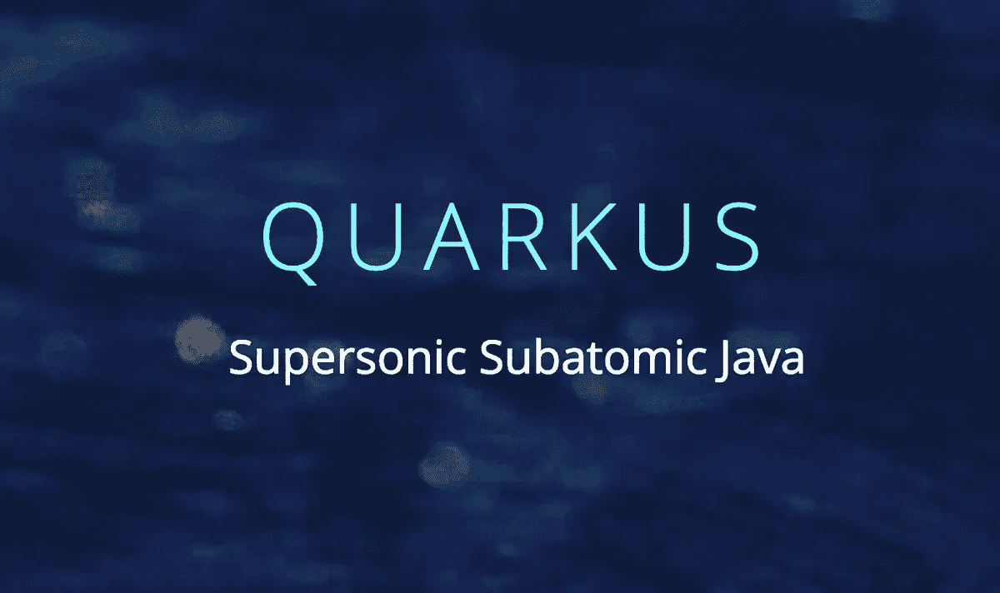

# 与夸库斯的旅行

> 原文：<https://itnext.io/a-journey-with-quarkus-ff73fc64cfe1?source=collection_archive---------7----------------------->

2019 年 5 月，我出席了 [Devoxx UK event](https://www.devoxx.co.uk/) ，在那里我看到了由 Sanne Grinovero 演示的来自 Red Hat 的名为 Quarkus 的新 Java 框架演示。我对它感兴趣，主要是因为我整天都在使用 Spring environment，学习新技术和从不同的角度看解决方案很重要。

所以我决定用 Quarkus 创建一个简单的 API。我在本文中的目标是描述我的框架开发之旅，我学到了什么，并展示如何用不同的工具开发软件。



https://quarkus.io/

## 应用特征

为了开发 API，我使用了:

*   Java 11
*   专家
*   龙目岛
*   Quarkus 0.20.0(与 Quarkus Hibernate Panache 一起使用)
*   PostgreSQL 数据库和 H2 数据库(测试范围)
*   码头工人和码头工人组成。

## 编写代码

我创建了一个技术商店解决方案。为了保持项目的简单，我只使用了一个模型，还有 Lombok。遵循 Quarkus 模型:

```
@AllArgsConstructor
@NoArgsConstructor
@Data
@Entity
@Builder
**public class** Product **extends** PanacheEntity {

    **private** String **name**;
    **private** String **description**;
    **private double price**;
}
```

正如我们所看到的，在 Quarkus，我们扩展了 PanacheEntity。这个抽象类表示一个具有生成的长 ID 的实体。因此，我们不需要在模型中声明 ID 属性。此外，PanacheEntity 扩展了 PanacheEntityBase，它生成所有有用的数据库方法，如查找、删除、持久化等。

您不需要在 Quarkus 中实现存储库类。[如官方文档](https://quarkus.io/guides/hibernate-orm-panache-guide)所示，可以直接使用模型类执行数据库命令:

```
if(product.isPersistent()) product.delete();
```

在我的项目中，我决定创建一个类来简化可视化。

为了用默认值初始化数据库，我用@ApplicationScoped 声明了一个 bean，并使用 StartupEvent 在启动时运行我的方法。用@Transactional 注释这个方法很重要，这样 Quarkus 就可以打开和关闭事务。

```
@ApplicationScoped
**public class** AppLifecycleBean {

    **private static final** Logger ***LOGGER*** = LoggerFactory.*getLogger*(**"Listener bean"**);

    @Transactional
    **void** onStart(@Observes StartupEvent event) {
        ***LOGGER***.info(**"Application starting..."**);
        createDB();
    }

    **private void** createDB() {
        Stream.*of*(**new** Product(**"Mouse"**, **"Really good mouse"**, 20),
                **new** Product(**"Notebook"**, **"Great notebook"**, 1000),
                **new** Product(**"Keyboard"**, **"Great keyboard"**, 300),
                **new** Product(**"Headphones"**, **"Great headphones"**, 60),
                **new** Product( **"Touchscreen"**, **"Great screen"**, 500))
                .forEach(product -> product.persist());
    }
}
```

也可以只在 *import.sql* 文件中添加 SQL 语句，[根据官方文档](https://quarkus.io/blog/hibernate-orm-config-profiles/)。

在 REST 端点实现中，由于 Quarkus 使用了 JAX-RS，所以我用@Produces 和@Consumes 注释了这个类，而不是注释每个方法。

```
@Path(**"/products"**)
@Produces(***APPLICATION_JSON***)
@Consumes(***APPLICATION_JSON***)
**public class** StoreController {

    @Inject
    **private** ProductRepo **productRepo**;

    @GET
    **public** List<Product> getProducts() {
        **return productRepo**.getProducts();
    }

    @GET
    @Path(**"/{id}"**)
    **public** Response getProductById(@PathParam(**"id"**) **long** id) {
        **if**(**productRepo**.getProductById(id).isPresent()) **return** Response.*ok*(**productRepo**.getProductById(id).get()).build();
        **else return** Response.*status*(***NOT_FOUND***).build();
    }

    @POST
    **public** Response addProduct(Product newProduct) {
        Product p = **productRepo**.addProduct(newProduct);
        **return** Response.*ok*(p).build();
    }

    @PUT
    @Path(**"/{id}"**)
    **public** Response updateProduct(@PathParam(**"id"**) **final long** id, Product product) {
        **productRepo**.updateProduct(id, product);
        **return** Response.*ok*(product).build();
    }

    @DELETE
    @Path(**"/{id}"**)
    **public** Response deleteProduct(@PathParam(**"id"**) **final long** id) {
        **productRepo**.deleteProduct(id);
        **return** Response.*noContent*().build();
    }
}
```

为了完成开发，我使用 Docker 和 Docker Compose 来编排 PostgreSQL 容器和我的应用程序。遵循以下 Dockerfile 文件:

```
FROM fabric8/java-centos-openjdk11-jreENV JAVA_OPTIONS="-Dquarkus.http.host=0.0.0.0 -Djava.util.logging.manager=org.jboss.logmanager.LogManager -Xmx256m"
ENV AB_ENABLED=jmx_exporterCOPY target/lib/* /deployments/lib/
COPY target/*-runner.jar /deployments/app.jarENTRYPOINT [ "/deployments/run-java.sh" ]
```

正如我们所见，*目标/库*文件夹被完全复制到容器中。在 [Quarkus 文档中引用了](https://quarkus.io/guides/getting-started-guide):*注意这不是一个超级 jar，因为依赖项被复制到了* `*target/lib*` *目录中。*

现在 docker-compose.yml 文件:

```
**version**: **'3.1'

services**:
  **quarkus**:
   **build**:
     **context**: .
     **dockerfile**: Dockerfile
   **depends_on**:
     - postgres
   **ports**:
     - 8080:8080

  **postgres**:
    **image**: postgres:latest
    **environment**:
      - POSTGRES_PASSWORD=test
      - POSTGRES_USER=test
      - POSTGRES_DB=testdb
    **ports**:
      - **"5432:5432"**
```

## 我的经历

在整个开发过程中，我了解到 Quarkus 是一个新的开源项目，而且进展很快。我从 Quarkus 0.17.0 开始开发，现在是 0.20.0 版本。我可以通过在资源库中打开一个问题来为项目做贡献:[https://github.com/quarkusio/quarkus/issues/2961](https://github.com/quarkusio/quarkus/issues/2961)。

正如我们在 REST 端点注释和 CDI events @Observes 注释中看到的那样，Quarkus 看起来和感觉上都像 Java EE。[扩展模型](https://quarkus.io/extensions/)允许与第三方代码集成。你可以使用官方网站上的[指南开始一个新项目，如果你有困难，可以查看 Github](https://quarkus.io/guides/) 中的[快速启动项目。](https://github.com/quarkusio/quarkus-quickstarts)

您可以使用 Quarkus 通过 GraalVM 编译成本地映像，这样您就不需要 JRE 来运行您的 Java 应用程序。如果你不了解 GraalVM，我建议你看一下 GraalVM 的官方文档，以及如何使用这两种解决方案构建一个本地可执行文件。

正如我们在 Sanne 的 Devoxx 中的[演示以及这篇关于 Oleg elajev](https://www.youtube.com/watch?v=za5CSBX-UME)的[轻量级云原生 Java 应用的文章中所看到的，使用 GraalVM 的一些好处是启动速度更快，运行时内存需求更少。](https://medium.com/graalvm/lightweight-cloud-native-java-applications-35d56bc45673)

## 结论

使用 Quarkus 可以轻松快速地创建解决方案。我的建议是，也将永远是，学习更多。因此，去那里测试新的 Quarkus，与你已经完成的项目进行比较，检查用它编码的感觉如何。

你可以从我的 Github 下载这个项目:[https://github.com/andreybevilacqua/techstore.](https://github.com/andreybevilacqua/techstore.)按照 Readme.md 文件中的步骤执行应用程序。