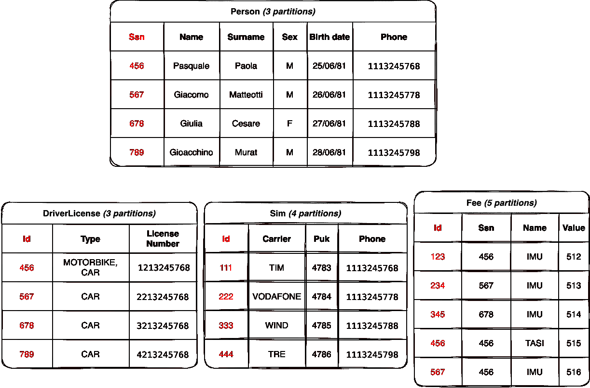
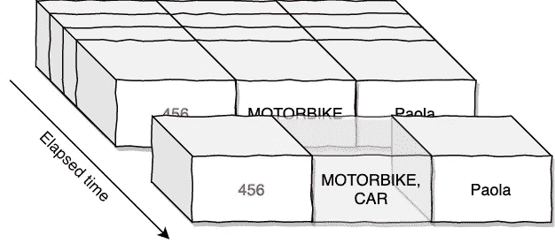
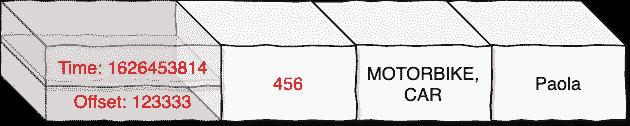
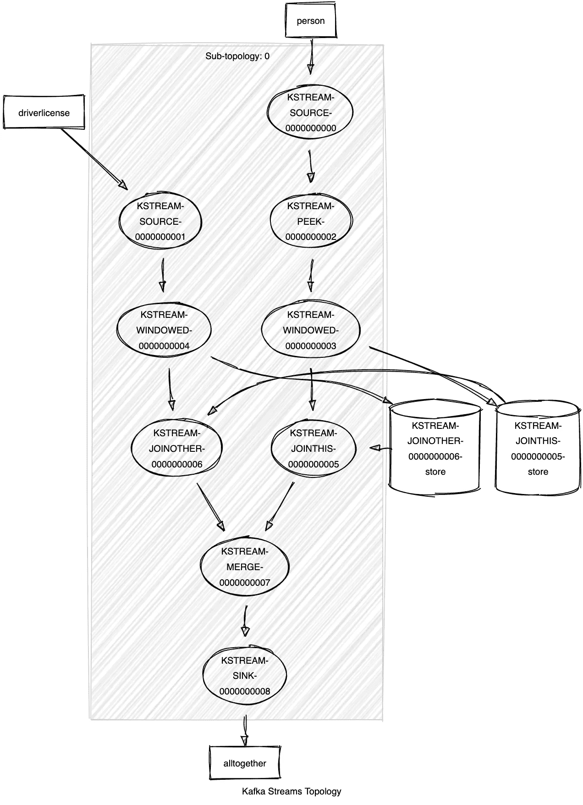
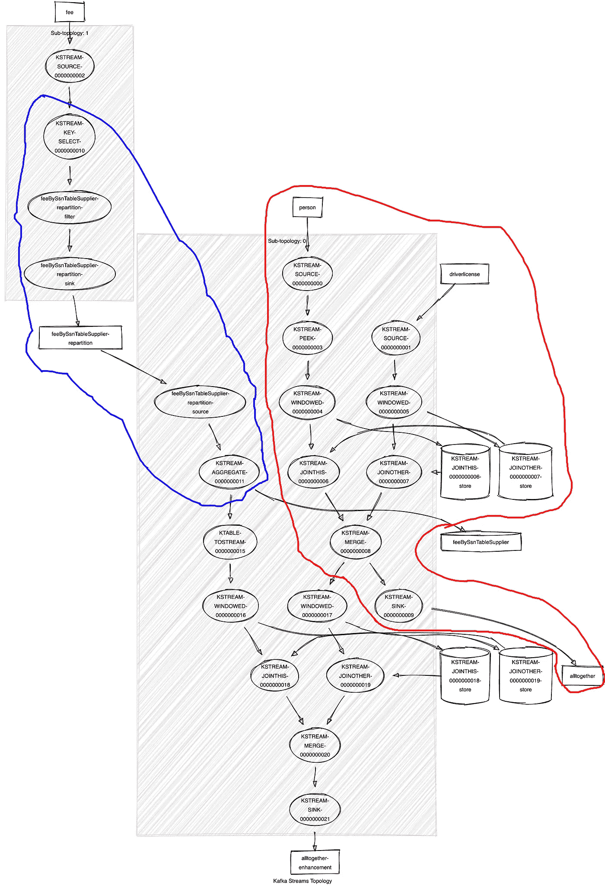

# 带有 Quarkus 的 Kafka 流应用程序

> 原文：<https://itnext.io/a-kafka-streaming-application-with-quarkus-722ad2a8def1?source=collection_archive---------1----------------------->

约书亚·索蒂诺在 [Unsplash](https://unsplash.com?utm_source=medium&utm_medium=referral) 上拍摄的照片

Kafka 流媒体应用平台正在成为*【事实上】*ETL(提取、转换和加载)世界的现代方法。也许你已经读了很多关于“什么是卡夫卡”、“什么是主题”和“什么是分区”的内容，但我想与你讨论“什么是流媒体应用”，这是本文的目的，我希望我会达到这个目的。《Kafka streams in Action》一书*将流处理定义为*“在数据到达您的系统时对其进行处理”*或者更精确的说法*“流处理是在数据流动时，通过连续计算对无限数据流进行处理的能力，而无需收集或存储数据来对其进行处理”*。通常，当我们拥有大量数据(BigData)并且需要快速响应或报告传入数据时，我们会使用流处理应用程序。*

*在继续之前，这里描述的完整示例发布在 https://github.com/paspao/quarkus-streaming-app 的 Github 上，它不仅包含流媒体应用，还包含完整的部署场景:*

*   *1 个 Zookeeper 实例*
*   *3 个卡夫卡实例*
*   *1 个 Kafdrop 实例(查看 Kafka 主题/实例等内容的简单方法)*
*   *1 个流媒体应用程序(如本文所述)*

*通过 Kafdrop 你可以验证卡夫卡主题的内容。*

*现在，让我们假设所有的数据都已经存在于 Kafka 主题中，我试着在下图中画出它们:*

**

*所以我创建了四个简单的实体(每一个都是 Kafka 主题表示):Person、DriverLicense、Sim、Fee。数据架构非常简单:一个人可以有一些驾照，一个人可以有 sim 卡，最后但并非最不重要的是，一个人不幸地支付费用。我用红色标记了主题的*键*，整行都是卡夫卡的信息或*有效载荷*。*

*显然，表格表示是一种简化，我们必须记住，表格中的每一行都可能包含多条消息，如下图所示:*

**

*同一行/消息可能有多个*版本*，为什么？*

**

*卡夫卡的行为就像一个*提交日志*，它是交易的记录。在数据库环境中，它用于跟踪正在发生的事情，并有助于灾难恢复，它代表所有 RDBMS 的承载结构。我们可以将*提交日志*定义为不可变的有序事件记录。*

*Kafka 为每一行存储了两个隐藏值:一个*偏移量*和一个*时间戳*。使用*偏移量*字段，您可以明确地标识分区中的一行。选择管理这两个*隐藏的*值是因为管理*时间*:事实上 Kafka 给了我们在特定时间窗口内处理消息的选项。例如，我们可以决定处理我们在 2009 年收到的消息，忽略我们在那一年之前或之后收到的所有消息，*忽略*这是让我们实现高速度的原因，事实上这是卡夫卡赞助/实现的实时处理(*流*)的秘密之一。*

*现在回到这个例子。我的第一个目标是加入两个简单的主题，即*人*和*驾照*，因为我想知道有多少人已经有了驾照，所以让我们开始加入这两个主题。从数据的角度来看，要连接两个主题，它们必须遵守*共同分区*要求，即:*

*   *连接的输入记录必须具有相同的键(或键模式)*
*   *输入记录的两边必须有相同数量的分区*
*   *连接的两端必须具有相同的分区策略(通常我们使用 kafka 客户端提供的默认策略，实际上忽略了选择不同策略的能力)*

*在这段代码中，你找不到配置，这不是我们的重点，这里的重点是流(无论如何你可以在 repo 中找到细节):在第 3 行和第 5 行，我们定义了两个流，一个用于 *Person* 主题，一个用于 *DriverLicense* 主题，然后只是一个 *peek* 操作来记录 *stream person* 以及随后在第 10–16 行 Person 和 driver 之间的 *join* 操作注意，我在第 10 行使用了一个 *peekStream* 而不是 *personStream* ，因为我想添加一个新的节点来记录流(我正在构建一个*拓扑…* )，我们需要一些东西来查看这个拓扑，所以在第 21 行我打印出了控制台日志中的流/拓扑，这是一个逻辑描述:*

*我们可以使用这个片段来绘制拓扑，使用类似[https://zz85.github.io/kafka-streams-viz/](https://zz85.github.io/kafka-streams-viz/)的工具，下面你可以找到结果:*

**

*现在我们有了简单拓扑的图形表示。可以更清楚地看到我们已经讨论过的主题、流和 *peek* 操作，但是现在我们可以更清楚地看到在 join 操作期间发生了什么。在第 12 行，我们使用了一个*join window*,*join*操作是一个有状态转换，我们需要一个状态存储来收集到目前为止在定义的窗口边界内接收到的所有记录。使用 Kafka，我们能够将时间视为数据，因此我们不想处理特定记录收到的所有更新，而只处理最近 5 分钟内发生的更改。例如，这样我将只处理几千字节的数据(在 BigData 上下文中，我们可以处理万亿字节的数据)。因此，对于 join 操作的每个元素，拓扑结构方面将创建一个状态存储(图片右侧的两个圆柱体),并且在 kafka 上也将创建一个相应的主题，这些主题被命名为 *store-changelog* topics，这是为了确保 Kafka 流的 foult-talerant 功能。如汇合文档中所述:*“这些 changelog 主题也被分区，以便每个本地状态存储实例以及访问存储的任务都有自己专用的 changelog 主题分区。在 changelog 主题上启用了日志压缩，以便可以安全地清除旧数据，防止主题无限增长。如果任务在一台失败的机器上运行，并在另一台机器上重新启动，Kafka Streams 保证在重新开始处理新启动的任务之前，通过重放相应的 changelog 主题，将它们的关联状态存储恢复到失败之前的内容。因此，故障处理对最终用户来说是完全透明的。”**

*因此，在第 18 行的最后一步中，数据将通过键连接，结果将存储在 *alltogether* 主题中，类似于:*

*好了，现在让我们试着创建一个更复杂/更现实的场景:让我们试着加入没有*共同划分的*主题，或者至少还没有，所以我们现在要做的是将 *alltogether* 主题与 *fee* 主题结合起来。结果将是具有以下内容的有效载荷:*

*   *人*
*   *驾照*
*   *费用*

*第一部分已经实现(它是前一部分的副本)，所以我们可以完全忽略第 1–20 行:*

*在第 24 行，我们为 *fee* 主题定义了一个新的流，然后在第 27–32 行，我们定义了一个新的东西，即用于设置用于序列化和反序列化数据的 *serde* 类的*持久键值存储*。*

*在第 34 行，我们开始将 *alltogether* 主题与 *fee* 主题连接起来:*

*   *我们需要“覆盖”主题 *fee* 的关键字，因为我不能用不同的关键字连接两个主题，我们在第 35 行完成*
*   *当覆盖键时，您还需要定义一个聚合策略，这在第 37–41 行完成。*
*   *现在 *fee* 流已经准备好与 *alltogether* 连接，所以在第 42–49 行，我们简单地连接这两个定义序列化和时间窗口的流(在我们的例子中，时间窗口只是一个例子)*
*   *最后一步连接的数据被移动到一个新的主题*

*像往常一样，在第 53 行，我们打印出已定义拓扑的描述:*

*现在真的更复杂了，下面是上面代码片段的图形表示:*

**

*我用红线突出显示了文章第一部分中分析的第一个拓扑，它只是由图形工具以不同的方式表示，红色部分之外的所有内容都是由第二个拓扑添加的。我用蓝色部分突出显示了遵守共同分区规则所需的*选择键/重新分区*操作。这个新连接拓扑的结果如下所示:*

*非常感谢你的阅读，如果有不清楚的地方请告诉我。*