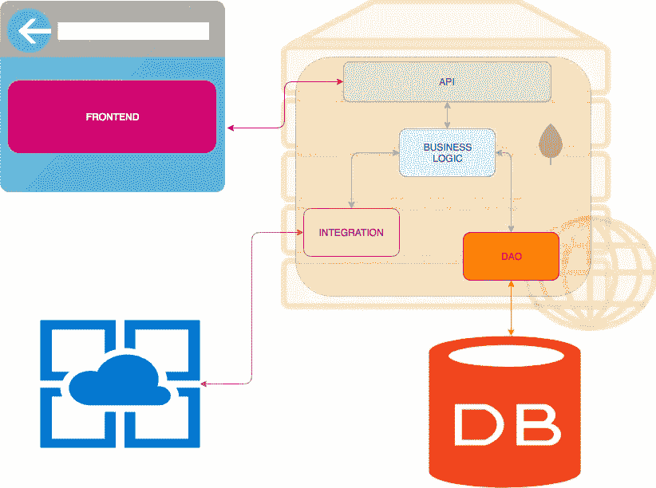

# 一个“吻建筑”:弹簧靴+棱角分明

> 原文：<https://itnext.io/a-kiss-architecture-springboot-angular-2ca6adf48271?source=collection_archive---------1----------------------->

《树枝上的两只鸟》由[乔纳·佩特里奇](https://unsplash.com/@jonah_jpg?utm_source=medium&utm_medium=referral)在 [Unsplash](https://unsplash.com?utm_source=medium&utm_medium=referral) 上演

就像维基百科建议的那样， **KISS** 是

> 简单点，笨蛋

作为美国海军在 1960 年提出的设计原则。KISS 原则指出，如果系统保持简单而不是变得复杂，大多数系统会工作得最好；因此，简单应该是设计中的一个关键目标，应该避免不必要的复杂性。这个短语与飞机工程师凯利·约翰逊联系在一起。

根据我的经验，我从事过许多类型的技术，有机会从客户端(可以是 SPA 或本地应用程序)和服务器端检查源代码和应用程序的开发。依靠这样的经验，我试图开发一个简单的架构，它在一个 **CRUD** 环境中包含了对基本**模式**的尊重。我将阐述这个架构的基础，作为我所有项目的起点。

在设计中，我牢记 KISS 的概念，从这个角度来看，我将提供 5 层，即众所周知的层，并有一个特定的完成任务:

*   前端
*   应用程序接口
*   业务逻辑
*   综合
*   数据访问对象(Data Access Object)

我使用一个*多层*架构模型。列表中的层顺序与信息流严格相关，所以从前端到 DAO

文章引用了可在链接[https://github.com/paspao/springboot-kiss-architecture](https://github.com/paspao/springboot-kiss-architecture)下载的项目

`git clone [https://github.com/paspao/springboot-kiss-architecture](https://github.com/paspao/springboot-kiss-architecture)`

使用 *maven* 管理项目(即父类型和子类型)；即使在 Angular 中开发的前端被包括在 *maven* 构建阶段，以便创建单个工件(进一步的细节可在下面的**前端**段落中获得)。

要深入每一层，我更喜欢使用*自下而上*的方法，所以让我们从数据开始。

# 数据访问对象(Data Access Object)

数据访问对象。我说的是 CRUD 应用程序，即需要收集和处理的数据。这个模块代表了最深的一点。这一层执行数据，它描述实体和访问逻辑。注意:插入、修改、删除和显示数据的简单数据访问逻辑，与其他层没有任何绑定；它是最深的一层，也不依赖于它的任何兄弟，它不处理应用程序的特定方面，如授权、交易或其他:也只是以独占方式访问数据。在 Springboot 上下文中，我正在执行**实体**和**存储库范例。**

所以我定义了*组件、实体和存储库*的位置。此外，我启用了事务，所以任何使用 DAO 模块的人都不必担心配置 DAO 模块的问题。

# 综合

简单的 CRUD 数据管理是不够的:我们可能需要与不依赖于我们的数据的其他系统进行互操作，例如 JAX-WS 或 JAX-RS 服务，或者使用不同协议的特定打印系统，等等。该组件包括所有这些交互/集成，而没有特定绑定到应用程序的上下文，以保证您具有非常高的可重用性(像 DAO 模块一样，这一层也是叶子类型)。

这里我展示了模块配置的中心点:只有一个对**服务**定义的引用和一个*第三方*服务的实例(GeoApiContext)。

# 业务逻辑

在确定要处理的数据之后，每个应用程序都必须处理定义在 DAO 层中的实体之间的交互逻辑。您必须将用户需求与应用程序逻辑结合起来，将它们分解，然后向上层展示简单易读的*签名*。因此，这一层允许开发人员进行一些处理，而无需进入数据库如何构造的细节或底层的集成是什么。

我们在这里发现 **DTO** 的定义和用法有助于屏蔽存储在数据库系统或各种集成 beans 中的数据:为什么？
有一些原因:首先，它是一种对敏感数据的信息隐藏形式(例如密码、时间戳或其他数据一致性所需的信息，但对最终用户没有)。相反，如果返回的数据需要详细说明(比如从多个来源组合的数据)，DTO 会帮助以合适的方式组织这些数据。
另一个方面是数据的序列化:在某些情况下，您必须转换数据库中的信息，使其可供人类使用。因此，开发人员必须用序列化逻辑“玷污”这些*实体*，序列化逻辑的目的应该只是表示数据，例如:数据库系统上的日期字段可能是一个数字，但我们以可打印的方式表示它，所以我们可能会使用格式化注释；这是一个解决方案！但是在这种情况下，我们将把序列化的各个方面链接到一个实体，从长远来看，这种解决方案将导致不可用的代码。哈罗德·艾贝尔森说:

> 程序必须写给人们阅读，并且只是附带地给机器执行。

dto 允许面对列出的问题，创建一个类似“缓冲区”的东西，因此有更多的松散耦合和更多的可重用性。

总之，业务逻辑与 DAO 层和集成层进行通信，在它们之间创建协同和交互。此外，它将逻辑和数据转换引入 DTO，可供其他层使用。警告:业务逻辑层使用内部定义的 DTO，这同样适用于返回的数据。它们*从不*是在其他层中定义的对象，所以为了确保我们上面所说的，并提供处理返回数据的能力。

该层的另一个特性是事务管理:由于它实现了业务逻辑，所以它能够确定对数据的操作是否成功，因此定义了操作的“**事务性**”。

下面是业务逻辑层的**@配置**:

它是唯一一个直接链接到 DAO 和集成层的模块，因此它必须导入配置才能使用它们。此外，为了加速实体和 DTO 之间的映射，使用为此而生的框架是一个很好的实践，避免长而不可读的 *setter* 和 *getter* 的代码块；在我的例子中，我使用了一个名为 **Dozer** 的映射框架。

# 应用程序接口

在这一层是表示的逻辑，它代表了我们的应用程序的入口点，至少从服务器的角度来看是这样的。像 JAX-RS 或 JAX-WS 这样的服务被定义为主要任务是以 XML、JSON 或其他格式呈现数据。它只与业务逻辑层对话:一个服务将只调用业务层提供的一个或多个服务，它永远不会直接使用集成或 DAO 层，也不会使用它们内部定义的对象，以避免*紧密耦合的*和*意大利面代码*。

它处理认证和授权的管理:在这里可以确定谁可以执行操作或不执行操作:在下面的层中要复杂得多，或者确定什么角色是必需的信息还不知道。

API 总是需要一些文档:REST 世界缺乏的一点是缺少这些服务的通用描述符。保证这一点的技术是 **Swagger** (现在的 OpenAPI):它允许记录 API，但是生成的文档也可以重用来生成客户端部分，因此不仅仅是描述性的。例如，在我的例子中，与 REST 服务的通信层完全是由服务的 Swagger 描述生成的:在**前端**模块中有一个*远程服务*文件夹，其中包含由工具[https://editor . Swagger . io](https://editor.swagger.io)生成的结果。

在 api 层的配置类中，我导入了业务层的配置类，并设置了 Swagger 文档的生成。

# 前端

它代表单页面应用程序:这种类型的应用程序必须与应用程序完全分离，Rest 技术的使用已经保证了这一点，但是有必要注意与远程服务的通信是如何实现的。我经常陷入对用于调用远程服务的各种 HTTP 客户端的糟糕组织和管理中，我指的是在整个应用程序中找到的引用。为了解决这个问题，并使 SPA 与表示与远程服务通信的所有内容严格分离，正如已经提到的，我使用 Swagger 技术来生成一个允许与 Rest API 通信的存根。所以开发人员将使用 Swagger 产生的东西，主要是因为它提供了许多现成的代码，具有不同的使用选项，并且您不再需要重写它。此外，逻辑将在其他地方实现，因为远程通信部分(存根)将不断重新生成，没有开发人员会梦想在可能被覆盖的源代码中实现自己的逻辑(我希望如此)。

为了确保用 Angular 编写的应用程序可以包含在 Maven 项目的构建周期中，我通过添加一个 *pom.xml* 文件来确保即使是**前端**也成为一个 Maven 模块。这个模块不会产生任何工件，所以打包将是 *pom 类型*，但是这样我可以将它插入到 maven 构建中，并与其兄弟创建依赖关系。为了能够在 Maven 环境中集成 Angular 构建，我使用了一个名为 *frontend-maven-plugin* 的插件:它允许安装一个*节点*和 *Npm* 实例

以及随后调用 Angular *CLI* 来管理依赖关系和构建 angular side。

当调用 Npm 构建任务时，将从 Angular CLI 获取控制权，如 *package.json* 中所述:

输出路径设置为*dist/resources/static/ui*，路径 *dist/resources* 也被配置为前端模块的 *resource* 。结合下面的层 API 配置，它允许在 Springboot 应用程序中注入 Angular build 的结果。在(package.json 中的 *build* 命令的)输出路径中，有一个特殊的目录 **…/static/…** ，Springboot 允许在其中定义静态内容。

# 建设

`mvn clean install`

# 奔跑

`java -jar api/target/api-0.0.1-SNAPSHOT.jar`

转到网址[http://localhost:8080/kiss/](http://localhost:8080/kiss/)