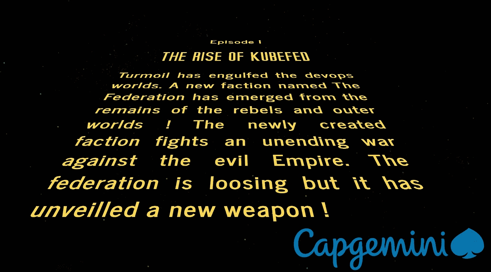
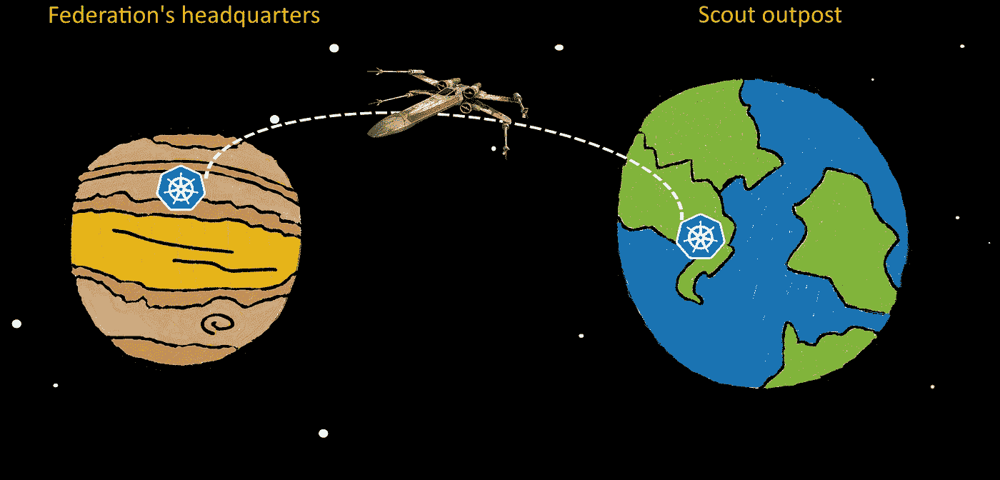
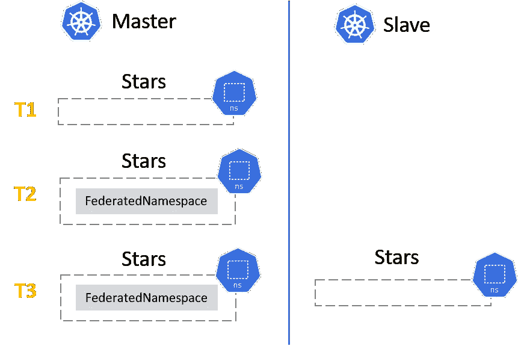
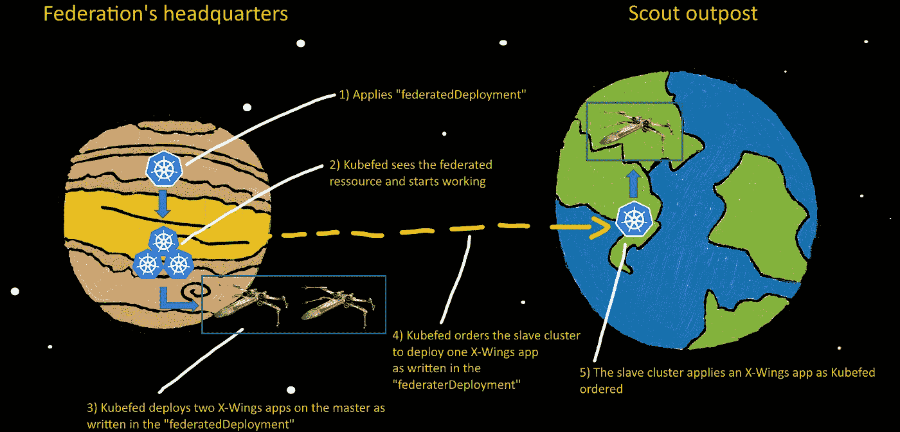
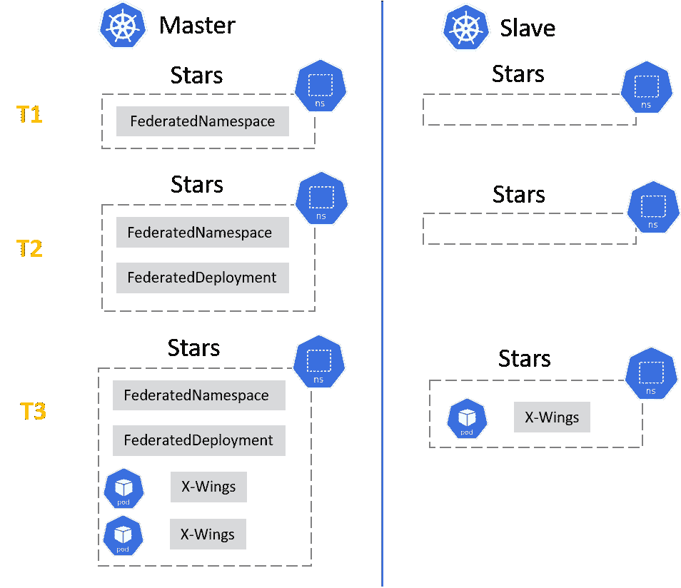
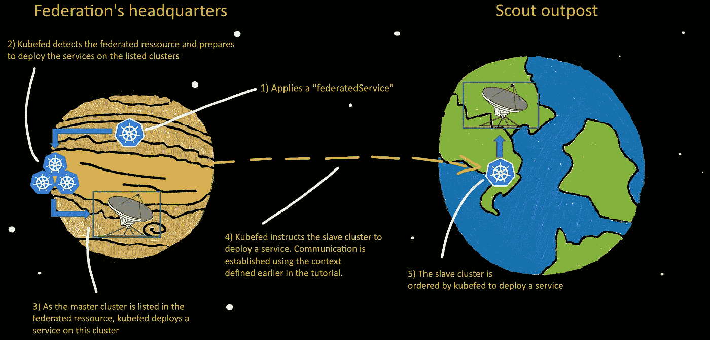
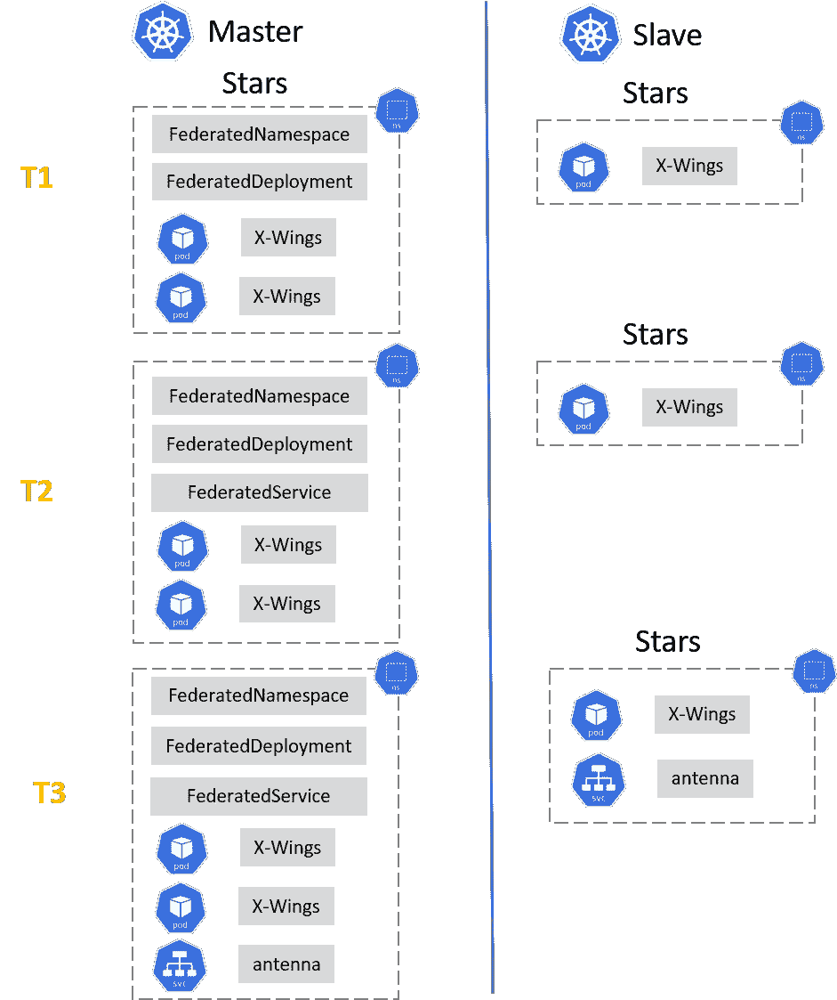

# 同步 k8s 集群的 Kubefed 教程！

> 原文：<https://itnext.io/a-kubefed-tutorial-to-synchronise-k8s-clusters-86108194ed79?source=collection_archive---------1----------------------->



如果你接受的话，你的任务就是组装库伯菲德武器并联合联邦的集群！愿原力与你同在！

# 概念

联邦在两个遥远的星球上安装了两个库本内特星团。



现在，他们不得不乘坐航天飞机从一个星球旅行到另一个星球，以同步他们的部署。这需要太多的时间，船员们都筋疲力尽了。幸运的是，在一些前反叛者的帮助下，一项新技术被创造出来了！它可用于将一个集群的内容立即复制到另一个集群。

**您为什么应该使用 Kubefed？**

*   如果你的星球被原子化，它将为你提供灾难恢复。
*   动态调整部署了工作负载的集群中的副本。
*   通过在集群间分散负载实现高可用性。给那些反叛者一些工作！
*   低延迟:在多个星球上部署集群，通过从离用户最近的集群为用户提供服务，最大限度地降低了延迟。这将有利于木星上的家伙！
*   故障隔离:最好有多个小集群，而不是单个大集群来进行故障隔离。十个卫星上的小星团比主行星上的一个大星团要好！
*   混合云:不同云提供商或内部数据中心上的多个集群。与弗林斯人分享你的集群？
*   因为这很酷，而且联邦需要你。

它是如何工作的？
kube fed 控制平面由运行在其中一个联合集群上的操作符组成。该操作员负责一些必须在主集群上部署的定制资源定义。如果您想在所有列出的集群上复制一个资源，那么您只需应用一个 CRD:当操作员看到它时，它将为您在任何地方部署您的应用程序。您甚至可以覆盖特定集群的一些值！

**我们将在这里讨论什么？**

*   使用 RBAC(和空间继电器)连接两个集群。
*   允许复制特定的资源类型。例如，您必须激活“服务”使其成为联盟的一部分。否则，同步将会失败，以帝国的胜利而告终。:-(
*   通过在应用程序上创建包装器来开始联合资源。
*   拯救银河系。

我们将把安装在联邦总部的集群称为“主”集群，把安装在侦察哨站的集群称为“从”集群。

寻找真实的东西？[点击这里](https://github.com/kubernetes-sigs/kubefed)访问 github！

# Kubefed 装置

## 第一步:安装库伯菲德武器

该武器只需在你决定作为主集群的集群上安装一次。在本教程中，我们将只使用两个集群，一个称为主集群，另一个称为从集群。

你需要一个工作舵来安装库伯菲德海图:

```
##On the master##
helm init
helm repo add kubefed-charts [https://raw.githubusercontent.com/kubernetes-sigs/kubefed/master/charts](https://raw.githubusercontent.com/kubernetes-sigs/kubefed/master/charts)
helm install kubefed-charts/kubefed --version 0.1.0-rc6 --name kubefed --namespace kube-federation-system
```

稍后，您还将需要二进制文件“kubefedctl ”,所以现在就从 Kubefed 资源库下载它。本教程使用的是版本 [v0.1.0-rc6](https://github.com/kubernetes-sigs/kubefed/releases/tag/v0.1.0-rc6) 。

## 第二步:使用 RBAC 激活空间继电器

***设置 RBAC***
为了让 Kubefed 武器联合您在主集群和从集群上的部署，它必须能够与它们进行交互。
为此，您可以使用以下 RBAC 配置/命令来创建相应的配置。**这与 Kubefed 没有直接关系，但本指南内容广泛，提出这一点很重要。**
以下内容必须应用于从机，但**不能应用于主机。**

```
##On the slave##
apiVersion: v1
kind: ServiceAccount
metadata:
  labels:
    name: <REPLACE_ME>
  name: <REPLACE_ME>
---
apiVersion: rbac.authorization.k8s.io/v1beta1
kind: ClusterRole
metadata:
  labels:
    name: <REPLACE_ME>
  name: <REPLACE_ME>
rules:
  - apiGroups: ['*']
    resources: ['*']
    verbs: ['*']
  - nonResourceURLs: ['*']
    verbs: ['*']
---
apiVersion: rbac.authorization.k8s.io/v1beta1
kind: ClusterRoleBinding
metadata:
  labels:
    name: <REPLACE_ME>
  name: <REPLACE_ME>
roleRef:
  apiGroup: rbac.authorization.k8s.io
  kind: ClusterRole
  name: <REPLACE_ME>
subjects:
  - kind: ServiceAccount
    name: <REPLACE_ME>
    namespace: default
```

用集群的名称替换所有的<replace_me>标签。为简单起见，姑且称之为“奴隶”。稍后您将使用相同的名称在主服务器上创建上下文。</replace_me>

然后检索新创建的服务帐户的令牌:

```
##On the slave##
kubectl get secrets
kubectl describe secret <REPLACE_ME>-token-XXXX
```

将令牌保存在某个地方，我们将在下一步中需要它。如果你有更多的奴隶，重复上述步骤。
从服务器上的最后一步:在`/etc/kubernetes/ssl/ca.crt`获取证书，并将其复制到主服务器上您想要的任何位置。

***设置库贝语境***

接下来，登录到主服务器。从那里，您将使用上面的令牌连接到从设备。

要链接集群，请执行以下操作:

```
##On the master##
kubectl config set-credentials kubefed-user --token="<TOKEN_FROM_SLAVE>"kubectl config set-cluster kubefedRemote --server=https://<IP_FROM_SLAVE>:6443 #This is the IP of one the kubernetes "master" nodes of your slave clusterkubectl config set-context <REPLACE_ME> --cluster=kubefedRemote --user=kubefed-user --namespace="default" #Better to use the same name as the one you chose for the RBAC yaml previoulsy. I called it "slave".
```

> 如果您有多个从属服务器，不要忘记定制凭证和集群名称！

现在您已经设置了上下文并加载了证书，您只需要编辑`~/kube/config`文件并添加以下密钥:

```
##On the master##
certificate-authority: <path-to-copied-cert-from-slave>
```

将上述键添加到之前使用`set-cluster`命令创建的`cluster` 部分。如果您使用与前面提到的完全相同的命令，那么您正在寻找的部分具有键“name: kubefedRemote”。

最后，它应该看起来像下面这样:

```
##On the master##
- cluster:
    server: [https://IP_OF_SLAVE:6443](https://IP_OF_SLAVE:6443)
    certificate-authority: /PATH_OF_CERT_FROM_SLAVE/ca.crt
  name: kubefedRemote
```

最后一步！用更轻松的东西更新你当前的背景。一般来说，创建的默认上下文是`kubernetes-admin@cluster.local`。将所有这些文档替换为“主文档”。Kubefed 不喜欢“@”之类的东西，当以后加入集群时，这将是一个问题。只要用你想要的任何东西更新默认值。看在本教程的份上，我建议你选择“大师”。

> 如果您做的一切都是正确的，用您创建的从上下文更新键`current-context`应该允许您直接从主上下文与从上下文交互。试试`kubectl get pod`应该显示出奴隶的豆荚。当你的测试完成时，不要忘记恢复`current-context`的值。

## 步骤 3:加入集群

现在，我们两个遥远星球上的两个星团之间的通信正常了，我们终于可以使用 Kubefed 让他们都加入联邦了。

首先，您需要从 git 存储库中下载 _kubefedctl_ binary。将其添加到您的主人的 **$PATH** 中。
然后使用 join 命令将它们连接起来:

```
##On the master##
kubefedctl join <CTX_MASTER> --v=2 --host-cluster-context <CTX_MASTER> --kubefed-namespace=kube-federation-systemkubefedctl join <CTX_SLAVE> --v=2 --host-cluster-context <CTX_MASTER> --kubefed-namespace=kube-federation-system
```

*   `<CTX_MASTER>`是代表主人的上下文的名称(如果你不知道在哪里可以找到它，它就写在你的`~/.kube/config`文件中)。
*   `<CTX_SLAVE>`是您在前面的步骤中创建的上下文的名称(它也在您的`~/.kube/config`文件中，因为您的每个从设备都有一个条目)。
*   `host-cluster-context`总是主上下文的名称。因此，这两个命令是相同的。

要检查连接是否正常工作以及武器是否准备好用于摧毁帝国，您可以使用以下命令检查联邦的状态:

```
##On the master##
kubectl -n kube-federation-system get kubefedclusters
NAME READY AGE
master True 22m
slave True 19m
```

它应该为每一行返回“真”。

如果您想要停止一个或多个集群的联合，请使用`unjoin`命令:

```
##On the master##
kubefedctl unjoin ctx1
kubefedctl unjoin ctx2
```

# 开始联盟！

## 步骤 A:授权联合资源

只有在您首先启用了要部署的特定资源的“kind: xx”时，联合资源才会起作用。每个资源只需执行一次，并将创建一个描述它的 CRD。

为此，您必须使用`kubefedctl enable`命令。它的参数是资源的种类，后跟 API 组:

```
kubefedctl enable <kind.api> --kubefed-namespace <NAMESPACE_INSTALL_KUBEFED> kube-federation-system
```

例如，要启用部署，您必须将“部署”与其 API 组“应用程序”连接起来

```
##On the master##
kubefedctl enable deployments.apps --kubefed-namespace kube-federation-system
```

服务业也是如此。它的 API 组是" "(空引号)，所以你不必在那里附加任何东西。

```
##On the master##
kubefedctl enable services --kubefed-namespace kube-federation-system
```

要获得所有 kubernetes 资源及其相应 API 组的列表，请使用:

```
##On the master##
kubectl api-resources -o wide
```

> **警告**除非您知道自己在做什么，否则不要联合“kind: pod”资源。在这种情况下，联合整个名称空间将同时联合 pod 和部署。部署将创建副本集，副本集又会创建 pod。这将导致圆荚体资源的复制，并创造一个黑洞，将你的星团和整个地球一起吸走。

要停止联合资源，请使用 disable 命令将其禁用:

```
##On the master##
kubefedctl disable <resource>
```

例如，要停用服务:

```
kubefedctl disable service
```

kubefed 的所有服务操作都将停止。创建 federatedServices 不会创建任何服务。删除 federatedServices 也不会删除任何服务。
你必须使用`kubefedctl enable`恢复联盟，以夺回你的资源控制权。

## 步骤 B:联合资源

***从哪里开始***

现在是联合资源并赢得战争的时候了。

您要做的第一件事是创建一个名称空间。
`kubectl create ns stars`

然后创建一个联合名称空间:

```
##On the master##
apiVersion: types.kubefed.io/v1beta1
kind: FederatedNamespace
metadata:
  name: stars #<= must be identical to the kubernetes namespace you created with kubectl
  namespace: stars #<= same
spec:
  placement:
    clusters:
    - name: <REPLACE_ME> #Replace this with the name of your master's context name
    - name: <REPLACE_ME> #Replace this with the name of your slave's context name
    - name: … #If you have more slaves then add more elements
```

现在只应用这个…它会在接下来的步骤中变得更清晰。请记住，为了创建 federatedNamespace 资源，您首先必须有一个存在的名称空间(它必须存储在某个地方……)。

如果一切正常，您应该会看到这个名称空间立即在您的所有奴隶上生成！神奇！或者是？

所见即所得:



***学习如何使用模板***

让我们进入问题的核心。**如何联合资源？**

嗯……这很容易。您必须用一些 Kubefed 来包装您现有的 yaml。
这是要使用的包装模板:

```
apiVersion: types.kubefed.io/v1beta1
kind: FederatedDeployment
metadata:
  name: some-federated-deployment
  namespace: <FEDERATED_NS>
spec:
  template:
    << DEPLOYMENT SPEC >>
  placement:
    clusters: #List of your clusters : master + slave
    - name: master
    - name: slave 
  overrides: #This is given as an example but is an optionnal section
  - clusterName: master
    clusterOverrides:
    - path: "/spec/replicas"
      value: 2
```

这是什么？

*   “位置”部分告诉您的应用程序必须部署在哪里。在上面的例子中，它将被部署在主服务器(联邦资源附带位于这里)和从服务器上。你可以拥有更多的奴隶而不把他们列入名单。如果您愿意，也可以从列表中删除主服务器。
    一切尽在掌握！
*   “覆盖”部分允许您覆盖特定集群上的一些值。在上面的示例中，名为“master”的群集的副本计数被覆盖为 2。这意味着该应用程序将在这个特定的集群上产生两次。在所有其他集群上，部署中设置的默认值仍然适用。**该部分是可选的，如果没有要覆盖的内容，可以删除**。

> 如何将您的应用程序与该模板合并？
> 很简单，取你的应用程序的 yaml，去掉前两行(kind + api)。将模板中的其余部分复制到“< <部署规范> >”标签中。通常应该是从左边 4 个空格。你可能不得不重新缩进所有其他行的 4 个空格，因为大多数复制粘贴引擎将无法保持缩进。

***联邦成员部署***

为了保卫地球，我们使用 X 翼应用程序。让我们用 Kubefed 模板包装它。

原始应用程序:

```
apiVersion: apps/v1
kind: Deployment
metadata:
  name: xwings
spec:
  replicas: 1
  selector:
    matchLabels:
      app: httpbin
      version: v1
  template:
    metadata:
      labels:
        app: httpbin
        version: v1
    spec:
      containers:
      - image: docker.io/kennethreitz/httpbin #Even 2000 years from now we will still use HttpBin
        imagePullPolicy: IfNotPresent
        name: httpbin
        ports:
        - containerPort: 80
```

让我们将 X 翼的“规格”合并到模板中:

```
##On the master##
apiVersion: types.kubefed.io/v1beta1
kind: FederatedDeployment
metadata:
  name: federated-xwings
  namespace: stars
spec:
  template:
    metadata:
      name: xwings
    spec:
      replicas: 1
      selector:
        matchLabels:
          app: httpbin
          version: v1
      template:
        metadata:
          labels:
            app: httpbin
            version: v1
        spec:
          containers:
          - image: docker.io/kennethreitz/httpbin #Even 2000 years from now we will still use HttpBin
            imagePullPolicy: IfNotPresent
            name: httpbin
            ports:
            - containerPort: 80
  placement:
    clusters:
    - name: master
    - name: slave
  overrides:
    - clusterName: master
      clusterOverrides:
      - path: "/spec/replicas"
        value: 2
```

“kind: xx”是字符串“federated”的串联&要联合的资源。这里是一个部署，所以资源是“federatedDeployment”。如果它是一个服务，那么它将是“联邦服务”。入口可以是“federatedIngress”等。

这就是所有人…现在你几乎可以摆脱只包含 X-Wings 应用程序的 yaml，因为从现在起你将只使用联邦版本。

您可以在主服务器上应用我们创建的**联邦部署，但前提是您已经使用`kubefedctl enable …`启用了“部署”资源(参见上文)。Kubefed 将在所有列出的集群上为您创建应用程序。看看吧！**

在我们的主星球上，由于集群覆盖，我们将有两个 X 翼应用程序，而在从星球上只有一个。我们安全了，骑兵来了！



需要明确的是，从现在开始，您将永远不必处理 X-Wings 应用程序本身，而只需处理联邦应用程序。
例如，要删除您的 X-Wings，只需删除我们创建的 federatedDeployment，Kubefed 就会从所有集群中删除该应用程序。如果你删除了应用程序本身，Kubefed 会为你重新创建一个。好孩子！

这是我们所做的:



***联邦成员服务***

现在让我们对 X-Wings 服务做同样的事情。如果能和中队沟通就更好了！

原始服务:

```
apiVersion: v1
kind: Service
metadata:
  name: antenna
  labels:
    app: httpbin
spec:
  ports:
  - name: http
    port: 8000
    targetPort: 80
  selector:
    app: httpbin
```

让我们将它包装在模板中:

```
##On the master##
apiVersion: types.kubefed.io/v1beta1
kind: FederatedService
metadata:
  name: federated-antenna
  namespace: stars
spec:
  template:
    metadata:
      name: antenna
      labels:
        app: httpbin
    spec:
      ports:
      - name: http
        port: 8000
        targetPort: 80
      selector:
        app: httpbin
  placement:
    clusters:
    - name: master
    - name: slave
```

使用`kubefedctl enable...`启用“服务”资源后，在主机上应用服务。
该服务现在应该出现在您列出的所有集群上，并且 X-Wings 应该可以通过 antena 访问(我们刚刚为那些感到失落的人提供的服务)。
请注意，更改或删除 federatedService 几乎会立即反映在集群上。



列出 kubefed 为我们创造的服务:

```
$ kubectl get svc -n stars
NAME TYPE CLUSTER-IP EXTERNAL-IP PORT(S) AGE
federated-antenna ClusterIP 10.233.32.129 <none> 8000/TCP 22m
```

让我们尝试使用服务与我们的 x 翼通信:

```
$ curl 10.233.32.129:8000/status/200 -vv
* About to connect() to 10.233.32.129 port 8000 (#0)
* Trying 10.233.32.129…
* Connected to 10.233.32.129 (10.233.32.129) port 8000 (#0)
> GET /status/200 HTTP/1.1
>
< HTTP/1.1 200 OK
* Connection #0 to host 10.233.32.129 left intact
```

成功了！行星得救了。

事情是这样的:



# 解决纷争

如果群集中没有任何变化，请检查以下可能的解决方案:

*   使用`kubectl -n kube-federation-system get kubefedclusters`检查集群是否联合。
*   检查“种类:xx”是否正确。“FederatedService”用于服务，而“FederatedDeployment”用于部署。对于任何其他资源，应用连接规则。
*   尝试使用`kubectl describe federatedXXXXX`描述联邦资源。事件部分有很多信息。
*   首先使用`kubefedctl enable XXXXXX`确保您想要部署的资源已经被启用。
*   检查 yaml 是否正确。使用模板，如果需要，更新“种类:xx”。然后，把你原来的 yaml 除了前两行(kind + api)之外，和模板合并。应该从左边粘贴 4 个空格。大多数复制粘贴引擎将无法正确粘贴其他行，所以你可能需要重新缩进 4 个空格。

我们的旅程到此结束，年轻的学徒。现在，您可以联合任意数量的集群。正如我的一位绿色老朋友所说，“把你学到的东西传递下去”。