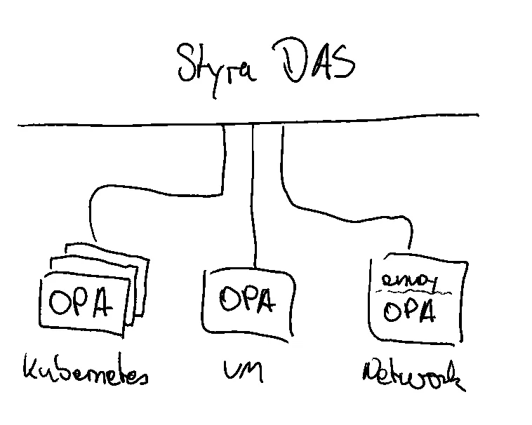
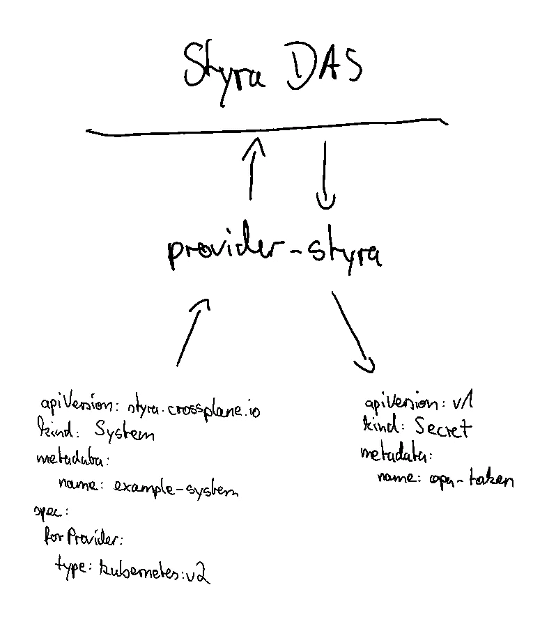
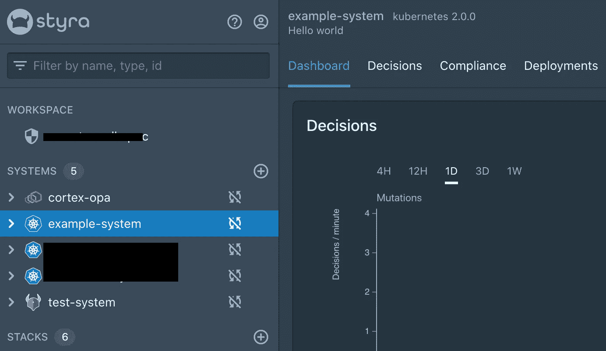
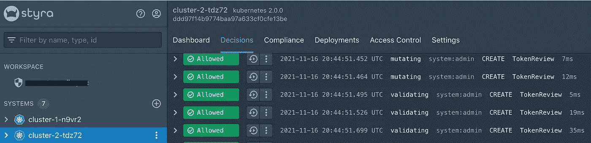

# Styra DAS 的 Kubernetes 控制器

> 原文：<https://itnext.io/a-kubernetes-controller-for-styra-das-9aa8e11c9947?source=collection_archive---------2----------------------->

我们刚刚为 Styra 声明式授权服务开源了我们的 Kubernetes 控制器。如果你有兴趣通过库伯内特管理 OPAs，请继续阅读。

**什么是 Styra 声明式授权服务？**

Styra DAS 是一个控制平面，用于管理地面上的许多 OPA 实例。类似于 istio 之于特使，或者 Kubernetes 之于 Kubelets。它告诉那些下游实例他们应该做什么(并报告状态、决策、分析等)。



您可以为不同的用例连接许多 OPA 实例

**细粒度访问控制的用例**

我确信有很多控制资源访问的用例。以下是一些突出的例子:

1.  OPA 作为 Kubernetes 准入控制者来审核和决定 Kubernetes API 请求，这为标准的 Kubernetes RBAC 提供了一个更细粒度的解决方案。
2.  网络上的 OPA，决定是否允许某人访问网络上的资源。这通常通过 [ext_authz 过滤器](https://www.envoyproxy.io/docs/envoy/latest/api-v3/extensions/filters/http/ext_authz/v3/ext_authz.proto.html)与 envoy 成对出现。
3.  另一个突出的用例来自业务应用程序内部，例如检查是否允许某人从数据库请求某些数据。

无论如何，有许多 OPA 实例需要管理。

在 Styra DAS 中，你使用 OPA 来控制的每个真实世界的软件系统都由一个*系统*来表示。因此，单个*系统*可能管理许多不同的 opa，所有这些 opa 都执行相同的策略。例如，如果您想使用 OPA 在三个 Kubernetes 集群上实施策略，您将创建三个不同的*系统*。如果您还想使用 OPA 在四个不同的基于特使的服务网格上实施策略，那么您将创建四个额外的*系统*。要在 Styra DAS 中注册一个实例，需要在 DAS API 中创建一个*系统*，检索注册令牌并用该令牌配置实际的 OPA 实例

我们可以通过用户界面手动完成，也可以自动完成。

**Provider-styra 帮助 Styra DAS 自动管理 OPA 实例**

Provider-styra 是一个 Kubernetes 控制器，它将 Styra DAS API 镜像到 Kubernetes 资源模型中。我们可以通过 Kubernetes API 以标准化的方式来管理 Styra DAS 系统(代表 OPA 实例)的生命周期，而不是通过它们的 UI 或自定义 API 实现。



Styra DAS 系统和同步回来的 OPA 令牌的 YAML 表示

为什么要在 Kubernetes 管理 Styra DAS 系统？

首先，有一个基础设施的声明式表示是很好的。但是还有其他好处。

人们已经通过 Kubernetes 管理应用程序，随着 CRDs 作为一种扩展机制被接受，我们看到它也被扩展到其他部分。流行的例子是开源项目 [crossplane](https://crossplane.io/) 或者像 [Google Config Connector](https://cloud.google.com/config-connector/docs/overview) 这样的专有服务，它们允许你在 Kubernetes 资源模型中声明性地描述基础设施(而不是 Terraform HCI、CloudFormation 等等)。

一些优点是在 CI/CD 管道中重用现有的 yaml 管理机制。利用 Kubernetes RBAC 来控制对 API 的访问。或者基础设施 GitOps。或者从 Kubernetes API 的其他特性中受益，比如变异和验证 webhooks，可能是为了更细粒度的访问控制(由 OPA btw 实现)。

最后但同样重要的是，我们可以用交叉平面[组合](https://crossplane.io/docs/v1.5/reference/composition.html)创建更高级别的 API。这就是真正的好处开始显现的地方。更多关于这方面的内容。

**参见供应商-施泰拉的行动**

要学习本教程，您需要一个 [DAS 帐户](https://signup.styra.com/)。在撰写本文时，provider-styra 实现了两个对象:*系统*和*堆栈*。堆栈是另一个特性，它使你能够编写适用于许多不同系统的全局策略(但那是另一篇博文)。

虽然 provider-styra 可以作为一个独立的 Kubernetes 控制器使用，但它与[交叉平面](https://crossplane.io/)结合使用时功能更加强大。让我们看看如何带他们兜一圈，跟随[官方文件](https://crossplane.io/docs/v1.5/getting-started/install-configure.html#using-self-hosted-crossplane):

```
kind create clusterkubectl create namespace crossplane-system

helm repo add crossplane-stable https://charts.crossplane.io/stable
helm repo update

helm install crossplane --namespace crossplane-system crossplane-stable/crossplane --version 1.5.0

# (optionally) install the crossplane-cli
curl -sL https://raw.githubusercontent.com/crossplane/crossplane/master/install.sh | sh
```

crossplane cli 允许我们轻松安装提供商包，但这不是强制性的。您也可以通过 kubectl apply -f 安装 provider(当然可以)，但是为了简单起见，我们使用 cli 来安装 provider-styra:

```
kubectl crossplane install provider crossplane/provider-styra:v0.1.0
```

过了一会儿，我们可以看到我们的 Kubernetes 集群能够管理更多资源:

```
$ kubectl api-resources | grep styra
[...]
stacks    styra.crossplane.io/v1alpha1       false        Stack
systems   styra.crossplane.io/v1alpha1       false        System
```

现在 provider-styra 需要配置为连接到 Styra DAS 控制平面的端点:

```
apiVersion: styra.crossplane.io/v1alpha1
kind: ProviderConfig
metadata:
  name: default
spec:
  host: $YOUR_STYRA_INSTANCE          # without https:// prefix
  basepath: '/'
  credentials:
    secretRef:
      key: token
      name: provider-styra-creds
      namespace: crossplane-system
    source: Secret
```

最后要做的事情是配置认证:访问[https://<STYRA _ INSTANCE>/access-control/API-tokens](https://signup.styra.com/)并创建一个新的令牌，用于在 Styra DAS API 上认证 provider-styra。

```
kubectl create secret -n crossplane-system generic provider-styra-creds --from-literal=token=$API_TOKEN
```

确保授予该令牌适当的权限，例如 workspace administrator(https://<styra_instance>/access-control/permissions/API-tokens)。</styra_instance>

现在我们都准备好了，可以创建系统了。以下是 Styra DAS 的 OPA 准入控制器示例:

```
apiVersion: styra.crossplane.io/v1alpha1
kind: System
metadata:
  name: example-system
spec:
  forProvider:
    description: "Hello world"
    type: kubernetes:v2
  writeConnectionSecretToRef:
    name: example-system
    namespace: crossplane-system
```

一个新的系统应该出现在 Styra DAS:



除了创建系统，provider-styra 还帮助您在 k8s 集群上安装 OPAs，以实现 k8s 准入控制。DAS 为 kubectl、kustomize 和 helm 提供安装工件。Provider-styra 读取资产端点并将 helm chart 值写回到 Kubernetes 秘密中，我们可以使用这个秘密将 OPA 安装到集群中并向 styra 注册:

```
kubectl -n crossplane-system get secret example-system -o json | jq .data.helmValues -r | base64 -d > values.yaml
helm install -n styra-system -f values.yaml styra-k8s-system styra-k8s-system-0.5.4.tgz
```

到目前为止，我们已经看到了如何在 Kubernetes 中声明性地控制 Styra DAS 系统。接下来，我们将完成使用 Helm 来安装用于准入控制的 OPAs。让我们添加提供者-头盔！

**提供者掌舵的掌舵图部署**

[Provider-helm](https://github.com/crossplane-contrib/provider-helm) 是一个 Kubernetes 控制器，它管理任何连接的 Kubernetes 集群中的 helm 图表。通过交叉平面命令行界面安装提供商 helm:

```
kubectl crossplane install provider crossplane/provider-helm:v0.9.0
```

设置一个*in-cluster*provider config，以便我们可以将图表部署到同一个集群中(注意，为了简单起见，这里使用了 cluster-admin 权限):

```
SA=$(kubectl -n crossplane-system get sa -o name | grep provider-helm | sed -e 's|serviceaccount\/|crossplane-system:|g')
kubectl create clusterrolebinding provider-helm-admin-binding --clusterrole cluster-admin --serviceaccount="${SA}"kubectl apply -f [https://raw.githubusercontent.com/crossplane-contrib/provider-helm/master/examples/provider-config/provider-config-incluster.yaml](https://raw.githubusercontent.com/crossplane-contrib/provider-helm/master/examples/provider-config/provider-config-incluster.yaml)
```

现在我们可以创建一个*版本*来自动安装 styra agents helm 图表:

```
apiVersion: helm.crossplane.io/v1beta1
kind: Release
spec:
  rollbackLimit: 3
  forProvider:
    namespace: styra-system
    chart:
      name: styra-k8s-system
      repository: [http://chartmuseum.chartmuseum.svc:8080/](http://chartmuseum.chartmuseum.svc:8080/)
      version: "0.5.4"
    valuesFrom:
      - secretKeyRef:
          name: example-system
          namespace: crossplane-system
          key: helmValues
          optional: false
  providerConfigRef:
    name: helm-provider
```

我们现在部署了 OPA 作为准入控制器，以及 Styra DAS 代理。更近了一步，但仍有改进的空间。

**用交叉平面组合连接点**

我们不需要分别描述这两种资源(styra 系统和 helm chart 部署)，而是可以将它们连接成一个组合。

一篇作文有两部分:

1.  XRD(描述物体看起来应该是什么样子，以及将产生哪个 CRD)
2.  合成(实际的合成，类似于模板/中的 helm 文件)

在这个设置中，我们将在一个主机 Kubernetes 集群中运行虚拟 Kubernetes 集群。github 描述了完整的设置:[https://github.com/janwillies/virtual-k8s-styra-opa](https://github.com/janwillies/virtual-k8s-styra-opa)

有了这两个资源，我们可以创建一个或多个集群 xrc，它们是组合的命名空间实例:

```
apiVersion: cnp.example.org/v1alpha1
kind: Cluster
metadata:
  name: cluster-1
  namespace: default
spec: {}
---
apiVersion: cnp.example.org/v1alpha1
kind: Cluster
metadata:
  name: cluster-2
  namespace: default
spec: {}
```

这将导致创建两个 Kubernetes 集群，这两个集群都安装了 OPAs，并在 Styra DAS 中显示:



现在，只需一个 Kubernetes 资源，我们就可以在 Styra 上创建一个系统，并使用定制配置部署代理。这是一个简单的 API，我们可以分发给开发团队。

平台团队可以为包含电池的 Kubernetes 集群提供一个 API，该集群带有一组默认的代理(用于合规性、安全性、监控等)。

**总结**

管理大量 OPA 实例是一项挑战。Styra DAS 提供了一个控制平面来帮助解决这个问题。 [Provider-styra](https://github.com/crossplane-contrib/provider-styra) 是一个开源的 Kubernetes 控制器，它将 Styra DAS API 镜像到 Kubernetes 资源模型中。这允许将 Styra DAS 系统(和其他资源)建模为 YAML 表示，并支持类似 GitOps 的工作流。

*系统*的连接令牌从 Styra API 读入 Kubernetes Secrets。借助 provider-helm，可以读取连接令牌并完全自动安装连接到 Styra DAS 控制面板的 opa。

我希望你对此感兴趣。欢迎在[github.com/crossplane-contrib/provider-styra](https://github.com/crossplane-contrib/provider-styra)发表评论或参与进来。你可以在 twitter.com/loswillios 找到我。