# 一点代码[C++20 范围]

> 原文：<https://itnext.io/a-little-bit-of-code-c-20-ranges-c6a6f7eae401?source=collection_archive---------2----------------------->

## 介绍 C++20 的一个期待已久的特性:范围。

C++20 即将推出，它有很多很酷的特性，其中之一是 **ranges** 库。在本文中，我旨在展示它所带来的优雅语法背后的力量。

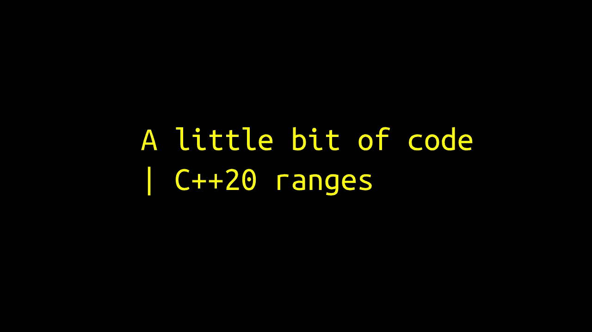

# 放弃

1.  代码示例中使用的库并不是真正的 C++20 ranges，而是 Eric Niebler 的 [**ranges-v3**](https://github.com/ericniebler/range-v3) 开源库，这是向 C++添加 **ranges** 的提议的基础。这是一个与 C++11/14/17 兼容的只有头文件的库。
2.  本文中的代码纯粹是实验性的，并不真正关心干净性和可读性。

# C++中的函数式编程

函数式编程(以下简称 FP)是 C++支持的编程范例之一。然而，与其他函数式语言相比，它并不是很舒服。然而，有了 C++这样一个锐利而强大的工具，你可以自由地创建自己的东西。这正是 **ranges-v3** 的作用。该库最好的部分是它提供的 Unix 管道语法。这提高了可读性，使我们有更少的代码，从而更少的错误。这只是 FP 的优点之一:对于更深入的知识，我强烈推荐这本书——《c++中的函数式编程》。

# 范围-v3

在了解这个库带来了什么之前，让我们快速回顾一下我们拥有什么。我们有 STL，在它的容器中，有算法，有迭代器的抽象层次，使算法能够与这些容器一起工作，还有一些函子。

范围库提供了以下功能:

1.  范围——任何类似范围的东西的包装器，例如容器、初始化列表、懒惰的类似范围的对象。
2.  算法——或多或少与 STL 提供的算法集相同，只是这些算法适用于范围。
3.  动作——修改底层范围的对象，如*排序*。
4.  视图——懒惰对象，其行为类似于范围或包装实际对象，如*过滤器*。

在进入代码之前，让我们更深入地研究一下**视图**。它们的意义在于它们是真正新颖和懒惰的东西，因此效率很高。考虑这个伪代码:

```
ContainerT container = { ... };
auto widgets = container
               | views::filter(...)
               | views::transform(...)
               | views::take(10);
```

想象一个场景，您有一个包含用户对象的大容器，并且您想

1.  选择那些符合特定标准的
2.  从每个用户对象创建一个小部件
3.  仅取前 10 个部件

最直接的方法是简单地完成所有这些步骤，这可能非常低效(考虑到容器非常大，我们只需要结果的前 10 个)。但是当我们对视图做同样的事情时，它们的懒惰使它变得非常高效。在上面的伪代码中，什么也没有发生，我们只是创建了一个视图，一个其他视图的组合。它的行为就像一个范围，也就是说，我们可以迭代它。一旦我们开始迭代，动作就开始了:

```
for (auto widget: widgets) {
    /* ... */
}
```

`widgets`将向`views::take`请求下一个小部件，而后者将依次向`views::transform`请求一个小部件，但只有 10 次。`views::transform`然后会向`views::filter`请求下一个`user`来创建一个小部件。`views::filter`将继续从底层真实容器中请求下一个`user`，直到满足其条件。对于一堆难看且容易出错的嵌套循环来说，这也是可能的。另外，请记住`container`实际上是一个范围，也就是说，它可以是一个真正的容器、一个流或者仅仅是另一个视图。

这个想法是为了证明音域将会使语言变得多么强大。因此，我将展示两段解决一些现实问题的代码，尽量保持代码尽可能短，尽可能多地使用 ranges-v3 库。

## 打印 n 个最常用的单词

这个问题是我在**“c++”中的函数式编程**这本书里碰到的。故事讲述，早在 1986 年， [Donald Knuth](https://en.wikipedia.org/wiki/Donald_Knuth) 被要求为一份杂志实现一个代码。问题陈述如下:

> 读取一个文本文件，确定最常用的单词，并打印出这些单词的排序列表以及它们的频率。

Knuth 提出了一个 10 页长的 Pascal 实现。作为回应，[道格·麦克洛伊](https://en.wikipedia.org/wiki/Douglas_McIlroy)写了一个 UNIX shell 脚本来解决同样的问题，它有这么长:

```
tr -cs A-Za-z '\n' |
    tr A-Z a-z |
    sort |
    uniq -c |
    sort -rn |
    sed ${1}q
```

这个故事是这篇文章的主要动机，所以我决定从同一个问题开始。

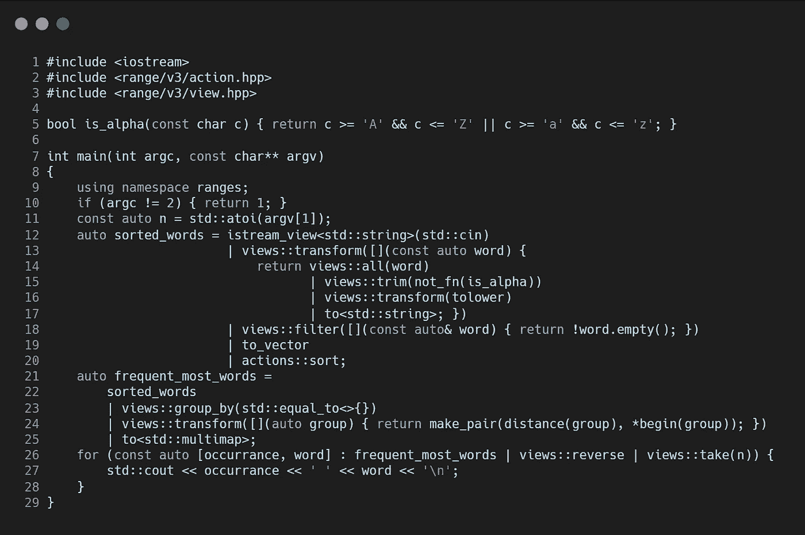

它比麦克洛伊的解决方案要长，但仍然很短，你可以不用滚动就能写出来。让我们一行一行地来看看它是如何工作的。

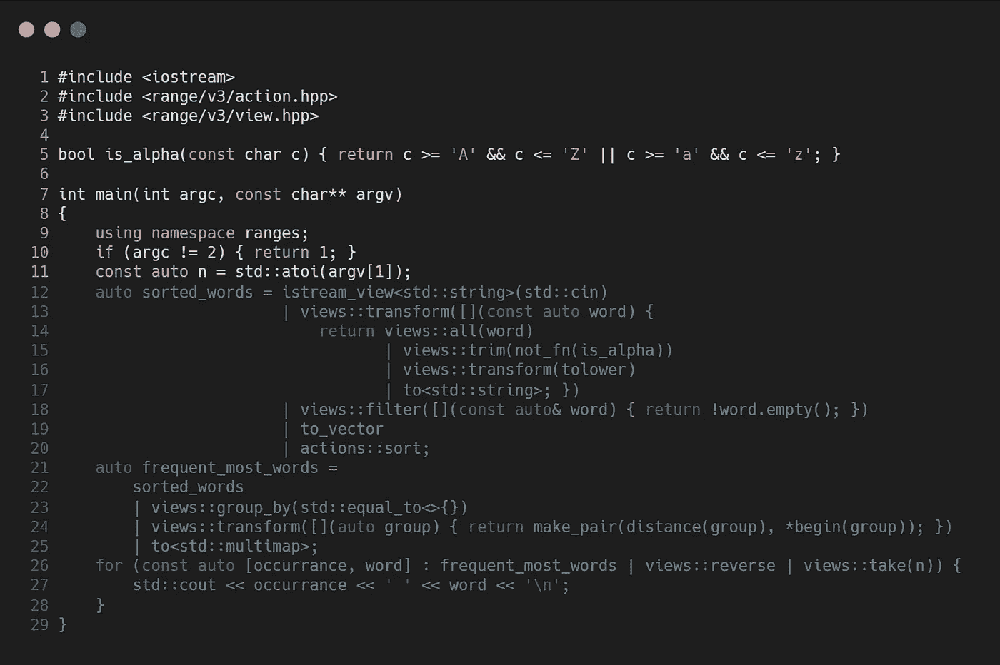

我们将使用库中的动作和视图，因此包括。`is_alpha`是一个非常简单的函数，它检查字符是否是字母。该程序基本上需要两个输入，(a)我们希望看到的最常用单词的数量，我们将作为命令行参数提供，以及(b)文本，我们将通过标准输入(`std::cin`)输入。

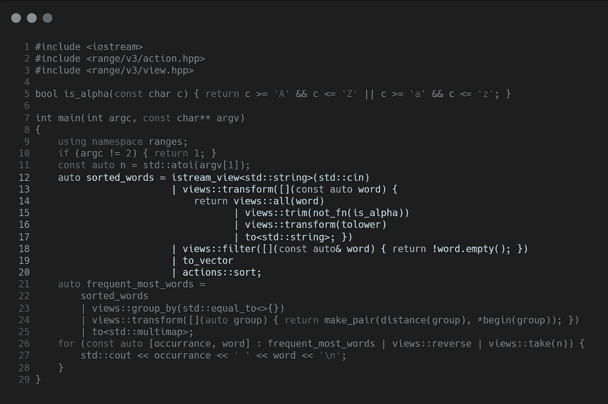

下一节从一个`istream_view`开始，它是来自标准输入的`std::string`的惰性容器。对于这些*单词中的每一个*，我们都做了如下的转换:


对于`views::all`，我们将`word`视为`char` s 的容器。`views::trim`是另一个惰性视图，它过滤掉容器开头和结尾不满足谓词的字符。这里的谓词是上面定义的`is_alpha`函数的否定(`not_fn`)。`views::transform`将每个字符转换为小写。最后，我们将结果转换回一个`string`。

一般来说，`views::transform`期望一个函数将一个值作为输入并返回一些其他的值，不一定是相同的类型。

在这种转换之后，我们最终得到了一个由修整过的小写单词组成的*惰性容器*。修剪可能会导致空词。`views::filter`接受一个布尔谓词，在本例中，它检查`string`的空性，并过滤掉那些空性。接下来`to_vector`(或`to<std::vector>`)创建这些单词的实际容器，原因是后面的`actions::sort`。显然它对容器进行了排序，但是需要注意的是`sort`是一个**动作**，而不是一个**视图**。这是因为它必须围绕实际容器中的元素移动，而视图无论如何都不会影响源范围。

因此，`sorted_words`是一个经过修剪的小写字符串的排序向量。对于 lorem-ipsum 输入，前 100 个元素如下所示:

```
[a,a,a,a,a,a,a,a,a,a,ac,ac,ac,ac,ac,ac,ac,ac,ac,ac,ac,accumsan,accumsan,accumsan,accumsan,adipiscing,adipiscing,adipiscing,adipiscing,adipiscing,adipiscing,adipiscing,aenean,aenean,aenean,aenean,aliquam,aliquam,aliquam,aliquam,aliquam,aliquam,aliquam,aliquam,aliquam,aliquam,aliquet,aliquet,aliquet,aliquet,aliquet,aliquet,aliquet,aliquet,amet,amet,amet,amet,amet,amet,amet,amet,amet,amet,amet,amet,amet,amet,amet,amet,amet,amet,amet,amet,ante,ante,arcu,arcu,arcu,arcu,arcu,arcu,arcu,arcu,arcu,arcu,arcu,at,at,at,at,at,at,at,at,at,at,at,at,at]
```

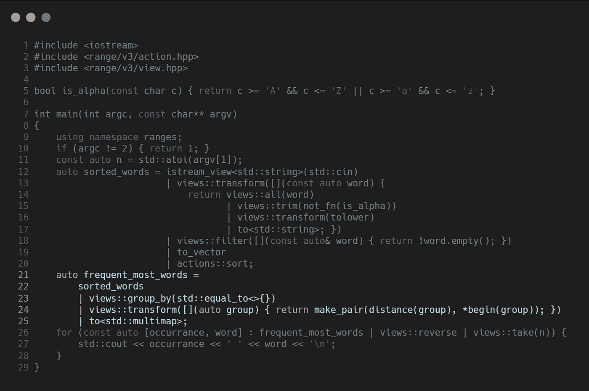

`views::group_by`将`sorted_words`分割成一系列连续重复的元素(因为有了`std::equal`)。然后我们把这些组中的每一组都转换成一对长度(`distance(group)`)和它的第一个元素。到目前为止，我们有这样的东西:

```
[ {10, "a"}, {11, "ac"}, {4, "accumsan"} ... ]
```

剩下的唯一事情就是按照它们的`first`对它们进行排序。我们可以利用默认的小于运算符`std::pair`，简单地将所有内容放入一个 multimap 中。因此，我们将对它们进行升序排序。

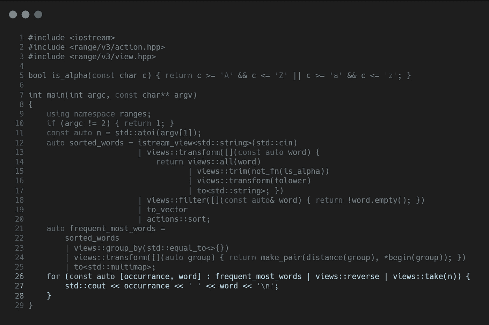

我们需要第 *n* 个最常用的单词，因此需要最后的第 *n* 个元素。为此，我们只需从 multimap 上的 **reverse** 视图中取出第一个 *n* 元素。

> 注意:这个库也提供了一个`views::take_last`视图，但是它和`| reverse | take`不一样。

```
std::vector vec = { 1, 2, 3, 4, 5, 6 };
auto tl_view = vec | views::take_last(3);             // [ 4, 5, 6 ]
auto rt_view = vec | views::reverse | views::take(3); // [ 6, 5, 4 ]
```

## 打印日历

下一个问题是编写一个程序来打印给定年份的日历。这个想法来自埃里克·尼布勒的 CppCon 演讲，他是 T21 系列 v3 的创造者。不同的是我试图让代码尽可能的短。

> 同样，这个代码只有一个演示和认知的目的。否则，它充满了不良做法。

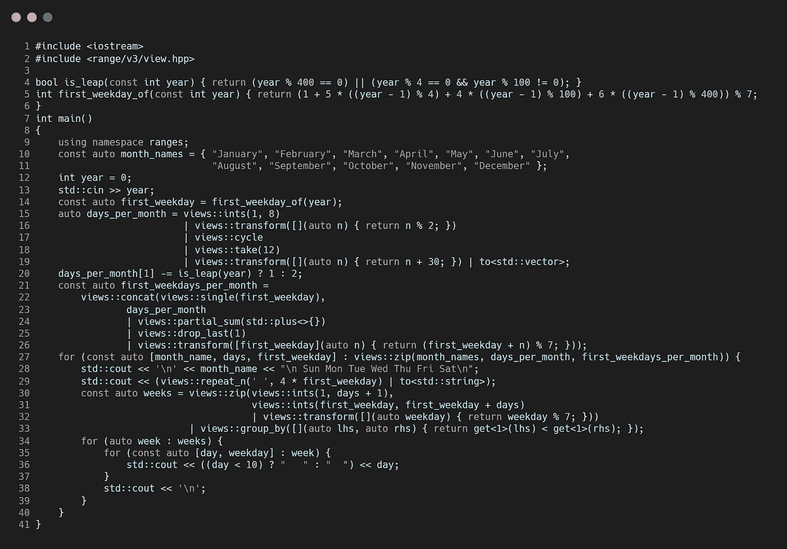

首先，我们定义两个非常基本的函数:`is_leap`如果给定年份是闰年，则返回 true，`first_weekday_of`返回给定年份的[0–6]范围内的整数，即该年 1 月 1 日的工作日(0 表示星期日)。这些是打印日历的充分必要条件。

第一个有趣的部分如下:

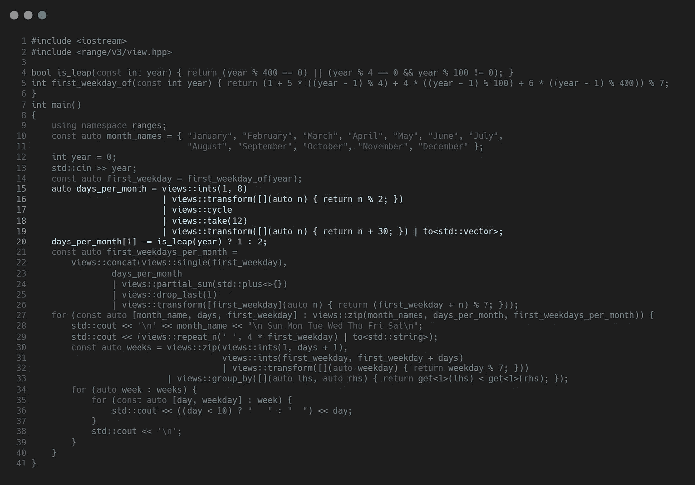

顾名思义，我们希望有一个由 12 个整数组成的数组来表示每月的天数。我们可以像`month_names`一样简单地初始化这些值，但是不要忘记我们为什么在这里:享受范围的乐趣。还记得[用指关节的把戏](https://en.wikipedia.org/wiki/Knuckle_mnemonic)吗？

首先，我们创建一个视图，用`views::ints(1, 8)`来计算 1 到 7，即左手指关节和指关节之间凹陷的数量。然后我们把它们连续地分成 1 和 0。使用`views::cycle`,我们让视图无限重复，模仿握住右手。然后我们取前 12 个值，因为我们需要这么多。然后我们再把它们加 30。最后，我们根据当年的*leap*来解决二月份的案例。

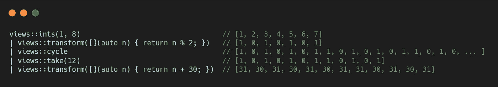

现在我们知道了每个月的天数和一年的第一个工作日，我们可以计算每个月的第一个工作日。

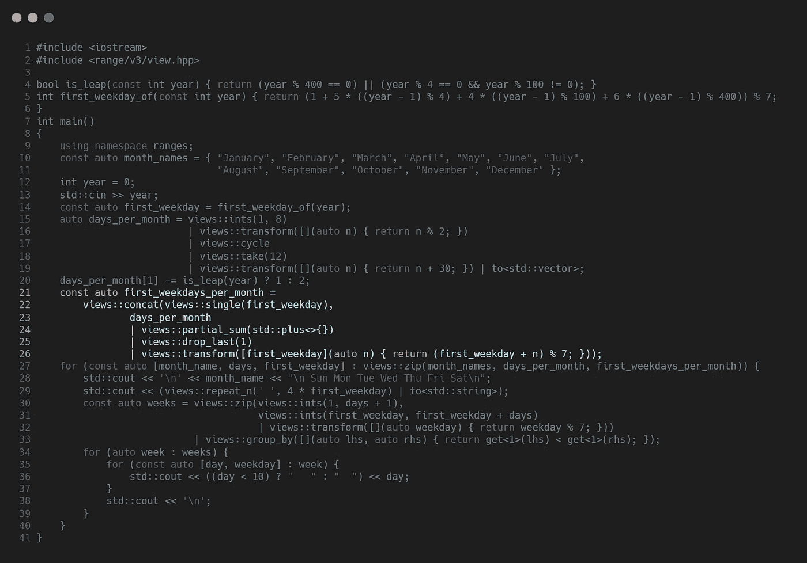

这可能看起来有点复杂，但这只是简单的计数。这里唯一有趣的视图是`partial_sum`，它产生一个同样大小的新范围，其中第 *n* 个元素是将给定的二元函数(本例中为`std::plus`)应用到源范围的第 *n* 个元素和结果范围的第 *(n-1)* 个元素的结果。

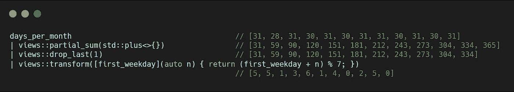

因此，我们从二月开始得到每个月的第一个工作日。至于一月，我们已经有了它，事实上，我们在最后一个`transform`视图中使用它来计算其余的，所以我们只是在`concat`视图的帮助下将它添加到这个视图中，这样我们就有了`first_weekdays_per_month`。

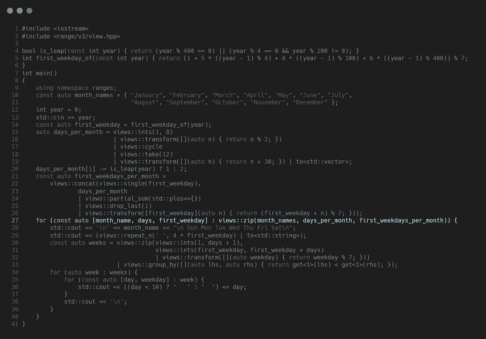

接下来，我们遍历月份并打印每个月份的日历。`views::zip`将三个大小为 12 的范围作为输入，并返回一个由 12 个元组组成的单一范围，每个元组由 3 个值组成—当月的`month_name`、`days`号和当月的`first_weekday`:

```
[ ("January", 31, 2), ("February", 28, 5), ("March", 31, 5) ... ]
```

然后我们打印每月的标题和第一周的填充(无聊的格式化的东西)。

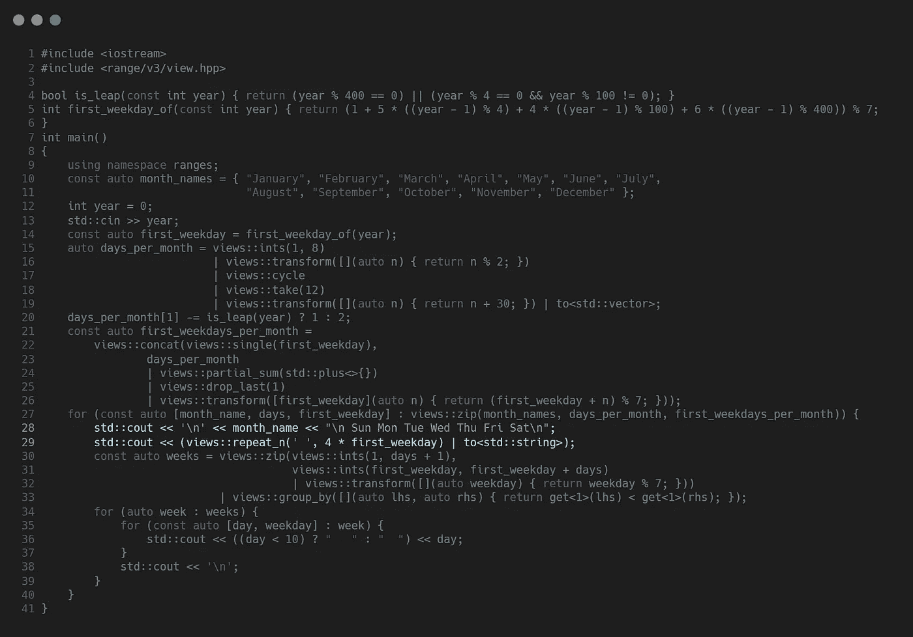

下一部分生成一个月中的周。

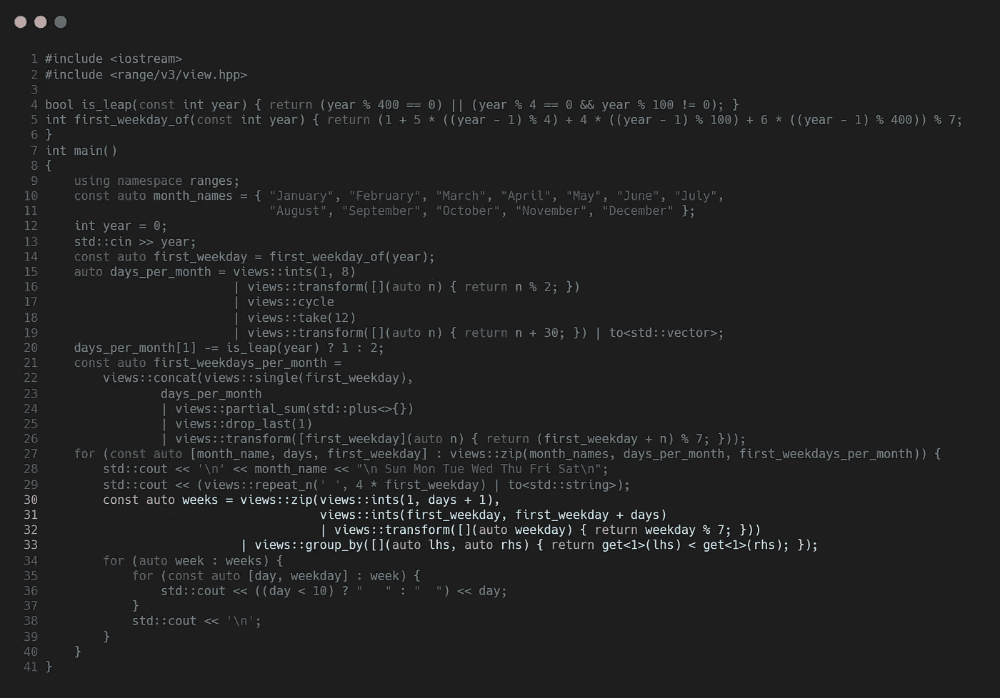

`views::zip`拉链分为两个系列:

1.  `views::ints(1, days + 1)`生成一个月中的第几天，1 到`days`包括在内。
2.  第二个`views::ints`从该月的第一个工作日开始进行相同的计数，这与`transform`视图相结合，产生了相同大小的工作日圆圈。

结果，我们得到这样的元组:

```
[(1, 2), (2, 3), (3, 4), (4, 5), (5, 6), (6, 0), (7, 1) ... (31, 4)]
```

在这个范围内，我们然后应用带有二元谓词的`group_by`视图，当*新的一周开始时*该谓词返回 false。

```
[
   [(1, 2), (2, 3), (3, 4), (4, 5), (5, 6)]
   [(6, 0), (7, 1), (8, 2), (9, 3), (10, 4), (11, 5), (12, 6)]
   ...
   [(27, 0), (28, 1), (29, 2), (30, 3), (31, 4)]
]
```

在那里我们有我们的星期。剩下的就是对周进行迭代，对每一周的每一天进行迭代，并打印出来。

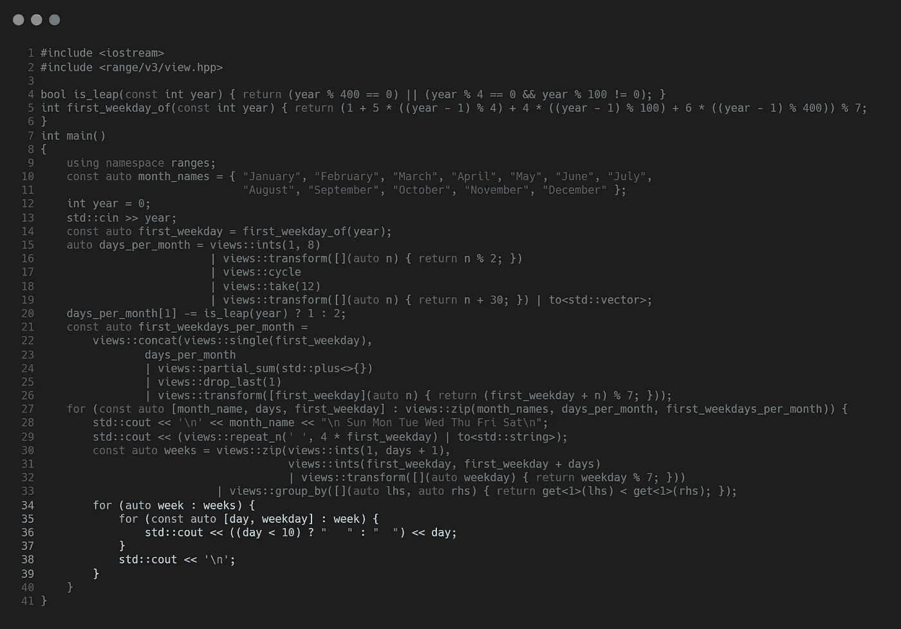

就这么简单。

如免责声明中所述，示例中的代码使用了 **ranges-v3** 库。这是一个只有头文件的库，所以你只需要克隆和包含就可以使用它了。我强烈建议试用一下，以适应新的语法，更深入地研究视图和动作，至少为 C++20 做好更好的准备。不幸的是，并不是这个库中的所有东西最终都会出现在该语言中。然而， **ranges-v3** 是成熟的，维护良好，足以用于更多。