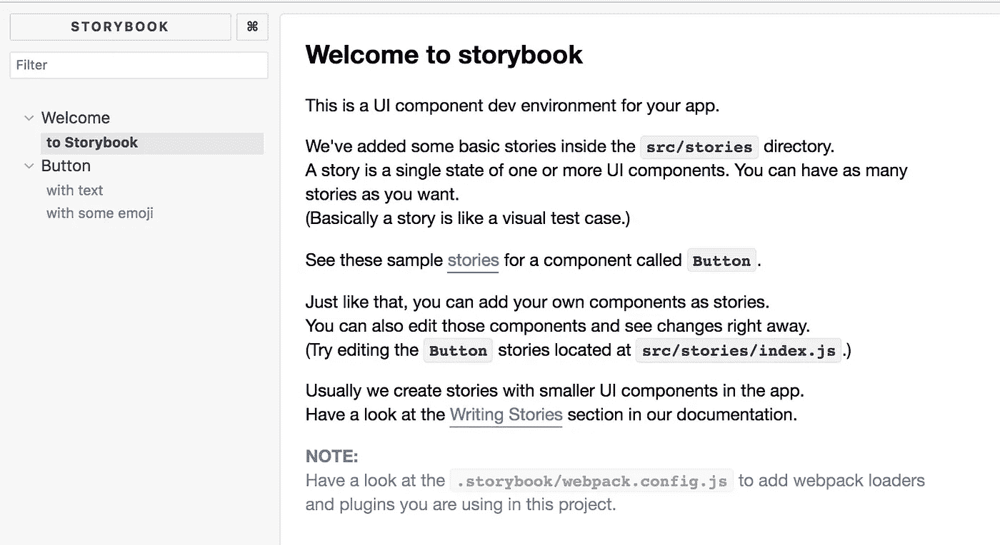
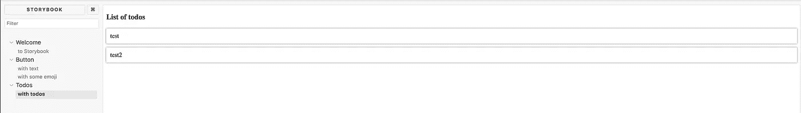
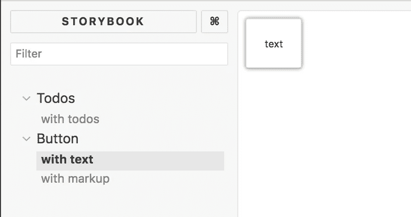
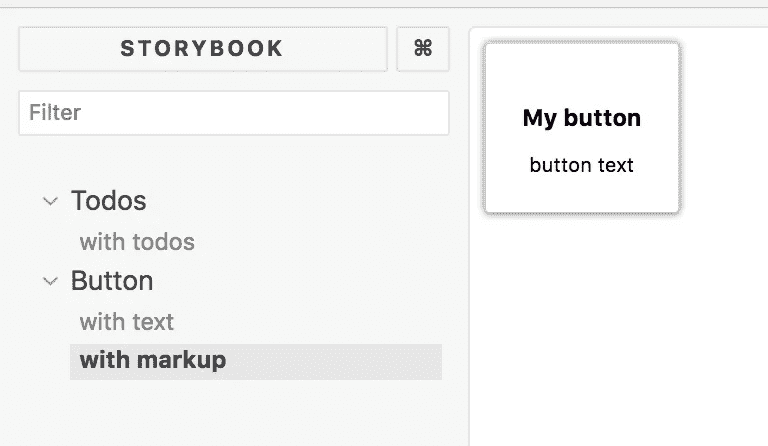

# React.js 生活方式指南-主演故事书

> 原文：<https://itnext.io/a-living-style-guide-for-react-js-starring-storybook-af6d614b6f7b?source=collection_archive---------2----------------------->

> 想象一下，当您的项目增长时，组件和开发人员的数量会增加。可能很难跟踪所有的组件，以及它们如何根据得到的输入而不同地呈现。对于这些情况，有许多工具可以直观地显示组件——样式指南。这篇文章就是关于这样一个叫做故事书的工具。


在本文中，我们将介绍如何:

*   **设置故事书**，故事书是一个 NPM 库，所以很容易安装，一个简单的命令行调用就可以用故事书来扩充你的项目
*   **运行并探索 Storybook** ，在这里我们将启动 Storybook 并探索它的用户界面，这样您就能感受到显示和管理组件的感觉
*   **创建和管理故事**，StoryBook 由故事组成，其中每个故事都是它在 UI 中显示的一个组件
*   **改进我们的设置**，有很多方法可以组织你的故事，这样当组件数量增加时，故事书也会随之增长

应该说 Storybook 在框架方面是不可知的，它支持 Angular、Vue React 等等，支持框架的完整列表

# 安装和设置

我们如何安装它？为此，我们需要通过键入以下命令来安装 CLI:

```
cd my-react-vue-angular-app
npx -p @storybook/cli sb init
```

## 将故事书添加到项目中

一旦我们完成安装，我们就可以继续创建我们的 React 项目。然后，我们从项目的根目录键入以下内容:

> 获取故事书

这将安装所有需要的依赖项，还会对您的项目进行以下更改:

*   添加一个`storybook-demo/.storybook/`目录
*   添加`src/stories`
*   将以下内容添加到`package.json`和`scripts`标签:“故事书”:“开始-故事书-p 9009 -s public”

`.storybook`目录包含以下内容:

*   addons.js，您可以进一步扩充 Storybook，但这超出了本文的范围
*   **config.js** ，config.js 告诉`storybook`在哪里可以找到我们的*故事*。`stories`目录包含一个`index.js`和我们添加的*故事*，它们是 storybook 选取并呈现为 HTML 页面的内容。

`/stories/index.js`看起来是这样的:

```
import React from 'react'; 
import { storiesOf } from '@storybook/react'; 
import { action } from '@storybook/addon-actions'; 
import { linkTo } from '@storybook/addon-links'; 
import { Button, Welcome } from '@storybook/react/demo'; storiesOf('Welcome', module).add('to Storybook', () => <Welcome showApp={linkTo('Button')} />); storiesOf('Button', module)
  .add('with text', () => 
    <Button onClick={action('clicked')}>Hello Button</Button>
  ) 
  .add('with some emoji', () => ( 
    <Button onClick={action('clicked')}> 
      <span role="img" aria-label="so cool"> 😀 😎 👍 💯 </span>
    </Button> 
  )
);
```

让我们看看在`stories/index.js`中产生这个的代码。每次调用`storiesOf('name of module', module)`都会产生一个部分，一个部分是 UI 菜单的一个新条目，包含一个特定的组件。

然后，我们可以通过重复调用`add('name of component variant', () => ())`来链接对该部分的调用。每个连锁调用产生一个组件的子变量。在上面的代码中，我们对 add()进行了两次不同的调用，从而产生了两种不同的变体，当我们调出 UI 时，很快就会看到这两种变体。

现在`add()`方法值得进一步研究:

```
.add('with text', () => 
<Button onClick={action('clicked')}>Hello Button</Button>)
```

第二个参数呈现出一个 React 组件，我们似乎可以在其中设置我们想要的任何属性。

# 奔跑

接下来让我们调出 UI。为此，我们在终端中调用以下命令:

> 纱线故事书

这将启动故事书项目，然后我们可以导航到`[http://localhost:9000](http://localhost:9000to)` [到](http://localhost:9000to)查看我们的故事。它看起来会像这样:



正如你在上面看到的，我们有通过调用`storiesOf()`创建的部分，我们有两个变体*和*，前者带有文本*，后者带有通过调用`add()`生成的表情符号*。

接下来让我们试着去创造自己的故事。

# 添加一个故事

让我们执行以下操作:

*   **创建**，一个`Todos.js`组件
*   **将该组件的条目**添加到`stories/index.js`

首先，让我们看看`Todos.js`的代码:

```
// Todos.js import React from 'react'; 
import styled from 'styled-components'; const Todo = styled.div` 
  box-shadow: 0 0 5px grey; 
  padding: 10px; 
  margin-bottom: 10px; 
`; const Todos = ({ todos }) => ( 
  <React.Fragment> 
    <h3>List of todos</h3> 
    {todos.map(t => <Todo key={t.title}>{t.title}</Todo>)} 
  </React.Fragment> ); export default Todos;
```

现在让我们将条目添加到`stories/index.js`:

```
import React from 'react'; 
import { storiesOf } from '@storybook/react'; 
import { action } from '@storybook/addon-actions'; 
import { linkTo } from '@storybook/addon-links'; 
import { Button, Welcome } from '@storybook/react/demo'; 
import Todos from '../Todos'; 
import mocks from './mocks'; storiesOf('Welcome', module)
  .add('to Storybook', () => <Welcome showApp={linkTo('Button')} />); storiesOf('Button', module) 
  .add('with text', () => <Button onClick={action('clicked')}>Hello Button</Button>) 
  .add('with some emoji', () => ( <Button onClick={action('clicked')}> <span role="img" aria-label="so cool"> 😀 😎 👍 💯 </span> </Button> )); storiesOf('Todos', module) 
  .add('with todos', () => <Todos todos={mocks.todos} />)
```

让我们强调一下我们的补充。首先，我们进口我们需要的东西:

```
import Todos from '../Todos'; 
import mocks from './mocks';
```

`mocks.js`是我们创建的一个文件，为我们的组件提供数据。我们选择将它放在一个单独的文件中，这样我们就不会弄乱`stories/index.js`。`mocks.js`是一个非常简单的文件，如下所示:

```
// stories/mocks.jsconst mocks = { 
  todos: [
    { title: 'test' }, 
    { title: 'test2' }
  ] 
}; export default mocks;
```

现在回到我们的 `stories/index.js`文件，让我们看看我们建立故事的部分:

```
storiesOf('Todos', module) 
  .add('with todos', () => <Todos todos={mocks.todos} />)
```

如你所见，我们通过调用`add`建立了这个故事并定义了这个故事的一个变体。如果需要的话，我们肯定可以定义更多的变量，记住，重点是展示所有不同的变量，这样你就可以理解是什么参数触发了你的组件的不同行为。

让我们来看看结果:



上面我们看到我们已经得到了条目`Todos`，它是由我们对`storiesOf()`的调用产生的，我们的带有 Todos 的变体*也被显示出来，它是由我们对`add()`的调用产生的。*

如你所见，演示项目中的任何组件及其变体都很容易。给`Todos`添加一个新的变体或者一个新的部分是非常容易的，希望我已经在上面清楚地说明了你是如何做的。

# 改进—专用故事文件夹

好了，现在我们知道了如何创建组件并在故事书中显示它们。然而，你的`storybook/index.js`可能会变得相当混乱，所以你可能想要选择一个更好的解决方案。让我们来看看`.storybook/config.js`:

```
import { configure } from '@storybook/react'; function loadStories() { 
  require('../src/stories'); 
}

configure(loadStories, module);
```

`loadStories()`函数允许我们在那里添加更多的条目，这是完美的。让我们接下来这样做:

```
// .storybook/config.jsimport { configure } from '@storybook/react'; function loadStories() { 
  require('../src/stories'); require('../src/stories/common'); 
} configure(loadStories, module);
```

如你所见，我们现在可以指出`../src/stories/common`是我们的故事可以存在的另一个地方。该目录现在需要包含一个`index.js`，我们可以像这样编写我们的故事:

```
import React from 'react'; 
import { storiesOf } from '@storybook/react'; 
import { action } from '@storybook/addon-actions'; 
import Button from '../../common/Button'; storiesOf('Button', module) 
  .add('with text', () => <Button title={'title for a button'}>text</Button>) 
  .add('with markup', () => 
  <Button title={'title for a button'}>
    <h3>My button</h3>
    <span>button text</span>
  </Button>
  )
```

我们上面呈现的组件有以下代码:

```
import React from 'react'; 
import styled from 'styled-components'; const InnerButton = styled.button` 
  padding: 20px; 
  box-shadow: 0 0 5px grey; 
  border-radius: 3px; 
  :focus { border: solid 1px black; } 
`; class Button extends React.Component { 
  render() { 
    return ( 
      <InnerButton { ...this.props } >
      {this.props.children}
      </InnerButton> ); 
  } 
} export default Button;
```

我们的风格指南现在呈现如下:



对于第二种按钮变体:



因此，如果您开始将组件划分到不同的目录中，那么随身携带该目录结构是一个好主意。

# 摘要

我们开始简要地发现为什么我们可能需要一个风格指南。简短的回答是，随着我们项目的增长，组件的数量也在增长，可能很难跟踪在什么情况下使用哪个组件。风格指南是跟踪上述内容的一个很好的选择，即使它需要开发人员一定程度的承诺来更新它。

希望你已经很好地理解了如何用 Storybook 建立一个 React 项目，并开始添加你的组件，作为故事。

## 进一步阅读

这是故事书上[官方文件](https://storybook.js.org/)的链接

这篇文章涵盖了不同类型的风格指南库，不仅仅是这篇，值得一读[关于 React 的不同风格指南的好文章](https://www.nearform.com/blog/react-living-style-guides/)

[我的推特](https://twitter.com/chris_noring)