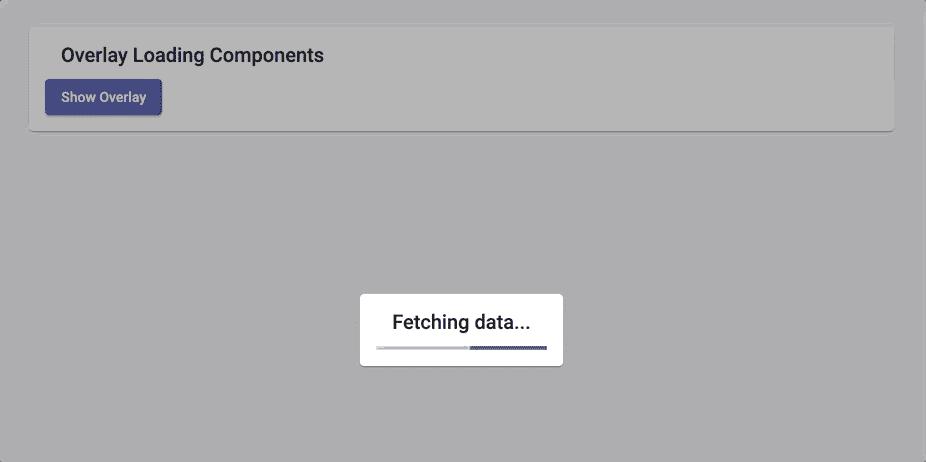
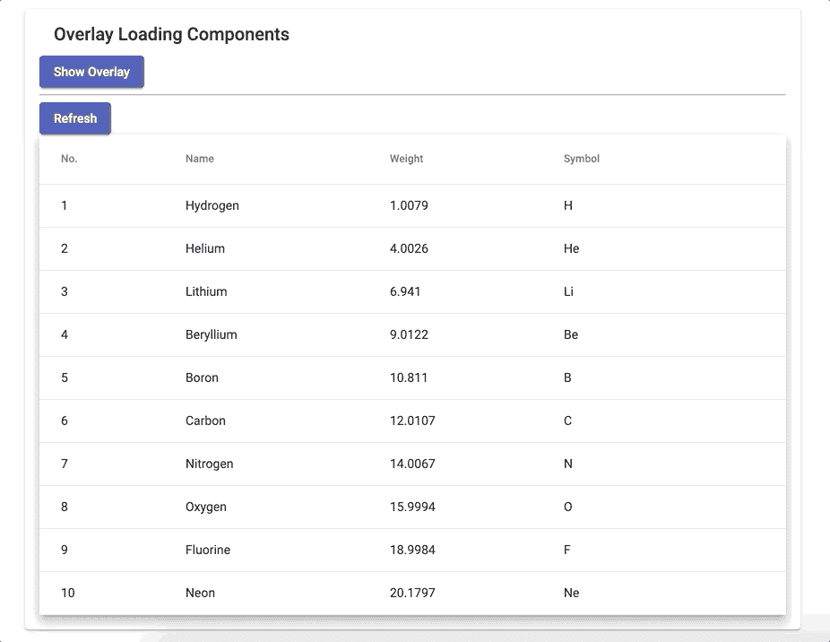
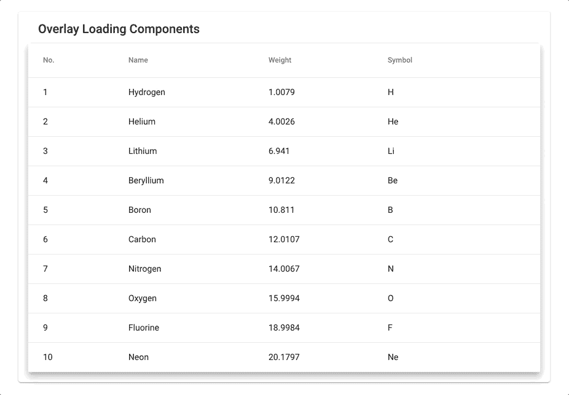

# 带角度 CDK 覆盖的组件加载器

> 原文：<https://itnext.io/a-loader-for-your-components-with-angular-cdk-overlay-ebf5a4962e4d?source=collection_archive---------1----------------------->

## 有角的

我们经常处理异步数据，即从远程 web 服务获取的数据。为了改善用户体验(UX)，一种常见的方法是添加一个加载器来指示正在发生的事情。

在本文中，我将向您展示如何使用一个简单的指令向所有组件快速添加一个加载器。为此，我们将使用角度 CDK 叠加功能。

 [## 角状材料

### 叠加 CDK 要素](https://material.angular.io/cdk/overlay/overview) 

照片由[诺德伍德主题](https://unsplash.com/@nordwood?utm_source=medium&utm_medium=referral)在 [Unsplash](https://unsplash.com?utm_source=medium&utm_medium=referral) 上拍摄

# 叠加 CDK 快速介绍

我猜你知道如何创建一个角度项目，所以我跳过这一步。让我们从添加棱角分明的材料开始，这得益于:

`ng add @angular/material`

以及*装载机组件*:

不要忘记将它添加为一个 *entryComponent* ，因为它没有在模板中被引用:

最后，我们可以在`app.component.ts`文件中使用这个加载器:

您可能已经注意到，我们在`overlayRef`上附加了一个*组件门户*。您可以在 [cdk 文档](https://material.angular.io/cdk/portal/overview)中找到该特性的完整描述。

*TL；博士(来自博士)*

> 一个`Portal`是一个 UI，它可以动态地呈现到页面上的一个空位上。

通过运行应用程序并点击按钮，我们会看到:



哇，这是一个开始！！然而，我们不能*关闭*这个覆盖图，它呈现在整个页面上……让我们继续，将这个加载器插入到一个组件中。

# 在组件上方显示装载器

*为了定位特定的组件，我们必须重新定义现有的 *OverlayContainer* 类，如下所示:*

*这将允许指定一个容器元素(在我们的例子中，我们的组件)。但是你不用*覆盖容器*而是用*覆盖。*因此你必须创建一个新的类扩展*覆盖*，让我们把它命名为… *动态覆盖*:*

*这是很多代码，但是我们需要注入所有这些服务和特性来适应最初的*覆盖*。我已经创建了一个包含默认配置的`createWithDefaultConfig`方法(`hasBackdrop`和`positionStrategy`已经定义好了，但是如何增强这个配置取决于你， [doc](https://material.angular.io/cdk/overlay/api#OverlayConfig) )。*

*这就是我们所需要的，不多也不少！让我们在一个`MatTable`上试试吧。*

*这里，我刚刚从[表基本示例](https://material.angular.io/components/table/overview#getting-started)中复制/粘贴了一个。*

*当点击*刷新*按钮时，我们可以看到覆盖图只在桌面上弹出。*

**

*(注意:在 GIF 的最后，加载器仍然被渲染)*

# *越来越接近真实世界*

*嗯，这个叠加看起来很好，但它仍然没有消失。这是很重要的，使它消失的数据提取。为此，我创建了一个 *OverlayLoading 指令*。这样，该指令可以在您想要的每个组件上重用。它需要一个`Observable<boolean>`作为参数来指示覆盖图应该被附加还是被分离(分别意味着数据被获取或被提取)。*

*然后，您将能够像这样使用它:*

```
*import { Component } from '@angular/core';
import { Observable, interval } from 'rxjs';
import { map } from 'rxjs/operators';@Component({
  selector: 'app-root',
  template:
    `<mat-card>
      <mat-card-header>
        <mat-card-title>Overlay Loading Components</mat-card-title
      </mat-card-header>
      <mat-card-content>
        <app-table-basic-example
          **[overlayLoading]="fetchingData$"**>
        </app-table-basic-example>
      </mat-card-content>
    </mat-card>`
})
export class AppComponent {
  displayOverlay = [true, false]; // An *Observable* sending true/false with 2s interval.
  **fetchingData$**: Observable<boolean> = 
    interval(2000).pipe(map(i => this.displayOverlay[i]));
}*
```

# *一个真实的用例*

*这个*覆盖加载指令*对于使任何组件 ***数据* *可加载*** 非常有用，这意味着您可以向它提供一个可观察值，指示数据是否被获取。*

*使用存储时，当您想从远程 Web API 获取数据时，它非常有用。你必须使用两个模块状态:一个用于实体(即用户状态)，另一个用于 UI。这些效果将有助于管理动作调度:*

*   *在实体模块中使用“空”操作来触发数据提取*
*   *在您的模块效果中，捕捉此动作以:*

1.  *向 UI 状态分派一个动作，指示正在获取数据(那么上面的 **fetchingData$** 为真)*
2.  *发送 API 请求*

*   *当数据被接收时，`pipe`和`map`它:*

1.  *一个新的实体动作，它将通过实体缩减器将数据设置到您的状态中*
2.  *向 UI 状态分派一个动作以指示数据已被获取(那么上面的 **fetchingData$** 为 falsy)。*

# *如果我想添加一些自定义功能怎么办？*

## *数据注入*

*目前，一切都很好，但你可能认为加载器模板非常静态，你想定制它！你 100%正确，使用*角度注射器*是可能的。*

*首先，我们需要定义将要使用的数据模型。为了简单起见，我只定义了一个*标题*和一个*加载器类型*，它们要么是微调器，要么是进度条。*

*然后将提供的配置应用到加载器模板:*

*这是*容易*的部分，不过不用担心，剩下的就简单明白了。当我们实例化一个 *ComponentPortal* (在指令中)时，我们必须想办法 ***注入*** 一些数据(我们的配置)以便定义我们的模板。我们的配置将由`@Input()`提供。*

*幸运的是，在其构造函数中，ComponentPortal 类接受一个注入器。因此，我们来注入:*

*最后，我们必须更新 *AppComponent* 来为指令提供配置:*

*遗言:别忘了更新 App 模块导入`MatProgressSpinnerModule`。*

**

*由于所提供的配置，这是一个定制的加载器。*