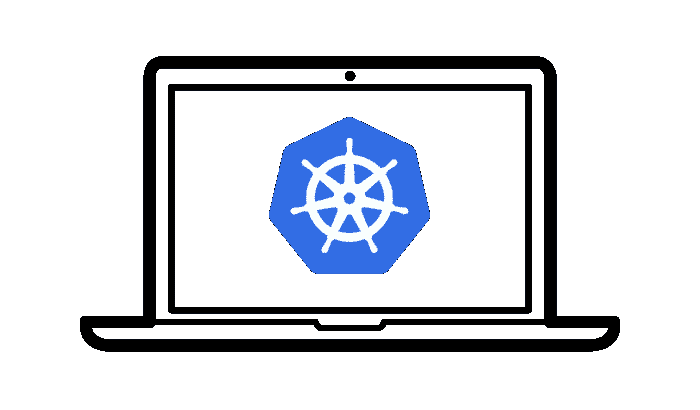
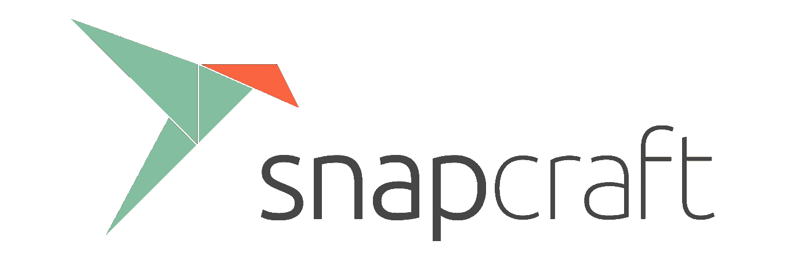

# 一个当地的 Kubernetes 与 microk8s

> 原文：<https://itnext.io/a-local-kubernetes-with-microk8s-33ee31d1eed9?source=collection_archive---------1----------------------->

当我想测试 Kubernetes 清单或尝试一些新东西时，我遇到的一个常见问题是，要么创建一些 LXC 机器，启动云实例，要么启动一个虚拟机，然后安装 Kubernetes。对我来说，这变成了一个耗时的仪式，没有一个选项可以提供真正快速、经济高效的 Kubernetes 集群。


利弊

在后续的帖子中，我将概述 GKE、AKS、EKS、CDK、CDK 与 LXD、kubeadm、minikube、microk8s 和其他项目之间的差异，以帮助强调该项目在任何给定工作流中的最佳位置。与此同时，我想快速分享如何开始，以便您可以得出自己的结论:)

我还在这篇文章的底部添加了一些常见的故障排除问题，如果你卡住了！

# 什么是 microk8s？

简而言之，microk8s 被设计成一个快速、轻量级的上游 Kubernetes 安装，与您的主机隔离，但不通过虚拟机。这种隔离是通过将 Kubernetes、Docker.io、iptables 和 CNI 的所有上游二进制文件打包在单个 [snap 包](https://snapcraft.io)中实现的。snap 包是一个应用程序容器——您可以把它想象成 Docker 容器的一个轻量级版本。它使用许多相同的底层隔离技术，但没有网络隔离的所有开销。



microk8s 是 Kubernetes，本地安装！

最终结果是一个超越任何一个发行版的软件包格式，因为快照可以安装在大多数 Linux 操作系统上，同时还利用了原子更新、升级失败时的回滚等功能，并提高了用户主机对软件的限制级别。



通过以这种方式安装 microk8s，您能够在本地机器上生成最新的上游 Kubernetes 的干净部署，而没有什么麻烦或开销。

# 我如何开始？

目前我只在 Fedora 28、Ubuntu 16.04 和 Ubuntu 18.04 上测试过这个。虽然更多的操作系统支持[快照](https://docs.snapcraft.io/core/install)，但您在这些操作系统上的体验可能会有所不同。

## Fedora 28

```
sudo dnf install snapd
sudo ln -s /var/lib/snapd/snap /snap
```

## Ubuntu 16.04

```
sudo apt update
sudo apt install snapd
```

## Ubuntu 18.04

Snap 是预装的！

# 安装 microk8s

microk8s 通过一个命令作为单个快照安装。在这篇博文发表的时候，它需要“经典的”坐月子。就快照而言，这意味着快照可以到达比正常情况下主机上更多的位置。这是一个临时措施，用于解决 Docker 修改某些内核级杠杆的需求。上游公司正努力使快照符合严格的限制。

```
sudo snap install microk8s --beta --classic
```

从这一点来看，值得一提的是这个项目**已经有三周了**。这就是为什么它是从测试频道获取的。虽然我和开发人员已经做了大量的测试，但事情可能会变得不稳定！如果事情真的发生在❤，我们将非常感谢发布报告

这将安装`microk8s`命令和一个 api-server、控制器-管理器、调度器、etcd、kubelet、cni、kube-proxy 和 docker。大约 30 秒后，您应该能够使用`microk8s.kubectl`命令检查集群。

```
microk8s.kubectl get no
```

如果一切顺利，您将看到您的机器的主机名！默认情况下，没有 pod、服务、daemonsets 或任何有趣的东西。这是最低限度的 Kubernetes。但是，您可以启用某些插件，如`kube-dns`和`dashboard`！

```
microk8s.enable dns dashboard
```

这将需要一些时间来创建和启动必要的吊舱，一旦你从`microk8s.kubectl get po,svc --namespace kube-system`那里得到看起来像这样的输出，你就可以进入下一步了！


由于这是您本地机器上的一个 Kubernetes，您可以在您的浏览器中像`service/kubernetes-dashboard`一样检查任何这些`CLUSTER-IP`地址，并与相关的 pod 进行交互——完成您的机器到 Kubernetes 游乐场的转换！

# 当我完成的时候呢？

虽然我愿意相信在我的笔记本电脑上运行 Kubernetes 集群 24/7 是真正的梦想，但事实是我并不总是需要它。您可以随时通过发出以下命令来暂停所有正在运行的 Kubernetes 服务

```
snap disable microk8s
```

这不仅会禁用所有正在运行的服务，还会删除`microk8s`命令。这实际上与不删除文件的卸载是一样的。当你准备好再次启动时，只需启用 microk8s

```
snap enable microk8s
```

豆荚需要一段时间重新稳定下来。值得注意的是，禁用 microk8s 也会停止所有正在运行的容器:]

如果你真的完成了`microk8s`，你可以删除整个包，这将清除所有文件和配置。首先，使用`.disable`命令禁用任何用`microk8s.enable`创建的插件

```
microk8s.disable dashboard dns
```

像今天这样(一个三周前的项目)，您需要等到所有的容器都停止后才能运行下面的命令。有一个 bug 是`kube-dns` pod 移动到终止但没有移除。只要 pod 计数都是`0`，您就可以继续。

```
sudo snap remove microk8s
```

就是这样！

# 联系我们

我个人对 microk8s 作为替代本地 Kubernetes 工具的潜力感到非常兴奋。microk8s 的贡献者有兴趣听听你的意见——好的、坏的和坏的！你可以在#microk8s 下的 [Kubernetes Slack、在](https://kubernetes.slack.com/messages/CAUNWQ85V) [Github](https://github.com/juju-solutions/microk8s) 以及在 [web](https://microk8s.io) 上找到我们。

# 帮帮我！

我们已经发现了一些常见问题，所以如果你被困在上面，这里有一些常见的*故障*以及如何*解决*它们。

## 我不能列出任何节点

如果您已经运行了 Docker 守护进程，这种情况会在新安装时发生。如果你这样做了，只需简单的`sudo systemctl stop docker`或 docker 守护进程的名称，并重新安装快照

## microk8s 命令不存在！

如果您没有明确禁用 microk8s，请检查以确保它仍然处于启用状态:

```
snap list
```

如果它已启用，而您看不到该命令，可能是因为`/snap/bin`不在您的路径中。验证`/snap/bin/microk8s.kubectl`是否在您的系统上，并将`/snap/bin`添加到您的系统路径中。