# 一种心理有效的乘法算法

> 原文：<https://itnext.io/a-mentally-efficient-multiplication-algorithm-7acc34cbaf7d?source=collection_archive---------0----------------------->

在你的头脑中把 5 位数相乘被认为是不可能的，或者只限于专家的领域。今天，你将学会自己完成不可能的事情，同时看到一些解决问题的技巧和我在设计这个算法时采取的步骤。如果您感兴趣的话，我还会在最后包含实现这种新方法的代码。

更先进的技术，如 [Karatsuba 算法](https://en.wikipedia.org/wiki/Karatsuba_algorithm)有额外的开销，所以它们只有在超过几百位数时才优于传统方法。正因为如此，Java BigInteger 之类的库使用传统的方法，直到达到那个截止点。

这种方法需要更少的内存，这使得心算更容易，同时也减少了求和步骤的数量。这对于资源受限的设备也是一个很好的选择。

**两个 N 位数相乘的其他算法比较:**

*   [小学方法](https://www.splashlearn.com/math-vocabulary/multiplication/long-multiplication) : **2N + 2N 加法**使用一种避免加零的巧妙方法。如果心算，你还需要记住需要求和的中间值，而代码实现可以重用结果空间。
*   [点阵乘法](https://en.wikipedia.org/wiki/Lattice_multiplication) : **N + 2N 加法**加额外内存，用于每个单元顶部三角形中的所有进位。如果沿着对角线求和，这比小学方法需要少 N 次加法，而不是将它们所代表的具有许多零的大值相加。
*   这个算法:**只有 N 次加法**并且通过只跟踪一次进位而非常有效地存储。

所有 3 种算法执行的乘法次数相同，不同之处在于加法次数和内存效率。

## 探索之路


照片由[本威克斯](https://unsplash.com/@profwicks?utm_source=medium&utm_medium=referral)在 [Unsplash](https://unsplash.com?utm_source=medium&utm_medium=referral) 上拍摄

学校教授的方法需要计算许多大的中间值，这使得心理计算很快崩溃:

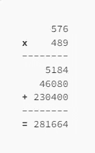

只有 3 位数的小学方法

为了找到一种更有效的方法，我们将应用小学的方法，但使用变量代替数字，并分析它们如何影响答案。

我们将从一位数相乘开始，在寻找模式的同时逐渐增加位数。当处理较少的数字时，我们将选择相同的最低有效变量，以便变量在迭代中是相同的:

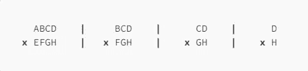

数字的变量

这种技术是至关重要的，以便用较少的努力看到模式。

**1 位数:**

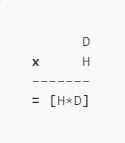

在乘以个位数之后，没有新的见解出现，因为到目前为止我们还没有真正说什么。

方括号表示结果中没有结转的数字。我的方法是用不需要结转的小数位来处理这个问题的一个更简单的版本，然后在最后发展解决方案来处理结转。

**两位数字:**

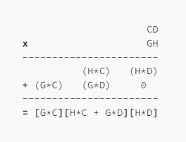

我们可以看到，最后一个数字**【H * D】**，对于两次迭代是相同的，但是我们不能真正推断出太多，因为我们只有 2 个样本。

**三位数:**

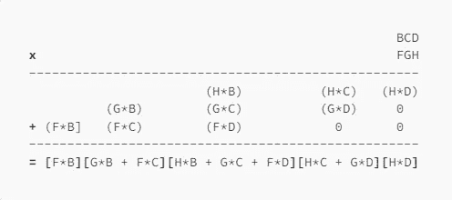

哦，这看起来很有趣，因为倒数第二个数字**【H * C+G * D】**，现在也匹配了！让我们再来看一次迭代，以获得更强的信号。

**4 位数字:**

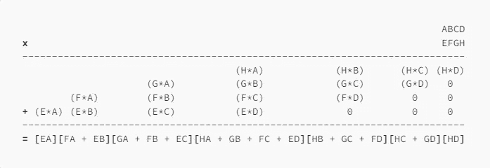

该模式在这里进一步延伸，因此我们看到:

*   最后一位数字始终是**【H * D】**
*   当将至少有两位数的数相乘时，倒数第二位总是 **[H*C + G*D]**
*   当将至少有 3 位数的数相乘时，倒数第 3 位数总是 **[H*B + G*C + F*D]**

## 洞察力


胡安·鲁米普努在 [Unsplash](https://unsplash.com?utm_source=medium&utm_medium=referral) 拍摄的照片

1.  当任何数字与至少 **k 位**数字相乘时，第 **k 位**最后一位数字总是具有相同的结构
2.  结果的第 **k** 个最后一位数仅由每个输入的最后 **k** 位数组成。

第一点是有希望的，因为它表明，如果我们能够发现第 **k** 个最后一位数的模式，我们就可以计算每个数字。然而，将两个 **k** 位数字相乘会产生一个 2* **k** 位数字的结果，所以我们只完成了一半。我的计划是为最后的 k 位数字找到一个模式，并使其适应整个结果，因为我希望一个一致的模式适用于所有的数字。

第二点更有希望，因为它表明我们应该能够从最低有效数字开始逐渐反向生成结果，而不是一次计算整个结果。这应该有助于减少精神开销。

## 解锁第 k 个最后一位数模式


保罗·斯科鲁普斯卡斯在 [Unsplash](https://unsplash.com?utm_source=medium&utm_medium=referral) 上的照片

我非常支持尽可能直观地描绘问题，因为与分析方法相比，我们的视觉皮层在识别模式方面要好得多。使用 4 位数迭代，让我们在结果中每个数字需要相乘的所有数字之间画一条线。

**最后一位:**【H * D】

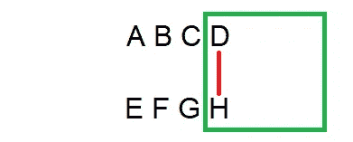

**第二位-最后一位:**【H * C+G * D】


**第三位-最后一位:**【H * B+G * C+F * D】


**第 4 位-最后一位:**【H * A+G * B+F * C+E * D】

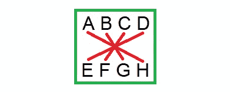

**第 5 位-最后一位:**【G * A+F * B+E * C】

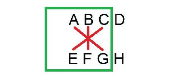

**第 6 位-最后一位:**【F * A+E * B】

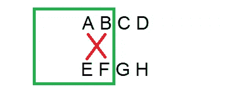

**第 7 位-最后一位:**【E * A】

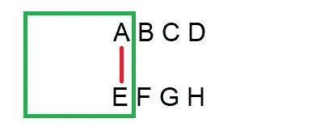

## 找到了。

数字的模式非常容易想象！

1.  创建一个足够宽的滑动窗口来容纳所有的数字。从右边包含每个输入的最后一位数字的窗口开始。
2.  用对角线交叉窗口中的每个数字。将所有交叉的数字相乘，并将乘积相加，生成结果中的当前数字。
3.  将窗口向左滑动 1 个位置，重复上一步生成下一个数字，直到窗口不再包含任何数字。

滑动窗口很容易用你的拇指和索引查找可视化。

第二步的好处是它的内存效率非常高，因为你只需要记录当前的计数，并一次添加一对交叉的数字到计数中。这使得通过几次练习就能很容易地在心理上表现出来。

## 结转


照片由[乔丹·昆斯](https://unsplash.com/@obi_wayne?utm_source=medium&utm_medium=referral)在 [Unsplash](https://unsplash.com?utm_source=medium&utm_medium=referral) 拍摄

应用上述方法会失败，因为在添加交叉对之后，一些计算出的数字最终会占用 1 个以上的数字。因为这不可能是正确的，所以让我们只保留计算的最后一位数字，并将其余数字结转，看看会发生什么。

让我们用新方法乘以 87 X 96 = 8352:

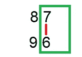

```
tally = **6** * **7** = **42**
```

截掉成绩的最后一位数字，并将其余数字结转:

```
result = **_ _ _ 2** (**2** from **42**)
carry-over = **4** (after chopping off the last digit from **42**)
```

向左滑动窗口生成下一个数字:

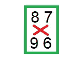

```
tally = **4** + **6*****8** (carry-over + first criss-cross)
      = **4** + **48**
      = **52**

tally = **52** + **9*****7** (tally + remaining criss-cross)
      = **52** + **63**
      = **115**
```

从计数中去掉最后一个数字作为结果中的下一个数字:

```
result = **_ _ 52** (**5** from **115** in front of previous result of **_ _ _ 2**)
carry-over = **11** (after chopping off the last digit from **115**)
```

最后一次向左滑动车窗:

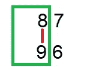

```
tally = **11** + **9*****8** (carry-over + criss-cross)
      = **11** + **72**
      = **83**
```

因为我们不能再向左滑动窗口，所以 83 的计数成为结果的剩余数字:

```
result = **8352** (tally **83** in front of the previous result of **_ _ 52**)
```

成功，结果符合我们的期望！

当处理不同数量的数字时，这种方法的工作方式是相同的，因为您只需要将两个数字右对齐，并在用完数字时停止纵横交错，因为缺少的数字是零。

在展示你的新技能之前，我建议做一些 2 位数的练习，一次逐渐增加一位数，因为需要一点练习来适应这种思维方式。我建议在你从右到左计算的时候写下结果的数字，因为无论如何你最终都需要给出答案，这样就少了一件需要记忆的事情。

这是一个基于 10 进制的 Kotlin 实现:

```
/** 
 * Multiplies [value1] times [value2] where these are arrays 
 * with 1 digit per element.
 */
fun multiply(value1: IntArray, value2: IntArray): IntArray {
    val smaller: IntArray
    val larger: IntArray
    if (value1.size < value2.size) {
        smaller = value1
        larger = value2
    } else {
        smaller = value2
        larger = value1
    }

    val result = IntArray(smaller.size + larger.size) { 0 }
    var resultIndex = result.lastIndex
    var carry = 0

    // Handle the first phase until the window no longer hangs off 
    // the right side
    for (windowStart in larger.lastIndex downTo 1) {
        var tally = carry
        // criss-cross the right side of the smaller value with left side 
        // of the larger value
        var smallerIndex = smaller.lastIndex
        // Stop when no digits are left in the smaller value
        // as those will all be zeros
        val numStepsInCurrentWindow = min(smaller.size, larger.size - windowStart)
        for (largerIndex in windowStart until windowStart + numStepsInCurrentWindow) {
            tally += smaller[smallerIndex] * larger[largerIndex]
            smallerIndex--
        }
        val (nextDigit, updatedCarry) = getNextDigitAndCarry(tally)
        carry = updatedCarry
        result[resultIndex] = nextDigit
        resultIndex--
    }

    // Handle the second phase where the window slides off the left side
    // until no digits are left in the smaller value
    for (windowEnd in smaller.lastIndex downTo 0) {
        var tally = carry
        var smallerIndex = windowEnd
        for (largerIndex in 0..windowEnd) {
            tally += smaller[smallerIndex] * larger[largerIndex]
            smallerIndex--
        }
        val (nextDigit, updatedCarry) = getNextDigitAndCarry(tally)
        carry = updatedCarry
        result[resultIndex] = nextDigit
        resultIndex--
    }

    // handle the remaining carry.  An efficient implementation
    // in a binary base would use a bit shift without looping here
    while (carry > 0) {
        val (nextDigit, updatedCarry) = getNextDigitAndCarry(carry)
        result[resultIndex] = nextDigit
        carry = updatedCarry
        resultIndex--
    }
    return result
}

/**
 * Computes the next digit in the result along with the carry-over.
 *
 * An efficient implementation would remove this function as it 
 * creates an object in the tight inner loops.
 */
fun getNextDigitAndCarry(tally: Int): Pair<Int, Int> {
    // Bit shifts would be more efficient here when dealing with a binary base
    val carry = tally / 10
    return Pair(tally - 10 * carry, carry)
}
```

*如果你觉得这很有趣，你可以通过* [*加入媒体*](https://roosterdan.medium.com/membership) *获得其他上千名类似作家的全部权限。*