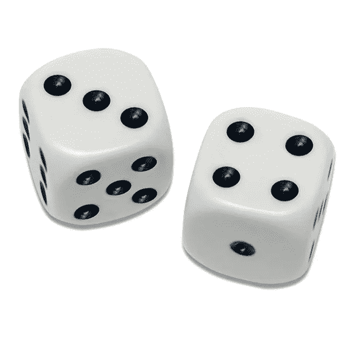

# 微服务及其分析方法

> 原文：<https://itnext.io/a-microservices-and-how-to-analyse-them-aa6d33f4dcf6?source=collection_archive---------1----------------------->

在上一篇文章中，我们定义了一个简单的框架来推理我们需要知道什么来实现一个可预测的基于微服务的软件。

 [## 微服务，清理定义

### 在前一篇文章中，我们研究了松散耦合如何导致更大的复杂性。

itnext.io](/microservices-clearing-up-the-definitions-f679ebb794cb) 

在本文中，我们将实现一个更正式但简单的框架来找出可能出错的地方，这样我们就可以扩展我们的需求，以可预测的方式处理这些情况。

在上一篇文章中，我们为基于微服务的应用给出了以下定义:

*   维护多个状态存储，
*   在多个存储上运行多个并行操作，
*   必须能够减轻由此环境引起的特定故障案例

最后一点要求我们在实现中识别所有潜在的冲突状态，否则我们将无法将可能的失败案例转化回客户端(考虑在输入表单上用红色标出无效值，或者由于资金不足而取消操作)。为了识别这样的问题，我们首先需要知道我们在这个过程中做了什么决定，以及它们如何可能出错。我们的操作将信息读取和/或写入独立的数据存储，彼此独立，其中许多操作可以并行运行。

他们对潜在互动的任何了解，我们都必须自己设计。

有人可能会说，客户通常不会用请求“轰炸”系统，所以我们需要探索每个潜在失败案例的前提是有缺陷的。一个很好的反驳观点是，如果不知道系统可能发生错误的每一种可能方式，我们实际上就无法知道它的影响。另一个是，软件必须表现正确，即使面对意想不到的甚至邪恶的使用模式，尤其是如果涉及到金钱。这些攻击不仅仅是理论上的，它们[至少从](https://blog.acolyer.org/2017/08/07/acidrain-concurrency-related-attacks-on-database-backed-web-applications/)[2017](https://www.researchgate.net/publication/316848790_ACIDRain_Concurrency-Related_Attacks_on_Database-Backed_Web_Applications)开始就已经公开了。2014 年，一家比特币交易所自愿将这个向量确定为其失败的[原因，还有许多其他案件受到怀疑。](https://arstechnica.com/information-technology/2014/03/how-the-worlds-first-bitcoin-bank-was-robbed-blind/)

## 模型

如果我们以一个库存管理系统为例，直觉上来说，我们不能出售比我们现有的更多的库存。为了更全面地了解这一需求，我们需要建立一个从存储中删除项目的请求顺序。换句话说，单一种类的检索必须是连续的。否则，如果两个并行请求询问“*我们是否有 15 个 cookies，删除它们*”，而我们有 20 个，我们可能会因为允许这两个请求而出现赤字。为了模拟现实生活，每个商店都将正确地运行，并为每个请求正确地序列化这些请求。

但是，如果我们有一个在多个步骤中更新多个存储的操作，会发生什么呢？继续这个例子，购物者要求购买商品，然后在相同的操作中付款，但是在不同的微服务上的不同步骤中。请记住，我们不是来解决这些问题的，只是来识别它们。让我们把这个正式化。

我们的应用程序有一个操作 **A** ，它读写(访问)两个存储器: **X** 和 **Y 的数据。A** 按以下顺序从存储器中访问信息: **X** 、 **Y** 、 **X** 、 **Y** 。

由 **A⁰** 执行的数据访问可以这样列出:

**X:TA⁰** ， **Y:TA** ， **X:TA** ， **Y:TA**

其中 **TA** … **TA⁴** 表示执行这些操作的时间。请记住，这些事件只是操作步骤的连续事件，因为微服务是相互独立的。我们将介绍 **A** ，操作 **A** 的并行执行，它与 **A** ⁰.处理相同的数据我们的系统现在有以下步骤:

**A⁰:X:TA⁰** ， **A⁰:Y:TA** ， **A⁰:X:TA** ， **A⁰:Y:TA**

**A :X:TB⁰** ， **A :Y:TB** ， **A :X:TB** ， **A :Y:TB**

我们在这里真正寻找的是这些步骤的可能顺序。一个随机选择的例子是:

**A⁰:X:TA⁰** ，**一个:X:TB⁰** ， **A⁰:Y:TA** ， **A⁰:X:TA** ，**一个:X:TB** ， **A⁰:Y:TA 一个:Y:** ，**一个:Y:TB⁴**

因为时间对于步骤是唯一的，所以我们可以简化我们的符号:

**TA⁰** ， **TB⁰** ， **TA** ， **TA** ， **TB** ， **TB** ， **TA，TB**

那么，我们如何在这个场景中找到**所有**(潜在的)冲突状态？通过查看这些步骤可能执行的每一个可能的顺序**。**

这些步骤的两组时间是{ **T⁰** 、 **T** 、 **T** 、 **T** }和{ **T⁴** 、 **T⁵** 、 **T⁶** 、 **T⁷** }。我们知道**t⁰**<**t**<**<**t**和**t⁴**<**t⁵**<**t⁶**<**t⁷**因为单个操作按顺序执行其步骤(这是为了简化模型，不一定反映真实生活)。所以我们现在需要找到的是这两个集合之间的元素的排序。**

**我们在这里取一个捷径，说我们有 8 个元素的组合[超过 4 个位置](https://math.stackexchange.com/questions/382174/ways-of-merging-two-incomparable-sorted-lists-of-elements-keeping-their-relative)。计算结果数量的公式说明[可在](https://www.mathcelebrity.com/permutation.php?num=8&den=4&pl=Combinations)中找到。所以**组合** (8，4)得出 70。**

**这意味着我们必须手动检查 70 个可能的执行命令，以确保我们在分析我们的(两个)并发操作是否总是都达到一些期望的结论时，已经查看了所有可能的情况。**

**记住两件事。首先，这是一种单一类型的操作，在两个状态存储上工作。很难想象我们之前定义的基于微服务的应用的更小的例子。第二，我们有意将并行执行的数量限制为两个。除了(过度)简化之外，这种限制没有任何理由。事实上，我们可以使用我们早期的模型来计算 3 个并行操作的可能组合的数量，这将产生**组合** (12，8) = 495。基于我们之前的真实例子，我们可以想象一个攻击者(或故障软件)同时运行数百个这样的事务。很容易看出手动方法是不可维护的。**

**在下一篇文章中，我们将探讨目前业界在整体式和分布式系统中使用的安全措施，以及这些安全措施如何帮助我们判断操作的正确性。**

**[https://andrasgerlits . medium . com/microservice-reasoning-about-boundaries-8da 26 c 0271 CB](https://andrasgerlits.medium.com/microservices-reasoning-about-boundaries-8da26c0271cb)**