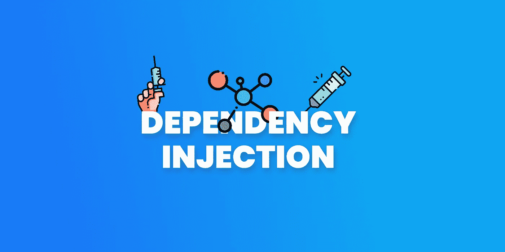
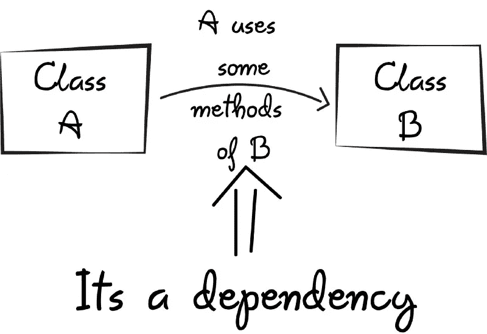
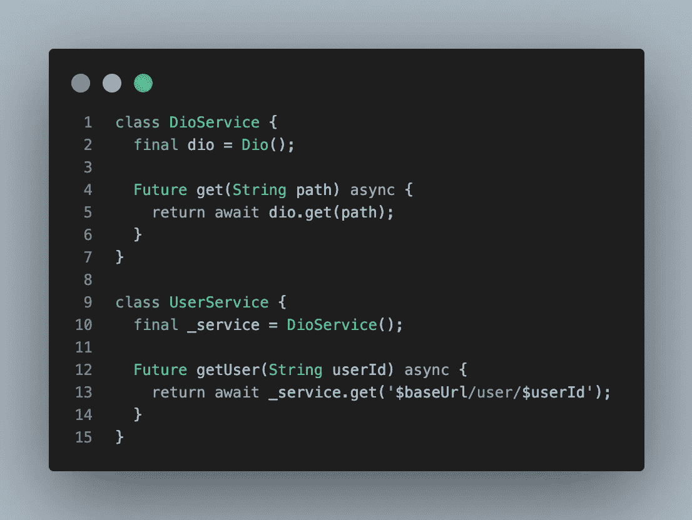
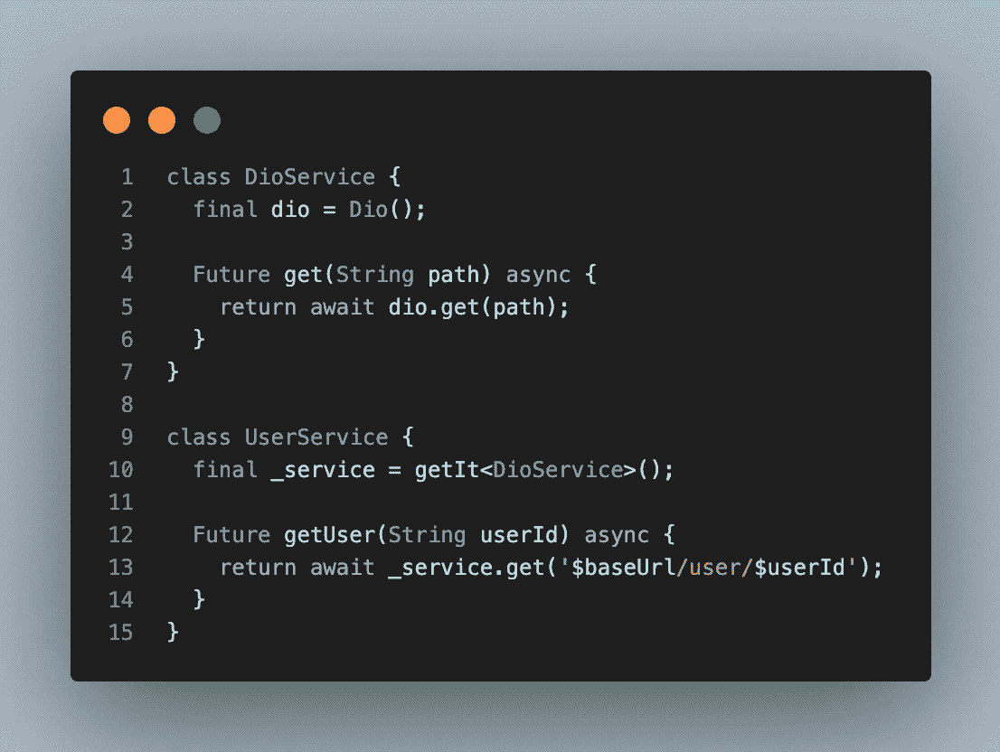
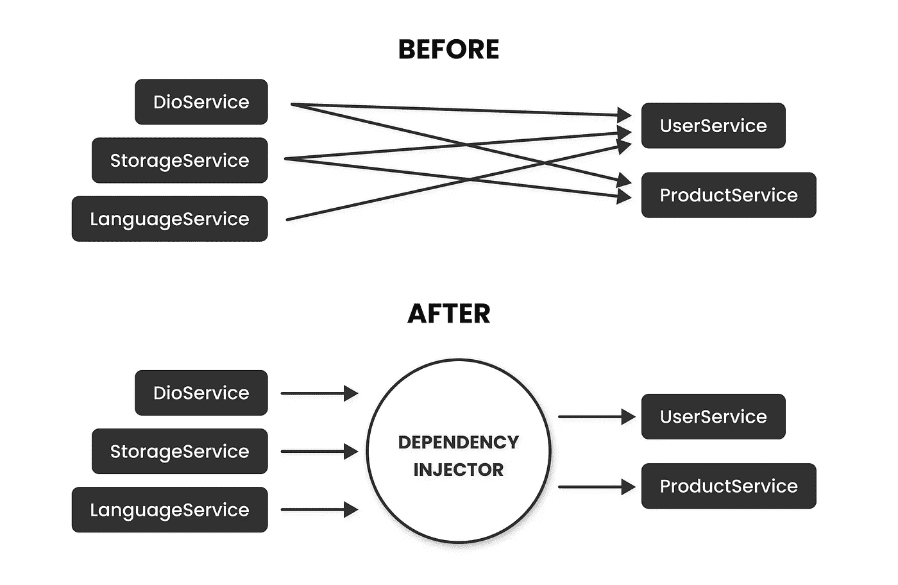

# Flutter 中依赖注入的最简指南

> 原文：<https://itnext.io/a-minimalist-guide-to-dependency-injection-in-flutter-641d4803c0fd?source=collection_archive---------2----------------------->



## 这是给 Flutter 用户的使用 get_it 包的依赖注入的介绍

# 什么是依赖注入？

基本意思是，某样东西依赖于某样东西。很简单，对吧？:)



我举个例子解释一下

## 问题

UserService 依赖于 DioService



## 解决办法

使用阿迪溶液



## 为什么这是一个问题？

那是因为每个阶级都应该是独立的。

依赖注入是一种编程技术，它使一个类不知道它的依赖来自哪里。

## 有什么区别？

我们将所有依赖项存储在一个地方，并对它们进行管理！



# 怎么做？

我会教你如何用 [get_it](https://pub.dev/packages/get_it) 包做到这一点，但你可以用 [riverpod](https://pub.dev/packages/riverpod) 或其他 DI 包做同样的逻辑。他们基本上在做同样的事情。


您可以通过这两个简单的步骤来使用 DI:`register`和`get`！

```
// Just register your class before you use the classclass CounterProvider extends ChangeNotifier {
  int count = 0;
}void main() {
  getIt.registerLazySingleton(CounterProvider.new);
  runApp(MyApp());
}// and get the class using find method and start using!final counter = getIt<CounterProvider>().count++;
```

# 两种类型的寄存器

1.  **工厂** —在每次调用中创建一个新实例
2.  **Singleton** —只创建一个实例，并在每次调用时重用它

它们有一些变种

## 1.注册

实例将在注册后立即创建

```
getIt.**registerSingleton**(Controller());
// OR
getIt.**registerFactory**(Controller());
```

## 2.懒人登记员

实例只有在第一次被调用时才会被创建

```
getIt.**registerLazySingleton**(Controller.new);getIt.**registerLazySingleton**(
  () {
    // ... some logic if needed
    return FirebaseAuth();
  },
)
```

## 3.registerAsync

你可以用异步操作符注册你的类并创建它！

```
// You can also use them using **registerFactoryAsync**getIt.**registerSingletonAsync**(() async => await MyAsyncClass());getIt.**registerSingletonAsync**(() async {
  final prefs = await SharedPreferences.getInstance();
  await prefs.setInt('counter', 12345);
  return prefs;
});
```

## 注意

还有一些其他的寄存器类型，但我不会继续下去，因为它有点脱离了上下文。因此，如果你想了解更多关于其他功能的信息，你可以查看文档

## 得到

如您所见，获取实例是最简单的部分！

```
final controller = getIt.**get**<Controller>();
final controller = getIt<Controller>();
```

## 参考

[](https://pub.dev/packages/get_it) [## get_it | Dart 包

### ❤️赞助商这是一个简单的服务定位器，为飞镖和颤振项目提供一些额外的好东西，非常受启发…

公共开发](https://pub.dev/packages/get_it) [](https://www.filledstacks.com/post/flutter-dependency-injection-a-beginners-guide/) [## 颤动依赖注入初学者指南

### 在本教程中，我们将介绍 Flutter 中被接受的依赖注入的三种形式。我们将看看…

www.filledstacks.com](https://www.filledstacks.com/post/flutter-dependency-injection-a-beginners-guide/) [](https://medium.com/android-news/basics-of-dependency-injection-for-dummies-b844d642e174) [## 傻瓜依赖注入的基础！

### 在这篇文章中，我将用一种非常基本的方式来谈论依赖注入！这篇文章是针对那些有…

medium.com](https://medium.com/android-news/basics-of-dependency-injection-for-dummies-b844d642e174) [](https://www.codementor.io/@olotintemitope/dependency-injection-explained-in-plain-english-b24hippx7) [## 用简单的英语解释依赖注入

### 依赖注入是一个软件设计概念，它允许以一种完全…

www.codementor.io](https://www.codementor.io/@olotintemitope/dependency-injection-explained-in-plain-english-b24hippx7) 

# 感谢您的阅读！

如果你喜欢这篇文章，请点击👏按钮(你知道你可以升到 50 吗？)