# gRPC 简明指南

> 原文：<https://itnext.io/a-minimalist-guide-to-grpc-e4d556293422?source=collection_archive---------1----------------------->

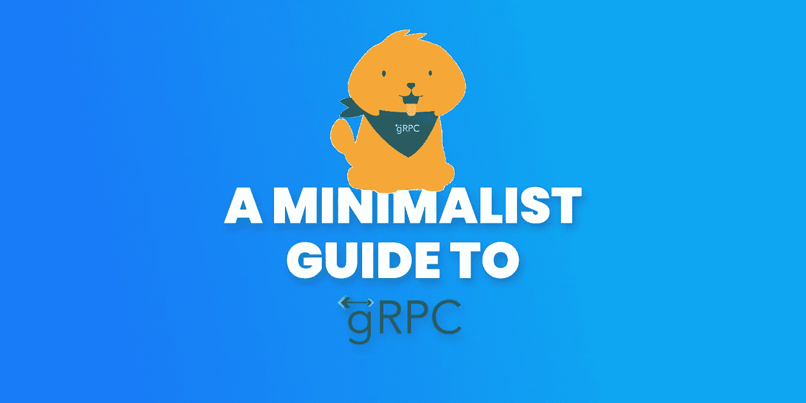

## REST API 很好，但是它真的是我们最好的选择吗？

让我们看一看 gRPC，理解它为什么如此棒，以及为什么和什么时候我们应该使用 gRPC 而不是 REST

## 动机

> (不同)语言之间的交流应该是容易的、简单的、有效的和快速的

**和 gRPC 给你全部免费**

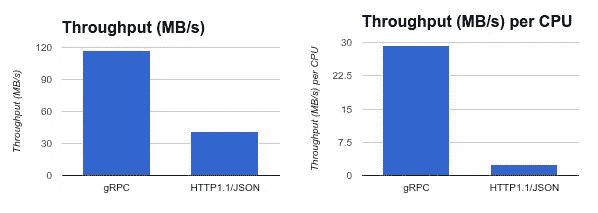

https://devopedia.org/grpc[(越高越好)](https://devopedia.org/grpc)

[https://laptrinhx . com/grpc-vs-rest-performance-comparison-2418648833/](https://laptrinhx.com/grpc-vs-rest-performance-comparison-2418648833/)

## 谁使用 gRPC？

Google 已经在 gRPC 中使用了很多底层技术和概念很长时间了。当前的实现正被用于谷歌的几个云产品和谷歌面向外部的 API。它也被 [Square](https://corner.squareup.com/2015/02/grpc.html) 、[网飞](https://github.com/Netflix/ribbon)、 [CoreOS](https://blog.gopheracademy.com/advent-2015/etcd-distributed-key-value-store-with-grpc-http2/) 、 [Docker](https://blog.docker.com/2015/12/containerd-daemon-to-control-runc/) 、[cockoroadb](https://github.com/cockroachdb/cockroach)、[思科](https://github.com/CiscoDevNet/grpc-getting-started)、[瞻博网络](https://github.com/Juniper/open-nti)等众多组织和个人使用。

## gRPC 的优势

*   轻量级消息。根据调用的类型，特定于 gRPC 的消息比 JSON 消息要小 30%。
*   **高性能**。通过不同的评测，gRPC 比 REST+JSON 通信快 [5](https://dzone.com/articles/is-protobuf-5x-faster-than-json) 、 [7](https://medium.com/@EmperorRXF/evaluating-performance-of-rest-vs-grpc-1b8bdf0b22da) ，甚至 [8](https://docs.microsoft.com/en-us/dotnet/architecture/cloud-native/grpc) 倍。
*   **内置代码生成**。gRPC 已经在不同的编程语言中自动生成代码，几乎所有的语言都是如此
*   **更多连接选项**。虽然 REST 侧重于请求-响应架构，但 gRPC 通过事件驱动架构为[数据流](https://www.altexsoft.com/blog/real-time-analytics/)提供支持:服务器端流、客户端流和双向流。

但是 gRPC 是什么呢？你甚至可以说 RPC 到底是什么意思？

## gRPC 是什么？

*   gRPC 是一个高性能的开源特性丰富的 RPC 框架
*   gRPC 最初是由谷歌开发的，但现在是 CNCF 的一部分

好的..但是什么是 RPC 呢？

## RPC 是什么？

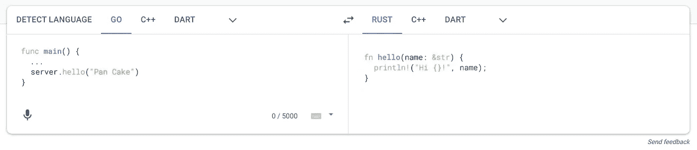

RPC 就像是编程语言的翻译器。帮助我们用同样的方法在客户机和服务器代码之间进行通信。

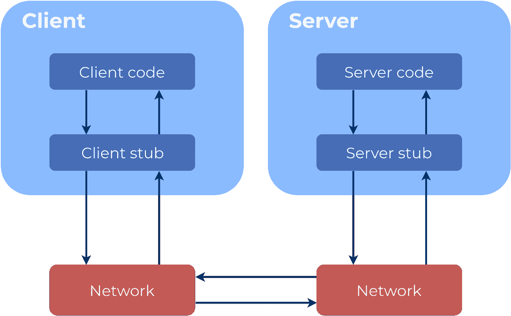

存根仅仅是一个服务层，为我们处理所有的翻译机制。

## g 代表什么？

一开始，你可以认为这意味着谷歌，因为它是由谷歌开发的，对不对？但不是这样的。`g`代表多种含义，如`good`、`gorgeous`等。它在每个版本中都有不同的含义

你可以得到整个名单

 [## GRPC 核心:g 代表

### “g”代表每个 gRPC 版本的不同之处:

grpc.github.io](https://grpc.github.io/grpc/core/md_doc_g_stands_for.html) 

## gRPC 是如何工作的？

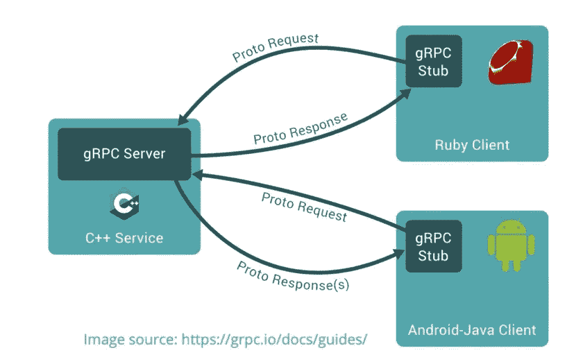

## 基本的 gRPC 流程是这样的

> Go 语言→存根序列化→原型→存根反序列化→ Dart 语言

不用担心 gRPC 生成的所有存根服务，我们根本不需要编写它

## 存根是如何生成的？

像那样:)

## 什么是 ProtoBuf，gRPC 为什么要用 ProtoBuf？

**Protocol Buffers(proto buf)**是一个免费开源的跨平台库，用于序列化结构化数据。

这意味着它基本上类似于 XML 或 JSON，但是**更小**、**更快**、以及**更简单**。

但是您可以从我以前的文章中找到详细的信息

 [## ProtoBuf 简明指南

### 有没有听说过协议缓冲区，想尽快学习的？

itnext.io](/a-minimalist-guide-to-protobuf-1f24fbca0e2d) 

## gRPC 支持哪些语言？

几乎支持所有语言！

## 是什么让 gRPC 高效？

gRPC 使用 HTTP/2、ProtoBuf、报头压缩、多路复用和服务器推送

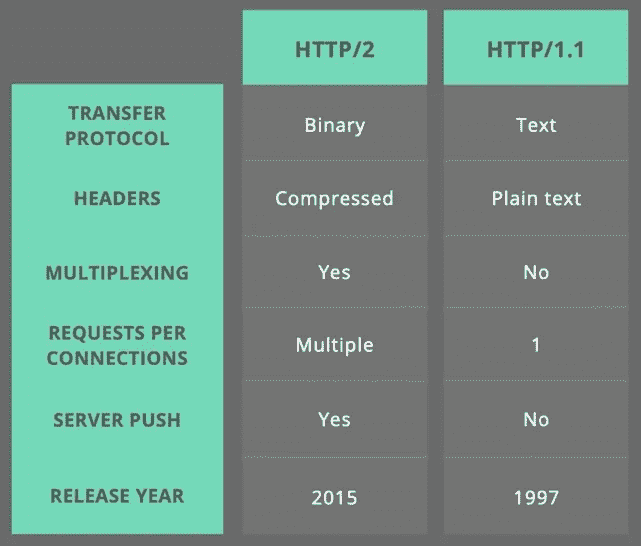

HTTP/1.1 与 HTTP/2

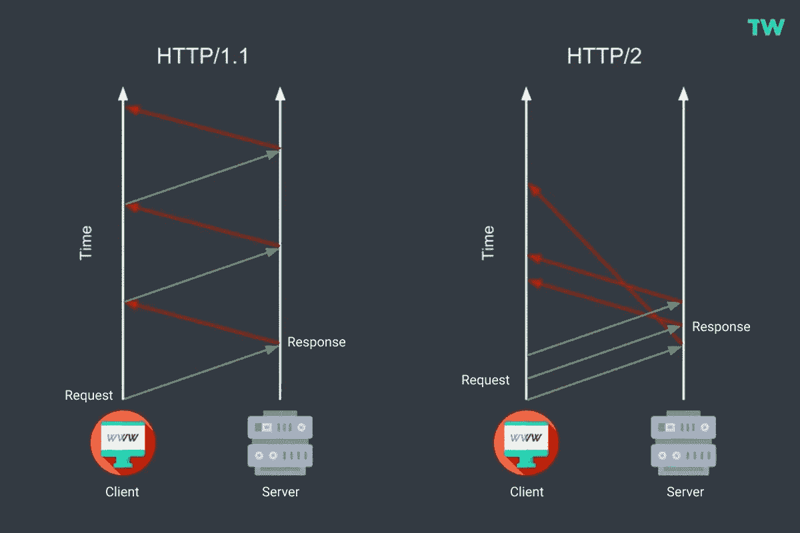

多路比较

速度比较(越低越好)

您也可以从这里测试自己

 [## HTTP/2 技术演示

### 你好！很遗憾，您的浏览器不支持 HTTP/2，我们很抱歉。尝试升级到最新版本并测试…

www.http2demo.io](http://www.http2demo.io/) 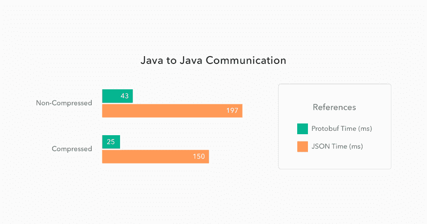

ProtoBuf vs JSON(越低越好)

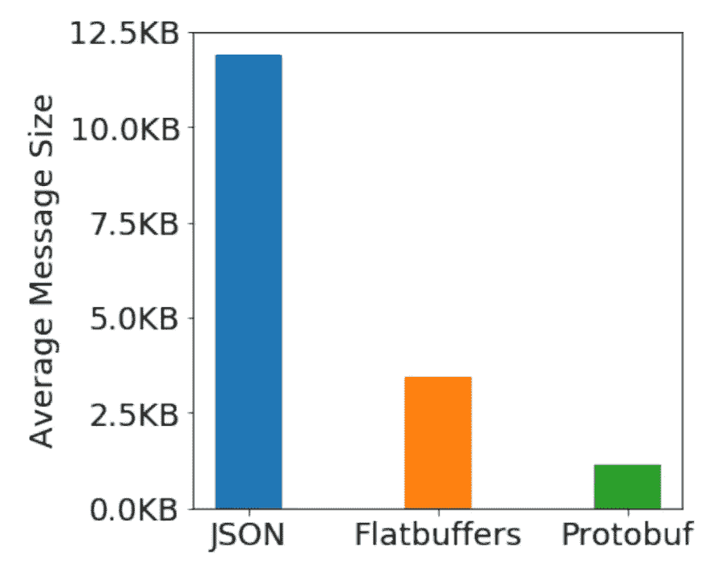

JSON vs Protobuf

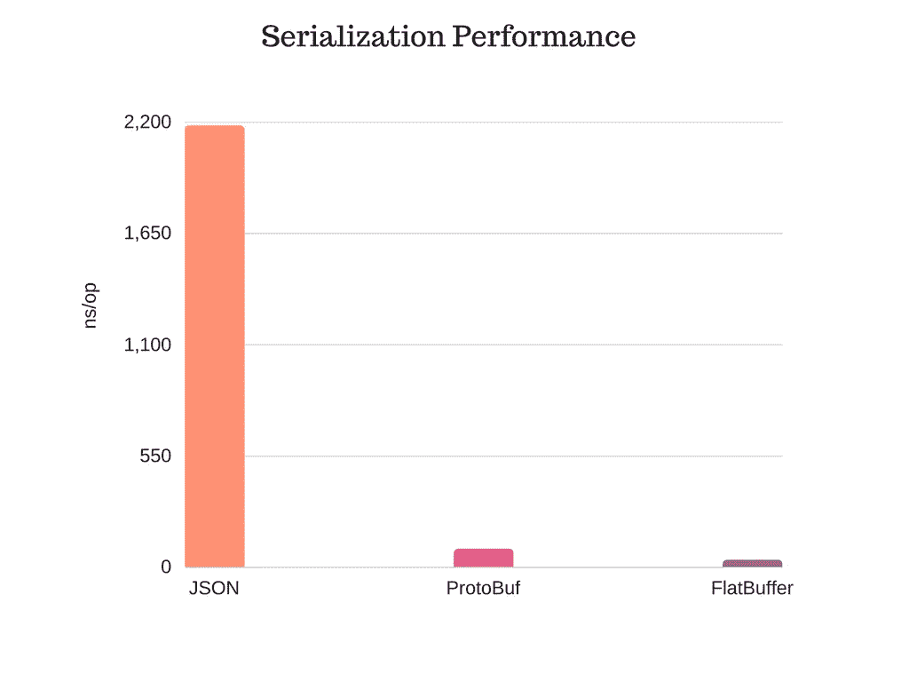

JSON vs Protobuf

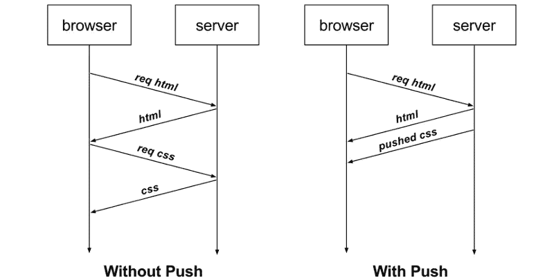

服务器推送

## 4 种 GRPC

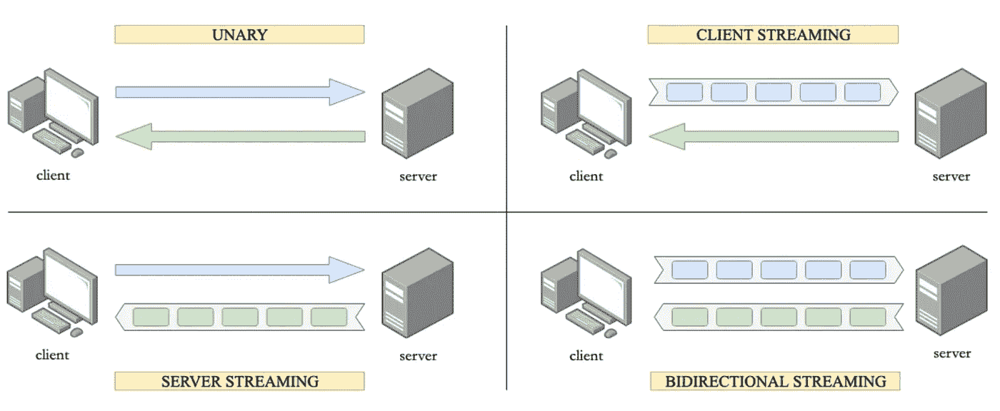

## **一元的**

经典的请求-响应关系

*   客户端向服务器发送一条消息
*   **服务器**回复一条消息

**示例**:网站、应用、REST API 使用的任何地方

## **服务器流媒体**

*   **客户端**向服务器发送一条消息
*   服务器用一系列消息来响应

**示例**:实时仪表盘或金融图表，如美元/欧元

## **客户端**流媒体

*   **客户端**向服务器发送一系列消息
*   **服务器**用一条消息响应

**示例**:上传图片、视频等。

## **双向流:**

*   客户端向服务器发送一系列消息
*   服务器用一系列消息来响应

**例子**:网络游戏、视频聊天等。

## GRPC vs REST vs GraphQL

以下是一些对比

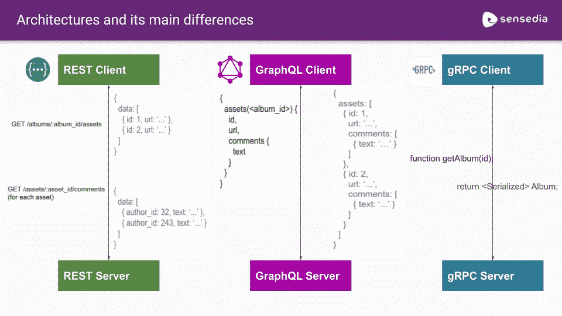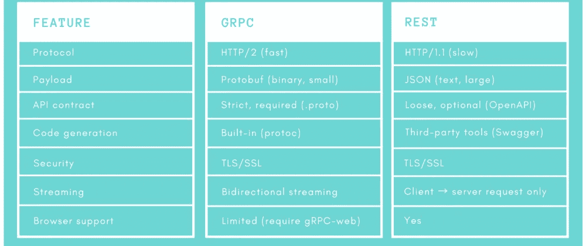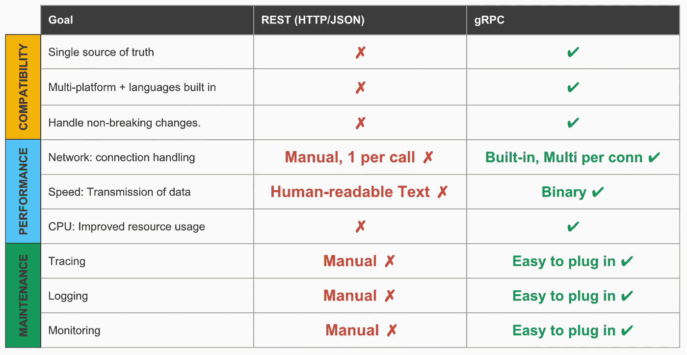

## 参考

我也强烈推荐了这个 gRPC 课程播放列表。在写这篇文章的时候，我使用了很多来自这里的信息

官方文件

 [## 证明文件

### 了解 gRPC 的主要概念，尝试快速入门，查找所有受支持语言的教程和参考资料，以及…

grpc.io](https://grpc.io/docs/) 

一篇关于 gRPC 的好文章

 [## 什么是 gRPC:主要概念、优缺点、用例

### 编程是为了解决问题。我们通常构建 API 来解决两个(或两个)非常具体的问题之一…

www.altexsoft.com](https://www.altexsoft.com/blog/what-is-grpc/) 

一篇关于 gRPC 和 REST 性能比较的精彩文章

 [## gRPC 与 REST:性能简化

### “打破巨石”。这些话是我在之前的两次实习中多次听到的…

medium.com](https://medium.com/@bimeshde/grpc-vs-rest-performance-simplified-fd35d01bbd4) 

# 在你走之前！

这是本系列文章的第 2 部分。我将在下一篇文章中解释如何轻松使用 gRPC，请订阅并保持关注！

 [## gRPC 简化版

### gRPC 的综合示例

itnext.io](/grpc-simplified-aa20609e4416) 

# 感谢您的阅读！

我试图尽可能简单地解释它，我希望你喜欢它。

如果你喜欢这篇文章，请点击👏按钮(你知道你可以升到 50 吗？)