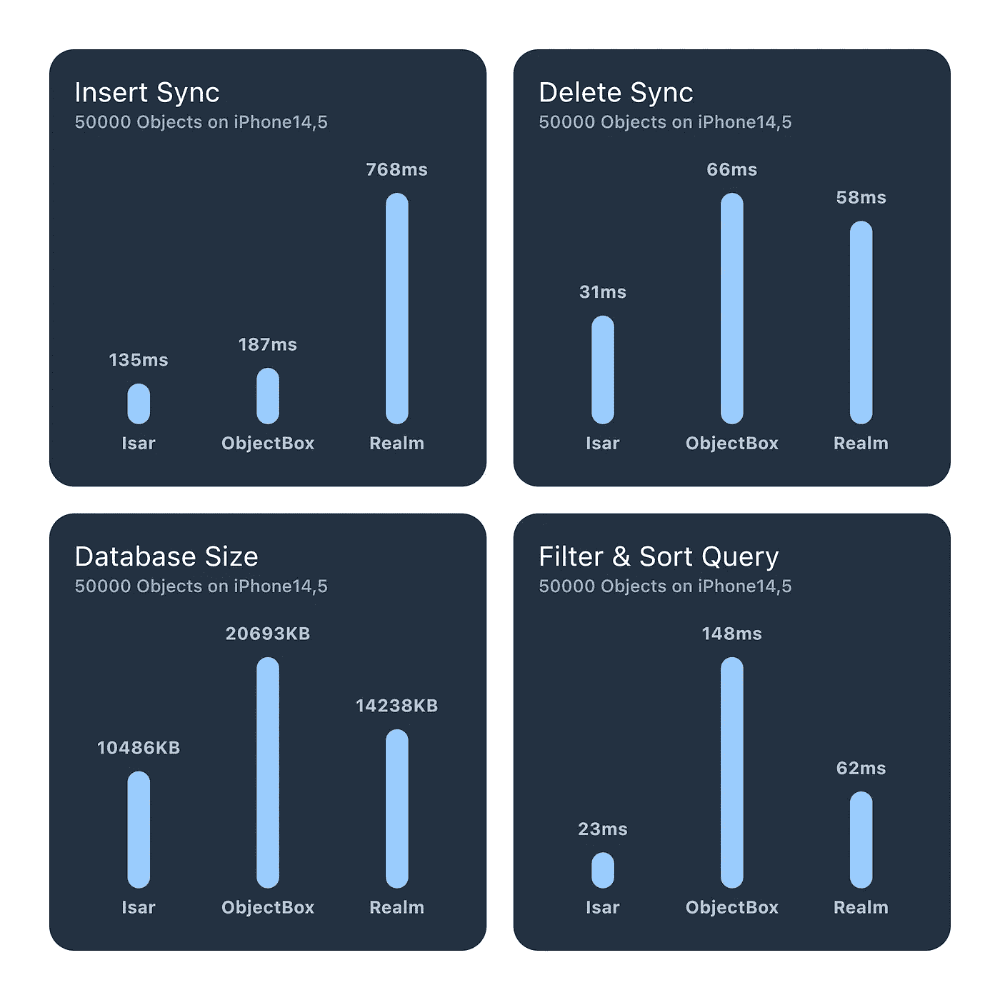
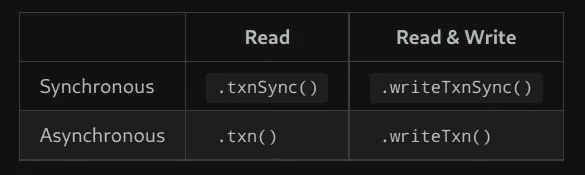
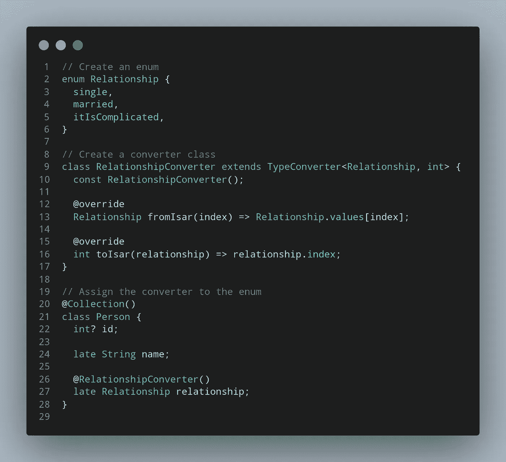
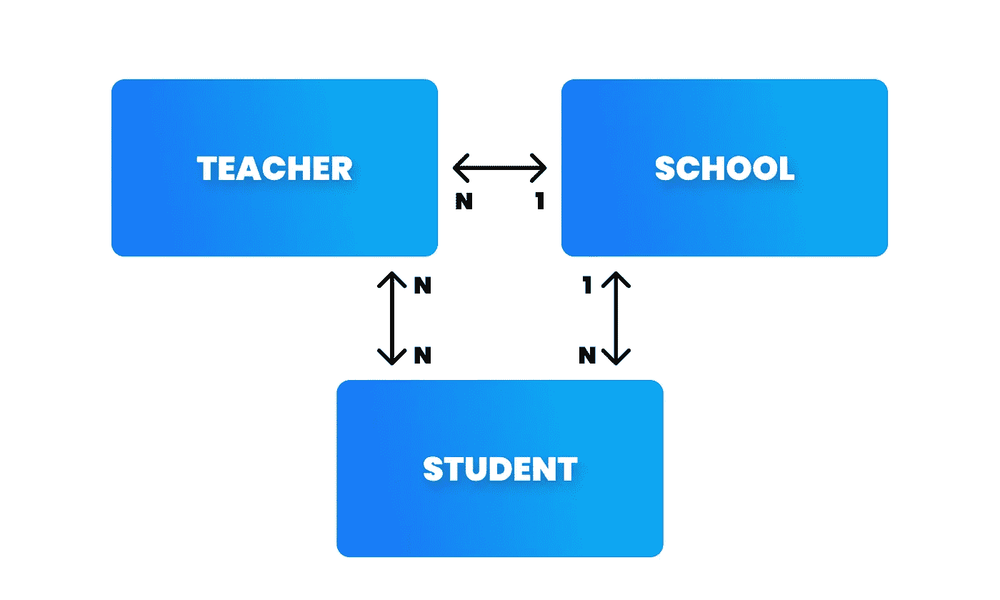
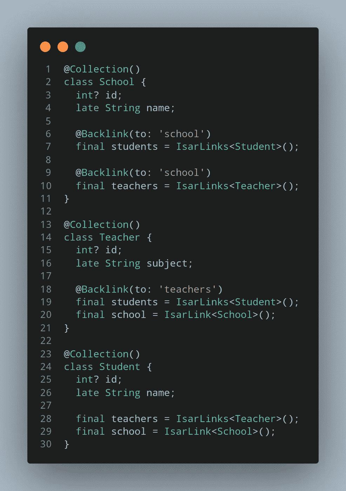
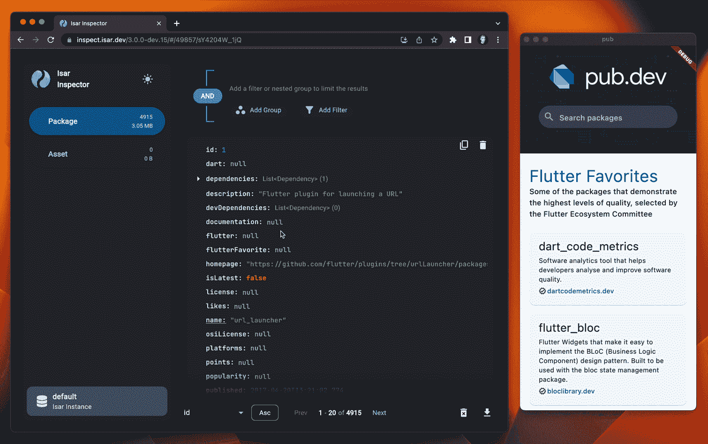

# 会计准则专家组简明指南

> 原文：<https://itnext.io/a-minimalist-guide-to-isar-ee43c1e51a85?source=collection_archive---------1----------------------->


## Hive 的改进版本，在 Flutter/Dart 中是 ObjectBox 的最佳竞争对手

`[Hive](https://pub.dev/packages/hive)`太牛逼了！以及它的作者！因为他在建造 Hive 的时候没有停下来，他想要更好的存储服务，并让`[Isar](https://pub.dev/packages/isar)`存在！！

## 另外，我在之前的文章中说过“`ObjectBox`是最快的本地数据库”，但这是真的吗？

> 如果你也对 Hive 或 Isar 感兴趣，你也可以看看这些文章！

[](/the-fastest-local-database-in-dart-flutter-a65ff5b29fee) [## 会计准则专家组简明指南

### ObjectBox 凭借其性能和自动同步选项改变了游戏规则

itnext.io](/the-fastest-local-database-in-dart-flutter-a65ff5b29fee) [](/flutter-save-data-to-local-storage-with-hive-nosql-database-package-8a0de834f313) [## 颤振保存数据到本地存储与蜂房 NoSQL 数据库包

### Hive 是一个用纯 Dart 编写的轻量级、速度极快的键值数据库。

itnext.io](/flutter-save-data-to-local-storage-with-hive-nosql-database-package-8a0de834f313) 

这一次我将试图说服您为什么应该考虑使用`Isar`而不是其他数据库

# 动机



[越低越好！](https://github.com/isar/isar#benchmarks)

## 信息很少

*   💙为颤动而生。易于使用，没有配置，没有样板文件
*   🚀高度可扩展的天空是极限(双关语)
*   🍭功能丰富。复合和多条目索引、查询修饰符、JSON 支持等。
*   ⏱异步。默认情况下，并行查询操作和多隔离支持
*   🦄开源。一切都是开源的，永远免费！

## 会计准则专家组可以做得更多(我们才刚刚开始)

*   🕵️全文搜索。让搜索变得快速有趣
*   📱多平台。iOS，Android，桌面，和完整的网络支持！
*   🧪酸语义学。依靠一致性
*   💃静态打字。编译时检查和自动完成的查询
*   ✨漂亮的文档。可读性强，易于理解，并且不断改进

# 快速入门

首先，让我们看看 Isar 是如何工作的。

## 1.创建带有注释的模型

```
**part 'user.g.dart';****@Collection()**
class User {
  **@Id()**
  int? id;
  final String name; User(this.name);
}
```

## 2.生成 Isar 代码

```
flutter pub run build_runner build
```

## 3.初始化您的模式

当您运行`build_runner`时，Isar 将为您生成模式！然后你就可以走了！

```
void main() async {
  final dir = await getApplicationSupportDirectory(); final isar = **await Isar.open**(
    schemas: [**UserSchema**],
    directory: dir.path,
  ); runApp(const MyApp());
}
```

## 4.施展你的魔法

```
var user = User('ehe');await isar.writeTxn((isar) async {
  user.id = await isar.users.put(user);
});
```

# 包办旅行

现在，让我们来看看我们的产品包的功能

# create, read, update, and delete

```
var newUser = User('ehe');
**await** **isar.writeTxn**((isar) **async** {
  **// CREATE**
  final userId = await isar.users.**put**(newUser); **// READ**
  var user = await isar.users.**get**(userId);**// UPDATE**easily
  user!.name = 'ehuehe';
  await isar.users.**put**(user); **// DELETE**
  isar.users.**delete**(user.id!);
});
```

# 处理

您可以轻松进行`sync`或`async`操作！！



# 问题

高级查询也非常简单！

## 例如

```
final shoes = **await isar.shoes.where**()
  .**sizeBetween**(42, 46)
  .**or**()
  .**sizeEqualTo**(38)
  .**sizeLessThan**(40)
  .**filter**()
  .**and**()
  .**isUnisexEqualTo**(true)
  .**modelContains**('nike', caseSensitive: false)
  .**not**()
  .**modelContains**('adidas', caseSensitive: false)
  .**sortByModelDesc**()
  .**offset**(10).**limit**(10)
  .**findAll**(); 
```

在这个例子中，只使用了几个方法，对于所有的方法请查看 [*这里的文档*](https://isar.dev/queries.html)

# 类型转换器

尽管 Isar 几乎支持所有类型的数据类型，但不幸的是，它还不支持枚举。

但是不用担心！对于这个问题有一个很好的解决方案，您也可以将这个解决方案用于任何类型的数据！

## 下面我们就来看看 3 步怎么用吧！



# 指数

Isar 很快，但是你可以用索引让它更快！！只需给数据添加一个索引注释就可以了！

```
@Collection()
class Product {
  int? id;
  late String name; **@Index()** late intprice**;**
}
```

此外，您可以配置您的索引，因为你想！

```
String? name,
List<CompositeIndex> composite = const [],
bool unique = false,
IndexType? type,
bool? caseSensitive,
```

有关索引的更多信息，请[查阅文档](https://isar.dev/indexes.html)

# 关系

让我们用一个例子来学习如何建立关系！

```
class **Teacher** {
  ... // One Teacher have only one school
  final school = **IsarLink<School>()**; // toOne // One Teacher have many students
  final students = **IsarLinks<Student>()**; // toMany
}
```



# 观察者

您可以监听特定的对象或集合，甚至整个查询！！

```
// Watch a specific object
**Stream<User>** userChanged = **isar.users.watchObject(5)**;// Watch a query
**Query<User> query = isar.users.filter().build();**
**Stream<List<User>>** queryChanged **= query.watch();****// Watch** **a collection
Stream<void>** collectionChanged **= isar.users.watchLazy();**
```

# 检查员应用程序

会计标准专家组还为我们提供了一个工具，使我们的数据库可视化，这是一个简单而令人惊叹的设计



## 在你走之前！

# 小警告

*   不幸的是与冷冻不兼容
*   Isar 会将您的应用程序的下载大小增加大约 1-1.5 MB。Isar Web 只有几 KB。

# 参考

 [## Isar 数据库

### 超快的跨平台数据库让我们开始吧！最小的设置，易于使用，没有配置，没有…

isar.dev](https://isar.dev) 

# 感谢您的阅读！

我试图尽可能简单地解释。希望你喜欢。

如果你喜欢这篇文章，请点击👏按钮(你知道你可以升到 50 吗？)