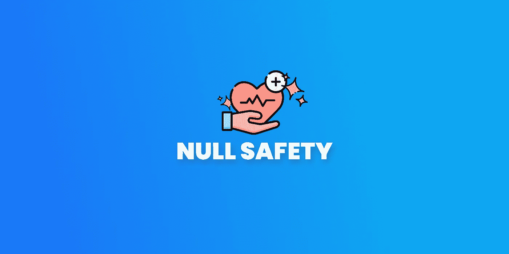
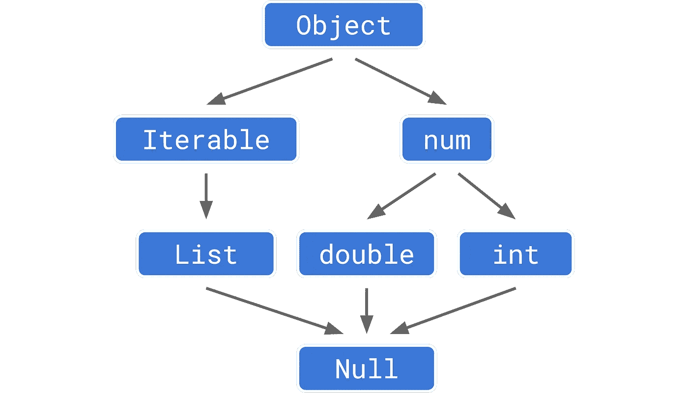
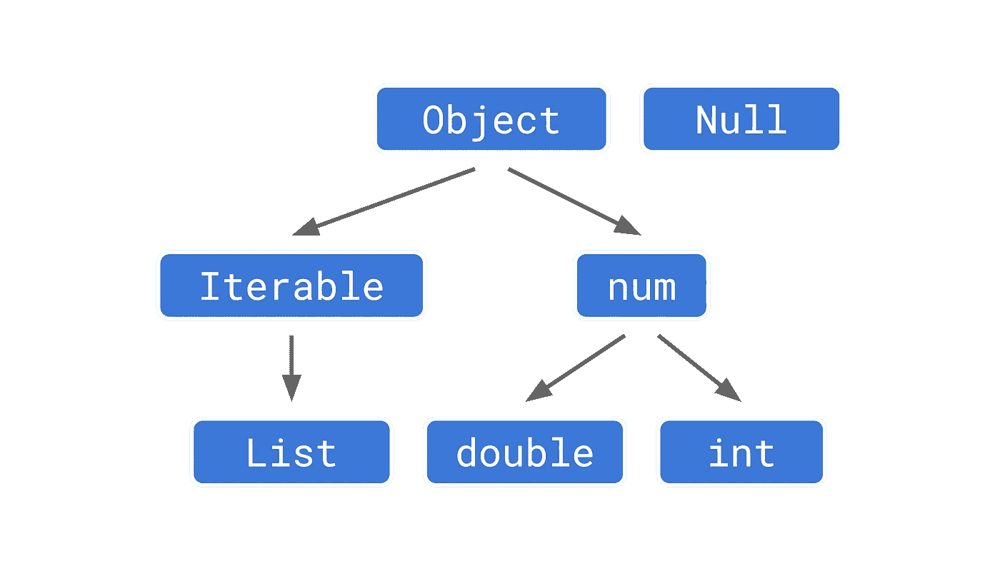
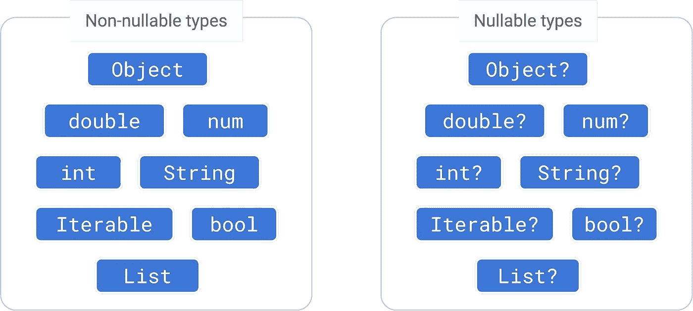
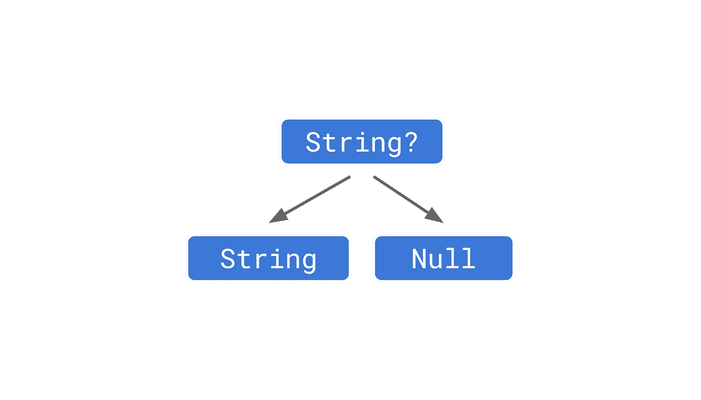

# 颤振/飞镖中声音零安全的最终指南

> 原文：<https://itnext.io/a-minimalist-guide-to-null-safety-a4c2c34c5ef8?source=collection_archive---------3----------------------->



## 什么是零安全，为什么以及如何使用它？这一次，让我们深入了解声音零安全！

## 在我们开始之前，我想说点什么！

我不知道为什么有些人讨厌空安全(不是不必要的样板什么的！)但是这篇文章可能有助于改变他们的观点，所以如果你身边有这样想的人，请发送这篇文章并帮助他们启发！

## 正如深奥的编码者所说；

> 只有傻瓜才会写糟糕的代码！

如果我们准备好了，那么让我们开始吧！

# 什么是声音零安全？

## 首先！

> Null 不是邪恶的，但也不是最好的朋友

摆脱`null`不是目标。`null`没毛病。

主要目标是防止意外的空情况导致我们的问题！我们只是在控制局面！

# 我们为什么需要它？

答案很简单！不要犯[](https://www.infoq.com/presentations/Null-References-The-Billion-Dollar-Mistake-Tony-Hoare/)*的亿元错误！*

# *什么是稳健？*

*这是静态编程分析中的行话*

*基本上，确保程序不能进入某些无效状态。*

## *稳健的好处*

*   *在编译时揭示与类型相关的错误。*(运行时错误见鬼去吧！)**
*   *更具可读性和可维护性的代码。*
*   *更好的 AOT(提前)汇编。*
*   *我们可以更好地声明我们的意图。这就产生了自文档化且更易于使用的 API。*
*   *编译器可以优化我们的代码，给我们更小更快的应用程序。*

## *现在，让我们稍微看一下架构！*

**

*在零安全之前*

*在空安全之前，所有东西都包含`Null`，这导致每种类型的支持默认为空，这就是问题所在！*

**

*无效安全后*

*如你所见，为了安全起见，我们将`Null`从树上分离并隔离！这样，没有什么将依赖于`Null`通过这样做，我们将防止我们的应用程序中任何不必要的空问题。*

## *现在让我们看看 Null 安全在实践中是如何工作的！*

```
*String myString;bool isEmpty(String string) => string.length == 0;**// Without null safety**
// Crashes while user's is using the app!
isEmpty(myString);**// With null safety**
// The app can't even be compiled!
isEmpty(myString);
// So that we will ensure that null case handled properly
// and that will make our moms proud of us!*
```

*现在，这是有道理的，对不对？*

*那么现在让我们来看看空感知操作符！！*

# *零感知运算符*

**

*可以为空，也可以不为空*

## *？—我是一个联合类型的变量，我可以是已定义的变量，也可以是空值*

> *那就是说:**字符串=字符串**和**字符串？=字符串或空值***

**

*字符串？=字符串|空*

## *一些基本规则*

*   *除非我们告诉 Dart 它可以为空，否则 Dart 将假定它不可为空！*

```
*// WTH, bro? don't you see I only accept String values. Why you still trying me to set null!
**String** text;*
```

*   *如果你没有给一个可空变量指定一个值，那么默认值将是`null`*

```
*// I got it, bro! I'm null for now but you'll set me a value later
**String?** text;*
```

## *！—我保证，我不会让这里放过任何一个 null！*

```
***String?** text; **String** newText = text**!**; // you can't assign it to me! Because you and I, We're different worlds variables. If you want me to be with you, you have to get rid of your null habits!*
```

## *！。—如果有人失踪，聚会将被取消！*

```
*class User { Address? address; }
class Address {String? name; }user**!.**address**!.**name**!***
```

## *？。—如果少了一个人，聚会就结束了！*

```
*class User { Address? address; }
class Address {String? name; }User? user;// the first one is equivalent to the second one!
// choose your side wisely!final name = user**?.**address**?.**name;final name = getNameOrNull();
String? getNameOrNull() {
  if (user == null) {
    return null;
  } else {
    if (user!.address == null) {
      return null;
    } else {
      if (user!.address!.name == null) {
        return null;
      } else {
        return user!.address!.name;
      }
    }
  }
}*
```

## *？？—如果杰克不参加聚会，就带别人来吧！*

```
*String? jack;String yep = jack **??** 'someoneElse';*
```

## *？？= —如果你的朋友不加入我们，那就打电话给 __！*

```
*String? yourFriend;String kevin = 'kevin';
String martha = 'martha';yourFriend **??=** kevin;
yourFriend **??=** martha;print(yourFriend); // returns kevin
// because jack join the group and martha couldn't make it!*
```

## *迟到——我会迟到，这样你就可以不等我就开始聚会了。我稍后会加入你们！*

```
***late** **String** ehe; // won't throw an error because it'll be initialized laterehe = 'yuppi';*
```

> *注意:如果你声明了一个变量`*late*`并且这个变量在赋值前被读取，那么就会抛出一个错误。*

***局部变量**是最灵活的情况。不可空的局部变量*不需要*有初始化器。这非常好:*

```
*// result will be act like, it has a late keyword!
int someMethod() {
    int result; 
    result = 5;
    return result;
}*
```

## *必需-可选参数，但也必须获得一个值！*

```
*// throws an error
// because you say it's optional can be null but also it's nullable!
void method({String value}){}// now it's better!
void method({required String value}){}*
```

## *我们还可以控制蔓延，瀑布，索引和关键！*

```
*// Null-aware spread operator
final newList = [...list, **...?**list2];// Null-aware cascade operator
receiver**?..method()**;
receiver**!..method()**;// Null-aware index operator
receiver**?[i]**;
receiver**![i]**;// Null-aware key operator
map**['key']?.**name;
map**['key']!.**name;*
```

# *飞镖的流量分析！*

*Dart 编译器足够智能，可以分析代码流和可达性。所以，即使你用 return，break，或者 throw 一点问题都不会有！*

## *让我们一步一步地看一个简单的例子*

```
*// Compiler will warn you because you didn't return anything!!
**int method(String? value) {
}**// This time warn you because value can be null but you don't expect a null value!
**int method(String? value) {
  return value.length;
}**// Dart will understand the value won't be null because It's checked before using
// and won't warn you for length issue but this time will warn you for unhandled return statement!
**int method(String? value) {
  if (value != null) return value.length; // ok
}**// and we are perfect!
**int method(String? value) {
  if (value != null) return value.length;
  return 0;
}***
```

*如你所见，零安全没有给我们任何犯错的空间！*

*这使得应用程序更加可靠和安全！*

## *最后*

*你可能会说，为什么不说说`Never`？*

*然后我会说我们将需要那几乎`NEVER`！所以何必呢？*

*顺便说一句，如果你还没有迁移你的项目，点击下面的链接！*

*[](https://dart.dev/null-safety/migration-guide) [## 迁移到零安全

### 本页描述如何以及何时将您的代码迁移到空安全。以下是迁移每一项的基本步骤…

dart.dev](https://dart.dev/null-safety/migration-guide) 

感谢保罗·阿拉德。他在 DartPad 中准备了一个语法快速参考。你也应该看看这个！

[](https://dartpad.dev/?id=52784f9fd4ba6367ccac0428eb834720) [## 镖靶

### 编辑描述

镖靶](https://dartpad.dev/?id=52784f9fd4ba6367ccac0428eb834720) 

此外，我强烈推荐这篇文章给你理解理论！

[](https://medium.com/flutter-students-club/really-null-safety-in-flutter-dart-56e2a70a3849) [## 颤振/飞镖中的安全性真的为零

### 亲爱的 Dart 开发者、初学者或专业人士，我认为，是时候真正理解和吸收零安全了。

medium.com](https://medium.com/flutter-students-club/really-null-safety-in-flutter-dart-56e2a70a3849) 

# 参考

你可以把这篇文章看成是官方的简化版！

[](https://dart.dev/codelabs/null-safety) [## 空安全代码实验室

### 这个代码实验室教你关于 Dart 的空安全类型系统，它是在 Dart 2.12 中引入的。当你选择空…

dart.dev](https://dart.dev/codelabs/null-safety) [](https://dart.dev/null-safety/understanding-null-safety) [## 理解零安全

### 零安全是我们对 Dart 做出的最大改变，因为我们用一个…

dart.dev](https://dart.dev/null-safety/understanding-null-safety) [](https://codewithandrea.com/videos/dart-null-safety-ultimate-guide-non-nullable-types/) [## Dart 空安全:不可空类型的最终指南

### Null 安全的引入标志着 Dart 语言的一个重要里程碑。零安全帮助您避免整个…

codewithandrea.com](https://codewithandrea.com/videos/dart-null-safety-ultimate-guide-non-nullable-types/) 

# 感谢您的阅读！

我试图创造尽可能简单的例子。希望你喜欢。

如果你喜欢这篇文章，请点击👏按钮(你知道你可以升到 50 吗？)*