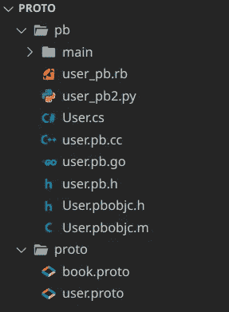
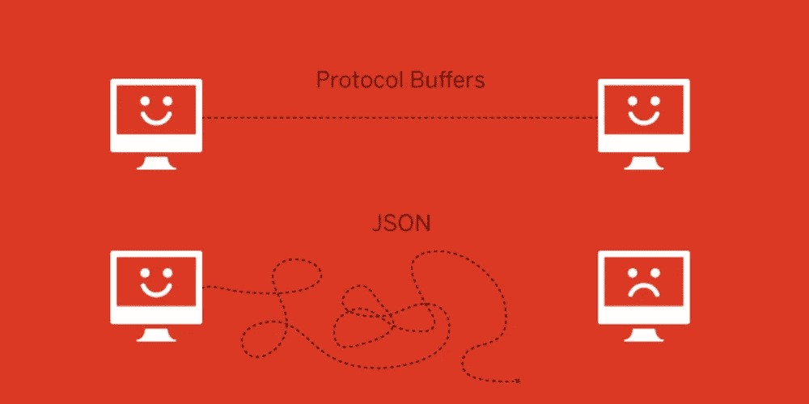
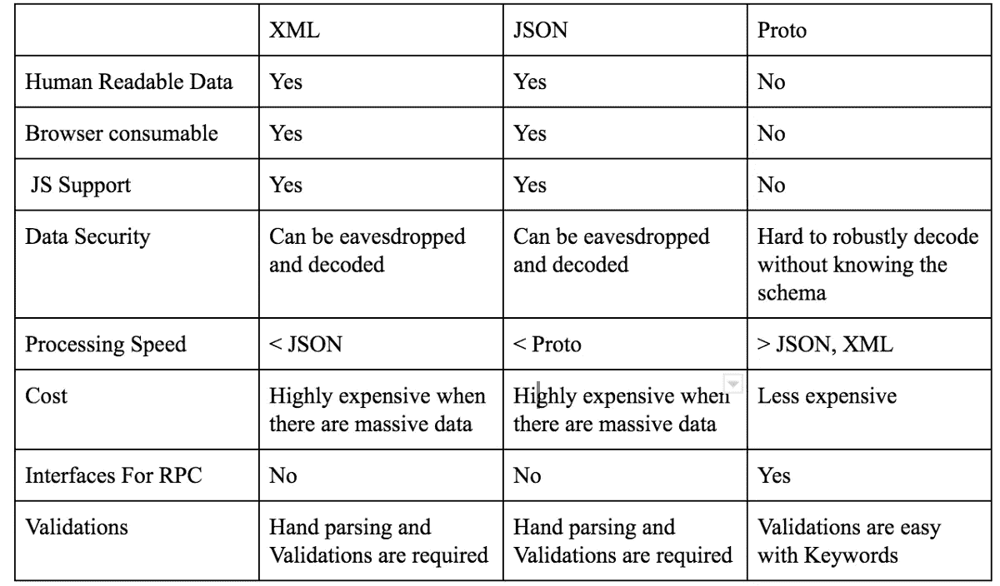
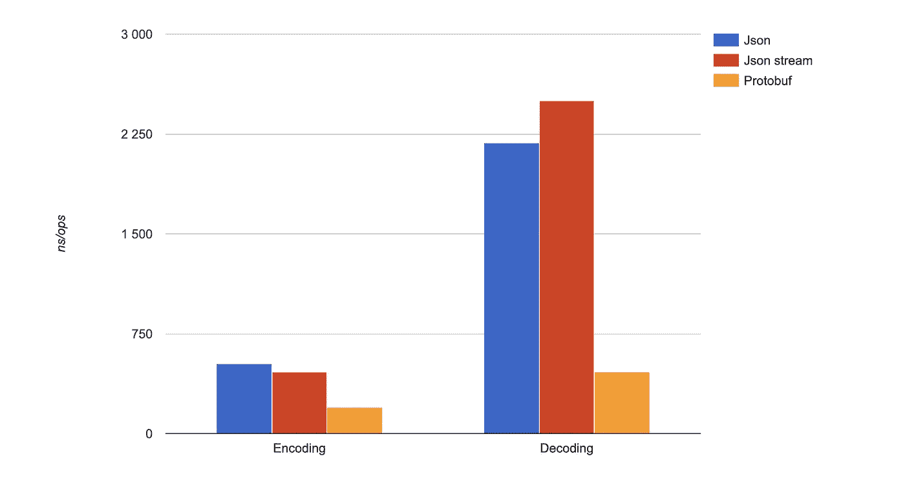
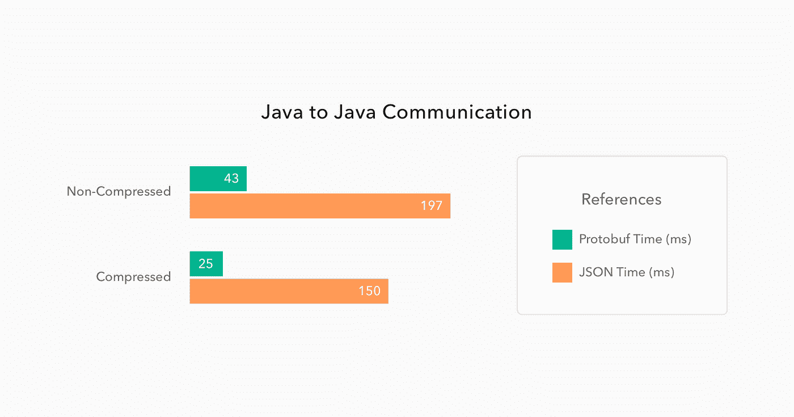
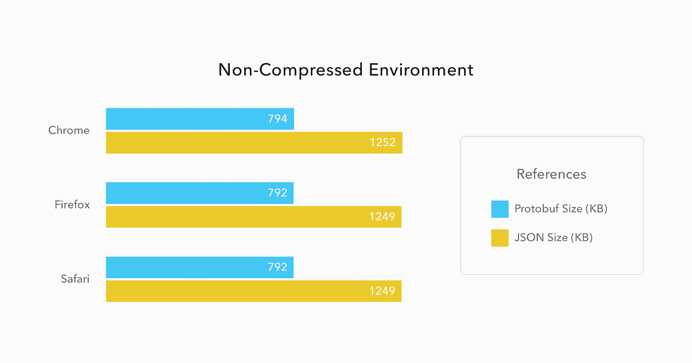

# ProtoBuf 简明指南

> 原文：<https://itnext.io/a-minimalist-guide-to-protobuf-1f24fbca0e2d?source=collection_archive---------0----------------------->


## 你听说过协议缓冲区吗？它就像 XML 或 JSON，但是**更小**，**更快**，并且**更简单！**

# 什么是协议缓冲区？

**协议缓冲区(Protobuf)** 是一个免费开源的跨平台库，用于序列化结构化数据。

这意味着它就像 XML 或 JSON，但是**更小**，**更快**，以及**更简单**。

定义您的数据结构，让`protoc`为您生成所有代码！

# 动机


(越低越好)

## 在这篇文章中，我们将学习

1.  如何定义 ProtoBuf？
2.  如何生成代码？

# 第 1 部分:如何定义 ProtoBuf？

首先，你需要创建一个 proto 文件，在第一行添加`syntax = “proto3”;`。

> 注意:如果你不把这一行加到第一行，protobuf 将定义为 proto2，这是 protobuf 的旧版本

## 一些规则

*   数据类型可以是用户定义的枚举或其他消息
*   字段名并不重要，ProtoBuf 只负责标记。
*   标签不必是有序的或连续的(但是强烈推荐)
*   对于同级字段，标签必须是唯一的
*   您可以定义嵌套消息

```
syntax = “proto3”;// Structuremessage UpperCamelCase {
  <data-type> lower_snake_case = tag;
}// Examplemessage MyUser {
  string full_name = 1;
  int32 age = 2;
  bool is_married = 3;
  repeated string friends = 4;
  repeated Book books = 5;
  enum Sex {
    NONE = 0; // default
    MALE = 1;
    FEMALE = 2;
  }
  Sex sex = 6;
  message Address {
    ...
  }
  Address address = 7;
  map<string, Project> projects = 3;
  ...
}message Book {
 ...
}message Project {
 ...
}
```

您可以在找到[中的所有数据类型](https://developers.google.com/protocol-buffers/docs/proto3#scalar)

## 如果你不知道什么是你的类型或者你想使用动态类型。

```
import "google/protobuf/any.proto";message Message {
  google.protobuf.Any details = 1;
}
```

## 您也可以使用预定义的自定义类型

```
import "google/protobuf/timestamp.proto";message Person {
  ...
  google.protobuf.Timestamp last_updated = 5;
}
```

## 您可以保留标签或字段名称

```
enum Foo {
  reserved 2, 15, 9 to 11, 40 to max;
  reserved "FOO", "BAR";
}
```

## 您可以随心所欲地嵌套消息

```
message Outer {       // Level 0
  message MiddleAA {  // Level 1
    message Inner {   // Level 2
    }
  }
  message MiddleBB {  // Level 1
    message Inner {   // Level 2
    }
  }
}
```

## 如果您有一个包含许多字段的消息，但想选择其中一个

```
message Violin {}
message Piano {}message ChangeNotification {
  int32 id = 1;
  oneof instrument {
    Violin violin = 2;
    Piano piano = 3;
  }
}
```

> 您可以添加任何类型的字段，除了`map`字段和`repeated`字段。

## 定义服务

您可以像这样定义服务。还有，你不需要知道什么是服务。现在只需注意语法。我用一个例子来解释

```
service SearchService {
  rpc Search(SearchRequest) returns (SearchResponse);
}
```

现在，让我们做一个简单的例子并生成代码！

# 第 2 部分:如何生成代码？

在这个例子中，我们有一个`User message`和`User service`

`User service`获取`ReadUserReq`消息并返回`ReadUserRes`消息

这意味着

我们把`user id`给服务器，服务器会给我们`User object`

```
syntax = "proto3"package pb; // package nameoption go_package = "./pb"; // which folder it will generate (only for golang)message User {
  string id = 1;
  string email = 2;
}service UserService {
  rpc ReadUser(ReadUserReq) returns (ReadUserRes);
}message ReadUserReq {
  string id = 1;
}message ReadUserRes {
  User user = 1;
}
```

我将生成 go 和 dart 语言，但你可以生成你想要的语言

```
// Full Structure
**protoc
  --proto_path=IMPORT_PATH (AKA -I)
  --cpp_out=DST_DIR
  --java_out=DST_DIR
  --python_out=DST_DIR
  --go_out=DST_DIR
  --ruby_out=DST_DIR
  --objc_out=DST_DIR
  --csharp_out=DST_DIR
  path/to/file.proto**// Most basic command
**protoc --proto_path=./proto --go_out=. user.proto** // for Golang
**protoc** **-I****=./proto --dart_out=./pb user.proto** // for Dartlangor you can you both of them in one command
**protoc --proto_path=./proto --go_out=. --dart_out=./pb user.proto**
```



正如你所看到的，我们只用一行命令就可以生成每种语言的所有代码

## XML vs JSON vs Proto



## 为什么 ProtoBuf 胜过 JSON 和 XML？

**更高效的解析**。使用协议缓冲区进行解析占用的 CPU 资源较少，因为数据是以二进制格式表示的，这样可以最小化编码消息的大小。这意味着，即使在物联网或移动设备等 CPU 较慢的设备中，消息交换也会更快。

**图式必不可少**。通过强制程序员使用模式，我们可以确保消息不会在应用程序之间丢失，并且其结构组件在另一个服务上也保持不变。

ProtoBufs 的主要目标是优化。通过去除由数据格式完成的许多职责，并使其只专注于执行序列化和反序列化，我们可以确保数据以最紧凑的方式尽可能快地传输，这在使用微服务时尤其有价值。我们稍后会谈到它。

# 一些基准



[https://auth 0 . com/blog/beating-JSON-performance-with-proto buf/](https://auth0.com/blog/beating-json-performance-with-protobuf/)



[https://auth 0 . com/blog/beating-JSON-performance-with-proto buf/](https://auth0.com/blog/beating-json-performance-with-protobuf/)


[http://dl . ifip . org/db/conf/networking/networking 2020/1570620395 . pdf](http://dl.ifip.org/db/conf/networking/networking2020/1570620395.pdf)

## 这是你的完整例子

请运行以下命令并查看结果

```
protoc --go_out=. --dart_out=./pb user.proto
```

# 在你走之前！

别忘了！Protobuf 只是一个定义和生成工具。

## 参考

更多详细信息，请查看官方文档！

[](https://developers.google.com/protocol-buffers/docs/proto3) [## 语言指南(proto3) |协议缓冲区| Google 开发者

### 本指南描述了如何使用协议缓冲区语言来构建您的协议缓冲区数据，包括。原型…

developers.google.com](https://developers.google.com/protocol-buffers/docs/proto3) [](https://auth0.com/blog/beating-json-performance-with-protobuf/) [## 用 Protobuf 击败 JSON 性能

### Protobuf 是 Google 精心制作的二进制格式，甚至在 JavaScript 环境中也超过了 JSON 的性能，比如…

auth0.com](https://auth0.com/blog/beating-json-performance-with-protobuf/) [](https://www.altexsoft.com/blog/what-is-grpc/) [## 什么是 gRPC:主要概念、优缺点、用例

### 编程是为了解决问题。我们通常构建 API 来解决两个(或两个)非常具体的问题之一…

www.altexsoft.com](https://www.altexsoft.com/blog/what-is-grpc/) 

# 在你走之前！

这是本系列文章的第 1 部分。我会写 gRPC 和微服务之类的..。请订阅，敬请关注！

## 第二部分

[](/a-minimalist-guide-to-grpc-e4d556293422) [## gRPC 简明指南

### REST API 很好，但是它真的是我们最好的选择吗？

itnext.io](/a-minimalist-guide-to-grpc-e4d556293422) 

# 感谢您的阅读！

我试图尽可能简单地解释它，我希望你喜欢它。

如果你喜欢这篇文章，请点击👏按钮(你知道你可以升到 50 吗？)