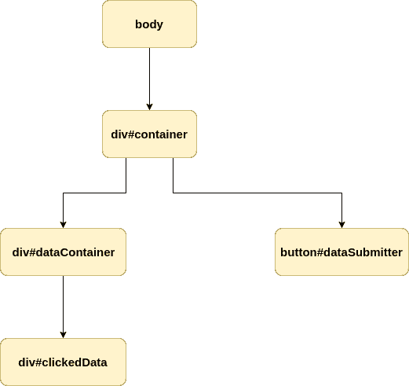
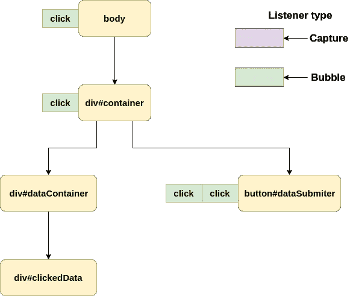
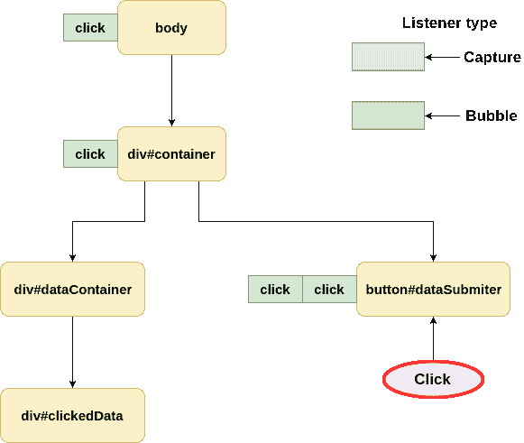
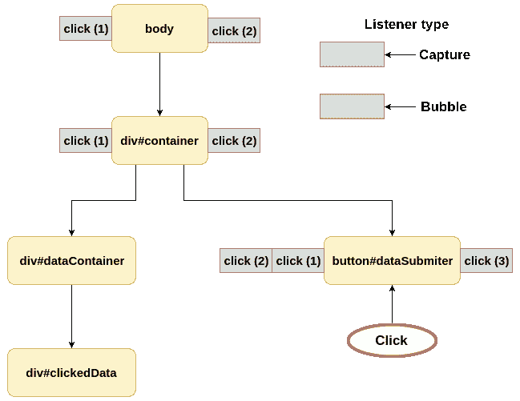
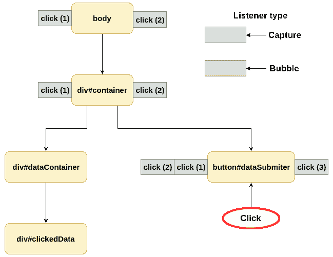
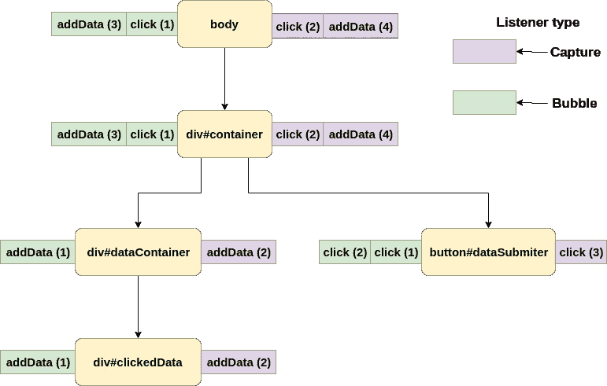
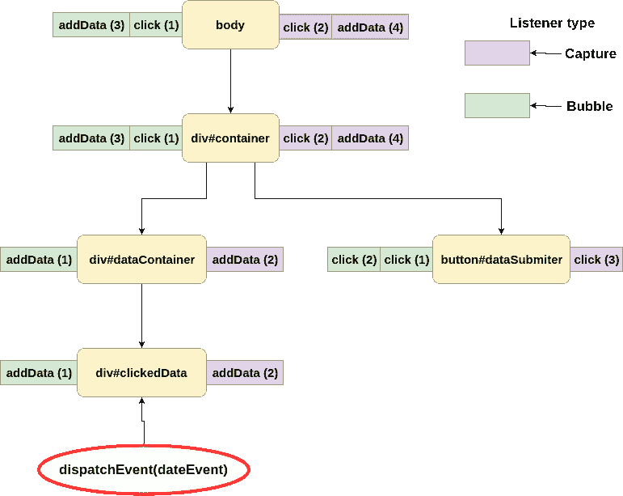
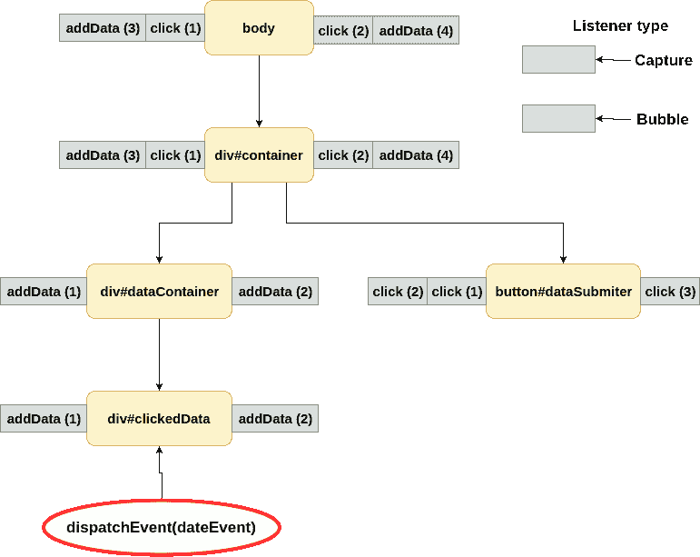

# JavaScript 事件现代指南

> 原文：<https://itnext.io/a-modern-guide-to-events-in-javascript-90ef314679a5?source=collection_archive---------6----------------------->

## 事件是如何通过 DOM 元素传播的？有没有办法让它为我们所用？

# 什么是事件？

> *事件是对象，实现了* [*事件接口*](https://dom.spec.whatwg.org/#interface-event)

这些对象由用户代理(或应用程序本身)分派，并由[事件监听器](https://dom.spec.whatwg.org/#concept-event-listener)处理。事件负责处理用户交互或网络活动。有不同类型的事件，但如果您愿意，您可以在 [MDN](https://developer.mozilla.org/en-US/docs/Web/API/Event#Introduction) 上查看。我们必须关注事件是如何通过 DOM 传播的。

# 事件传播

首先，我们必须创建一些简单的 DOM 来解释事件传播

```
<div id="container">
  <div id="dataContainer">
    <div id="clickedData"></div>
  </div>
  <button id="dataSubmitter">Add Data</button>
</div>
```



为了处理事件，我们需要添加一些事件监听器。在 VanillaJS 中要做到这一点，我们必须获取 DOM 元素并对其调用`addEventListener`。DOM 元素正在实现 EventTarget 接口，因此，我们可以访问`addEventListener(type, callback, options)`和`removeEventListener(type, callback, options)`方法。

*   **类型** —事件的名称
*   **回调** —要调用的函数
*   **选项** —改变默认监听器行为的对象

```
const button = document.getElementById('dataSubmitter');button.addEventListener('click', e => {
  console.log('clicked');
});
```

在调用了`addEventListener`之后，我们在那个元素(按钮)上的**事件监听器列表**中添加了一个监听器。该列表是零个或多个事件侦听器的列表，这意味着您可以为同一事件添加更多侦听器。

```
const button = document.getElementById('dataSubmitter');button.addEventListener('click', e => {
  console.log('clicked first');
});
button.addEventListener('click', e => {
  console.log('clicked second');
});
```

在这种情况下，当`click`事件被调度时，侦听器将按照它们被分配的顺序被调用(我们将在控制台中看到`clicked first`和`clicked second`)。

每个人都知道点击我们的按钮(2 个控制台日志)后会发生什么，但是为了显示事件如何通过我们的 DOM 树传播，我们必须添加更多的侦听器



而现在用户交互事件之后是**通过 DOM 向上冒泡**



这个过程被称为**冒泡**并且很容易理解，但这不是全部路径。每个事件都从树的顶部开始其路径。这个过程被称为**捕获**，为了访问**捕获**阶段的事件，我们必须创建带有额外选项的监听器，作为第三个参数传递。

`capture: true`通知我们的监听器监听**阶段 1 或 2** 中的事件。每个事件有 3 个阶段:

*   **捕捉(1)** —下树
*   **关于目标(2)** —这是不言自明的
*   **泡泡(3)** —上树

现在让我们看看我们的事件是如何传播的(事件类型旁边的数字是添加事件侦听器的顺序)。



在点击事件被调度后，它在`body`级别以`eventPhase === 1`开始。之后，它在树中传播，直到到达它的目标(按钮)。

在按钮级别，相位变为 **2** ，我们可以发现异常行为。如果你仔细观察监听器被调用的顺序(`button`，首先我们调用负责**冒泡**事件的事件监听器，然后监听器负责**捕获**。一开始可能看起来很奇怪，但是在`button`级别，我们的事件不在任何一个阶段。正因为如此，我们的侦听器是按照创建的顺序被执行的。在目标阶段的**中，监听器类型无关紧要。**

之后，我们的事件以与前一个例子相同的方式冒泡。

# 如何阻止事件传播？

有时我们希望事件位于树的特定点。为此，我们需要使用`e.stopPropagation()`或`e.stopImmediatePropagation()`。这些函数防止其他侦听器被同一个事件调用。

## 停止传播()

```
const button = document.getElementById('dataSubmitter');button.addEventListener('click', e => {
  console.log('clicked first');
  e.stopPropagation();
});
button.addEventListener('click', e => {
  console.log('clicked second');
});
button.addEventListener(
  'click',
  e => {
    console.log("button capture 'click'");
  },
  {
    capture: true,
  }
);
```



即使我们在第一个侦听器中调用`stopPropagation()`，所有分配给当前元素的侦听器都会被调用。事件不会传播到另一个`EventTarget`。我们可以在我们的任何一个侦听器中调用`stopPropagation()`，它不一定是目标，甚至不一定是冒泡的阶段。如果你想阻止事件到达目标，你可以在一个监听**捕获**阶段的监听器中调用`stopPropagation`。

## stopImmediatePropagation()

```
const button = document.getElementById('dataSubmitter');button.addEventListener('click', e => {
  console.log('clicked first');
  e.stopImmediatePropagation();
});
button.addEventListener('click', e => {
  console.log('clicked second');
});
button.addEventListener(
  'click',
  e => {
    console.log("button capture 'click'");
  },
  {
    capture: true,
  }
);
```


你可能已经发现了不同之处。`stopImmediatePropagation`在调用它的同一个侦听器上停止传播。如果我们在`click (2)`内部调用它，那么传播在`click (2)`处停止，并且不执行`click (3)`。在元素上处理多个侦听器时，您应该意识到这种差异。

## 预防默认()

很好的提一下`preventDefault`法。在现代框架中，这样做很常见:

```
e.preventDefault();
e.stopPropagation();
```

很多人都在这样做，甚至不知道为什么。您知道`stopPropagation()`正在阻止一个事件通过事件监听器。另一方面，`preventDefault`告诉浏览器不要执行它的默认行为。

[https://codesandbox.io/s/awesome-wildflower-z3wn2](https://codesandbox.io/s/awesome-wildflower-z3wn2?fontsize=14)

如果我们从复选框中调用`click`事件上的`preventDefault()`，那么浏览器不会将我们的复选框更改为选中状态。我们可以手动处理我们的事件(例如，改为应用自定义操作)。这对于提交表单也很有帮助。在大多数流行的库中，我们实际上不希望表单元素发送 HTML。我们希望手动处理表单数据，应用验证，解析并在发送前添加一些额外的数据。

# 手动调度事件

我以前说过，事件不一定要由浏览器创建，我们可以创建它们。为此，我们必须创建新的`CustomEvent`实例和`dispatchEvent`。`[CustomEvent](https://dom.spec.whatwg.org/#interface-customevent)`基本上是相同的标准`Event`，但是在`options`对象中有一个名为`details`的附加属性。该属性用于存储自定义数据。

```
const clickedData = document.getElementById('clickedData');
const dataEvent = new CustomEvent('addData', {
  detail: { test: 'test2' },
});clickedData.dispatchEvent(dataEvent);
```

让我们将监听器添加到我们的树中，以监听我们的自定义事件



当我们的代码被执行时会发生什么？



等等第二，为什么没有冒泡？！在我们的例子中，事件停留在目标阶段的**上。原因是默认情况下，所有使用`new CustomEvent()`创建的事件都将`bubbles`设置为`false`。**

要启用此事件的冒泡，我们必须使用`options`对象创建它:

```
new CustomEvent('addData', {
  bubbles: true,
  detail: { test: 'test2' },
});
```



> *使用* `*CustomEvent*` *不是强制性的。如果你愿意，你可以创建* `*new Event()*` *的实例，并使用它进行传播。*

# 当我们需要使用自定义事件时。

我认为向元素发送数据是显而易见的。React 的 HOCs(高阶组件)就是一个很好的例子，它向您展示了为什么您可能想要与事件传播挂钩。想象一下，一个应用程序有多层逻辑包裹着你的表单。它可能看起来像这样:

```
<div id="app">
  <div id="addUserData">
    <div id="prefillAfterReset">
      <form>
        {...}
      </form>
    </div>
  </div>
</div>
```

在这种情况下，我们甚至可以在表单的`submit`和`reset`事件到达我们的表单组件之前挂钩到它们，并在提交/重置表单时添加/修改数据。我并不是说要实现这样的行为，因为有更好的方法来实现它。

如果你想玩事件，请检查这个沙盒

https://codesandbox.io/s/blissful-wilson-6ce25

*最初发布于*[*https://erdem . pl*](https://erdem.pl/2019/08/a-modern-guide-to-events-in-java-script)*。*