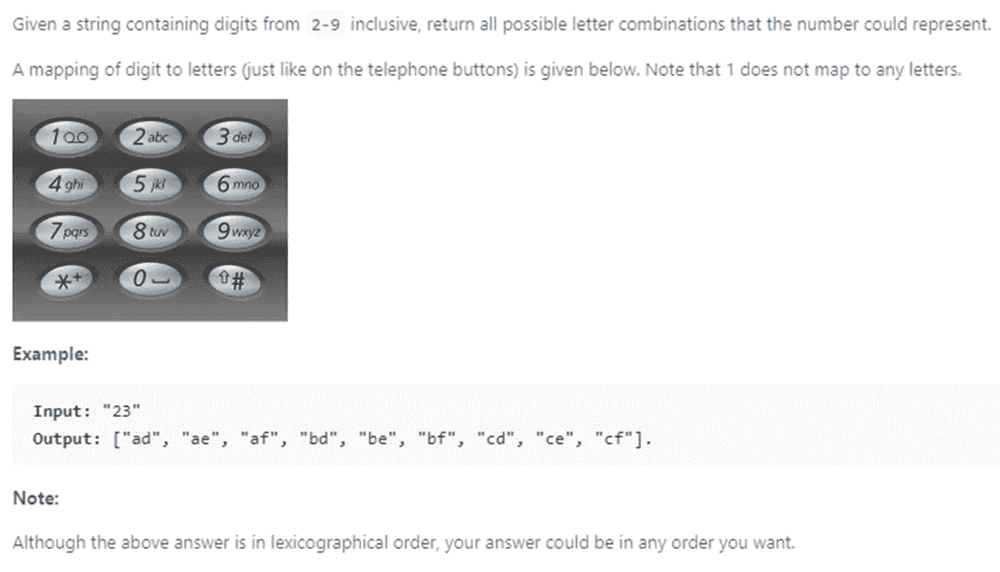
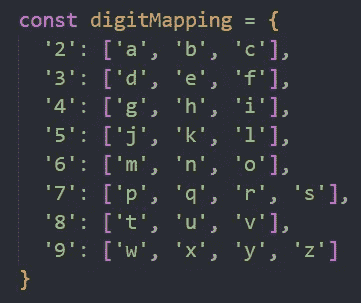
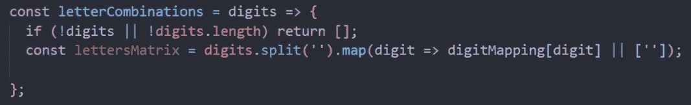
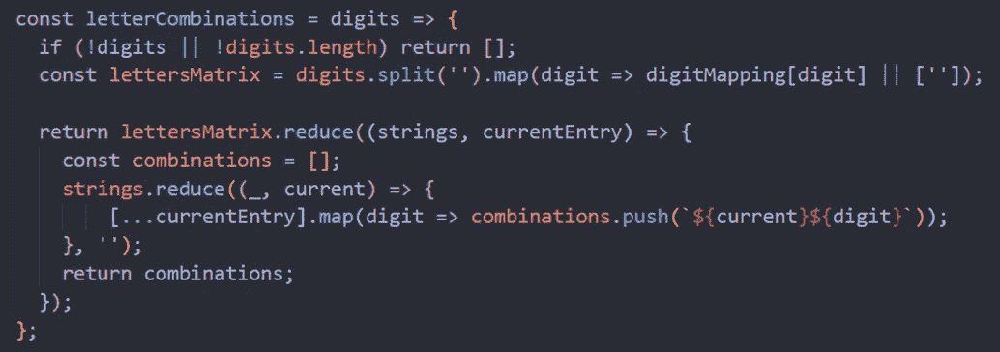
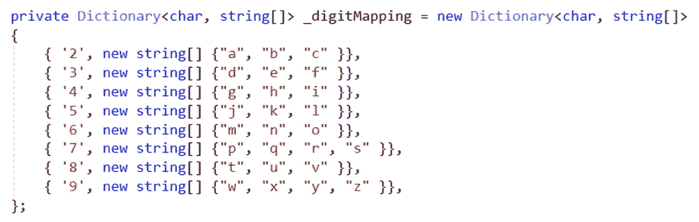
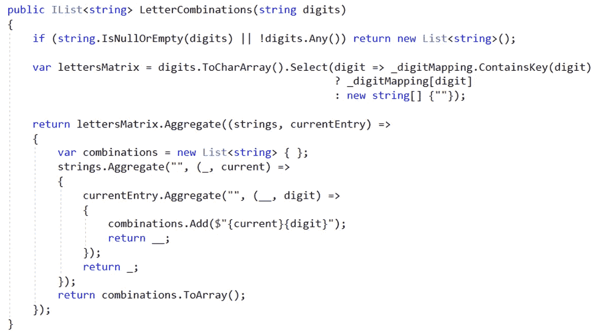

# 对于 T9 问题，JavaScript 和 C#都提供了更具声明性的解决方案

> 原文：<https://itnext.io/a-more-declarative-solution-to-the-t9-problem-in-both-javascript-and-c-13ab7f7a859b?source=collection_archive---------2----------------------->

大约两年前，在编写了大约 16 年的命令式代码之后，我开始学习、探索和使用更多的声明式代码形式来创建企业软件以及解决竞争性编程算法。对我来说，结果是更清晰，更短的代码，更少的错误和问题。以编写自定义代码为例。NET 使用循环来根据列表中包含的人的年龄对列表进行排序，而不是使用 LINQ 运算符。在第一个场景中，您自己做所有的事情，使用**代替**、**，而**或**代替每个**循环。在第二个场景中，您只需在一行代码中使用 **OrderBy** 或 **OrderByDescending、**来说明您想要完成的操作。NET framework 为您完成了这项工作。它更简洁，更清晰，更干净，因为微软已经测试了那些你知道他们工作的操作符。我记得有一天在一次代码审查会议上，我们能够使用 LINQ 在几分钟内将一个有 20 多行代码和两个错误的方法转换成 4 或 5 行代码，没有任何错误。

在 JavaScript 中，您可以使用 **Array.prototype** 方法做类似的事情，如 **map** 、 **reduce** 和 **filter** 。通过这种方式，您可以摆脱与复杂的嵌套循环相关的所有混乱，在嵌套循环中，每行代码都告诉运行时如何做事情，而不仅仅是说您想要做什么。

接受并精通更多的陈述性方法也可能是得到你梦想中的工作或被拒绝的区别。我记得一个关于谷歌拒绝 Max Howell 的奇怪故事，因为他在一次面试中无法反转二叉树([https://www . quora . com/Whats-the-logic-behind-Google-rejecting-Max-Howell-the-author-of-home brew-for-not-able-invert-a-binary-tree](https://www.quora.com/Whats-the-logic-behind-Google-rejecting-Max-Howell-the-author-of-Homebrew-for-not-being-able-to-invert-a-binary-tree))。Max Howell 是 Homebrew 的创始人，我听说 Google 的很多开发人员都在使用它。他必须是一名杰出的开发人员，我认为谷歌本可以从中受益，可惜的是，一棵二叉树挡住了他获得这份工作的道路。

如果你试图使用一个迭代命令式的解决方案，但是你不记得或者不知道正确的方法，那么反转一个二叉树会很棘手。但是如果你使用声明性的方法，使用递归，你可以在几分钟内用非常简单的 6 或 7 行代码解决问题，比如 JavaScript 和 C#。现在你可能认为递归是邪恶的，如果你没有使用支持尾部调用优化的语言，它会吞噬你的堆栈帧；那是一个单独的讨论，在这里我只是在谈论得到你梦想的工作。

由于反转二叉树很简单，并且没有给我们太多的空间来展示声明性思维和编程的美妙之处，所以我选择了一个更复杂的问题来做这件事。根据 leetcode.com 的说法，这是在谷歌、脸书、亚马逊、微软、苹果、摩根大通等大公司面试时最常被问到的问题之一。大约两年前的一次面试中，我实际上被要求解决这个问题，即使我能够解决，我也对我的解决方案感到有点惭愧，它包含 3 个嵌套的**用于**循环，所有这些 *i* 、 *j* 和 *k* 变量无处不在(这恰好是你在互联网上看到的一个非常常见的解决方案)。

**遇到问题:电话号码的字母组合**(取自 leetcode.com，也有人称之为 T9)**:**

这个问题是不言自明的。请注意，您点击的按钮数量决定了最终数组中字符串的长度。“23”有 9 种可能的组合，但“735”有 36 种(pdj、pdk、pdl…)，当你按下更多的按钮时，这个数字当然会增加。

我会先用 JavaScript(我热爱的语言，甚至在 ECMAScript 6 出现之前)解决问题，然后用 C#(从 2004 年开始我就非常接近的语言)。

**JavaScript 中的解决方案:**

我们将使用一个类似字典的对象来保存数字和字母之间的映射:

接下来，我们将创建一个函数来解决这个问题，并添加基础检查来防止边缘情况输入。

现在，我们将添加一行代码，将类似“23”的输入转换为数组的数组，包含与每个数字相关的所有字母，例如:[['a '，' b '，' c']，['d '，' f '，' g']]。

最后，我们将添加一段代码，生成所有可能的组合(完整的函数实现):

如果你不熟悉 **map** 和 **reduce** 的工作方式，那么这个函数内部发生的事情可能并不明显。解释它们值得写一整篇文章，网上已经有很多了。我将不跟踪代码，因为我的目标不是让您知道如何解决特定的问题，而是将这种编码方式与更“传统”的命令式编码方式进行对比。为了帮助你做到这一点，我在这里给你留下了其中一个链接:[https://repl . it/@ nickangtc/JavaScript-Letter-Combinations-of-a-Phone-Number](https://repl.it/@nickangtc/javascript-Letter-Combinations-of-a-Phone-Number)。

在本文中显示的明显更简洁和更短的代码下面，隐藏着声明性比命令性更强的最大好处，当您手边有键盘、记号笔或铅笔时，减少了 bug 的出现。如果你不习惯，它可能看起来更难做或理解，但是相信我，当你习惯了，你会越来越不喜欢 **for/while/foreach** 循环。

我想提的三件事:如果你担心 JavaScript 中的**map**/**reduce**/**filter**vs“传统”循环的性能，就像我在以前的一篇文章中提到的那样，看看这个[https://www.youtube.com/watch?v=g0ek4vV7nEA](https://www.youtube.com/watch?v=g0ek4vV7nEA)，它可能会改变你对 JavaScript 性能的看法。第二，即使我们在本文中使用代码挑战，其背后的思想在企业软件中也是完全有效和适用的，一件奇怪的事情是，在用 JavaScript 的不同编码方式重新连接我的大脑后，我也成为了一个更好的 C#/。NET 开发者。最后，我想说这个问题可以用递归来解决，如果你是一个 Haskell 开发者，你应该已经知道了；如果您是 Python 开发人员，您可能知道可以使用类似的方法用一行代码(当然不包括映射字典)解决这个问题，这对您有好处！

接下来，我将向您展示我的 C#实现。我必须承认我不像 JavaScript 那样喜欢它。因为这种语言的强类型本质，所以有更多的必要代码、混乱和约束，但是我仍然会把它放在 *i，j，k* 版本之上。

假设我们有下面的字典，作为**类**字段的一部分:

一个可能的方法实现是:

如果你认为这很难做到，试着实现你自己的命令式解决方案，并展示给别人看。诚然，编程中没有银弹，也没有适合所有钉子的思维方式，我在这里鼓励的思维方式只是你工具箱中另一个非常有价值的工具。我写这篇文章的唯一目的是，如果还没有发生的话，唤醒你对更具陈述性的思考的好奇心。

编码快乐！