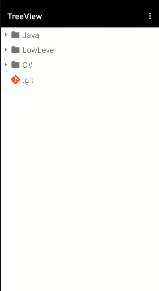

# 一个新的 Android TreeView 实现

> 原文：<https://itnext.io/a-new-android-treeview-implementation-9b27ca9854af?source=collection_archive---------3----------------------->

大家好，在 2022 年初，我想创建一个文件树，就像你在任何代码编辑器或 IDE 中看到的那样，表示项目结构，你可以做一些操作，如展开或折叠目录，我在 GitHub 中搜索了许多树视图实现，但我发现其中一些已经很多年没有维护过了，并且示例项目不能在新的 Android Studio 版本上运行，其他实现从头开始创建自定义视图并绘制树，但它们不能正确地工作，因为有大量的节点和其他限制。

因此，我开始创建一个列表，其中包含所有这些功能的一组功能，以及 GitHub 问题上要求的一组功能，以便从中获得灵感，这样我就可以创建一个通用而有用的实现，每个人都可以轻松定制和扩展，因此，我想介绍这个新的 [TreeView](https://github.com/amrdeveloper/treeview) 库。

主要目标是使[树形视图](https://github.com/amrdeveloper/treeview)易于使用，几乎不受限制地定制和扩展，并与新的 android 版本保持同步，那么你能用[树形视图](https://github.com/amrdeveloper/treeview)做什么呢？

TreeView 没有任何自定义视图，您需要的只是一个普通的 recycle view，这样您就可以获得 recycle view 回收和性能的好处，也可以获得 2D 滚动，而无需任何自定义布局，就像您希望让您的普通 recycle view 具有 2D 滚动一样，TreeView 有一个自定义的 recycle view 适配器，带有随时可用的单击和长单击侦听器，我们可以在将来添加更多侦听器，所以每个 TreeNode 都不需要有一个对它的侦听器的引用。

您可以拥有任意数量的根，也可以拥有任意数量的列表项布局，而无需扩展和覆盖默认的适配器，我已经使用工厂设计模式实现了这一点，因此您需要将 TreeViewHolderFactory 传递给适配器构造函数，该构造函数将每个列表项布局映射到它的 ViewHolder，因此您所需要的就是为该布局创建一个 View Holder，并将其添加到工厂中。

TreeView 还支持许多操作，如展开和折叠节点和分支或按级别展开和折叠所有节点，您还可以获得当前选择的节点和任何节点的父节点，所有这些功能的实现都封装在 TreeNodeManager 类中，因此我们可以轻松地为它们编写单元测试，如果您想要不同的实现，您可以轻松地创建一个自定义的 TreeNodeManager 并将其传递给适配器。

关于如何安装、使用和扩展的所有细节都写在 TreeView 网站上，并附有示例，如果您面临任何问题或有任何疑问，请随时在 [Github](https://github.com/amrdeveloper/treeview) 资源库上创建新问题，以便我们可以快速帮助您。

这个实现是现成的，如果你有任何想法或要求，请随时分享或贡献和添加它们，你也可以在网站上找到所有的细节。

TreeView Github:[**AMR developer/TreeView**](https://github.com/amrdeveloper/treeview)
TreeView 网站:[**Github.io/TreeView**](https://amrdeveloper.github.io/TreeView/)

你可以在: [**GitHub**](https://github.com/amrdeveloper) ， [**LinkedIn**](https://www.linkedin.com/in/amrdeveloper/) ， [**Twitter**](https://twitter.com/amrdeveloper) 上找到我。

享受编程😋。