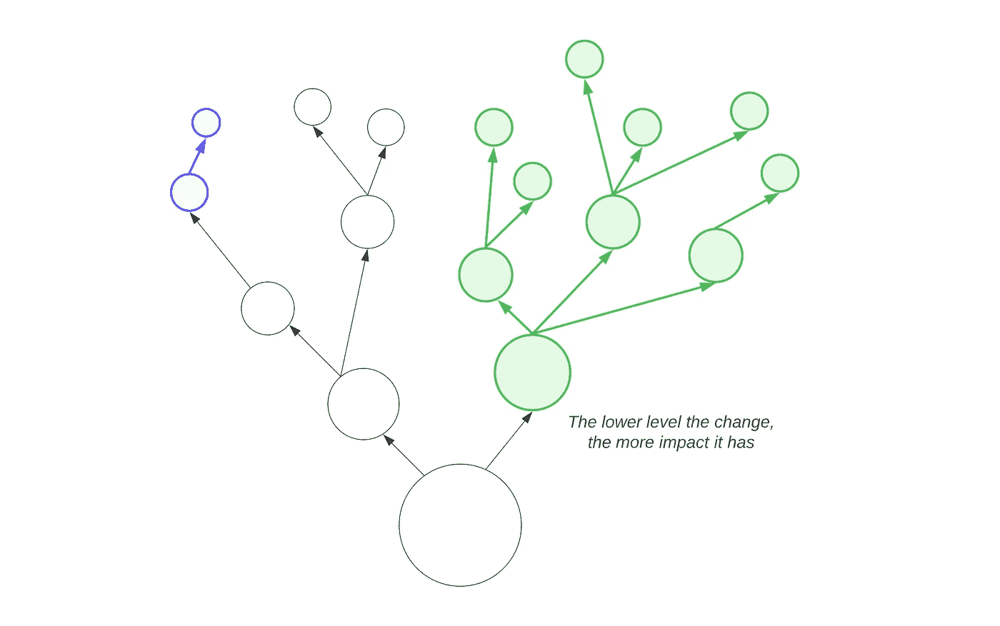
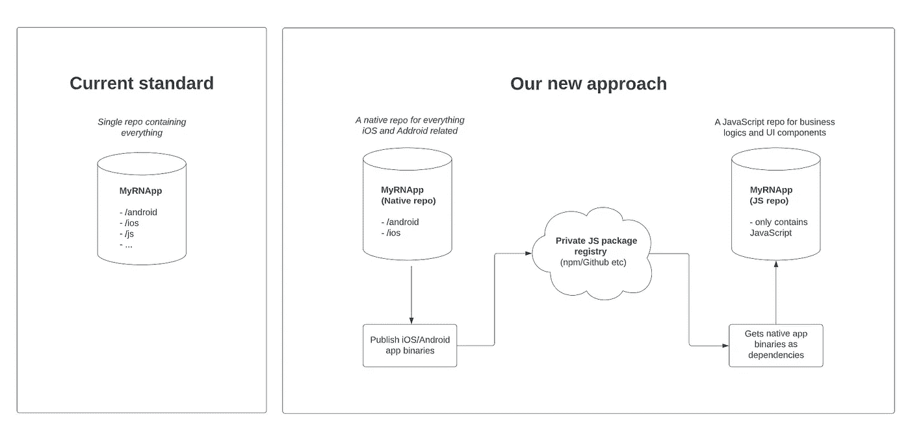
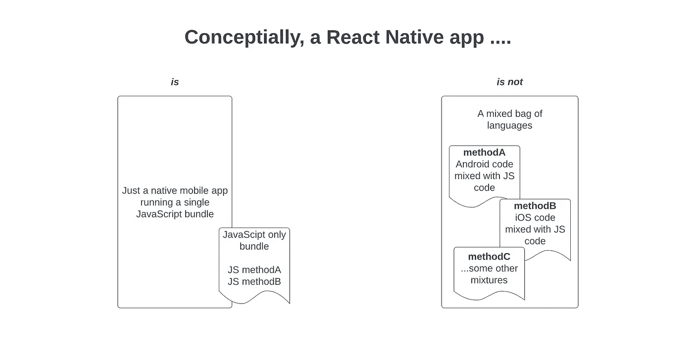
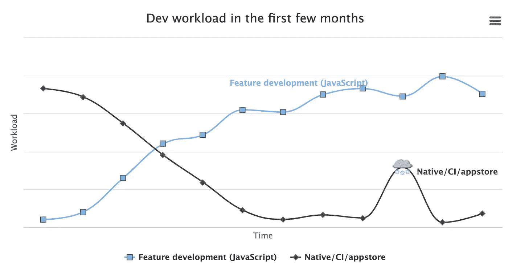
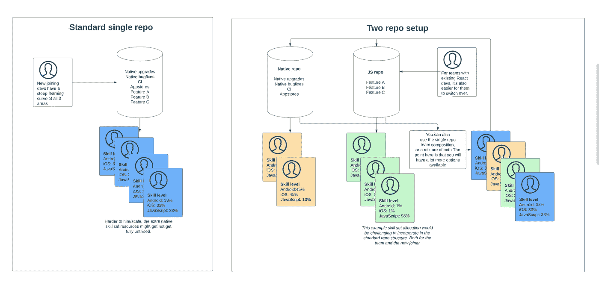
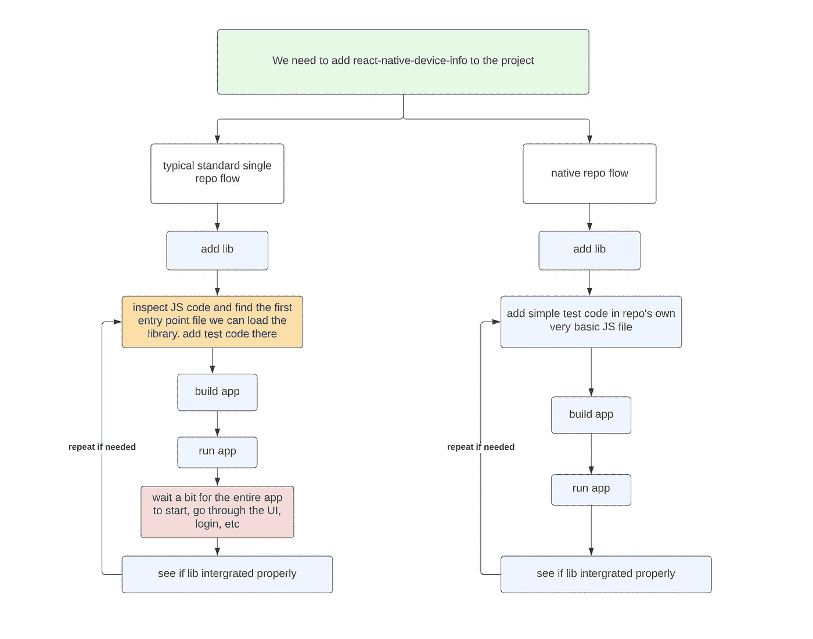
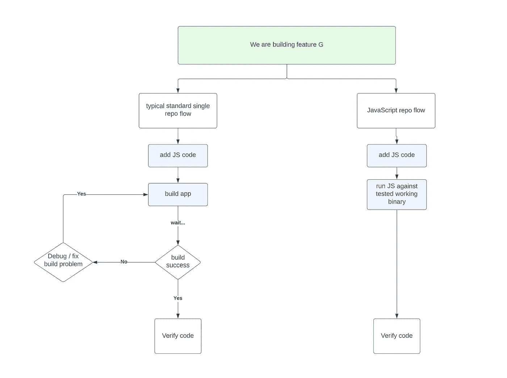
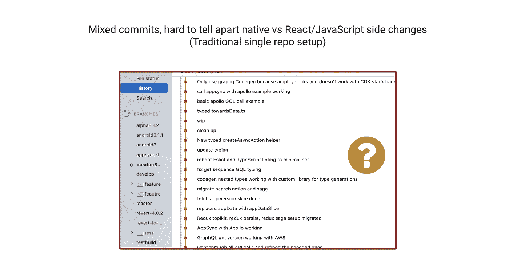
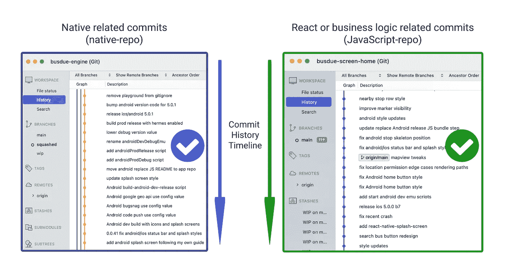

# 一种反应本地开发和团队组成的新方法

> 原文：<https://itnext.io/a-new-approach-to-react-native-development-and-team-composition-d6e3e3eb5184?source=collection_archive---------3----------------------->

在本文中，我们将了解如何通过采用一种新的*双回购*方法来进行 React Native 开发，我们能够提高团队效率，并且还打开了许多其他选项的大门，这些选项之前由于 React Native 独特的三域性质而无法实现。

新方法本身实现起来相对简单，因为大部分工作是将原生`/android`和`/ios`文件夹移动到项目的文件夹层次结构中更深的三层，这一微小变化的结果是**能够在 React Native 中将 React(JS)和原生(Android、iOS、builds)域分开，方法是将传统的单个交叉关注 RN repo 分成两个，一个 repo 用于原生部分，另一个用于 JavaScript 部分。**正如我们将在本文中看到的，这一变化为各种规模的 react-native 项目带来了许多有益的好处。

# **这种新的应用程序开发方法的起源**

不久前，Wix Engineering [分享了他们的 React 原生应用架构的一瞥](https://medium.com/wix-engineering/react-native-at-wix-the-architecture-ii-deep-dive-9cfcb3c2822c)，以提高他们由 50 多名 React 原生开发人员组成的大型团队的开发效率。虽然他们的原始文章从一个非常大的项目的角度(1%的 RN 项目)来看开发问题，但是在深入挖掘内部之后，我很快意识到，有些部分甚至可以被利用来有益于较小的开发团队(也就是我们——也就是 99%)。

为了验证我的假设，我决定在 Wix 的另一端测试这个新想法，通过在一个只有一个开发人员的 React 本地项目中完全实现它，最终结果令人惊讶地积极。

# **本文是两篇**文章的第一部分

我们的变化是低水平的，因为我们是分裂成 2 个回购代码库！

因为*两次回购*方法的核心变更非常接近我们软件设计决策的基础水平，所以它影响了随后的许多叶子决策。为了解释这种新方法而不至于让每个人都感到信息过载，我决定把它分成两部分。在第一部分中，我们将主要从高层次的角度来看影响，这样我们就可以检查应用这一点来反应本地开发的各种[二阶和三阶结果](https://www.weskao.com/blog/second-and-third-order-consequences)。你可以认为第一部分是“什么和为什么”，而在未来的第二部分，我们将讨论“如何做 X，Y，Z ”,我们将深入研究所有技术细节，从功能开发到使用*二次回复*设置在应用商店上线。

对于那些想在第二部分之前体验一下的人来说，在本文的最后，您会找到一个小的演示回购供您试用。

# 新方法的 30000 英尺视角

一个交叉关注回购与两个专业回购

目前，最广泛采用的 React 本地项目结构与您第一次初始化 RN 应用程序时获得的默认项目设置有些不同。它基本上是一个包含 React Native 所有三个领域的单一回购:Android、iOS 和 JavaScript。我们的新方法通过拆分 ***React*** 和 ***原生*** 部分，对当前的规范提出了挑战，我们将看看这个单一的决定如何影响 React 原生软件开发的许多其他方面。

如果项目回购也以类似的方式构建，会有助于我们的心理模型吗？

首先，我们通过将原生文件夹移动三层来实现原生/JavaScript 代码库的分离。在 *JavaScript-repo* 中，我们没有在开发过程中构建原生二进制文件，而是引入预构建的二进制文件作为依赖项。对于开发人员来说，这个过程就像向 JavaScript 项目添加任何其他库一样。即`npm i lodash`

# **验证关于新方法的假设**

为了实现确定这种*两次回购*方法在真实 React 本地开发中的可行性和实用性的主要目标，我建立了以下测试计划来验证这个想法，并使用我的一个真实 React 本地应用 [BusDue](https://apps.apple.com/gb/app/busdue/id1185327843) 作为测试场地。

> 假设:
> 对于绿地应用程序开发来说是可行且实用的

**验证计划**
为了模拟绿地应用程序的开发，我决定完全重写 BusDue，并在此过程中做一些大的改动，所以很多东西都是从头开始重新编写的。后端也在同一时间经历了类似的重写，因此我们更接近于早期绿地项目的快速变化的环境。

例如，整个 API 从 node/express 迁移到 GraphQL+AWS Lambda。前端代码从 JS 变成了完整的 TypeScript。状态管理也经历了重新设计，将更多的状态委托给 hooks 或 GraphQL 客户端。一些应用程序功能的更改是当场进行的(我是产品/设计师/开发人员:P ),有时很快就恢复了，因为最终结果不是我想要的，这允许我在早期阶段测试东西，在那里一切都需要非常灵活，并对不断的需求变化做出快速反应。

> 假设:
> 这对于棕色地带的应用程序开发是可行且实用的

**验证计划**
虽然 BusDue 应用的业务逻辑在很大程度上是重写的，但出于向后兼容的原因，仍然有一些部分和技术需要保持不变，为此，我需要一个移植并保持他们现有的行为，这样我就不会在他们升级到新版本时破坏应用的当前用户。例如，读取和写入存储在用户设备上的数据必须是向后兼容的。

> 假设:
> 这对于中小型团队来说是可行且实用的

**验证计划**
我是 BusDue 上唯一的开发人员，由于 Wix 已经证明了这可以与 50 多名开发人员一起工作，如果我可以证明这可以与一名开发人员一起工作，我们就有很大的机会让中间的一切也可以工作。

**结论**

在经历了使用新的*两次回购*设置重写和发布 BusDue v5 的整个过程后，我的结论是，这种新的开发方法为绿地和棕地项目提供了许多好处。最重要的是，这些好处不是一堆相互排斥的决策与令人兴奋的实践相冲突，而是可以逐渐地、可选地被采用，或者根据您的项目需求进一步定制。

# 双回购开发方法的优势

> 更多开发团队组成选项。*新的两次回购方法使得将 JavaScript/React Web 开发人员整合到您的项目中更加容易。*

*在后期阶段，很少或没有本地任务的时期并不少见*

尽管 React Native 这个名字看起来要求开发人员具备所有三个领域的技能 Android、iOS、JS 以及一系列相关知识，如应用商店管理和移动 CI/CD，但当我们实际查看更长时间内的整体工作负载时，我们可以看到它们并不完全是线性的。例如，原生工作负载在项目开始时占主导地位，然后随着时间的推移慢慢稳定下来，偶尔会出现需要立即关注的大峰值，例如修复阻塞的原生 bug 或由您的依赖项之一强制进行的大规模 RN 升级。

对于大多数较小的项目来说，拥有 2 到 3 名具有良好本地技能的注册护士开发人员对于大多数本地工作来说应该是足够的，因为本地方面的工作量与功能/业务开发方面的工作量相比并不相称(见上图)，经历很少或没有本地变化的时期并不罕见。在开始时，您当然可以只与一个专注于本地的开发人员合作，但是从长远来看，如果您不复制团队的这一部分，您将增加开发总线因素问题的风险。

支持只有少数开发人员的大型功能开发团队

有了本地方面的内容，开发团队的其他成员可以是 RN 或 React/JavaScript 开发人员的混合体，主要的特性开发几乎完全发生在 JS 方面。

> 我们现在更好地定位于**最大化**React Native 作为一项技术的独特优势——利用现有的大量 JavaScript/React 人才。

对于能够接触到现有 React web 开发人员并希望让他们加入移动应用项目的团队来说，这种设置还提供了一种比单一回购设置中必须采取的学习曲线更精细的方法，这导致了一条 ***更快的生产力之路*** ，而不管新开发人员决定首先关注哪个领域。

# 需要更少的思维导图就等于更好的诊断

> 能够只考虑一个领域(本地或 JavaScript)是一个很大的 DX 改进

在 DX 中使用*双回购*设置有很大的好处。这是因为当在本机端工作时，您不必担心理解或意外破坏任何复杂的业务逻辑，因为本机回购不包含来自 JavaScript-repo 的任何代码。对于处理 JavaScript-repo 任务的开发人员来说也是如此，因为**在开发期间用于运行应用程序的本机二进制文件是作为节点模块依赖关系**导入的。您将始终得到保证，您使用的是与您的同事相同的经过良好测试的本机代码库，并且不需要修复在您必须用您的机器设置来构建二进制文件时出现的任何构建问题。

# 本机开发和调试改进

如前一节所述，当开发任何与本机相关的东西时，开发人员只需要在本机环境中思考，而不必担心项目的 JavaScript 代码，由于这种明确的分离，**我们还可以自由编写测试本机代码是否工作所需的任何类型的 JavaScript 代码**。如果需要，我们甚至可以提交这些测试代码，它们只会在我们从本机回购运行应用程序时出现。例如，下面是一个典型的“添加本地库依赖项”任务的比较。

更快的交互周期，无需处理 JS 代码库错误

正如我们所看到的，从事这项原生任务的开发人员能够更快地迭代，因为他们能够**启动一个小得多的 RN 应用**。通过在我们的 JavaScript 代码库中不包含各种复杂性，我们还通过**消除了通读 UI 代码以找出放置临时测试代码的适当位置的需要，从而节省了时间。随着时间的推移，这些小小的节省真的会越积越多。**

# JavaScript 开发和调试改进

立即将 JS 加载到经过良好测试的二进制文件中，无需处理机器上的任何构建问题

这里节省的时间和精力与上面的原生示例相似，但正好相反，**我们消除了应用程序全新启动之间的原生二进制构建时间**，并确保您正在工作的原生二进制与其他人的相同。

对于更大的项目，作为一个纯 JavaScript repo 意味着我们现在可以更好地利用其他许多已知的和经过测试的 JS 代码分割技术，如 monorepo，或微前端开发。在旧的标准单一回购设置中，由于 React 本地项目中的额外本地元素，许多开发技术很难有效实现。

## 以后跳到“另一边”就容易多了

因为我们有 JavaScript 和本地代码库的明确分离，所以每个 repo 上的提交历史也将更紧密地与它们随时间的实际演变保持一致。这使得我们新的 React/JavaScript 开发人员一旦安顿下来，就可以更容易地首次涉足原生领域，反之亦然，更多面向原生的开发人员希望更深入地探索 JavaScript 世界。这也将有利于所有开发人员，因为它可以大大减少调试过程中的搜索区域。

# 风险呢？

在考虑是否采纳这样的重大决定时，我们不仅需要评估其益处是否适用于我们自己的个人情况，还需要很好地理解我们可能遇到的各种潜在风险。

## react-native 停止支持自定义入口 index.js 路径怎么办？而其他 RN 库中的自定义路径支持呢？

我认为 RN 取消对自定义文件路径的支持的可能性很小，因为这个概念本身并不新鲜，它是一个非常重要的功能，支持 monorepo 这样的设置。和 AFAIK 目前有许多 React 项目，它们都在某种 monorepo 结构中，每个项目可能都有自己的文件夹层次结构设计。

至于其他 RN 库，我的 BusDue 应用程序使用了许多流行的原生库，如 react-native-maps、react-native-navigation、react-native-bugsnag 等。尽管它们所在的节点模块在三层以上，但我还没有遇到任何问题。

因此，根据目前的经验，我认为我们可以有把握地假设，在可预见的未来，支持将会继续。

## **这种方法会让 react-native 升级变得更加困难吗？**

这是新设置的一个胜利。

虽然我不能说未来，但在写这篇文章的时候，我已经在这个双回购设置下经历了两次 react-native 升级。升级过程与您的标准设置没有什么不同，事实上，我会说**在两个 repo 设置中升级 react-native 更容易**，因为我们有更快的本机调试周期，因为我们不需要每次都加载巨大的 JS 代码库。

## 如果我不喜欢这种变化，我可以恢复吗？

是的。正如您在[中看到的，这个示例提交了](https://github.com/ywongweb/barebonePub/commit/7e90dfcd39781baa717068651ed8ff8548c66444)整个变更基本上由两个主要部分组成，*“将原生文件夹下移 3 层”*和*“添加一些 QoL 脚本和工具来帮助开发”*。对于后者，它没有听起来那么神秘，所有的脚本和工具都只是助手函数，最终产生一行标准 xcode 或 gradle 命令行脚本，我们可以在标准终端中运行。

例如，我们的`yarn build-ios`脚本简单地构造了一个`xcodebuild <args...>`命令来构建和 ios 存档，而`yarn ios`脚本构造了一个`xcrun simctrl`命令来在模拟器中启动应用程序。所有这些都是在正常的构建或运行过程中在控制台上打印出来的完全相同的命令。因此，如果你想恢复它，你需要做的就是将文件夹移回原来的位置，并从不同的路径设置中删除`../../..`,然后你将得到一个标准的 React-Native 项目。

## app store 部署流程呢？

部署过程主要是技术步骤，所以我的计划是将该部分推迟到第二部分。但是为了让你有个概念，下面是 iOS 发布应用商店二进制文件的一般步骤。

本地回购

*   从原生 repo 创建应用商店二进制文件
*   将二进制文件发布到 github 包

JavaScript-回购

*   通过`npm`或`yarn`将二进制文件拉入 JavaScript-repo
*   在 JavaScript-repo 中，提交所有您希望包含在发布中的代码，然后使用`react-native bundle`命令创建一个新的 JS 包。
*   提取 app store 原生二进制文件，并用新捆绑的文件替换其中的 JS 包
*   用`fastlane`重新签名应用商店二进制文件
*   上传至 Apple 进行审查和发布

(Android 的过程与使用 Android 等效命令的过程非常相似)

# 一个面向技术人员的小型演示项目

[原生回购示例](https://github.com/ywongweb/barebonePub)构建并发布您自己的原生二进制文件
[伴随 JavaScript-repo](https://github.com/ywongweb/bareboneFE) 使用来自原生回购的二进制文件

请注意，上面的演示项目是一个精简的 ios 专用版本。这不是我在 BusDue 应用程序中使用的最终设置，例如在我的 BusDue 应用程序中，每次我构建原生代码库时，我都能够输出任意数量的这些二进制文件以用于不同的目的。

*   开发环境模拟器/设备的 iOS 调试
*   生产环境模拟器/设备的 iOS 调试
*   面向开发环境设备的 iOS 专用
*   iOS 专用于生产环境的设备
*   iOS 应用商店
*   Android 开发环境调试
*   针对生产环境的 Android 调试
*   Android 版本

# 定论

在这种架构下花时间开发和发布整个应用程序重写，然后比较我过去使用的旧流程，我真的很喜欢这种想法的简单性以及它带来的各种开发人员授权的好处，我肯定会在我当前和未来的项目中继续探索和完善这种设置。

在列出的所有好处中，我最喜欢的是**我不再需要在调试过程中考虑一半的堆栈**，由于 90%的开发时间都花在各种形式的调试上，这确实为我腾出了大量时间和精力来做其他重要的事情。我真诚地相信，这种*两次回购*的开发流程是从今天开始的任何 React 本地项目的**非常强大的替代方案**,或者是由于我们讨论的各种棘手问题而遭遇瓶颈的棕色地带项目。

我希望这篇文章对你有用，并考虑在你的下一个项目中尝试一下*两次回购*设置。别忘了敲那个👏按钮几次，让这篇文章可以达到更多志同道合的人喜欢你！感谢阅读和快乐编码！