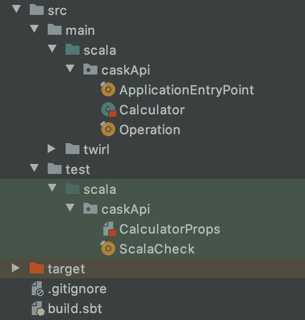

# 一个新手玩 ScalaCheck 的方法

> 原文：<https://itnext.io/a-newbie-way-to-play-with-scalacheck-333cbabfc00a?source=collection_archive---------6----------------------->

## 第 1 部分:发电机


图片由[https://www.flickr.com/photos/gerlos/](https://www.flickr.com/photos/gerlos/)

## 测试的重要性

一个好的程序员总是假设他的应用程序会失败。他尽最大努力编写一个可靠的代码，但错误是不可避免的。这就是为什么测试是应用程序开发的关键部分。"在正确测试应用程序之前，它是不存在的."——这是我从我的 Scala 导师([温德森·费雷拉](https://medium.com/u/a43d48be8213?source=post_page-----333cbabfc00a--------------------------------))那里听到的。

大多数程序员编写测试只有一个目的，那就是验证应用程序做了它应该做的事情。尽管这是一个很好的起点，但这种方法并不能涵盖所有可能的场景。适当的测试会揭示出你代码中的弱点。这将确保代码的新变化不会引入新的错误。测试还决定了应用程序在压力下的极限。

## 为什么是斯卡拉切克？

在 Scala 语言中执行测试有三个主要角色:ScalaTest、specs2 和 ScalaCheck。如果你是一名 Java 程序员，你会想要探索 ScalaCheck 测试方法，因为它们与 Scala.js 扩展的帮助是兼容的。ScalaCheck 可以与 ScalaTest 和 specs2 集成。如果你对函数式编程感兴趣，那么 ScalaCheck 绝对是值得一看的。

ScalaCheck 的优势在于并行执行自动化测试。它是专门设计来通过运行多个测试来检查您的代码的，这些测试使用自动为您的函数生成的数据。ScalaCheck 解决了上述正确测试所需的所有场景。与 JUnit 或 ScalaTest 测试方式相比，ScalaCheck 是一种不同的思维方式，需要时间来开发。ScalaCheck 测试代码的属性，并不关注测试中使用的值。

## 斯卡拉切克简介

ScalaCheck 不是一个容易进入并开始使用的资源。但是我认为这是可能的，即使对新手来说，只要你得到一本书或一位导师的良好指导。该资源的文档主要面向有经验的 Scala 用户。我将把它简化成初学者的语言，这样更多的人会对使用这个强大的测试工具感兴趣。

ScalaCheck 的两个基本结构是**属性**，用于测试函数的行为，以及**生成器**，用于为代码中的参数生成数据。最简单的方法是理解 ScalaCheck 如何生成大量的值，既包括内置数据类型，如 *Int* 和 *String* (在 Scala 中是对象，不是原始数据类型)，也包括定制的用法。

## 实际例子

例如，如何测试一个简单的*计算器*类的*计算器*方法？

```
#code for a *Calculator* classpackage caskApi

import caskApi.Operation.{Operation, *ADDITION*, *SUBTRACTION*, *DIVISION*, *MULTIPLICATION*}

case class Calculator(a: Int, b: BigDecimal) {

  def calculator(action: Operation): String = {
    val calculation = action match {
      case *ADDITION* => a + b
      case *SUBTRACTION* => a - b
      case *DIVISION* => a * b
      case *MULTIPLICATION* => a / b
    }

     "The answer is %s ".format(calculation)
  }
}
```



我的项目内部结构

首先，将 ScalaCheck 添加到您的 *sbt* 构建中以获得依赖关系。

```
*name* := "MyScalaProject"

*version* := "1.0"

*scalaVersion* := "2.13.1"

*libraryDependencies* += "org.scalacheck" %% "scalacheck" % "1.14.3" % *Test*
```

类*计算器*的参数是数字数据类型，这个类*计算器*的一个方法有一个自定义*操作*变量。默认情况下，ScalaCheck 中的生成器可以生成各种 *Int* 和 *String* 值。您想要创建自己的随机数范围而不依赖于 ScalaCheck 生成的值的原因是，首先，ScalaCheck 不会为您定制的对象类型生成值(在我的示例中，是*操作*变量的值)。其次，有时你想要对你的测试有更多的控制。

```
#code for default Generatorspackage caskApi

import caskApi.Operation.Operation
import org.scalacheck.Gen

object ScalaCheck extends App { val *aGen*: Gen[Int] = Gen.*choose*(-100, 1000)

  val *bGen*: Gen[BigDecimal] = for {
    value <- Gen.*chooseNum*(-100000000, 10000000)
    valueDecimal = *BigDecimal*.*valueOf*(value)
  } yield valueDecimal
...
```

我在类*计算器*中的第一个参数是一个整数*一个*。因此，如果我想在一个特定的时间间隔内生成一个数，我使用一个基本的生成器 *Gen.choose* 方法，并指定范围内的最小值和最大值。这是一个在给定的包含范围内生成随机值的生成器。

我在 Calculator 类中的第二个参数是 BigDecimal 类型的。如果你试图对这个数字类型使用相同的方法，那么 Scala 将不会这样做。你需要更有创意，把一个生成的数字变成这种类型。为此，我首先使用 *Gen.chooseNum* 方法，该方法在给定的包含范围内生成数字，额外的权重为 0、+/-1、两端以及提供的任何特殊数字。之后，你需要将生成的值转换成 BigDecimal。为了结合这两个动作，我使用了 Scala *作为*的理解构造，这是一个非常通用的构造。

接下来，我将展示一个为我在代码中单独定义的结构生成定制生成器的示例。我定义了一个自定义类型*操作，*有四个可能的值(加、减、除、乘)。

```
#code for a custom object *Operation*package caskApi

object Operation extends Enumeration {
 type Operation = Value
  val *ADDITION*, *SUBTRACTION*, *DIVISION*, *MULTIPLICATION* = Value
}
```

这个自定义对象*操作*是在项目级别定义的，而所有生成器都是在测试级别的 *ScalaCheck* 对象中定义的(参见上面我的项目内部结构)。

```
#code for a custom Generator (in *ScalaCheck* test object)val *operatorGen*: Gen[Operation] = Gen.*frequency*(
  2 -> Operation.*MULTIPLICATION*, 1 -> Operation.*SUBTRACTION*,
  4 -> Operation.*DIVISION*, 5 -> Operation.*ADDITION* )
```

我们在 *operatorGen* 中定义了一个运算分布，这意味着，例如，乘法运算的次数将是减法运算的 2 倍，加法运算的次数将是减法运算的 5 倍。

最后，我将展示为您的类和方法创建定制生成器的方法。为此，您需要组合以前生成的该类或方法的变量。同样，我们使用 Scala 灵活的*作为*语法。

```
#code for generating an instance of *Calculator* class (in *ScalaCheck* test object)val *calculatorGen*: Gen[Calculator] = for {
  a <- *aGen* b <- *bGen* }  yield Calculator(a, b)#code for generating results for a method of a generated instance of class *Calculator* (in *ScalaCheck* test object)val *methodCalcGen*: Gen[String] = for {
  c <- *calculatorGen* operator <- *operatorGen* } yield c.calculator(operator)
```

## 查看生成数据的样本

为了测试 ScalaCheck 构造，您可以在您的智能中使用 *sbt* shell 插件。首先调用> *测试:控制台*和>导入 *org.scalacheck.Gen._* 库包。然后像往常一样，定义所有想要在 Scala 中检查的参数。在这一点上，我的目标是使用一个*示例*方法来展示一种查看生成值的方式。

```
#Scala script in *sbt* shellscala> import caskApi.{Calculator, Operation}
...scala> val calculatorGen = for {
       a <- aGen
       b <- bGen
       } 
       yield Calculator(a, b)
...scala> calculatorGen.sample
res1: Option[caskApi.Calculator] = Some(Calculator(0,-3000))
```

在我的示例中，为了生成具有两个值的*计算器*类的实例，我需要导入在项目级别定义的对象(例如*计算器*和*操作*)并定义所有变量(例如*阿根*和 *bGen* ，未显示，以及*计算器 Gen* )。最后，将*样本*方法应用到*计算生成*变量。在上面的例子中，ScalaCheck Generator 生成了一个类*计算器*的实例，值 a=0，b=-3000。

## ScalaCheck 发电机奖金

ScalaCheck 生成器类可以在您的代码中用于数据生成目的，而不仅仅是在 ScalaCheck 测试的框架中。注意，如果您在项目级别而不是在您的测试包中使用 ScalaCheck，那么您应该在您的 build.sbt 文件中删除% Test extension。如果你想生成数字或字符串，甚至是它们的组合，导入 *org.scalacheck.Gen* 库，你会看到神奇的事情在几秒钟内发生。如果你对如何生成 *Int* 和 *String* 的组合感兴趣，可以在评论区问我。

## 未完待续…

在“玩 ScalaCheck 的新手方法”系列的第 2 部分中，我将展示如何测试一个行为，或者用 ScalaCheck 语言来说，测试代码的一个属性。