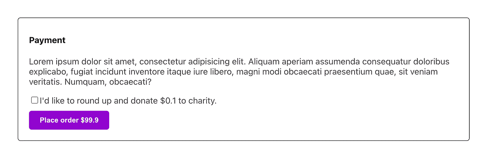
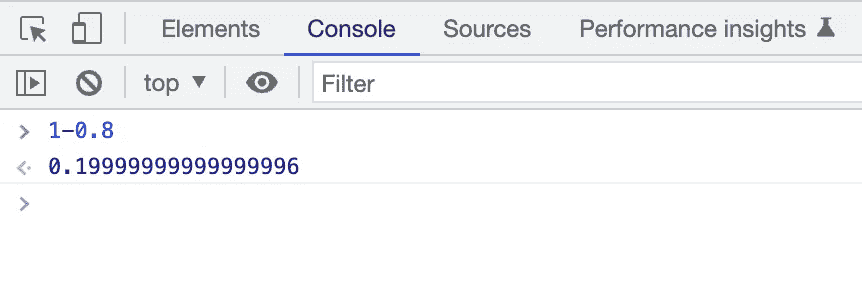

# 可维护的反应——一个关于综述的故事(上)

> 原文：<https://itnext.io/a-not-too-short-story-about-rounding-up-24cb4bdfcb69?source=collection_archive---------2----------------------->


马文·迈耶在 [Unsplash](https://unsplash.com?utm_source=medium&utm_medium=referral) 上的照片

*【更新 11。现在整个系列都完成了，我在 leanpub 上为它创作了一本书*[](https://leanpub.com/react-clean-code)**。可以用* [*这个链接七折获得一份*](https://leanpub.com/react-clean-code/c/mYXp686cMFw1) *。自从本文(和第二部分)首次发表以来，我已经做了许多修改，我真的相信新的方法要好得多。请读一读，我相信你会成为一个更高效、更优秀的开发人员。**

**更新(2022 年 9 月 25 日):我在这篇* [*中总结了 7 个小技巧，可在这里*](https://icodeit.ck.page/maintainable-react-tips) *免费下载* [*。*](https://icodeit.ck.page/maintainable-react-tips)*

*我想在本教程中分享一些关于干净代码和重构的有趣技巧。虽然有一些来回，但整个过程是一个很好的体验——特别是因为我已经用测试驱动的开发方法完成了。*

*我认为这很有趣，因为 1)这是实际项目中的一个特性(你也可以在你的应用程序中找到它)，2)实现这个特性的迭代方式很有趣，更不用说我还学到了许多其他东西(比如日本和丹麦货币)。*

*所以这个专题是关于四舍五入的。基本上，我们网站上的商品价格是类似于`$9.49`或`$4.95`的价格。让这个数字看起来比实际小是一个聪明的策略——有一些研究支持这个观点。无论如何，我们在这里讨论的功能是，我们希望为用户提供一个选项，让他们在下单前捐赠少量的钱。是的，你猜对了——金额是四舍五入后的价格减去原始价格。例如，如果订单是`$9.9`，那么我们问他们是否愿意捐赠`$0.1`，如果原价是`$4.95`，那么我们问`$0.05`，那么总数将是最接近的整数。*

*但是有一个例外，当原始价格已经是一个整数时，我们要求捐赠一美元而不是零美元。*

**

*具有取整选项的付款部分*

# *从主要逻辑开始*

*因此，如果我遵循测试驱动的开发，这里至少要涵盖两个测试:*

```
*describe('round up logic', () => {
  it('rounds up to nearest integer', () => {
    const total = getRoundedUpTotal(99.9)
    expect(total).toEqual(100)
  }) it('adds 1 for integer number', () => {
    const total = getRoundedUpTotal(100)
    expect(total).toEqual(101)
  })
})*
```

*通过谷歌搜索，我发现使用`Math.floor`很容易做到这一点:*

```
*const getRoundedUpTotal = (total: number) => Math.floor(total + 1)*
```

*代码正如预期的那样工作。*

*为了显示捐赠金额，我需要一个函数来计算差额。所以我需要一些相应的测试，比如:*

```
*it('returns the diff between origin price and rounded up price', () => {
    const diff = getRoundedUpAmount(99.9)
    expect(diff).toEqual(0.1)
  }) it('returns the diff between origin price and rounded up price - integer', () => {
    const diff = getRoundedUpAmount(100)
    expect(diff).toEqual(1)
  })*
```

*在浮点数部分，`getRoundedUpAmount`的实现有点棘手，但是一旦我引入了`toPrecision`，一切都很好。*

```
*const getRoundedUpAmount = (total: number) => {
  const roundedUpAmount = getRoundedUpTotal(total) - total
  return parseFloat(roundedUpAmount.toPrecision(10))
}*
```

*这里需要注意的是，当你比较两个浮点数时，你可能会惊讶地发现`0.2`并不真的等于`1 - 0.8`。如果你想知道更多关于浮点数的奇怪行为，这里有一个[好(长)](https://docs.oracle.com/cd/E19957-01/806-3568/ncg_goldberg.html)的阅读材料。*

**

*比较两个浮点数*

*是啊，我知道。*

# *让我们做用户界面*

*我们还需要确保用户界面按预期工作。让我们从一些测试开始。*

```
*it('shows rounded-up amount when user agreed to donate', () => {
  render(<Payment price={99.9} />) expect(screen.getByTestId('total')).toHaveTextContent(`Place order $99.9`) const checkbox = screen.getByTestId('checkbox')
  fireEvent.click(checkbox) expect(screen.getByTestId('total')).toHaveTextContent(`Place order $100`)
})it('shows message correspondingly', () => {
  render(<Payment price={99.9} />) expect(screen.getByText(`I'd like to round up and donate $0.1 to charity.`)).toBeInTheDocument() const checkbox = screen.getByTestId('checkbox')
  fireEvent.click(checkbox) expect(screen.getByText(`Thanks, your donation will make a difference.`)).toBeInTheDocument()
})*
```

*在该功能的用户界面部分，我可以使用这两个助手函数来使用户界面正常工作:*

```
*const Payment = ({price}: { price: number }) => {
  const [withDonation, setWithDonation] = useState<boolean>(false) const roundedUpAmount = getRoundedUpAmount(price) const total = withDonation ? getRoundedUpTotal(price) : price const onChange = () => setWithDonation(withDonation => !withDonation) return (
    <div className="payment-container">
      <h4>Payment</h4> <div>
        <label>
          <input type="checkbox" checked={withDonation} onChange={onChange}/>
          {
            withDonation ?
              `Thanks, your donation will make a difference.` :
              `I'd like to round up and donate $${roundedUpAmount} to charity.`
          }
        </label>
      </div> <button className="payment-button">
        Place order ${total}
      </button>
    </div>
  )
}*
```

*这里也没什么特别的。一个复选框允许用户选择加入捐赠，一旦他们选择了它，我们就将其四舍五入并更新按钮上的`total`金额。*

# *新要求—日本货币*

*你已经发布了这个功能，哇哦！当人们可以享受食物并更好地帮助世界时，他们会感觉很好，市场数量也看起来不错。*

*在业务扩展到日本市场之前，一切都很完美。日本人喜欢你的申请提供的食物。唯一的问题是，在他们的货币中，四舍五入没有多大意义。与美元相比，日元通常看起来非常大。例如，一个不起眼的比萨饼要花 3549 英镑。目前的舍入逻辑将增加 1 日元，因为它已经是一个整数，但向慈善机构捐款 1 日元几乎是零。*

*因此，我们的策略是，在这种情况下，我们需要针对日本市场的具体规则——我们需要四舍五入到最接近的百。让我们先写几个测试来验证新的变化。*

```
*describe('JPY', () => {
    it('rounds up to nearest hundred', () => {
      const total = getRoundedUpTotalForJP(3549)
      expect(total).toEqual(3600)
    }) it('add 100 for integers', () => {
      const total = getRoundedUpTotalForJP(3600)
      expect(total).toEqual(3700)
    })
  })*
```

*实现方法是除以 100，向下舍入，然后乘以 100:*

```
*const getRoundedUpTotalForJP = (total: number) => Math.floor(total / 100 + 1) * 100*
```

*相应地，为了计算差异，我们也需要通过这些测试:*

```
*describe('JPY', () => {
    it('returns the diff between origin price and rounded up price', () => {
      const diff = getRoundedUpAmountForJP(3549)
      expect(diff).toEqual(51)
    }) it('returns the diff between origin price and rounded up price - integer', () => {
      const diff = getRoundedUpAmountForJP(3600)
      expect(diff).toEqual(100)
    })
  })*
```

# *重构视图*

*为了对日本市场使用新的逻辑，我们可以在`Payment`中放一些 if-else。但是我认为，如果我们能够对它进行评估，看看我们是否能够稍微清理一下代码以使更改更容易，这将是一个更好的主意。*

*自定义挂钩将有助于拆分计算逻辑和视图。*

```
*const useRoundUp = (price: number) => {
  const [agreeWithDonation, setAgreeWithDonation] = useState<boolean>(false) const roundedUpAmount = getRoundedUpAmount(price) const total = agreeWithDonation ? getRoundedUpTotal(price) : price const updateDonationAgreement = () => setAgreeWithDonation(withDonation => !withDonation) return {
    agreeWithDonation,
    updateDonationAgreement,
    total,
    roundedUpAmount
  }
}*
```

*因此，本质上，我们将这些与视图无关的代码移到了一个钩子中，并重命名了变量，使它们更清晰，并与业务语言保持一致。然后我们从视图中的钩子请求所有必要的部分:*

```
*const Payment = ({price}: { price: number }) => {
  const {
    agreeWithDonation,
    updateDonationAgreement,
    total,
    roundedUpAmount
  } = useRoundUp(price) //...
}*
```

*酷，我喜欢这个主意！现在让我们假设我们可以从 URL(或其他地方，但这并不重要)获得国家代码，而`Payment`的调用者会将国家代码传递给我们。*

*例如:*

```
*<Payment price={99.9} countryCode="AU" />
<Payment price={3459} countryCode="JP" />*
```

*让我们把它传给`useRoundUp`胡克:*

```
*const useRoundUp = (price: number, countryCode: string) => {}*
```

# *如果-否则*

*在钩子内部想出一些 if-else 来在不同的算法之间切换并不太难:*

```
*const useRoundUp = (price: number, countryCode: string) => {
  const [agreeWithDonation, setAgreeWithDonation] = useState<boolean>(false)
  const updateDonationAgreement = () => setAgreeWithDonation(withDonation => !withDonation) const roundedUpAmount = 
    countryCode === 'JP' ? getRoundedUpAmountForJP(price): getRoundedUpAmount(price)
  const total = 
    agreeWithDonation ? 
      (countryCode === 'JP' ? getRoundedUpTotalForJP(price) : getRoundedUpTotal(price)) : price return {
    agreeWithDonation,
    updateDonationAgreement,
    total,
    roundedUpAmount
  }
}*
```

*现在我们的代码有三层:*

*   *像`getRoundedUpAmountForJP`和`getRoundedUpAmount`这样的函数的纯计算逻辑*
*   *挂钩`useRoundUp`*
*   *无逻辑视图`Payment`组件*

*每一层都有自己的职责，这很好，因为我们可以在一层进行更改，而不必太担心其他层。*

# *摘要*

*在教程的第一部分，我们已经实现了该特性的一些核心功能，并且通过测试驱动的开发方法，我们已经做了一些很好的重构和清理。在第 2 部分中，我们将继续实现 rest 部分，以及更多奇特的重构。*