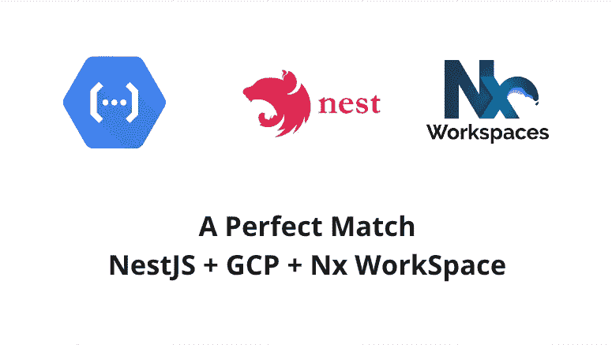
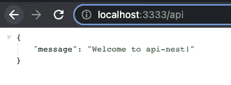
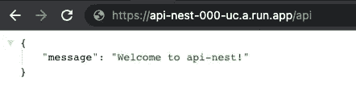

# 完美匹配:NestJs 和云功能(第二代)和 Nx WorkSpace

> 原文：<https://itnext.io/a-perfect-match-nestjs-cloud-functions-2nd-gen-nx-workspace-f13fb044e9a4?source=collection_archive---------0----------------------->



梦之队(NestJS + GCP + Nx WorkSpace)

> 注意:第二代包含在谷歌云服务条款的[预发布条款](https://cloud.google.com/terms/service-terms#1)中。请避免在产品中使用它，直到它完全发布。

[快速浏览:部署第二代 GCP 云函数与 Nx Workspace](/deploy-2nd-gen-gcp-cloud-functions-with-nx-workspace-5d75fcf21566)[云函数本地测试&开发](https://dalenguyen.medium.com/2nd-gen-cloud-functions-local-testing-development-7c518f7bd0b1)
[创建 REST APIs 与 Express &第二代 GCP 云函数](https://dalenguyen.medium.com/create-rest-apis-with-express-2nd-gen-gcp-cloud-functions-d244dd9a4717)
[**完美匹配:NestJs &云函数(第二代)&Nx Workspace**](https://dalenguyen.medium.com/a-perfect-match-nestjs-cloud-functions-2nd-gen-nx-workspace-f13fb044e9a4)[GCP 云函数(第二代)发布/订阅](https://dalenguyen.medium.com/gcp-cloud-functions-gen-2nd-pub-sub-development-testing-2c498fa4464e)

## 创建一个新的 NestJS 项目

```
npx nx g [@nrwl/nest](http://twitter.com/nrwl/nest):application api-nest
```

确保 NestJS 项目正确运行。

```
npx nx serve api-nest
```


## 添加对云功能的支持(第二代)

为了将 NestJS 应用集成到无服务器云函数中，我们需要创建一个包装器 Express 函数，并将其传递给`functions-framework`

```
// main.tsconst server = express()import { http } from '@google-cloud/functions-framework'export const createNestServer = async (expressInstance) => {
  const app = await NestFactory.create(AppModule, new ExpressAdapter(expressInstance))const globalPrefix = 'api'
  app.setGlobalPrefix(globalPrefix)
  app.enableCors()return app.init()
}createNestServer(server)
  .then((v) => {
    if (environment.production) {
      Logger.log('🚀 Starting production server...')
    } else {
      Logger.log(`🚀 Starting development server on [http://localhost:${process.env.PORT](http://localhost:${process.env.PORT) || 3333}`)
      v.listen(process.env.PORT || 3333)
    }
  })
  .catch((err) => Logger.error('Nest broken', err))**http('apiNEST', server)**
```

我发现本地开发非常方便，只需一个命令就可以在本地提供应用程序。

```
npx nx serve api-nest
```

还记得你开发 Firebase 云功能的时候，要有两个分别运行 watch & serve app 的终端吗？现在已经不是这样了。

```
dale:dalenguyen.github.io dalenguyen$ npx nx serve api-nest> nx run api-nest:servechunk (runtime: main) index.js (main) 4.15 KiB [entry] [rendered]
webpack compiled successfully (62dc22cb30f1fb81)
Debugger listening on ws://localhost:9229/4361ab8a-b560-4409-b445-922c55fe3d8b
Debugger listening on ws://localhost:9229/4361ab8a-b560-4409-b445-922c55fe3d8b
For help, see: [https://nodejs.org/en/docs/inspector](https://nodejs.org/en/docs/inspector)
[Nest] 13168   - 04/01/2022, 10:14:12 AM   [NestFactory] Starting Nest application...
[Nest] 13168   - 04/01/2022, 10:14:12 AM   [InstanceLoader] AppModule dependencies initialized +50ms
[Nest] 13168   - 04/01/2022, 10:14:12 AM   [RoutesResolver] AppController {/api}: +5ms
[Nest] 13168   - 04/01/2022, 10:14:12 AM   [RouterExplorer] Mapped {/api, GET} route +2ms
[Nest] 13168   - 04/01/2022, 10:14:12 AM   [NestApplication] Nest application successfully started +1ms
[Nest] 13168   - 04/01/2022, 10:14:12 AM   🚀 Starting development server on [http://localhost:3333](http://localhost:3333) +0ms
```



## 部署 NestJS 和云功能

为了支持部署，我们必须在 project.json 中做一些调整。

```
// project.json// change the compiled file & expose package.json"options": {
    "outputPath": "dist/apps/api-nest",
    "main": "apps/api-nest/src/main.ts",
    "tsConfig": "apps/api-nest/tsconfig.app.json",
    "assets": ["apps/api-nest/src/assets"],
 **"externalDependencies": "all",
    "outputFileName": "index.js",
    "generatePackageJson": true**
  },// add deployment script for cloud functions"deploy": {
    "executor": "[@nrwl/workspace](http://twitter.com/nrwl/workspace):run-commands",
    "options": {
      "commands": [
 **"gcloud beta functions deploy api-nest --region us-central1 --gen2 --runtime nodejs16 --trigger-http --entry-point apiNEST --source ./dist/apps/api-nest --allow-unauthenticated --project {args.gcpProject}"**
      ],
      "color": true,
      "parallel": false
    }
  }
```

完成调整之后，在部署之前，我们需要构建它。

```
// make sure that you have production, in order to update the environment file for productionyarn nx build api-nest **--configuration production**
```

然后，您可以运行到 GCP 的部署

```
dale:dalenguyen.github.io dalenguyen$ **npx nx deploy api-nest --gcpProject your-project**> nx run api-nest:deploy --gcpProject=your-projectPreparing function...

serviceAccountEmail: [000-compute@developer.gserviceaccount.com](mailto:150192836944-compute@developer.gserviceaccount.com)
timeoutSeconds: 60
uri: [https://api-nest-000-uc.a.run.app](https://api-nest-eyoojzj54q-uc.a.run.app)
state: ACTIVE
updateTime: '2022-04-01T13:56:42.849632548Z'——————————————————————————————————————————————————————————————————>  NX   Successfully ran target deploy for project api-nest
```

之后，你的 NestJS 云函数(第二代)就可以使用了[🎉](https://emojipedia.org/party-popper/)

