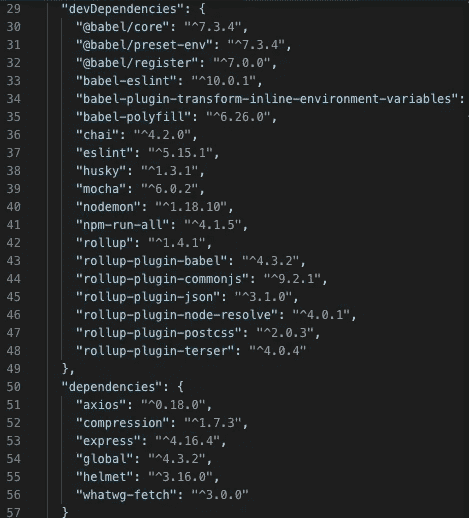

# OSS 多样性的一个陷阱

> 原文：<https://itnext.io/a-pitfall-of-oss-diversity-2c2747f4ba0?source=collection_archive---------4----------------------->


鸣谢:reddit/xaxaxa_trick

我们都拥护开源社区的多样性，这听起来很对，不是吗？每个人都可以贡献，我用你的，你用我的，世界从此不会再完美。(我不是顺便指共产主义；))

在漏洞出现之前，现在人们的痛苦也会被需要它的人分享和感受，当依赖链越来越长时，情况会变得更糟，你甚至无法判断升级其中一个是否安全。

它发生在我最近为我的一个项目做的一个`npm audit`中，它显示了[在](https://www.npmjs.com/advisories/788) `[v3.13](https://www.npmjs.com/advisories/788)`之前的 `[js-yaml](https://www.npmjs.com/advisories/788)` [包中的一个有中度 DoS 漏洞。](https://www.npmjs.com/advisories/788)



依赖地狱

有两个依赖项需要它，一个是`eslint`，另一个是`rollup-plugin-postcss`，我可以很容易地解决`eslint`，因为我发现新版本的`eslint`在`js-yaml`上有升级。但是我不能对`rollup-plugin-postcss`做同样的事情，因为`rollup-plugin-postcss`已经是最新的了。

所以我查了一下`rollup-plugin-postcss`的依赖树，看起来是这样的:

```
├─┬ rollup-plugin-postcss@2.0.3
│ ├─┬ postcss-load-config@2.0.0
│ │ ├─┬ cosmiconfig@4.0.0
│ │ │ ├─┬ js-yaml@3.9.0
```

`js-yaml`的补丁在 21 天前就出现了(到这个博客被编辑时)，我们看到直接依赖模块`cosmiconfig`已经在 12 天前使用了打了补丁的`js-yaml`，这太棒了！

然而不幸的是，`postcss-load-config`似乎是一个拦截器，该模块已经**而不是**更新了 9 个月。尽管维护者可能不会很快注意到最新的补丁——它的依赖关系`cosmiconfig`托管于 12 天前。补丁很有可能不会这么快就发布。不用说，打补丁的直接依赖是从`cosmiconfig@4.0.0`到`cosmiconfig@5.2.0`的重大更新，可能会发生突破性的变化，这由语义本身指示。

Node.js 社区以依赖项 hell 而闻名，它有几十个依赖项，几百个子依赖项加权兆字节。补丁，即模块的升级，从边缘慢慢传播到表面，一个模块接一个模块，取决于依赖链的层次，可能需要几个月或几年。只看 grunt/gradle 的图书馆有多老，你能想象有多少死的依赖吗？

我相信，升级的缓慢传播是 Monorepo (mono repository)试图解决的问题之一，因为每个依赖项都是同步的，这意味着不会出现依赖项碎片。但这只是一个理想的范例，Monorepo 很难维护，因为一个可能会破坏另一个，DevOps 构建可能需要采取另一种策略或重新设计，等等。

网飞采取的一种方法，代号为 Niagara ，是他们有一个内部注册表，将新版本与需要它的模块的每个版本配对，并更新那些通过测试的配对，同时向两个模块的维护者报告失败。这样，依赖链升级将无缝地发生。

另一种方法是让一个机器人不断检查你自己的更新所需的依赖项，然后根据它们自动测试，最后如果测试通过，立即升级依赖项。然而，如果测试不彻底，这可能会损坏模块。

当我想升级我的 surface 应用程序时，我感受到了为我自己的项目升级依赖链的同样痛苦，我需要升级我的依赖&依赖的依赖。我想这是每个现代开发人员在快节奏的开发世界中不可避免的痛苦。