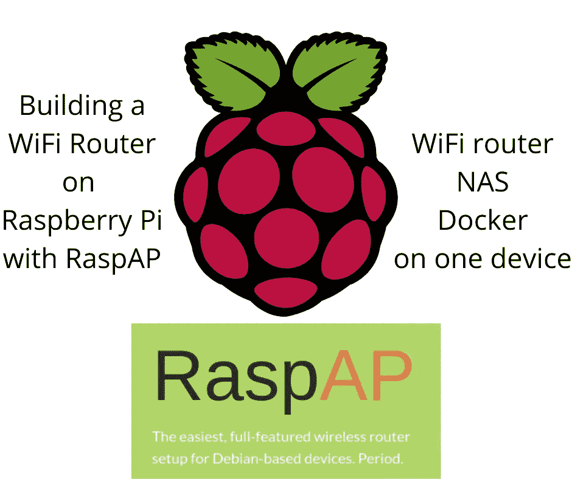
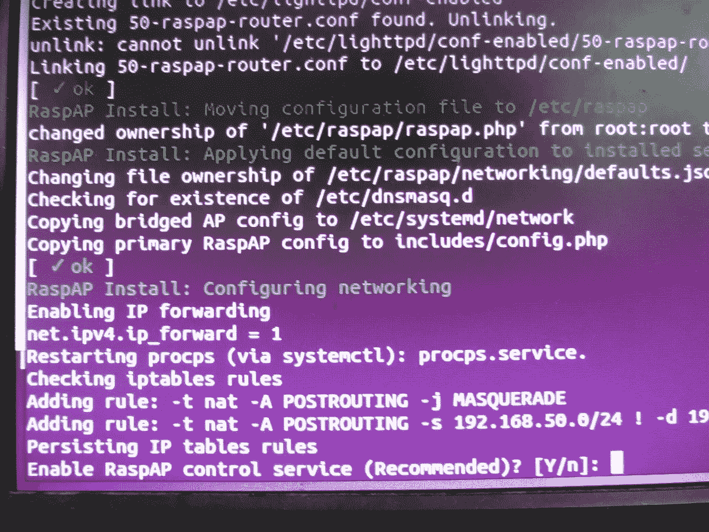
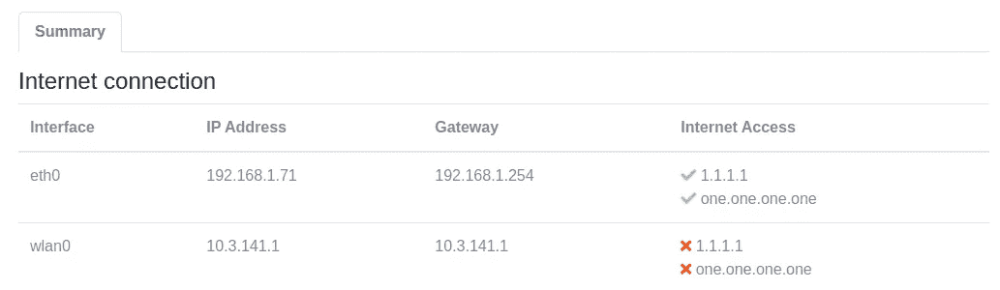
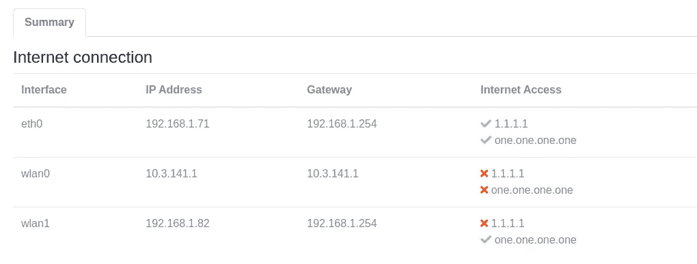
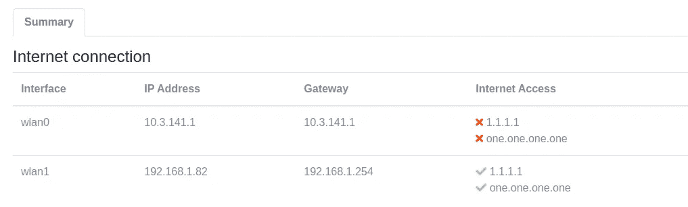
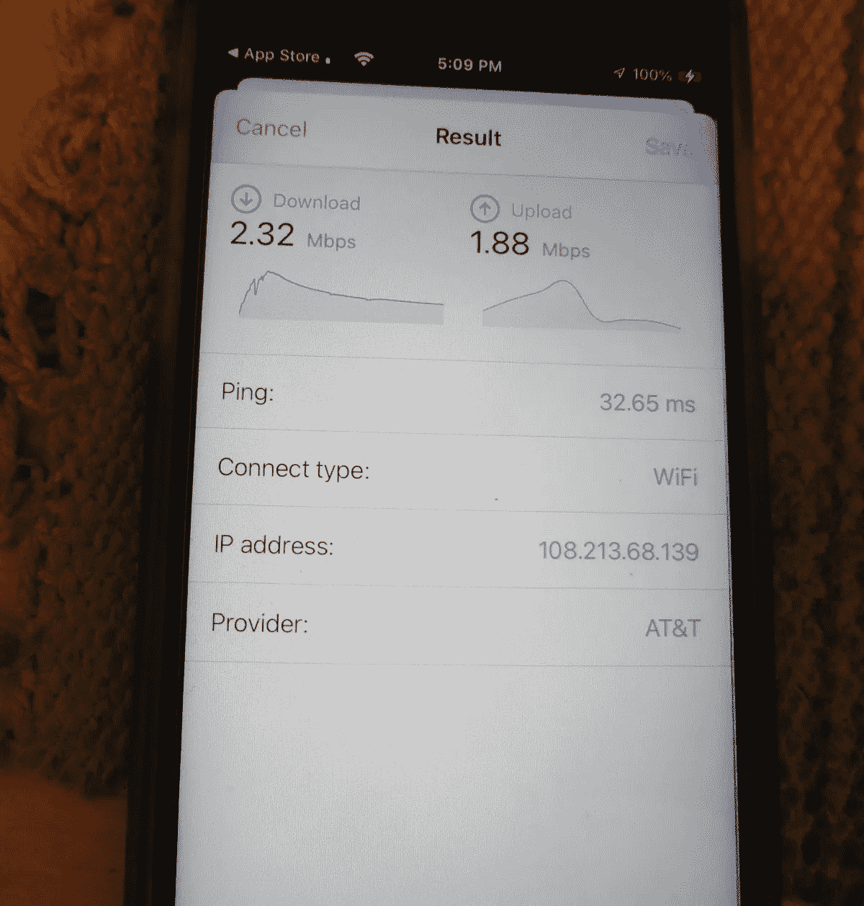
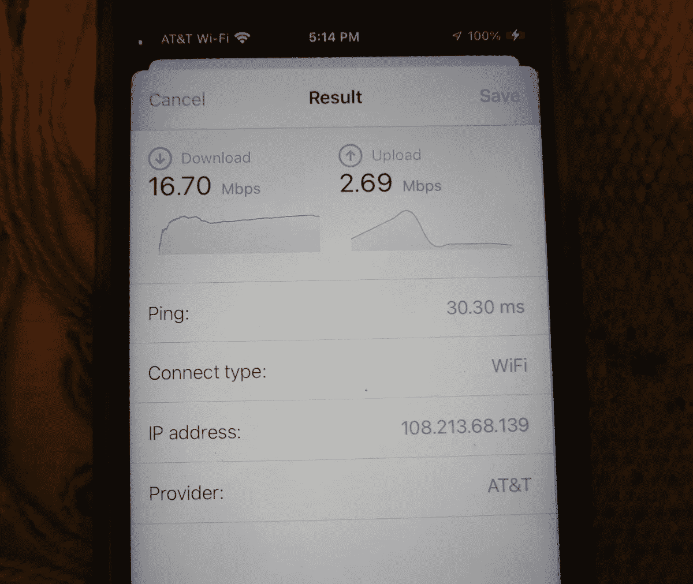
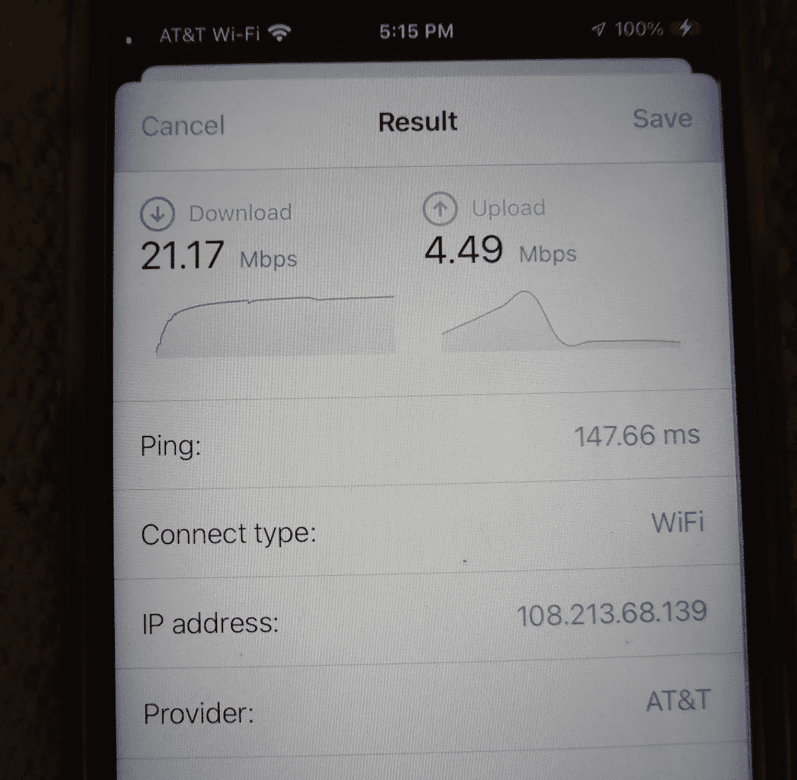

# 在 Raspberry Pi 4 上使用 RaspAP 的便携式 WiFI 路由器/NAS/Docker，带有 USB/SSD 引导设备

> 原文：<https://itnext.io/a-portable-wifi-router-nas-docker-using-raspap-on-raspberry-pi-4-with-usb-ssd-boot-device-a64cd4a68d6f?source=collection_archive---------2----------------------->

## 在使用固态硬盘的便携设备上安装 DIY 路由器/NAS/etc，以获得更高的速度和可靠性



RaspAP 允许我们在基于 Debian 的系统上构建 WiFi 路由器，比如 Raspberry Pi。它可以轻松构建一个复杂的 WiFi 路由器，同时运行其他服务。

如果您可以构建自己的 WiFi 路由器，提供比商用路由器更多的功能，会怎么样？商用路由器处理 WiFi 网络、本地以太网和广域网之间的路由互联网流量。通常，这是它们的功能范围，尽管有些有一个支持磁盘驱动器或打印机的 USB 端口。如果我们能造出一个功能更多的电脑会怎么样？

一个 Raspberry Pi，加上合适的软件，可以制作一个非常好的 WiFi 路由器，也可以运行其他软件。一种选择是安装 OpenWRT，这是一种专业级路由器软件，甚至被用作实际商业 WiFi 路由器的固件。它可以在树莓 Pi 上运行，我最近也尝试了一下。但是，我看不出有什么方法可以和 OpenWRT 一起运行其他服务。我对使用 Raspberry Pi 作为路由器很感兴趣，它还可以处理其他任务，如网络连接存储(NAS)。

另一方面，RaspAP 不会接管机器。您可以安装自己选择的操作系统，然后在该操作系统中安装 RaspAP，而不是安装为 RaspAP 预先定制的操作系统映像。嗯，“您选择的*操作系统*”仅限于 RaspAP 团队支持的操作系统。他们的网站目前列出了 *Raspberry Pi OS* 、 *Armbian* 、 *Debian* 、 *Ubuntu* ，它们都是 Debian Linux 的变种。RaspAP 似乎也可以作为 Docker 图像使用。

我得出的一个观点是，对于基于 Raspberry Pi 的路由器来说，最好从普通磁盘驱动器启动，而不是从 SD 卡启动。我知道树莓派是基于将操作系统烧录到 SD 卡上。但是，WiFi 路由器是那种你设置好，放在架子上，并期望它在没有干预的情况下运行几年的设备。对于这种应用的主驱动器来说，SD 卡简直是最差的选择。因此，主机(也称为 Raspberry Pi)最好运行常规磁盘驱动器。对于 Raspberry Pi，这意味着使用通过 USB 连接的常规磁盘驱动器(SSD 或 HDD)进行引导。

有关几篇相关文章，请参见:

*   [如何从 USB 驱动器启动 Raspberry Pi 4 或 400](https://techsparx.com/linux-sbc/raspberry-pi/pi4-boot-usb.html)—从 USB 驱动器启动 Raspberry Pi 的指南
*   [使用 USB 引导设备在 Raspberry Pi 4 上安装 OpenWRT](https://techsparx.com/linux-sbc/raspberry-pi/pi4-openwrt.html)—也许你更喜欢 OpenWRT？

安装 RaspAP 的高级过程是:

*   用 Raspberry Pi OS(或其他支持的 OS)刻录 SD 卡(或 u 盘)。您可能应该使用 Lite 版本——没有 GUI 支持——因为这种设备可能不会用于桌面用户体验
*   使用以太网线将您的 Raspberry Pi 连接到您的互联网路由器
*   从 SD 卡(或 USB 驱动器)启动 Raspberry Pi
*   设置:`sudo apt-get update && sudo apt-get full-upgrade -y`
*   重新启动
*   配置:`sudo raspi-config`
*   重启— `raspi-config`可能会要求重启
*   安装:`curl -sL https://install.raspap.com | bash`
*   访问 RaspAP web GUI 并开始配置

更多文档位于:[https://raspap.com/](https://raspap.com/)

接下来是我自己的旅程，并没有上面的概述那么简单。运行这种组合有几个技巧。

我的测试系统是一个 2GB 的 Raspberry Pi 4，安装在 FLIRC 机箱中，外部机箱中有一个 Kingston 2.5 英寸 480GB SSD 驱动器。我有一个 EDIMAX 品牌的 USB WiFi 模块，可以测试多种 WiFi 场景。该系统的图片在文章的底部。

我最终的目标是这个组合:

*   允许`eth0`连接到本地局域网，或者直接连接到笔记本电脑，但是`eth0`是可选的
*   使用`wlan0`(Raspberry Pi 上的内置 WiFi)将 WiFi 连接到主机网络，比如我家的 WiFi 系统
*   使用 WiFi 加密狗提供托管接入点
*   使用固态硬盘作为启动驱动器，并支持根据需要热连接其他驱动器
*   一个附加服务是使用 Samba 导出文件系统

# RaspAP 初始设置的混乱——在 Raspberry Pi 操作系统上调试 PAM 配置

在我的第一次尝试中，我在第`raspi-config`步做出了不幸的选择。这使得 RaspAP 的设置不正确，导致了对 PAM 子系统的一些探索。我在调试这个的时候学到了一些东西，可能会有用。

如果你想阅读工作建议，跳过这一节。本节旨在为遇到类似问题的人提供有用的建议。

第一个线索是 RaspAP 安装脚本没有完成就“冻结”了。也就是说，它收到了一条关于设置 NAT 服务的消息，输出停止了，过了一段时间，到 Raspberry Pi 的 SSH 连接中断了。SSH 回到路由器显示它运行良好，RaspAP web GUI 正在运行，我可以摆弄一些东西。

但是，当我试图创建一个 WiFi 热点时，我不断得到一个错误— *无法保存热点设置*。这个模糊的错误信息令人不满意。在热点区域，有一个*日志*标签，你可以打开它查看关于`hostapd`服务的细节。但是这对于最初的问题是没有用的。

相反，`/var/log/auth.log`中的这些信息更为重要。

```
Jul  5 18:28:48 router sudo: pam_unix(sudo:auth): conversation failed
Jul  5 18:28:48 router sudo: pam_unix(sudo:auth): auth could not identify password for [www-data]
Jul  5 18:28:48 router sudo: www-data : user NOT in sudoers ; PWD=/var/www/html ; USER=root ; COMMAND=/sbin/iw dev wlan0 set txpower auto
```

为了解释这一点，RaspAP 软件试图使用`sudo`来做一些事情。PAM 系统(`sudo:auth`)说它不能识别`www-data`的密码，并且这个用户名不在`sudoers`文件中。

第一阶段的解决方案是运行:

```
$ sudo usermod -aG sudo www-data
```

这将把`www-data`用户 ID 添加到`sudo`组，允许该用户 ID 使用`sudo`命令。

之后,`auth.log`消息演变为:

```
Jul 5 19:02:31 router sudo: pam_unix(sudo:auth): conversation failed Jul 5 19:02:31 router sudo: pam_unix(sudo:auth): auth could not identify password for
```

经过大量的搜索(和一个[堆栈溢出 post](https://stackoverflow.com/questions/58509304/pam-requires-password-for-exec-shell-exec-even-with-nopasswd-in-etc-sudoers) )我发现可以使用`visudo`向`sudoers`文件添加一个条目:

将这一行放在文件的底部，而不是中间的某个地方。这允许`www-data`使用`sudo`而无需在系统中注册密码。

此后,`auth.log`消息变为:

```
www-data ALL=(ALL) NOPASSWD: ALL
```

这表示活动成功。事实上，我现在可以更改设置了，但我仍然无法打开 WiFi 系统。

在*日志*选项卡(`hostapd`)中，显示了以下消息:

```
Jul  5 19:58:28 router sudo: www-data : PWD=/var/www/html ; USER=root ; COMMAND=/bin/chmod o+r /tmp/hostapd.log
Jul  5 19:58:28 router sudo: pam_unix(sudo:session): session opened for user root(uid=0) by (uid=33)
Jul  5 19:58:28 router sudo: pam_unix(sudo:session): session closed for user root
```

这表示活动成功。事实上，我现在可以更改设置了，但我仍然无法打开 WiFi 系统。

在*日志*选项卡(`hostapd`)中，显示了以下消息:

```
Configuration file: /etc/hostapd/hostapd.conf
Could not read interface uap0 flags: No such device
nl80211: Driver does not support authentication/association or connect commands
nl80211: deinit ifname=uap0 disabled_11b_rates=0
Could not read interface uap0 flags: No such device
nl80211 driver initialization failed.
uap0: interface state UNINITIALIZED->DISABLED
uap0: AP-DISABLED 
uap0: CTRL-EVENT-TERMINATING 
hostapd_free_hapd_data: Interface uap0 wasn't started
```

在那一点上，我被难住了。是的，`uap0`设备不存在等。我上床睡觉，考虑这个问题，早上决定从头开始。

# 安装 RaspAP 时不正确使用`raspi-config`

上一节讨论的问题原来是因为我在运行`raspi-config`时做了一个错误的选择。即使用`raspi-config`开启 WiFi 支持。这个选择似乎导致了 RaspAP 的安装脚本偏离了轨道，并导致 RaspAP 被错误地安装。

在`raspi-config`中进行这些设置更改:

*   设置你喜欢的主机名——我用的是`router`
*   要求控制台要求使用用户名和密码登录，而不是支持自动登录
*   启用 SSH 登录

当我进行额外的设置更改时，失败了。如果使用`raspi-config`使 WiFi 连接到我的家庭局域网，那么 RaspAP 安装在这里失败:



作者图片

这个屏幕截图显示了应该发生的事情。两个*添加规则*行被打印出来，它询问是否启用 RaspAP 等等。最后，脚本运行到最后并重启系统。

在故障模式下，我使用`raspi-config`启用了 WiFi，在第一行显示*添加规则:-t nat 之后...*，进程停止打印任何东西。过了一会儿，我点击 *RETURN* ，SSH 会话断开。我可以重新连接到 Raspberry Pi，它看起来很好，并且 RaspAP GUI 正在运行，但是出现了前面讨论过的故障。

我经历了这个过程足够多次，我确信在`raspi-config`步骤中启用 WiFi 时会出现错误。当我使用`raspi-config`跳过启用 WiFi 之后，安装脚本就正确地运行完成了。此外，RaspAP GUI 工作正常，这意味着在热点部分所做的更改可以正确注册。

# 使用 RaspAP web GUI 启用 WiFi

在上一节中，我已经说得很清楚了——不要使用`raspi-config`来启用 WiFi，因为这会导致不正确的安装。

在 RaspAP 中，我可以在热点区域进行设置更改，但无法启动热点——这意味着 WiFi 无法打开。RaspAP GUI 的左上角是一些指示灯，闪烁的红灯表示热点处于非活动状态。所有其他指标表明，它无法启动我配置的 WiFi 热点。在`hostapd`日志区，出现了以下消息:

```
Configuration file: /etc/hostapd/hostapd.conf 
rfkill: WLAN soft blocked wlan0: interface state UNINITIALIZED->COUNTRY_UPDATE 
Using interface wlan0 with hwaddr dc:a6:32:3d:f4:7c and ssid "HotSpot" 
Failed to set beacon parameters 
wlan0: Could not connect to kernel driver 
Interface initialization failed wlan0: interface state COUNTRY_UPDATE->DISABLED 
wlan0: AP-DISABLED  
wlan0: Unable to setup interface. 
wlan0: interface state DISABLED->DISABLED 
wlan0: AP-DISABLED  
wlan0: CTRL-EVENT-TERMINATING 
 hostapd_free_hapd_data: Interface wlan0 wasn't started 
nl80211: deinit ifname=wlan0 disabled_11b_rates=0
```

注意第二行讨论了`rfkill`。在 RaspAP 文档中，手动配置说明包含讨论`rfkill`阻止 WiFi 系统的章节。

给出的解决方案是:

1.  使用`raspi-config`来设置 WiFi 区域设置——但没有使用它来打开 WiFi——可以使用 RaspAP GUI 来设置 WiFi 区域设置
2.  之后需要重新启动(通过 raspi-config)
3.  重启后:`sudo rfkill unblock wlan`

在 RaspAP 中，指示器“热点激活”立即变为绿色，而之前它一直是红色闪烁的。

在运行了`rfkill unblock`之后，我能够对 RaspAP 进行一些修改，并以正常的方式反映出来。

# 配置 RaspAP 以通告 WiFi 网络

第一个实验是用你的树莓派做一个 WiFi 路由器。这意味着使用以太网线将 Raspberry Pi 连接到您的常规互联网路由器，然后使用 Raspberry Pi 的内置 WiFi 创建一个新的 WiFi 网络。从技术上来说，会配置成 WiFi 接入点。

默认情况下，RaspAP 配置`eth0`，即内置以太网端口的设备名称，以从网络上的 DHCP 服务器接收网络配置和 IP 地址。该 DHCP 服务器内置于您的互联网路由器中。您需要调查以找到它被分配的 IP 地址，例如通过查看路由器管理页面。另一种方法是，当你有一个显示器/键盘连接，登录到命令行，并运行`ifconfig -a`。

对于分配给`eth0`接口的 IP 地址，可以在`http://IP-ADDRESS`到达 RaspAP web GUI。或者，在运行`raspi-config`时，您给了 Raspberry Pi 一个主机名。您可以使用`[http://HOST-NAME.local](http://HOST-NAME.local.)` [进行连接。](http://HOST-NAME.local.)

下一步是转到 RaspAP web GUI 的热点部分。有三个感兴趣的选项卡。在选项卡中进行如下设置更改:

*   *基础设置*
*   *接口* —保留为`wlan0`
*   *SSID* —选择一个网络名称
*   *无线模式* —别管这个？
*   *频道* —如果需要，选择一个频道号
*   *安全*
*   *安全类型* — WPA2
*   *加密类型* — CCMP
*   *PSK* —选择密码
*   *高级设置*
*   将*发射功率*设置为`auto`
*   将*国家代码*设置为您所在的国家

点击*保存设置*按钮，将设置写入配置文件。然后点击*重启热点*实施设置更改。

在 *DHCP 服务器*部分，选择`wlan0`接口，确保其配置如下:

*   选择*静态 IP* 地址
*   *静态 IP 选项*
*   *IP 地址* —选择一个地址，如`10.71.71.1`
*   *子网掩码* —定义相应的掩码，如`255.255.255.0`
*   *默认网关* —与 IP 地址相同
*   *DHCP 选项*
*   设置*启用该接口的 DHCP*
*   *起始 IP 地址* —选择网络内的 IP 地址，例如`10.71.71.20`
*   *结束 IP 地址* —选择网络内的 IP 地址，例如`10.71.71.120`
*   *DNS 服务器 1* 和 *DNS 服务器 2* —如有需要，选择 DNS 服务器，如`1.1.1.1`或`8.8.8.8`

再次点击*保存设置*启用这些更改。这确保了 WiFi 网络上 DHCP 地址分配的合理设置。创建 WiFi 网络可能是明智的选择。

在网络区域，您可能会看到如下状态:



作者图片

`eth0`设备是有线以太网，其 IP 地址与互联网路由器的 IP 地址相同。`wlan0`是内置 WiFi，它为您刚刚创建的 WiFi 网络分配了网络的 IP 地址。

如果你有其他设备，比如智能手机，你可以扫描 WiFi 网络。新创建的网络应该会出现，并且您应该能够使用您选择的密码加入网络。加入网络后，您的设备应该显示路由器分配的 IP 地址。

你应该可以使用这个热点来浏览互联网和做任何其他事情。

到目前为止，结果是两个网络接口:本地局域网和新的 WiFi 热点，Raspberry Pi 在两者之间路由流量。

# 使用第二个 WiFi 适配器作为 WiFi 客户端

RaspAP 能够将 WiFi 接口配置为现有 WiFi 网络的客户端。我们正在使用内置的 WiFi 接口来创建我们自己的 WiFi 网络。我们可以轻松添加一个 USB WiFi 加密狗来连接现有网络，这样路由器就可以在我们的新 WiFi 网络和现有网络之间路由。

例如，你可能在一家咖啡店。第二个 WiFi 接口可以连接咖啡店提供的 WiFi，你的笔记本电脑或平板电脑可以连接 RaspAP 创建的 WiFi 网络。

对于这个测试，我有一个 EDIMAX EW-7811UN WiFi 加密狗。盒子正面明确写着*非常适合树莓酱*。

我只是简单地将它插入树莓 Pi 上的一个 USB 端口。查看`/var/log/kern.log`和`/var/log/syslog`，立即显示消息，确认操作系统识别设备:

```
# /var/log/kern.log

Jul  7 20:46:09 router kernel: [86914.640754] usb 1-1.3: new high-speed USB device number 3 using xhci_hcd
Jul  7 20:46:10 router kernel: [86914.772283] usb 1-1.3: New USB device found, idVendor=7392, idProduct=7811, bcdDevice= 2.00
Jul  7 20:46:10 router kernel: [86914.772313] usb 1-1.3: New USB device strings: Mfr=1, Product=2, SerialNumber=3
Jul  7 20:46:10 router kernel: [86914.772335] usb 1-1.3: Product: 802.11n WLAN Adapter
Jul  7 20:46:10 router kernel: [86914.772353] usb 1-1.3: Manufacturer: Realtek
Jul  7 20:46:10 router kernel: [86914.772370] usb 1-1.3: SerialNumber: 00e04c000001
Jul  7 20:46:10 router kernel: [86914.905863] rtl8192cu: Chip version 0x10
Jul  7 20:46:10 router kernel: [86914.974023] rtl8192cu: Board Type 0
Jul  7 20:46:10 router kernel: [86914.974159] rtl_usb: rx_max_size 15360, rx_urb_num 8, in_ep 1
Jul  7 20:46:10 router kernel: [86914.974216] rtl8192cu: Loading firmware rtlwifi/rtl8192cufw_TMSC.bin

# /var/log/syslog

Jul  7 20:46:10 router dhcpcd[1488]: wlan1: adding address fe80::fd26:84c3:b23f:d43c
Jul  7 20:46:10 router avahi-daemon[361]: Joining mDNS multicast group on interface wlan1.IPv6 with address fe80::fd26:84c3:b23f:d43c.
Jul  7 20:46:10 router dhcpcd[1488]: wlan1: carrier lost
Jul  7 20:46:10 router avahi-daemon[361]: New relevant interface wlan1.IPv6 for mDNS.
Jul  7 20:46:10 router avahi-daemon[361]: Registering new address record for fe80::fd26:84c3:b23f:d43c on wlan1.*.
Jul  7 20:46:11 router dhcpcd[1488]: wlan1: deleting address fe80::fd26:84c3:b23f:d43c
Jul  7 20:46:11 router avahi-daemon[361]: Withdrawing address record for fe80::fd26:84c3:b23f:d43c on wlan1.
Jul  7 20:46:11 router avahi-daemon[361]: Leaving mDNS multicast group on interface wlan1.IPv6 with address fe80::fd26:84c3:b23f:d43c.
Jul  7 20:46:11 router avahi-daemon[361]: Interface wlan1.IPv6 no longer relevant for mDNS.
```

在*热点*区域，一个新的设备`wlan1`出现了。根据 RaspAP 文档，可以通过手动干预来配置两个多个 WiFi 网络热点。但是，这不是我们在这部分要做的。注意到 RaspAP 识别`wlan1`是很有用的。

在 *WiFi 客户端*部分，它会显示可以看到的 WiFi 网络。还有一个*重新扫描*按钮来扫描网络。

我只需输入我的 WiFi 网络的密码，然后点击*添加*按钮

在*网络*部分，您现在有三个条目:



作者图片

`wlan1`接口已通过 WiFi 连接到互联网路由器，并接收到 IP 地址分配。现在，您可以使用这个 IP 地址将您的浏览器连接到 RaspAP。就此而言，您可以使用`ROUTER-NAME.local`连接到 RaspAP Web GUI。无论哪种方式，GUI 的行为都是一样的。

现在，从 Raspberry Pi 上断开以太网线。您应该仍然能够浏览 RaspAP Web GUI，现在*网络*部分将如下所示:



作者图片

现在仅有的接口是`wlan0`和`wlan1`。

状态是:

*   `wlan0`树莓派创造了新的 WiFi 网络
*   `wlan1`用作 WiFi 客户端，连接到您现有的 WiFi 网络

理想情况下，你现在应该能够将一个设备(比如你的智能手机或另一台电脑)连接到 WiFi 网络，并且路由器可以让你浏览互联网。它会将你的查询通过 WiFi 路由到你的互联网路由器，一切都会好的。

我在这方面遇到了一些麻烦。在 RaspAP FAQ 中，建议取消勾选*为该接口安装默认路由*选项。

# 使用 RaspAP 的 WiFi 速度测试比较

有三种情况可用于比较互联网速度。为了测试，我使用了一个 iPhone 速度测试应用程序——速度测试*WiFi 分析器&——它是从 App Store 新安装的。我确保它是通过 WiFi 进行测试的，对于性能测试的每个阶段，我都确保 WiFi 是按照每个场景指示的那样连接的。*

我的家庭互联网连接是通过 Sonic DSL 提供的 DSL 线路，这绝不是最好的线路，但对于我的需求来说已经足够快了。

1.  通过为 WiFi 配置的 RaspAP 连接 WiFi-WiFi 到互联网路由器
2.  通过为 WiFi-以太网到互联网路由器配置的 RaspAP 连接 WiFi
3.  WiFi 直接连接到互联网路由器的 WiFi



通过 RaspAP 连接，通过 WiFi 连接到互联网路由器，图片由作者提供



通过 RaspAP 连接，通过以太网连接到互联网路由器，图片由作者提供



直接连上网路由器 WiFi，图片由作者提供

如你所见，WiFi-WiFi 性能慢了很多。可能是因为 WiFi 加密狗只支持 USB2。可能有树莓 Pi OS 支持的 USB3 WiFi 加密狗。安装应用程序时，手机通过路由器连接到互联网。虽然 App Store 应用程序在 RaspAP 路由器上运行良好，但应用程序下载速度似乎非常慢。

# 使用运行 RaspAP 的 Raspberry Pi 实现文件共享

因为 RaspAP 与我们安装在 Raspberry Pi 上的任何东西一起运行，所以运行其他应用程序应该很容易。

对于文件共享，让我们从在默认模式下设置 Samba 开始。

```
$ sudo apt-get install samba samba-common-bin
$ ls /opt
$ mkdir /opt/share
$ sudo mkdir /opt/share
$ sudo chown david /opt/share
$ sudo chown david.david /opt/share
$ sudo vi /etc/samba/smb.conf 
$ sudo smbpasswd -a david
$ sudo service smbd restart
```

这将安装 Samba 包，创建一个目录(`/opt/share`)，我将把它设置为文件共享区，将它的所有权更改为我的登录。然后我编辑`smb.conf`,这是我马上要展示的配置。我确保为我的帐户设置了 Samba 密码。然后我重启 Samba 服务。

对于`smb.conf`,唯一的改变是在默认配置文件的 *Misc* 部分。当然，根据你的目标，你可以在其他地方做出无数的改变。这可能是最简单的设置。在 *Misc* 部分，我注释掉了那里的所有内容，并添加了以下条目:

```
[david]
    comment = David
    path = /home/david
    browsable = yes
    guest ok = no
    read only = no
    create mask = 0755
    valid users = david

[share]
    comment = Share
    path = /opt/share
    browsable = yes
    guest ok = no
    read only = no
    create mask = 0755
    valid users = david
```

这设置了一对可浏览的共享，并支持使用我刚刚创建的密码进行连接。

我的笔记本电脑运行的是 Ubuntu Linux，这两个共享立即出现在 Nautilis 中，我可以轻松地附加到文件共享并添加文件。

因此，一种可能的情况是——在咖啡店——通过该路由器连接到咖啡店 WiFi 同时在 SSD 驱动器上携带一些文件。

# 在 RaspAP 旁边的树莓码头上安装 Docker

我感兴趣的一件事是运行基于 Docker 的服务。我有一些在各种操作系统上安装 Docker 的说明:[Docker 入门:安装，第一步](https://techsparx.com/software-development/docker/damp/getting-started.html)

对于在 Raspberry Pi 操作系统上安装，官方说明是:

```
$ sudo apt-get remove docker docker-engine docker.io containerd runc
$ sudo apt-get install     ca-certificates     curl     gnupg     lsb-release
$ sudo mkdir -p /etc/apt/keyrings
$ curl -fsSL https://download.docker.com/linux/debian/gpg | sudo gpg --dearmor -o /etc/apt/keyrings/docker.gpg
$ echo   "deb [arch=$(dpkg --print-architecture) signed-by=/etc/apt/keyrings/docker.gpg] https://download.docker.com/linux/debian \
   $(lsb_release -cs) stable" | sudo tee /etc/apt/sources.list.d/docker.list > /dev/null
$ sudo apt-get update
$ sudo apt-get install docker-ce docker-ce-cli containerd.io docker-compose-plugin
$ sudo groupadd docker
$ sudo usermod -aG docker $USER
```

因为 Docker 包已经改变了，所以使用新的包是很重要的。然后它会添加一个基于`docker.com`的包源，并安装 Docker 引擎的当前版本。默认情况下，这会启动 Docker 引擎作为系统服务运行。最后一步是确保`docker`组存在，并将您的用户 ID 添加到该组中。

在最后一步之后，从 Raspberry Pi 中注销，然后再次登录，这样您的新登录 shell 就有了`docker`组。然后，您应该能够运行以下命令:

```
$ docker run hello-world 
Unable to find image 'hello-world:latest' locally 
latest: Pulling from library/hello-world 
9b157615502d: Pull complete 
Digest: sha256:13e367d31ae85359f42d637adf6da428f76d75dc9afeb3c21faea0d976f5c651 
Status: Downloaded newer image for hello-world:latest Hello from Docker! This message shows that your installation appears to be working correctly. ...
```

`hello-world`镜像是一种快速简单的方法来验证 Docker 已经安装，并且您可以自己执行 Docker 命令。

# 摘要

我们在树莓派上安装了一个非常有趣的装置。使用 RaspAP，我们可以设置复杂的互联网路由器配置。很容易安装该软件，此外还可以安装 RaspAP 旁边的其他软件。

RaspAP GUI 的功能并不全。直接在 GUI 中可以做的事情是有限制的。例如，RaspAP 常见问题解答说，可以设置两个接入点网络，也就是说，在同一台设备上托管两个 WiFi 网络，但 GUI 不支持这样做。相反，您可以转到命令行，在那里进行一些配置。

换句话说，RaspAP 允许您使用命令行工具进行任何您想要的复杂配置。但是，GUI 的目的是照顾尽可能多的用例。

在本文中，我没有讨论 OpenVPN 或 Wireguard 的设置。这是为了空间的利益。

OpenVPN 似乎能够通过第三方 VPN 服务隧道传输您的出站流量。因此，如果你在星巴克或酒店使用公共 WiFi，通过外部 VPN 传输流量意味着公共 WiFi 网络上的任何人都无法窥探你的流量。Wireguard 是需要特定软件的备用 VPN 服务。

我上面展示的组合——RaspAP+Samba+Docker——对像我这样的软件工程师很有用。例如，我可以在 Raspberry Pi 中添加一个 Gitea 服务器作为本地 Git 服务器，或者在 Raspberry Pi 上运行一个数据库，或者任何其他可能性。

另一个看起来很吸引人的想法是 4G LTE 或 5G WWAN 调制解调器。有连接 Raspberry Pi GPIO 头的设备，也有连接 USB 口的其他设备。应该可以配置 RaspAP 来设置带有这种调制解调器的例程，使您能够创建一个通过 WAN 网络连接的便携式热点。

我的硬件配置如下所示:


Raspberry Pi 4 安装在 FLIRC 外壳中。这些器件在非常时尚/小巧的外壳中提供出色的被动散热性能。USB 驱动器是一个简单的 2.5 英寸外壳，是一个总线供电的固态硬盘，根据您的预算，可能有 2TB 的便携式存储空间。这里显示的是一个微型 HDMI 到 HDMI 适配器电缆，允许在常规 HDMI 显示器上显示。通过 USB 端口添加键盘/鼠标很容易。通过便携式 USB 电源组、USB 充电器或其他 5v 电源(未显示)，可以轻松满足电源需求。这个系统很容易放在包里随身携带。

将此设置提升到下一个级别需要一个通电的 USB3 集线器和几个连接到该集线器的 USB 磁盘。

最重要的是，这演示了如何构建一个灵活的微服务器，您可以随身携带，在现场使用。

# 关于作者


奥索作者的图片

[**大卫·赫伦**](https://davidherron.com/) :大卫·赫伦是一名作家和软件工程师，专注于技术的明智使用。他对太阳能、风能和电动汽车等清洁能源技术特别感兴趣。David 在硅谷从事了近 30 年的软件工作，从电子邮件系统到视频流，再到 Java 编程语言，他已经出版了几本关于 Node.js 编程和电动汽车的书籍。

*原载于*[*https://techsparx.com*](https://techsparx.com/linux-sbc/raspberry-pi/pi4-raspap.html)*。*