# Linkerd 授权策略实用指南

> 原文：<https://itnext.io/a-practical-guide-for-linkerd-authorization-policies-6cfdb50392e9?source=collection_archive---------2----------------------->

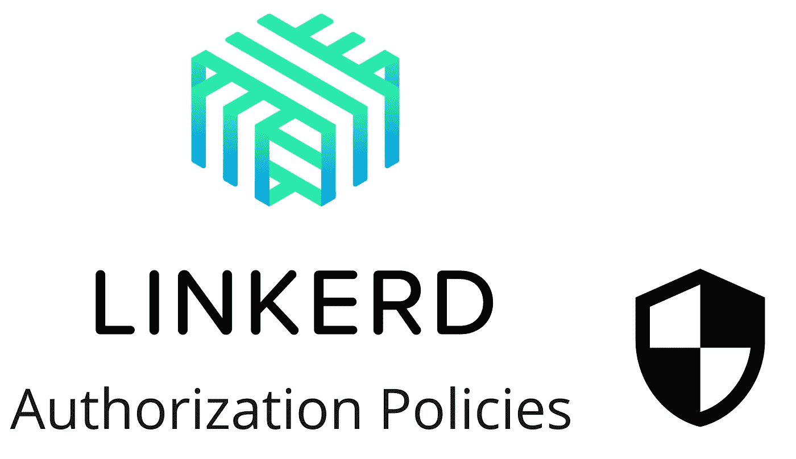

之前我写了文章比较了一些服务网格解决方案，以及我们为什么选择 Linkerd。当时，只有一种方法来限制服务之间的访问:标准 K8s 网络策略。在 Linkerd 2.11.0 中，有一个称为授权策略的新特性。在发布之后，我们开始使用它。这篇文章主要介绍我们在新政策方面的经验。我们观察它，尝试使用它，并找出符合我们需求的模式。

> 我尽量不重复[的官方文档](https://linkerd.io/2.11/reference/authorization-policy/)，而是尽量把重点放在实践方面和一些缺陷上。此外，在本文中，**多集群设置不在**中，因为在 ANNA Money 中，我们不使用它。

# 基线

向后兼容性很好。默认行为就像你对新的授权策略一无所知一样。

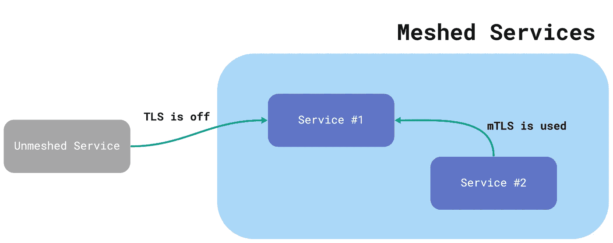

默认行为

如图所示，任何连接都被 service(或 POD)接受。Linkerd 的显著优点是，默认情况下它不需要 mTLS，但如果可以的话，它会支持 mTLS。如果两个服务都是网状的，那么它们之间的连接使用 mTLS。在另一种情况下，他们仍然可以通信，但没有加密。这个策略叫做 ***完全未认证。***

> 当所有人都允许所有人时，这种模式虽然方便，但本质上并不安全。

我们希望通过新政策实现两个主要目标:

*   **内部沟通零信任政策**。想象一下，一个黑客攻击前端，试图调用不受保护的内部 API。所以我们想防止这种情况。
*   **限制对内部 API** 的非受控访问。例如，一些团队需要私有 API，这些 API 可以被其名称空间(例如，业务域)内的服务调用，但不能从任何其他名称空间调用。所以我们想增加建立反腐败网关的可能性。

因此，让我们一步一步地实施政策。

# 准备

在我们开始之前，有些事情我们应该记住。

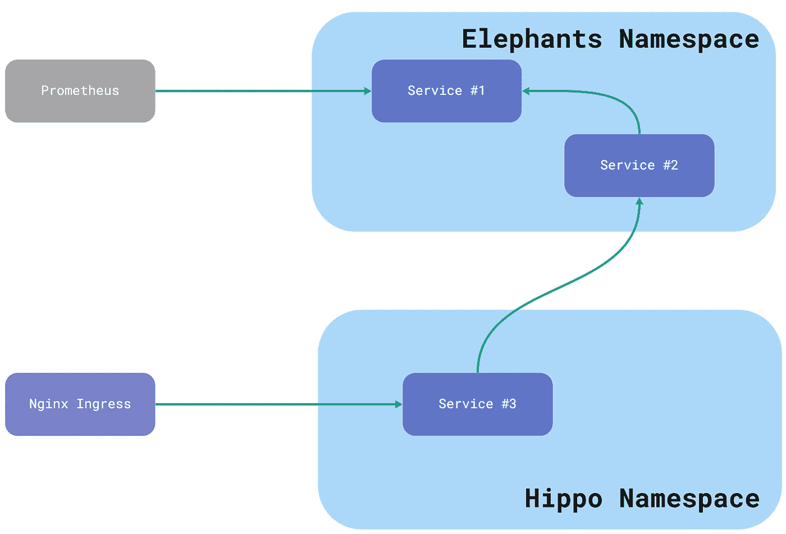

想象的建筑

首先，一些系统组件可能无法啮合。例如，我们以前没有啮合普罗米修斯。此外，您可能有一些 Kubernetes 作业应该调用其他服务，但不注入 Linkerd 代理(如何做参见[我的文章](/three-ways-to-use-linkerd-with-kubernetes-jobs-c12ccc6d4c7c))。所以他们应该在扣动扳机前就已经啮合了。

其次，您的一些 pod 不能使用某些服务帐户，而是使用默认帐户。这可能会导致将来的授权问题。因此，我们应该为每个 pod 添加一个特定的服务帐户。

第三，最好在 pod 中使用命名端口，因为它简化了策略配置。所以如果你不做，那就好好想想。

# **步骤 1:选择默认策略。**

我们之前说过，启动**后正确使用*和****策略。如果您使用多集群网格，这是合理的，但如果不使用，最好选择一个未经 ***集群认证的*** 策略，只允许来自有限范围的 IP(例如，来自同一个集群)的请求。*

*我们可以通过在 Linkerd 配置中设置适当的属性来做到这一点:*

```
***policyController:
  defaultAllowPolicy: cluster-unauthenticated***
```

*或者通过在名称空间甚至 pod 上设置注释**config.linkerd.io/default-inbound-policy**(我认为这样的粒度不合适)。*

*默认情况下， ***未经群集验证的*** 策略的 IP 范围过宽:*

```
*clusterNetworks: 10.0.0.0/8,100.64.0.0/10,172.16.0.0/12,192.168.0.0/16*
```

*最好通过集群中使用的实际范围来限制它。*

## **-经过验证的策略*

*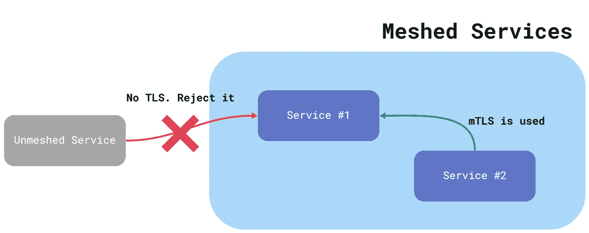*

**-身份验证模式限制非网状请求*

*两个策略隐式地只允许 mTLS 连接: ***全认证*** 和 ***集群认证。******所有-**** 和 ***集群-**** 的区别以上我们整理了一下。对它的第一印象是哇。下一步是保护您的集群。打开它，继续前进。**不！***

*请不要在生产环境中启用此选项，直到您在测试环境中尝试并首先做好额外准备。这里的主要问题是这个模式拒绝 ***所有未网状连接，*** 包括来自 kubelet 的健康检查。你的豆荚进入崩溃循环，因为健康检查没有通过。哒哒！(GitHub 上有一个关于这种行为的问题，所以 Linkerd 可能会以某种方式解决它)。*

*那么如何才能修复呢？首先出现的天真想法是选择所有具有健康检查的端口，并添加附加配置以通过健康检查。*

*我们做了什么？我们为它们添加了两个**服务器**配置和一个授权策略。*

*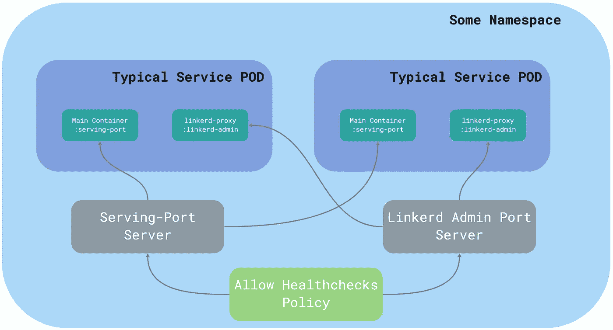*

*允许运行状况检查策略架构*

*我们使用一对多关系。每个**服务器**配置通过标签选择器覆盖一个名称空间中的所有网状 pod:*

```
*podSelector:
 **matchLabels:
    linkerd.io/control-plane-ns: linkerd***
```

*如果您知道某个端口的协议，最好通过 **proxyProtocol** 属性显式添加此信息。*

```
***proxyProtocol: "HTTP/2"***
```

*此外，我们添加了一个适用于两种**服务器**配置的策略:*

```
*server:
  selector:
 **matchLabels:
      anna.money/server-type: common***
```

*我们定义了任何未经授权的特定 IP 的客户端都可以连接到我们。*

```
*client: **unauthenticated: true**
  **networks:**


    **- cidr: 10.{{ n }}.{{ m }}.1/32**

*
```

*如你所见，GKE 没有很好的解决方案，因为 kubelet 从 POD CIDR 范围内的网关 IP 地址发出请求。如果您使用另一个 Kubernetes 解决方案，那么请阅读它的文档。*

*这能解决我们的问题吗？是的，但是带来新的。健康检查通过了，但是通常的请求(例如，来自 Nginx 入口的请求)没有通过。我们在沙盒环境中遇到了一个错误:*

```
*{"message":"Request failed","error":"unauthorized connection on server serving-port"}
...
{"client.addr":"<other_pod_address>","name":"rescue"}*
```

*但是为什么呢？*

***否认政策***

*首先，我们需要满足最后一种政策: ***否定*** 。*

**

*拒绝策略要求明确允许任何连接。您可以将它用作默认策略，但是在为所有现有的 pod 和端口创建所有必要策略的最后一步。*

*所以，回头看看我们的配置问题。*

*当任何**服务器**配置与端口匹配时，它使用 ***拒绝*** 策略，而不是默认策略。我们允许从 kubelet 进行健康检查，但不允许网状连接。*

> *如果您有一个单独的端口用于运行状况检查，就不会遇到这个问题。*

*我们开始吧！*

*允许所有策略*

*根据新策略，我们允许所有具有身份的网状连接(事实上，任何网状服务都应该具有身份):*

```
*client:
 **meshTLS:
    identities:
      - "*"***
```

## *概述*

*所以我们现在所做的是:*

*   *注入像 Prometheus 和 CronJobs 这样的 Linkerd 代理系统组件*
*   *将所有端口命名为*
*   *为每个 POD 建立单独的服务帐户*
*   *为名称空间中的每个 POD 的`serving-port`创建**服务器**配置*
*   *为 Linkerd 代理管理端口创建**服务器**配置*
*   *创建允许来自 kubelet 的请求的 **ServerAuthorization***
*   *创建允许任何网状连接的**服务器授权***
*   *使 Linkerd 配置中的`clusterNetworks`更紧密*
*   *打开**集群认证**作为名称空间的默认策略*

# *第二步:使其可定制。*

*还记得目标吗？目前，如果一个假想的黑客可以访问前端 POD，他也可以调用任何其他 POD。这是因为我们允许任何网状通信。所以让我们试着修复它。*

*我们不能为服务端口服务器配置添加新的特定策略，因为此配置适用于大量的 pod(确切地说，在名称空间中的任何网格上)。*

*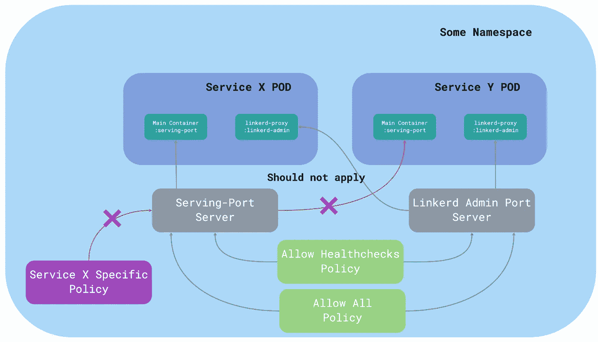*

*特定策略需要一个精确的服务器。*

*因此，也许我们可以为服务 X 再添加一个**服务器**配置？*

*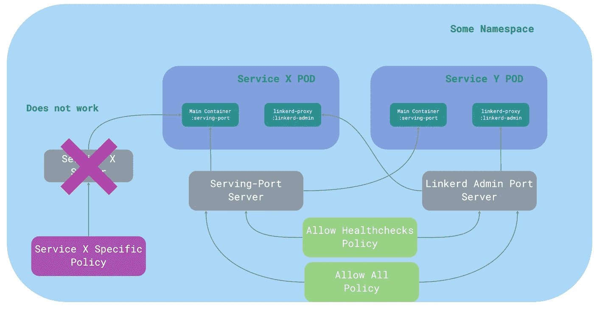*

*端口有多个服务器*

*这很危险，会导致奇怪的行为。问题是 Linkerd **检查每台服务器对端口**的访问。如果我们只应用特定的策略，那么运行状况检查就会开始失败。所以我们也需要使用所有的公共政策。*

*同样，这也不是推荐的方式，准入挂钩试图拒绝这样的配置。*

*这里的解决方案是在端口和服务器配置之间使用一对一的关系。*

*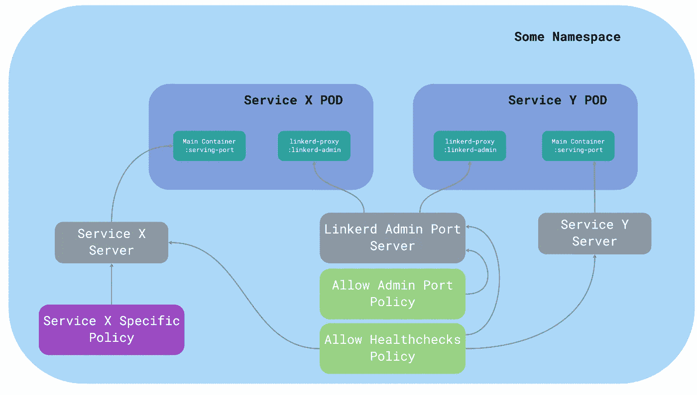*

*独立的服务器配置*

*我们保留了 linkerd 管理端口**服务器**配置，因为我们对名称空间中的所有 Linkerd 代理容器都有确切的要求。出于安全原因，有必要为管理端口添加一个策略，允许来自 Prometheus(它获取度量)和其他工具(如果有)的连接，但拒绝其他连接。*

*这里我们用一个严格的名字来选择**服务器**而不是选择器:*

```
***server:
  name: linkerd-admin-port***
```

*此外，让 **linkerd** 系统名称空间中的所有 pod 都获得授权也是合理的:*

```
*server:
  name: linkerd-admin-port
client:
  meshTLS:
    identities:
      - "***.linkerd**.serviceaccount.identity..."
      - "***.linkerd-viz**.serviceaccount.identity..."*
```

*为了支持应用程序端口的特定和通用策略，我们应该在所有其他应用程序中使用唯一标签来标记 POD:*

```
***labels:
  anna.money/authorization-policy: "{{ app_name }}"***
```

> *在这里和下面，我们将使用 Jinja 语法进行模板化。所以 **app_name** 只是一个带有应用名称的变量。*

*然后，我们应该为**服务端口**(或应用程序用来处理请求的每个端口)和**服务器授权**添加一个特定的**服务器**，允许所有授权的身份发出请求:*

*如您所见，我们用两个标签来标记**服务器**——一个用于公共授权策略，另一个用于特定于应用程序的策略。它让我们可以灵活地添加更多的通用授权策略，而无需重新配置服务器。此外，我们使用一个唯一的标签来为**服务器**选择合适的端口。*

*我们没有机会涵盖所有情况，但是您应该记住，在您进入生产环境之前的迁移过程中，可能会在测试环境中发现特定于平台的东西。对于每种情况，可能需要另一个**服务器授权**策略。*

> ***GKE 特有的**。如果您使用内部负载平衡器(ILB)，您应该为平衡器代理的任何端口添加宽 CIDR。原因是来自 ILB 的请求可以来自通常使用整个 VPC 网络的任何 GKE 节点。比如可以是 **10.xxx.0.0/20。***

*此外，请记住，我们应该对应用程序的每个名称空间进行适当的配置。*

## *概述*

*所以我们在这一部分所做的:*

*   *将**服务器**定义从一对多修改为一对一关系*
*   *为所有 **linkerd-admin** 端口保留**服务器**，因为我们希望为名称空间中的任何 **linkerd-proxy** 容器实现相同的行为*
*   *保护 **linkerd-admin** 端口，但为 Prometheus 等系统组件打开它*
*   *用一个唯一的标签标记 pod，并在特定的**服务器**定义中将其用作选择器*
*   *在**服务器**定义上使用通用标签，以简化新的通用授权策略添加*
*   *请记住特定于平台的情况*
*   *请记住，我们应该为任何覆盖的名称空间复制配置*

# *第三步:确保安全。*

*我们做了很好的准备，但是我们仍然没有达到我们的目标。要做到这一点，我们应该修改所有允许的政策，使之更加具体。*

*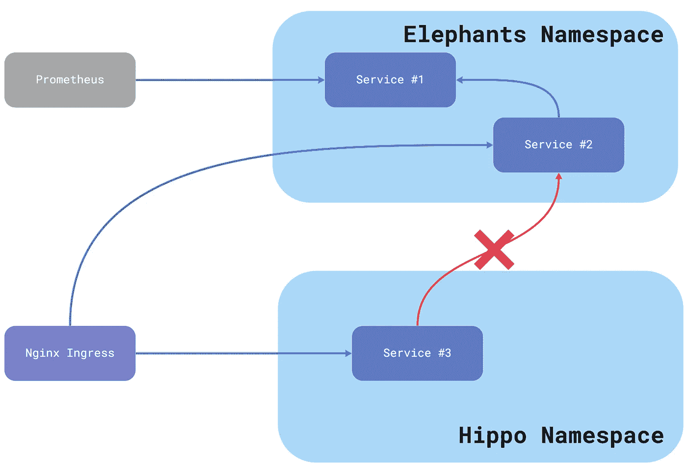*

*想象的建筑#2*

*看图表。我们有两个名称空间，三个服务，Nginx ingress 将数据暴露给外部世界，Prometheus 获取度量(实际上，我们应该从它添加更多的箭头，但这导致了一个不可读的图片)。*

*有些服务可以调用其他服务，有些不能。来自**大象**名称空间的服务只接受来自同一个名称空间的请求**。Nginx 不应该向服务#1 发出请求，但是可以为服务# 2 和服务# 3 发出请求。***

*看起来很复杂？现实更多。让我们收拾残局。*

*第一步很简单。我们应该添加 **ServerAuthorization** ，它允许所有应用程序从 Prometheus 发出请求。我们之前用 **linkerd-admin** 端口做过，所以这应该很容易:*

*使用 Nginx 的情况更棘手。我们希望拥有尽可能少的授权定义，但是我们不能对通用服务器类型应用新的授权策略。*

*这里的解决方案是在**服务器**上为 Nginx 应该通过 Nginx 公开的端口添加一个新标签:*

*现在，只有当**服务器**具有`anna-money/nginx: enabled`标签时，授权策略才适用。我们可以在部署期间通过舵图或其他模板来实现。*

*接下来，我们希望将**大象**名称空间与其他名称空间隔离开来，因此我们可以使用类似的技巧，在每个应用程序**服务器**上再添加一个标签:*

```
*labels:
  anna.money/server-type: common
  anna.money/authorization-policy: {{ app_name }}
  anna.money/nginx: enabled
 **anna.money/server-ns: {{ app_ns }}***
```

*然后允许来自该命名空间的所有身份:*

```
*server:
  selector:
    matchLabels:
      **anna.money/server-ns: {{ app_ns }}**
client:
  meshTLS:
    identities:
      - "***.elephants**.serviceaccount.identity..."*
```

> *此时，我们应该逐步删除应用程序端口的 allow-all**server authorization**定义。*

*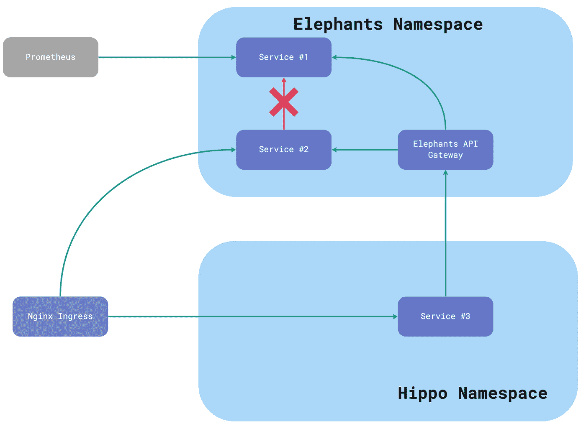*

*想象的建筑#3*

*让我们添加一个新组件——用于**大象**名称空间的 API 网关。它类似于其他名称空间的服务可以请求的公共 API。这里我们应该为网关再添加一个 **ServerAuthorization** 。它应该接受来自其他授权名称空间的任何请求。*

*我们可以使用通配符身份来实现这一点(就像我们之前做的一样):*

```
*server:
  selector:
    matchLabels:
      **anna.money/authorization-policy: gateway**
client:
  meshTLS:
    identities:
      - "***.hippo**.serviceaccount.identity..."
      - "***.xxx**.serviceaccount.identity..."*
```

*此外，我们希望限制从**服务#2** 到**服务#3** 的呼叫。在这种情况下，我们应该删除允许名称空间内任何请求的策略，并添加一个更具体的策略。*

*如果我们有几个服务，我们可以为每个服务手动添加一个授权策略，其中包含服务帐户(或其他服务)的详细列表:*

```
*server:
  selector:
    matchLabels:
      **anna.money/authorization-policy: service1**
client:
  meshTLS:
    **serviceAccounts:
      - namespace: elephants
        name: gateway***
```

> *如你所见，在这里，我们使用另一种方式来定义身份。它比“身份”变体更明确。*

*如果我们有几十个生产应用程序，我们应该考虑流程的自动化，以允许一个服务大规模地提供给另一个服务。*

*有两种方法来组织这个过程:显式和本机。要感受不同之处，让我们看一下图表。*

*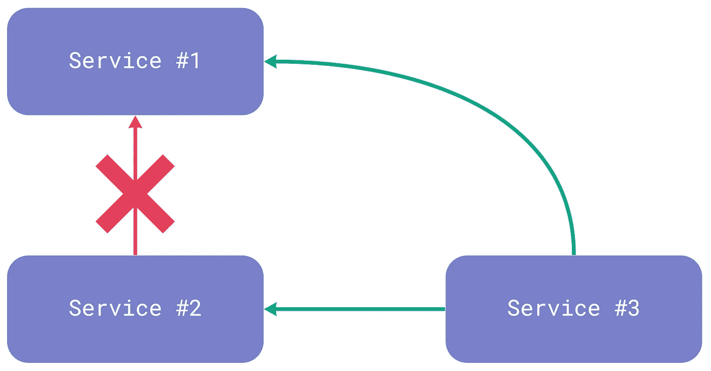*

*我们应该如何定义这个方案？在**显式变体**中，我们在 Helm chart(或另一个模板)中添加了一个新属性，以支持允许的应用程序或服务帐户列表:*

```
*#no one allowed **allowedServiceAccounts: []**#only service #3 is allowed **allowedServiceAccounts:**  **- namespace: elephants
    name: service3***
```

*然后我们很容易模板化策略，因为定义与 **ServerAuthorization** 规范中的相同。*

***变体的好处**是容易理解和模板化。主要缺点是需要定义应用程序的所有客户端。这很棘手，需要时间。*

*相比之下，**原生变体**意味着定义每个服务的依赖关系，构建图表，并找出依赖于特定服务的所有应用程序。*

```
*#no dependencies **dependencies: []**#service #3 depends on #1 and #2 **dependencies:**  **- namespace: elephants
    name: service1
  - namespace: elephants
    name: service2***
```

***该变体的主要好处**是以一种更本地的方式定义应用程序之间的关系。**主要缺点**是模板化和更新授权策略的过程更加复杂，因为我们必须解决逆问题。*

*当然，如果服务没有明确的定义，我们可以将这两种方法结合起来，使用本地变体。*

*在迁移过程的最后，我们应该删除应用程序的所有 allow-all 策略，并打开所有覆盖的名称空间的默认策略*。**

## **概述**

**所以我们在这一部分所做的:**

*   **使用**服务器**的标签来定义典型行为；例如，我们添加标签以允许 Prometheus 和 Nginx 访问**
*   **与前一个类似，我们使用一个**服务器**的标签来确定一个应用程序是否在特定的名称空间中**
*   **我们已经理清了开发人员如何为名称空间(或业务领域)实现 API 网关**
*   **我们看两种大规模组织服务到服务策略规则的方法**
*   **我们一步一步地删除允许所有授权策略**

# ****结论****

**还记得目标吗？**

**我们通过 Linkerd 授权策略实现了两个主要目标:**

*   ****内部沟通零信任政策****
*   ****限制对内部 API 的非受控访问****

**我们一步一步地添加从 allow-all 到 allow-only 的授权规则，在文章的最后，每个服务定义它应该接受什么请求。 ***爽！*****

**让我们回忆一下我们面临的主要陷阱:**

*   *****-经过认证的**默认策略会破坏您的环境**
*   **每个端口应该只由一个**服务器**定义覆盖**
*   **还记得特定于平台的东西吗，比如 GKE 的内部负载平衡器或者 CIDR 的健康检查**

**结束了。我希望这篇文章能帮助你通过这种方式，或者，至少，给你一些思考、见解和乐趣。**