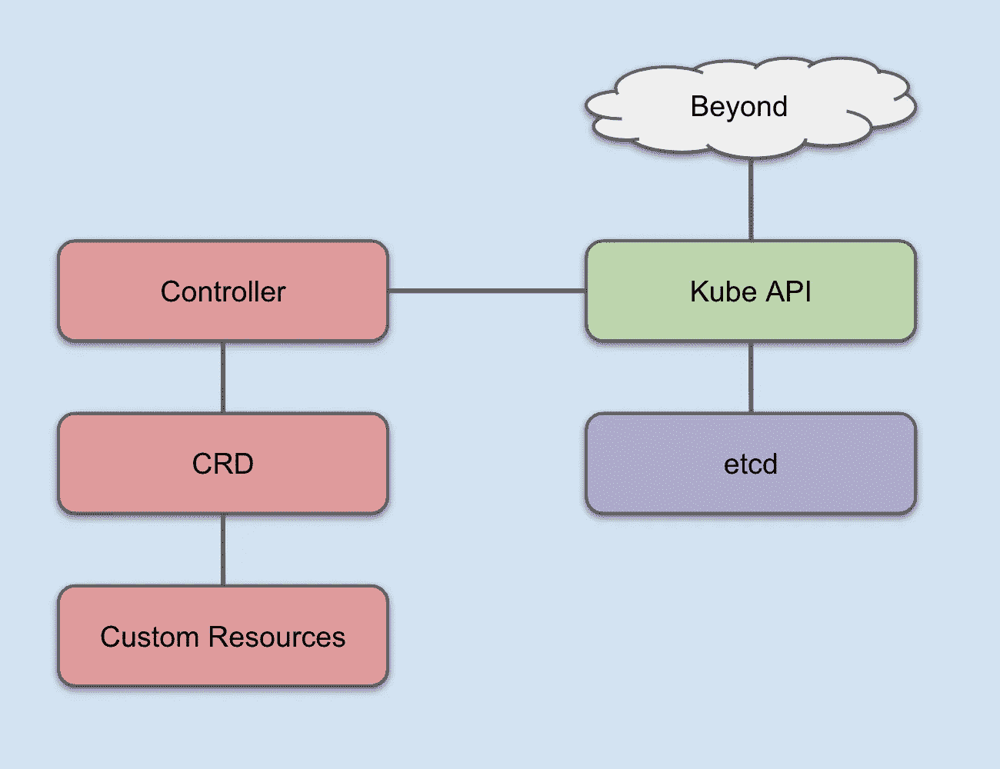
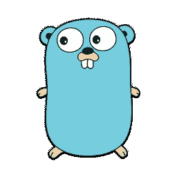
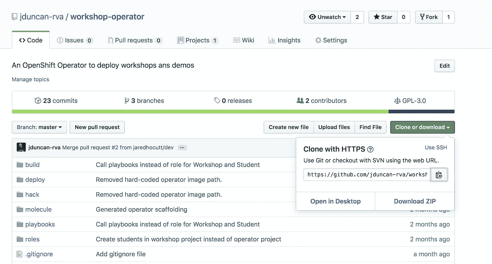

# 用 Ansible 实现 kubernetes 算子——一个例子

> 原文：<https://itnext.io/a-practical-kubernetes-operator-using-ansible-an-example-d3a9d3674d5b?source=collection_archive---------1----------------------->

*注:这是我和* [*贾里德·霍科特*](https://medium.com/u/30a356c1c9a2?source=post_page-----d3a9d3674d5b--------------------------------) *共同努力的学习经历。*

就在 [Red Hat](https://www.redhat.com) 收购它们的时候， [CoreOS](https://www.coreos.com) 宣布发布一个新的框架和开发包，围绕一个叫做“ [Operators](https://coreos.com/operators/) 的概念。从那时起，运营商已经发展成为有效管理 kubernetes 集群以及其中部署的应用程序的最佳方式之一。但是定义什么是操作者以及他们如何改进你的集群可能有点困难。他们在抽象出用于完成工作的 kubernetes 对象方面做得很好。但是这些对象之间的联系和交互可能有点难以理解。这篇文章(可能不止一篇)将采用我在互联网上用过的多个例子，把它们粘在一起，让这些基础知识变得更加清晰。


kubernetes 运营商 logo…哈利波特 v. Shazam？

我们要解决的问题是一个完全自私的问题。我们将编写一个 kubernetes 操作器，它将部署定制的客户研讨会，这样当研讨会参与者破坏了他们的环境时，我可以花更少的时间来部署和修复它们。在我们找到解决方案之前，让我们先快速地分析一下这个问题。

# 我们需要什么

我想建立一个能够:

*   在 kubernetes 中创建一个`Workshop`资源，它将为一个研讨会部署和维护所有的共享资源。这些可能包括容器注册、共享实验室内容等。这些共享资源需要能够为每个独特的部署车间指定。
*   workshop 对象需要接受一定数量的学生，并使用这个数量来部署为 workshop 中的每个学生创建定制内容的`Student`资源。学生的内容可以是要使用的应用程序、实验指南、数据库等。

因此，研讨会将更容易部署，更有活力，自我修复，并为与会者提供更好的体验。

*这不是一个真实的用户故事。我知道。但你明白要点了，对吧？*

# 操作员如何工作

像许多新技术一样，构成运营商的 kubernetes 组件并不新鲜。但是它们的构建、管理和实现方式是革命性的。最基本的，操作符是一个 kubernetes 定制资源定义(CRD)和一个定制控制器。

控制器本质上是将 CRD 集成到 kubernetes API 和数据库中的大脑。它们控制用户和定制资源之间的交互。出于时间的原因，我们不打算再深入了。如果你感兴趣，托马斯·斯金格写的关于控制器的很棒的初级读本就在 Medium 上。

[](https://medium.com/@trstringer/create-kubernetes-controllers-for-core-and-custom-resources-62fc35ad64a3) [## 扩展 Kubernetes:为核心和定制资源创建控制器

### Kubernetes 功能强大，附带了许多开箱即用的功能。但是当我们开始考虑新的方法来…

medium.com](https://medium.com/@trstringer/create-kubernetes-controllers-for-core-and-custom-resources-62fc35ad64a3) 

运营商最大的好处之一就是他们可以抽象出你自己管理的大部分需求。

CRD 是为您的定制工作做繁重工作的实际资源。我们将进入一个示例，我们需要在页面的下面创建一个 CRD。如果你想深入了解 CRD，它们在[文档](https://kubernetes.io/docs/concepts/extend-kubernetes/api-extension/custom-resources/#customresourcedefinitions)中有很好的介绍。



难以置信的简单，逻辑，可能在 36 个方面不准确，控制器和 CRD 如何集成到 kubernetes 的观点。

在定制控制器和 CRDS 之间，您可以任意扩展 kubernetes 数据库，以处理与您的应用程序和应用程序平台生命周期的各个方面相关的各种数据。运营商使这成为几乎任何 IT 专业人员或团队的能力，而不仅仅是精英。

有了这样的背景，让我们做一些决定并开始吧。

# 运营商 SDK

建筑运营商使用[软件开发套件(SDK)](https://github.com/operator-framework/operator-sdk) 。由于我在 Mac 上(说来话长)，我可以很容易地用`brew`安装它。

```
$ brew install operator-sdk
```

有几种类型的运算符可以与 SDK 一起使用。

## 运算符的类型



戈朗地鼠

[Golang 操作符](https://github.com/operator-framework/operator-sdk/blob/master/doc/user-guide.md) —这是所有 SDK 选项中最灵活的。这是用纯戈兰语写的。它提供了对所创建的 CRD 和控制器的最大程度的暴露(从而控制)。权力越大，责任越大。这个对我们来说有点过了。


头盔标志

[舵操作符](https://github.com/operator-framework/operator-sdk/blob/master/doc/helm/user-guide.md) —这个操作符抽象出控制器，CRD 嵌入你选择的舵图表。我不是舵手专家，但是舵手图表被输入到 CRD 并且在里面被执行。


Ansible 标志

可变运算符——这才是我们要说的！我的两个极客最爱。OpenShift 和 Ansible。我们稍后将深入研究细节(铺垫—这是我们为我们的操作符选择的)，但是这个操作符在 CRD 中使用了`[ansible-runner](https://github.com/ansible/ansible-runner)`。它在无限循环中执行指定的剧本和角色。这个操作符不如 Golang 操作符灵活，但是对于许多目标来说，它有足够的马力。

有了这些信息，让我们选择一个解决方案并开始编码。

# 使用哪个运算符

对于这个项目，Ansible 操作员的进入门槛最低(我既不是 Golang 也不是 Helm 专家)，我们设想的工作流可以轻松集成到 Ansible 剧本和角色中。

已经决定了。我们开始吧！

# 创建操作员

当您安装 Operator SDK 时，它会在您的系统上添加一个名为`operator-sdk`的二进制文件。要创建新的操作员，您需要设置以下选项:

*   名称:在`new`参数之后，您为您的操作符指定名称
*   [api-version (API 组)](https://kubernetes.io/docs/concepts/overview/kubernetes-api/#api-groups):API 组在 REST 路径和序列化对象*(引用自链接)*的`apiVersion`字段中指定
*   [kind](https://github.com/kubernetes/community/blob/master/contributors/devel/sig-architecture/api-conventions.md#types-kinds) : Kind 是一个字符串值，代表这个对象所代表的 REST 资源。服务器可以从客户端向其提交请求的端点推断出这一点。无法更新。在骆驼案。([来源](https://kubernetes.io/docs/reference/federation/v1/definitions/))
*   类型:要构建的运算符的类型。在我们的例子中，我们使用 Ansible 操作符。
*   集群范围:这个操作符将创建新的项目(类似于 kubernetes 名称空间的 OpenShift)和这些项目中的资源。这意味着我们需要它访问整个集群，而不仅仅是单个名称空间。

```
$ operator-sdk new workshop-operator \
--api-version=workshops.operator.redhatgov.io/v1 \
--kind=Workshop \
--type=ansible \
--cluster-scoped
```

你会看到一堆输出。

```
INFO[0000] Creating new Ansible operator 'workshop-operator'.
INFO[0000] Created deploy/service_account.yaml
INFO[0000] Created deploy/role.yaml
INFO[0000] Created deploy/role_binding.yaml
INFO[0000] Created deploy/crds/workshops_v1_workshop_crd.yaml
INFO[0000] Created deploy/crds/workshops_v1_workshop_cr.yaml
INFO[0000] Created build/Dockerfile
INFO[0000] Created roles/workshop/README.md
INFO[0000] Created roles/workshop/meta/main.yml
INFO[0000] Created roles/workshop/files/.placeholder
INFO[0000] Created roles/workshop/templates/.placeholder
INFO[0000] Created roles/workshop/vars/main.yml
INFO[0000] Created molecule/test-local/playbook.yml
INFO[0000] Created roles/workshop/defaults/main.yml
INFO[0000] Created roles/workshop/tasks/main.yml
INFO[0000] Created molecule/default/molecule.yml
INFO[0000] Created build/test-framework/Dockerfile
INFO[0000] Created molecule/test-cluster/molecule.yml
INFO[0000] Created molecule/default/prepare.yml
INFO[0000] Created molecule/default/playbook.yml
INFO[0000] Created build/test-framework/ansible-test.sh
INFO[0000] Created molecule/default/asserts.yml
INFO[0000] Created molecule/test-cluster/playbook.yml
INFO[0000] Created roles/workshop/handlers/main.yml
INFO[0000] Created watches.yaml
INFO[0000] Created deploy/operator.yaml
INFO[0000] Created .travis.yml
INFO[0000] Created molecule/test-local/molecule.yml
INFO[0000] Created molecule/test-local/prepare.yml
INFO[0000] Run git init ...
Initialized empty Git repository in /Users/jduncan/Code/workshop-operator2/workshop-operator/.git/
INFO[0000] Run git init done
INFO[0000] Project creation complete.
```

转到新创建的目录，您会看到几个文件:

```
$ tree
.
├── build
│   ├── Dockerfile
│   └── test-framework
│       ├── Dockerfile
│       └── ansible-test.sh
├── deploy
│   ├── crds
│   │   ├── workshops_v1_workshop_cr.yaml
│   │   └── workshops_v1_workshop_crd.yaml
│   ├── operator.yaml
│   ├── role.yaml
│   ├── role_binding.yaml
│   └── service_account.yaml
├── molecule
│   ├── default
│   │   ├── asserts.yml
│   │   ├── molecule.yml
│   │   ├── playbook.yml
│   │   └── prepare.yml
│   ├── test-cluster
│   │   ├── molecule.yml
│   │   └── playbook.yml
│   └── test-local
│       ├── molecule.yml
│       ├── playbook.yml
│       └── prepare.yml
├── roles
│   └── workshop
│       ├── README.md
│       ├── defaults
│       │   └── main.yml
│       ├── files
│       ├── handlers
│       │   └── main.yml
│       ├── meta
│       │   └── main.yml
│       ├── tasks
│       │   └── main.yml
│       ├── templates
│       └── vars
│           └── main.yml
└── watches.yaml17 directories, 25 files
```

这是您的运营商的基本模型。现在它做的不多，但是你的基础都在那里。更详细地看一下目录结构:

*   `build` —这个目录包含一个 docker 文件和一些测试，当您通过 SDK 触发一个构建时，这些测试就会运行。
*   `deploy` —构建完成后部署的对象。我们将在这篇文章的后面处理这些问题。
*   `molecule` — [分子](https://pypi.org/project/molecule/)是对可承担角色的测试框架。这超出了本文的范围，主要是因为我还没有做到这一步。
*   `roles`—SDK 在创建您的工作环境时，为您创建了一个空的可负责角色。
*   `watches.yaml` —该文件告诉 SDK 在构建 CRD 容器时要将哪些角色和剧本插入其中。本质上，这是您告诉 Operator SDK 关于 Ansible 您想作为您的操作员运行的地方。

## 手表. yaml

一开始的`watches.yaml`的内容实质上就是你在创建环境时提供的`operator-sdk`的信息。

```
$ cat watches.yaml
---
- version: v1
  group: workshops.operator.redhatgov.io
  kind: Workshop
  role: /opt/ansible/roles/workshop
```

SDK 使用它来确保正确的 Ansible 内容与正确版本的 kubernetes 对象相关联，创建这些对象是为了使您的操作符。按照这个顺序，正确的 kubernetes 事件将与相应的 Ansible 内容相关联。

从技术上来说，你现在就可以建立你的运营商。它不会做任何事，但它会建造。接下来，让它做点什么。

# 让我们的操作员做点什么

我们的第一个任务是让我们的操作员创建一个命名空间来保存我们车间的任何共享资源。这将为我们提供一个简单的角色，我们可以在部署操作符时确认正在发生的事情。

将以下任务添加到`roles/workshop/tasks/main.yml`。运行时，变量`meta.name`在容器内由配置容器内`ansible-runner`的代码[设置。](https://github.com/operator-framework/operator-sdk/blob/master/pkg/ansible/runner/runner.go#L417)

```
---- name: Create project for global workshop content
  k8s:
    api_version: v1
    kind: Namespace
    name: "{{ meta.name }}"
```

随着最初的任务添加到我们的角色中，让我们第一次构建我们的操作符，看看这个过程是如何工作的。

# 构建车间操作员

当构建 Ansible 操作符时，`watches.yaml`中引用的剧本和/或角色使用包含`ansible-runner`的专用基础映像进行合并。从外部看，该过程与[源到图像](https://github.com/openshift/source-to-image)非常相似。该过程由`build/Dockerfile`控制。

```
$ cat build/Dockerfile
FROM quay.io/operator-framework/ansible-operator:v0.6.0COPY roles/ ${HOME}/roles/
COPY watches.yaml ${HOME}/watches.yaml
```

使用`operator-sdk`命令构建车间操作员。

```
$ operator-sdk build quay.io/jduncan/workshop-operator:v1
Step 1/3 : FROM quay.io/operator-framework/ansible-operator:v0.6.0
...
Step 2/3 : COPY roles/ ${HOME}/roles/
 ---> 1a0094e3c710
Step 3/3 : COPY watches.yaml ${HOME}/watches.yaml
 ---> 44a4573f0e00
Successfully built 44a4573f0e00
Successfully tagged quay.io/jduncan/workshop-operator:v1
```

您应该能够在本地容器图像缓存中看到新的容器图像。

```
$ docker images
REPOSITORY                                                       TAG                 IMAGE ID            CREATED              SIZE
quay.io/jduncan/workshop-operator                                v1                  0fd27b9c9905        6 seconds ago       611MB
```

最后，将新创建的映像推送到容器注册表中。在这个例子中，我们使用的是 [quay.io](https://quay.io) 。

```
$ docker push quay.io/jduncan/workshop-operator
The push refers to repository [quay.io/jduncan/workshop-operator]
...
v1: digest: sha256:97180d40822007bc81628bdd459077bd6c9301f516c5354f178260e2fbe173d0 size: 19642
```

这就是构建过程。您的新操作员的图像已经创建。接下来，我们需要调整一两个文件，这样我们就可以将操作符部署到 OpenShift 集群中。

# 部署车间操作员

当我们创建新的操作符时，它创建了`deploy/operator.yaml`。我们需要更改一些默认值来指定上传的映像和重启策略。

这在[文档](https://github.com/operator-framework/operator-sdk/blob/master/doc/ansible/user-guide.md#1-run-as-a-pod-inside-a-kubernetes-cluster)中有所涉及，但看起来确实有点过时。因为我是在 MacOS 上做这个的，所以我将运行一些快速的`sed`语句来处理这一切。注意，`opererator.yaml`正在创建一个 kubernetes [部署](https://kubernetes.io/docs/concepts/workloads/controllers/deployment/)对象。

```
$ sed -i "" 's|{{ REPLACE_IMAGE }}|quay.io/jduncan/workshop-operator:v1|g' deploy/operator.yaml$ sed -i "s|REPLACE_NAMESPACE|workshop-operator|g" deploy/role_binding.yaml$ sed -i "" 's|{{ pull_policy\|default('\''Always'\'') }}|Always|g' deploy/operator.yaml
```

完成这些更改后，就该部署我们操作符的初始版本了。这是通过运行`deploy/`中的几个 yaml 文件来完成的。因为我们要将它部署到 OpenShift 集群中，所以我们使用了`oc`命令。

*   首先，创建一个项目来容纳我们的新操作员

```
$ oc new-project workshop-operator
Now using project "workshop-operator" on server "[https://api.test.kuberati.com:6443](https://api.test.kuberati.com:6443)".You can add applications to this project with the 'new-app' command. For example, try:oc new-app centos/ruby-25-centos7~[https://github.com/sclorg/ruby-ex.git](https://github.com/sclorg/ruby-ex.git)to build a new example application in Ruby.
```

*   然后，创建一个服务帐户供操作员使用

```
$ oc create -f deploy/service_account.yaml
serviceaccount/workshop-operator created
```

*   接下来，为操作员创建一个角色。我们需要对创建操作符时生成的版本`deploy/role.yaml`进行一些编辑。因为我们使用 serviceaccount 在其默认名称空间之外创建资源，所以我们需要赋予它更多的权力。这里的配置**不是**生产就绪。但我们不是在生产，我们是在创造一个原型！它应该看起来像下面的例子。

```
apiVersion: rbac.authorization.k8s.io/v1
kind: ClusterRole
metadata:
  creationTimestamp: null
  name: workshop-operator
rules:
- apiGroups:
  - '*'
  resources:
  - '*'
  verbs:
  - '*'
```

*   完成后，我们创建我们的角色。

```
$ oc create -f deploy/role.yaml
role.rbac.authorization.k8s.io/workshop-operator created
```

*   接下来，将角色绑定到服务帐户

```
$ oc create -f deploy/role_binding.yaml
clusterrolebinding.rbac.authorization.k8s.io/workshop-operator created
```

*   接下来，部署操作员将使用的 CRD。

```
$ oc create -f deploy/crds/workshops_v1_workshop_crd.yaml
customresourcedefinition.apiextensions.k8s.io/workshops.workshops.operator.redhatgov.io created
```

*   最后，部署操作符本身，它引用了上面的角色绑定。

```
$ oc create -f deploy/operator.yaml
deployment.apps/workshop-operator created
```

完成这些步骤后，我们就部署了一个操作员！要进行确认，请检查以确保部署已启动并正在运行。

*注意:为了更好地解释，我们将它分成了几个单独的步骤。但是我们也已经把这一切都放到了这个项目的 Github repo* *中的少数* [*方便脚本中。*](https://github.com/jduncan-rva/workshop-operator/tree/master/hack)

```
$ oc get deployment
NAME                READY   UP-TO-DATE   AVAILABLE   AGE
workshop-operator   1/1     1            1           6m14s
```

如果运行`oc get workshops`，将不会返回任何资源(我们还没有部署 workshop，只是由操作员来控制它们)。但它不会出错。

```
$ oc get workshops
No resources found.
```

为了得到有趣的东西，我们有一个文件`deploy/workshops_v1_workshop_cr.yaml`，它为我们提供了一个部署研讨会的模板。因为我们还没有修改 Ansible 代码来创建惟一的名称空间名称，所以将这个模板的`size`参数改为 1。

```
$ cat deploy/crds/workshops_v1_workshop_cr.yaml
apiVersion: workshops.operator.redhatgov.io/v1
kind: Workshop
metadata:
  name: example-workshop
spec:
  # Add fields here
  size: 1
```

做出更改后，让我们部署一个研讨会吧！部署完成后，我们将再次运行`oc get workshops`来确认它是否成功。然后，为了确保 Ansible 被正确执行，我们将寻找一个名为`workshop-operator`的新创建的项目。

```
$ oc create -f deploy/crds/workshops_v1_workshop_cr.yaml
workshop.workshops.operator.redhatgov.io/example-workshop created$ oc get workshops
NAME               AGE
example-workshop   15s$ oc get projects | grep workshop
example-workshop                                         Active
workshop-operator                                        Active
```

成功！我们部署了一个`Workshop`资源，这个资源的创建创建了一个新项目，就像我们使用 Ansible 告诉它的那样。这项工作完成后，唯一需要重复的部分就是创建新的定制资源。例如，如果我将`workshops_v1_workshop_cr.yaml`中的名称更改为其他名称，我可以重新运行它，并获得一个带有新关联项目的新车间。在这个例子中，我将`deploy/crds/workshops_v1_workshop_cr.yaml`复制到另一个文件，并将名称改为`another-workshop`。

```
$ oc create -f deploy/crds/workshops_v1_workshop2_cr.yaml
workshop.workshops.operator.redhatgov.io/another-workshop created$ oc get workshops
NAME               AGE
another-workshop   62s
example-workshop   26m$ oc get projects | grep workshop
another-workshop                                         Active
example-workshop                                         Active
workshop-operator                                        Active
```

我们现在已经创建了第一个函数运算符。它创建了一个名为`Workshop`的资源，每个 workshop 资源又创建了一个项目，最终将包含所有共享的内容。

在下一部分中，我们将为我们的操作员创建一些额外的工作来处理，以便我们可以完成我们在开始时概述的成功标准。

# 扩展车间操作员

## 观看剧本而不是角色

默认情况下，Ansible 运算符监视特定的角色。但是，使用多个较小的角色并将它们整合到一个剧本中是可行的最佳实践。为此，我们必须:

*   创建一个参考我们角色的行动手册
*   指示`watches.yaml`寻找那些剧本，而不是默认的可负责角色。
*   将`playbooks`目录添加到`build/Dockerfile`中。

要创建行动手册，请在操作员目录的顶层创建一个`playbooks`目录。在该目录中，创建一个名为`workshop.yml`的文件，内容如下。

```
---- hosts: localhost  
  roles:    
    - workshop
```

行动手册将在`roles`目录中查找我们已经创建的车间角色。接下来，编辑`watches.yaml`以引用剧本而不是角色。对于角色和剧本，父目录`/opt/ansible`是您用 SDK 构建的操作员容器映像中的位置。请确保使用该路径，而不是开发系统上的路径。

```
$ cat watches.yaml
---
- version: v1
  group: workshops.operator.redhatgov.io
  kind: Workshop
  playbook: /opt/ansible/playbooks/workshop.yml
```

最后一项任务是确保`build/Dockerfile`在构建我们的操作员映像时将包含`playbooks`目录。编辑您的文件，如下例所示。

```
$ cat build/Dockerfile
FROM quay.io/operator-framework/ansible-operator:v0.6.0COPY roles/ ${HOME}/roles/
COPY playbooks/ ${HOME}/playbooks/
COPY watches.yaml ${HOME}/watches.yaml
```

仅此而已。车间操作员现在可以观看我们刚刚创建的车间行动手册。接下来，我们将向操作符添加一个学生对象。

## 添加附加资源

当我们在开始定义我们的成功标准时，我们声明我们想要创建工作室(完成)和学生。现在让我们向操作符添加一个学生对象。我们可以使用`operator-sdk`工具来完成这项工作。我们需要为它提供一个 API 值，包括一个版本和一个`Kind`值。

```
$ operator-sdk add crd \
--api-version students.operator.redhatgov.io/v1 \
--kind Student
INFO[0000] Generating Custom Resource Definition (CRD) version student.operator.redhatgov.io/v1 for kind Student.
INFO[0000] Created deploy/crds/student_v1_student_crd.yaml
INFO[0000] Created deploy/crds/student_v1_student_cr.yaml
```

这个过程为我们的新对象创建 CRD 和 CR 文件。当我们将新的对象部署到操作符中时，我们将使用它们。接下来，让我们向我们的操作符添加一个可转换的代码来创建我们的学生对象。

## 观看多个行动手册

我们希望我们的学生对象尽可能真实地反映我们的车间对象。我们将从使用`ansible-galaxy`创建一个新的学生角色开始。

```
$ cd roles/
$ ansible-galaxy init student
- student was created successfully$ tree student
students
├── README.md
├── defaults
│   └── main.yml
├── files
├── handlers
│   └── main.yml
├── meta
│   └── main.yml
├── tasks
│   └── main.yml
├── templates
├── tests
│   ├── inventory
│   └── test.yml
└── vars
    └── main.yml
```

将以下内容添加到`roles/students/tasks/main.yml`。

```
- name: Create project for student 
  k8s:    
    api_version: v1    
    kind: Namespace
    name: "{{ meta.name }}"
```

接下来，用下面的内容创建`playbooks/student.yml`。

```
---
- hosts: localhost
  roles:
    - student
```

随着我们新的学生角色和剧本的创建，我们需要告诉`watches.yaml`观看我们新的学生内容。

```
$ cat watches.yaml
---
- version: v1
  group: workshops.operator.redhatgov.io
  kind: Workshop
  playbook: /opt/ansible/playbooks/workshop.yml- version: v1
  group: operator.redhatgov.io
  kind: Student
  playbook: /opt/ansible/playbooks/student.yml
```

完成这项工作后，我们就可以构建新版本的操作符容器映像了！一定要增加版本号，这样我们就不会混淆。

```
$ operator-sdk build quay.io/jduncan/workshop-operator:v1
INFO[0000] Building Docker image quay.io/jduncan/workshop-operator:v2
Sending build context to Docker daemon  189.4kB
Step 1/3 : FROM quay.io/operator-framework/ansible-operator:v0.5.0
 ---> 1e857f3522b5
Step 2/3 : COPY roles/ ${HOME}/roles/
 ---> 2d415bae1bf4
Step 3/3 : COPY watches.yaml ${HOME}/watches.yaml
 ---> 0a45095442ba
Successfully built 0a45095442ba
Successfully tagged quay.io/jduncan/workshop-operator:v2
INFO[0001] Operator build complete.
```

构建完成后，将容器映像推送到存储库。

```
$ docker push quay.io/jduncan/workshop-operator:v1
...
v2: digest: sha256:96e40f62a49b96e7a068a3858afc4f65ab11d71cfeeac1fd825f1a32dba73b1f size: 19172
```

为了部署我们的新操作员，我们删除以前的部署并创建新的部署。此外，一定要创建新的学生 CRD。

```
$ oc delete deployment workshop-operator
deployment.extensions "workshop-operator" deleted$ oc create -f deploy/operator.yaml
deployment.apps/workshop-operator created$ oc create -f deploy/crds/student_v1_student_crd.yaml
customresourcedefinition.apiextensions.k8s.io/students.student.operator.redhatgov.io created
```

为了测试我们的新操作符，编辑`deploy/crds/student_v1_student_cr.yaml`如下图所示。

```
$ cat deploy/crds/student_v1_student_cr.yaml
apiVersion: student.operator.redhatgov.io/v1
kind: Student
metadata:
  name: example-student
spec:
  # Add fields here
  size: 1
```

部署一名测试学生。

```
$ oc get students
No resources found.$ oc create -f deploy/crds/student_v1_student_cr.yaml
student.student.operator.redhatgov.io/example-student created$ oc get students
NAME              AGE
example-student   5s$ oc get projects | grep student
example-student                          Active
```

现在，我们的车间操作员为车间和学生创建和管理我们的定制资源。但是有点硬编码，比较脆。当你有 50 个学生时，你不希望在一个车间里为每个学生写 yaml。在我们的最后一部分，我们将把 workshop 和 student 对象更紧密地联系在一起，让它们做一些更有效的工作。

## 集成更复杂的工作流程

现在我们已经有了车间操作员的基本知识，让我们来做一点更实际的事情。首先，让我们解决让车间自己部署它们自己的学生对象的任务。

首先，编辑`roles/workshop/tasks/main.yml`以包含以下代码。这个新任务将接受一个变量`num_students`，并创建相应数量的学生对象。

```
--- - name: Create project for global workshop content
  k8s:
    api_version: v1
    kind: Namespace
    name: "{{ meta.name }}"

- name: Create students for workshop
  k8s:
    definition: "{{ lookup('template', 'student.yaml.j2') | from_yaml }}"
  vars:
    student_number: "{{ item }}"
  loop: "{{ range(1, num_students + 1) | list }}"
  when: num_students is defined
```

这个新任务使用了一个 [Ansible 模板](https://docs.ansible.com/ansible/latest/modules/template_module.html)，并使用这个呈现的信息来创建新的 kubernetes 对象。模板位于`roles/workshop/templates/student.yaml.j2`，如下图所示。`meta.name`与我们在车间角色中使用的值相同。名称是动态格式，为每个学生的每个项目选择一个唯一的名称。

```
apiVersion: students.operator.redhatgov.io/v1
kind: Student
metadata:
  name: "{{ 'student%02d' | format(student_number) }}"
  namespace: "{{ meta.name }}"
spec:
  workshopName: "{{ meta.name }}"
```

有了这些文件，重新构建容器映像并上传它。

```
$ operator-sdk build quay.io/jduncan/workshop-operator:v1
INFO[0000] Building Docker image quay.io/jduncan/workshop-operator:v1
Sending build context to Docker daemon  190.5kB
Step 1/4 : FROM quay.io/operator-framework/ansible-operator:v0.6.0
 ---> 5c51606d3f0e
Step 2/4 : COPY roles/ ${HOME}/roles/
 ---> 54b5a0bef4a7
Step 3/4 : COPY playbooks/ ${HOME}/playbooks/
 ---> 445da9f5faaa
Step 4/4 : COPY watches.yaml ${HOME}/watches.yaml
 ---> 481899806b43
Successfully built 481899806b43
Successfully tagged quay.io/jduncan/workshop-operator:v1
INFO[0002] Operator build complete.$ docker push quay.io/jduncan/workshop-operator:v1
The push refers to repository [quay.io/jduncan/workshop-operator]
c080bf655ca4: Pushed
0741b9b522c4: Pushed
a28abf610d57: Pushed
...
v1: digest: sha256:3ac111f13b305408f742b42e7d2f0c8d5125250a77762ab8ba1633cfe52a4f3a size: 20158
```

在我们重新部署之前，让我们清理一下以前的研讨会和学生，以确保新配置自动为我们部署学生。

```
$ oc delete deployment workshop-operator
deployment.extensions "workshop-operator" deleted$ oc delete workshop example-workshop
workshop.workshops.operator.redhatgov.io "example-workshop" deleted$ oc delete workshop another-workshop
workshop.workshops.operator.redhatgov.io "another-workshop" deleted$ oc delete student example-student
student.students.operator.redhatgov.io "example-student" deleted
```

清理完这些对象后，使用包含新 Ansible 代码的新映像重新部署 workshop 操作员。

```
$ oc create -f deploy/operator.yaml
deployment.apps/workshop-operator created$ oc get pods
NAME                                 READY   STATUS    RESTARTS   AGE
workshop-operator-6759b6cf87-cc9xf   2/2     Running   0          54s
```

新操作员运行后，部署一个车间。

```
$ oc create -f deploy/crds/workshops_v1_workshop_cr.yaml
workshop.workshops.operator.redhatgov.io/example-workshop created
```

我们正在部署相同的定制资源，但是因为我们已经更新了操作符，所以`Student`资源也随着他们的项目一起被部署。

```
$ oc get projects | grep student
example-workshop-student01                               Active
example-workshop-student02                               Active
example-workshop-student03                               Active
```

当创建一个`Workshop`资源时，它会创建`numStudents`个相应的`Student`资源。这些资源的创建触发相应的 Ansible 剧本从`watches.yaml`运行。

这就是我们决定让我们的运营商为这个项目所做的。在您的 OpenShift 或 kubernetes 集群中，看到 Ansible 操作符的成千上万个潜在用例并不需要很大的飞跃。

# 总结和后续步骤

## 摘要

几个人花了几天时间，在谷歌上搜索了数千次文档，才开始制作这个项目。和大多数文章一样，我们希望花时间阅读这篇文章能为你节省一些时间和研究。

运营商为 kubernetes 集群的软件定义世界注入了强大的力量。这是一个用例的例子，其中我们能够将相对手动的流程转移到完全包含在我们的 OpenShift 集群中的完全自动化的流程中。操作员的目标是将应用程序的操作任务转移到集群本身。

## 后续步骤

我们在这篇文章中使用的例子是一个积极开发的项目。我们的目标是将我们的 Red Hat workshop 内容推广到这种交付形式中。我们将所有这些工作保留在 Github 上。



https://github.com/jduncan-rva/workshop-operator

接下来的步骤包括[使用 Sphinx 自动创建实验指南内容](https://github.com/jduncan-rva/workshop-operator-lab-guide)(这是一篇即将发表的博客文章的主题)，以及继续为我们的项目构建资源以继续自动化过程。

随时欢迎评论和问题/公关/明星！