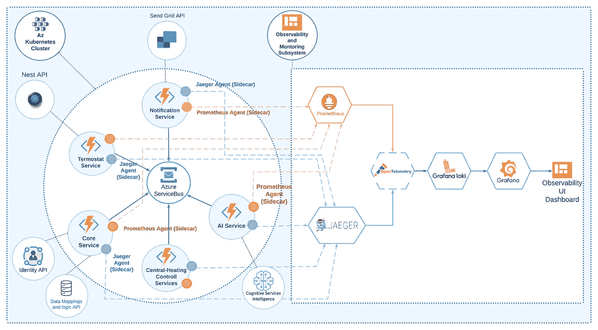
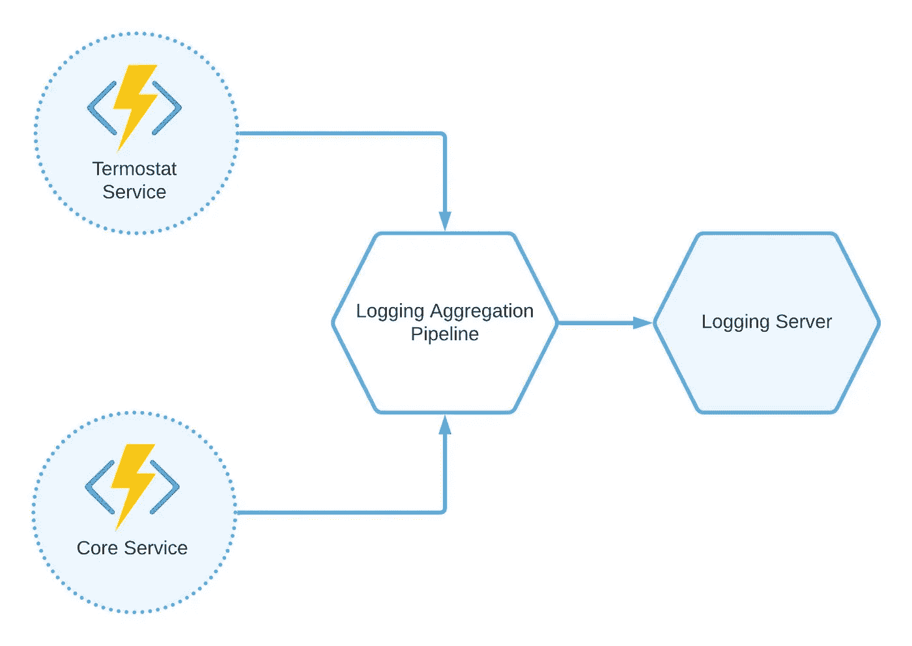
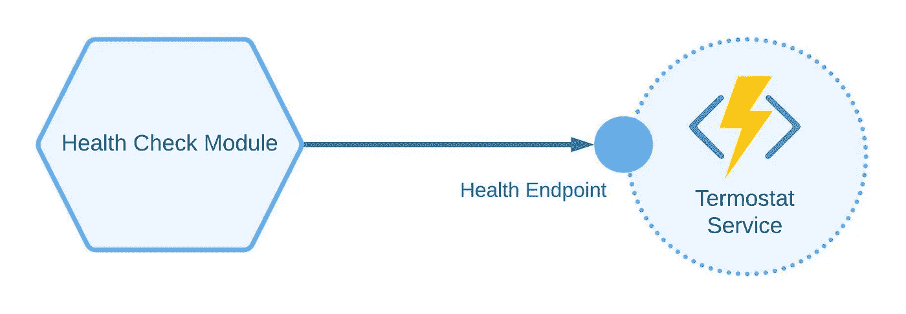
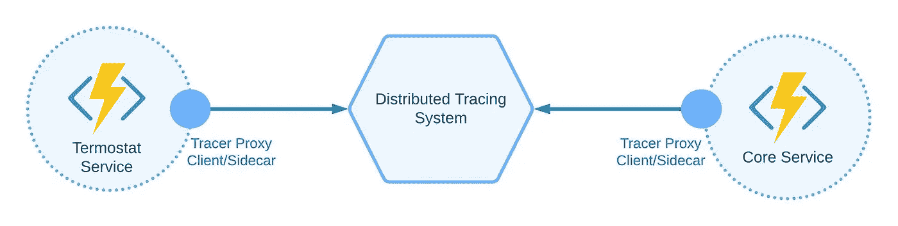
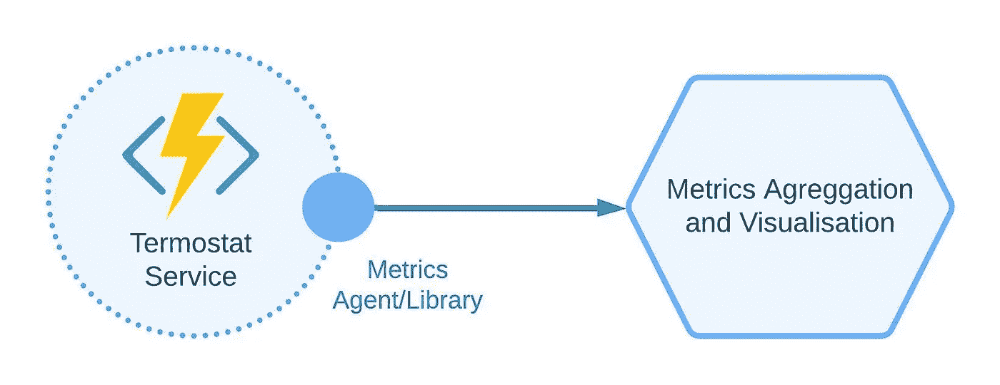
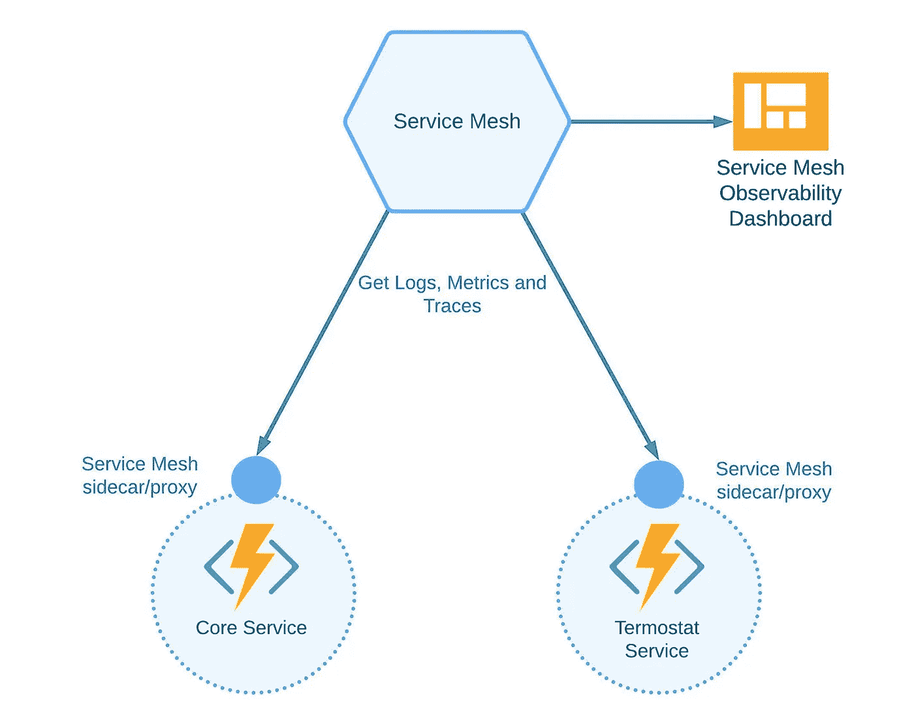
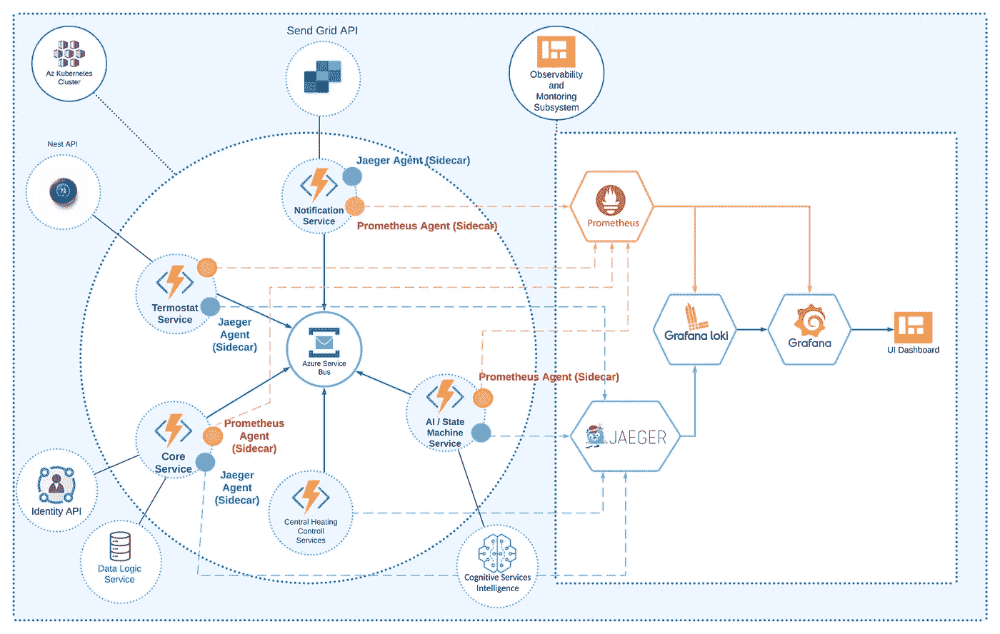

# 分布式系统可观测性入门

> 原文：<https://itnext.io/a-primer-on-distributed-systems-observability-a0c2a8e2146c?source=collection_archive---------0----------------------->

# 在这篇文章中，探索什么是可观测性和监控系统，一个好的可观测性平台的模式，以及可观测性子系统可能是什么样子。

在过去的几年中，系统架构的复杂性急剧增加，尤其是在分布式的、基于微服务的架构中。调试和查看日志非常困难，而且在大多数情况下效率很低，尤其是当我们有数百甚至数千个微服务或模块时。在本文中，我将描述什么是可观测性和监控系统，一个好的可观测性平台的模式，以及可观测性子系统可能是什么样子。

> *这是 DZone 2022 年性能和站点可靠性趋势报告中的一篇文章。更多:* [*阅读报道*](https://dzone.com/trendreports/performance-and-site-reliability)

# 可观察性与监控

在我们直接跳到重点之前，让我们描述一下什么是可观测性，它包括哪些组件，以及它与监视有何不同。可观察性允许我们在不知道细节或领域模型的情况下，对系统中发生的事情有一个清晰的概述。此外，可观察性让我们能够有效地提供以下信息:

*   整个系统、单独的服务故障和中断
*   一般系统和服务的行为
*   整体安全性和警报

我们知道什么函数应该覆盖可观测系统。下面我们可以看到应该收集哪些信息来正确设计可观察性和监控平台。

*   **指标** —数据收集使我们能够了解应用和基础设施状态，例如，延迟以及 CPU、内存和存储的使用情况。
*   **分布式跟踪** —允许我们调查从一个服务到另一个服务的事件或问题流
*   **日志** —这是一条带有时间戳的消息，包含有关应用程序或服务级别错误、异常和信息的信息。
*   **警报** —当停电或一项或多项服务出现问题时，警报会通过电子邮件、短信、聊天或打电话给运营商来通知这些问题。这允许快速采取行动解决问题。
*   **可用性** —确保所有服务正常运行。监控平台向某个服务或组件(向 HTTP API 端点)发送 prob 消息，以检查它是否响应。如果没有，则可观测性系统会生成一个警告(参见警告的要点)。

此外，一些可观察性和监控平台可能包括用户体验监控，例如热图和用户动作记录。

可观察性和监控遵循相同的原则和模式，并且主要依赖于工具集，因此在我看来，两者之间的区别是出于营销目的。对于可观察性与监控有何不同，没有明确的定义；所有的定义都不一样，都是高层次的。

# 可观察模式

所有基于微服务的复杂系统都有推荐和模式。这使我们能够建立一个可靠的系统，而不用重新发明轮子。可观测系统也有一些基本模式。以下部分讨论了五种最重要的模式。

# 日志聚合模式

在分布式系统中，日志记录可能很困难。每个微服务都可以产生大量的日志，要找到并分析每个微服务的错误或其他日志消息可能是一场噩梦。因此，日志聚合模式在这里对我们有所帮助。它包含作为中央日志存储的中央日志聚合服务。此外，该服务还提供了标记、索引、分类、搜索和分析所有日志的选项。有几个日志聚合平台的例子，如 [Grafana Loki](https://grafana.com/oss/loki/) 、 [Splunk](https://www.splunk.com/) 、 [Fluentd](https://www.fluentd.org/) 和 [ELK stack](https://www.elastic.co/what-is/elk-stack) 。

*图 1:日志聚合模式*

# 健康检查模式

假设您有多个服务或微服务，您需要知道它们的当前状态。当然，你可以去日志聚合服务查看日志。但是服务可能不会在启动状态下生成日志。此外，当服务失败时，可能会出现无法登录的情况。

在所有这些情况下，您需要实现健康检查模式。您只需要在您的服务中创建一个健康(或 ping)端点，并让您的日志聚合系统检查和收集每个服务的检查。您还可以在服务不可用时设置通知或警报，这样可以节省大量时间来识别哪些服务未能启动或关闭。

*图 2:健康检查模式*

# 分布式跟踪模式

想象一下这个场景:您在一个或几个微服务中有多个组件、模块和库。您需要检查组件执行的整个历史或者将请求发送到一个微服务，并且您需要检查从一个服务组件列表到另一个服务组件列表的执行历史。

为此，您需要一些分布式系统来收集和分析所有跟踪数据。一些开源服务允许你这么做，比如 [Jaeger](https://www.jaegertracing.io/) 、 [OpenTelemetry](https://opentelemetry.io/docs/) 和 [OpenCensus](https://opencensus.io/) 。查看 [Istio 文档](https://istio.io/v1.0/docs/tasks/telemetry/distributed-tracing/)中演示分布式跟踪的例子。

*图 3:分布式跟踪模式*

# 应用度量模式

拥有分布式日志记录和跟踪是必要的；然而，没有应用程序度量，您的可观察性系统将是不完整的。您可能需要收集基础和应用程序级别的指标，例如:

*   中央处理器
*   记忆
*   光盘使用
*   服务请求/响应时间
*   潜伏

收集这些指标不仅有助于您了解您需要的基础架构规模，还能帮助您节省在云提供商方面的资金。它还可以帮助您快速缓解因缺少 CPU 或内存资源而导致的停机。

下面是一个具有委托代理的服务示例。委托代理聚合遥测数据并将其发送到可观测性平台。

*图 4:应用度量模式*

# 可观察性的服务网格

服务网格不仅为微服务架构提供中央管理控制平面，还提供单个可观察性子系统。

我们可以只使用一个工具，而不是安装一个单独的工具来收集指标、分布式跟踪和日志。例如，Azure 提供了一个集成的[服务网格附加组件](https://learn.microsoft.com/en-us/azure/aks/open-service-mesh-about)，可以在一分钟内完成设置。

还有一个使用 [Istio 服务网格](https://istio.io/latest/docs/concepts/observability/)的选项，它包含一个适当的可观察性子系统所需的所有特征。此外，它可以为[控制平面](https://istio.io/latest/docs/concepts/observability/#control-plane-metrics)收集度量、日志和跟踪。

例如，当我们设置 Grafana、Loki 或其他工具时，我们还需要为它们启用可观察性，因为它们也可能在工作或部署过程中失败；因此，我们需要排除故障。

*图 5:作为可观察性的服务网格*

# 微服务的可观测性架构

作为可观察性架构的一个例子，我将使用一个智能加热系统。智能供暖是每个家庭(甚至是智能家居)的重要组成部分，它允许业主:

*   使用应用程序手动管理公寓中的供暖。
*   根据时间和室内外温度自动调节加热。

此外，系统可以做以下动作来帮助所有者:

*   当人们即将到达公寓时，打开/关闭暖气。
*   通知、提醒或询问是否有人需要注意或是否有问题。

*图 6:具有可观察性子系统的微服务架构*

在图 6 中，您可以看到一个基于微服务模式的架构，因为它提供了最好的服务并代表了所有的系统组件。它包含主子系统和可观测子系统。每个微服务都基于 Azure 功能，部署到 Azure Kubernetes 集群。我们使用 [KEDA 框架](https://learn.microsoft.com/en-us/azure/azure-functions/functions-kubernetes-keda)向 Kubernetes 部署功能。KEDA 是一个开源的，基于 Kubernetes 的事件自动缩放，允许我们自动部署和缩放我们的微服务功能。此外，KEDA 还提供了将函数包装到 Docker 容器的工具。如果我们没有大规模负载并且不需要扩展选项，我们也可以直接部署微服务功能，而无需 KEDA 和 Kubernetes。该架构包含以下代表主要子系统的组件:

*   Azure 作为微服务运行
*   Azure 服务总线(或 Azure IoT Hub)作为微服务用来通信的中央消息总线
*   Azure API 应用程序为移动/桌面应用程序提供 API

这里的关键部分是一个可观测性子系统。各种组件和工具代表了它。我在下面的表 1 中描述了所有组件:

**可观测性系统的组成** **工具** **描述**[Prometheus](https://prometheus.io/)Prometheus 是一个开源框架，用于收集和存储日志和遥测作为[时间序列数据](https://dzone.com/refcardz/working-with-time-series-data)。此外，它还提供了警报逻辑。Prometheus proxy 或 sidecar 与每个微服务集成，以收集所有日志、遥测和跟踪数据。[Grafana Loki](https://grafana.com/oss/loki/)Grafana Loki 是一个开源的分布式日志聚合服务。它基于一种标记算法。它没有索引日志；相反，它为每个日志域、子系统或类别分配标签。 [Jaeger](https://github.com/jaegertracing/jaeger) Jaeger 是一个开源框架，用于基于微服务的系统中的分布式跟踪。它还提供搜索和数据可视化选项。Jaeger 的一些高级使用案例包括:

1.  性能和延迟优化
2.  分布式事务监控
3.  服务依赖分析
4.  分布式上下文传播
5.  根本原因分析

Grafana 也是一个开源的数据可视化和分析系统。它允许从不同来源收集轨迹、日志和其他遥测数据。我们使用 Grafana 作为主要的 UI“控制平面”来构建和可视化来自 Prometheus、Loki 和 Grafana Loki 来源的数据仪表板。

让我们总结一下我们的可观测性架构。记录由 Prometheus 和 Grafana Loki 负责，分布式跟踪由 Jaeger 负责。所有这些组件都向 Grafana 报告，Grafana 提供 UI 数据仪表板、分析和警报。

我们也可以使用 [OpenTelemetry](https://opentelemetry.io/docs/) (OTel)框架。OTel 是一个开源框架，由[云本地计算基金会](https://www.cncf.io/) (CNCF)创建、开发和支持。这个想法是创建一个标准化的无供应商可观测性语言规范、API 和工具。它旨在收集、转换和输出遥测数据。我们的架构基于 [Azure](https://learn.microsoft.com/en-us/azure/azure-monitor/app/distributed-tracing#enable-via-opentelemetry) 云，我们可以为我们的基础设施和应用组件启用 OpenTelemetry。下面你可以看到我们的架构如何随着 OpenTelemetry 而改变。

*图 7:带有可观察子系统和开放式遥测系统的智能加热*

同样值得一提的是，我们不一定需要添加 OTel，因为它可能会增加系统的复杂性。在上图中，您可以看到我们需要将所有日志从 Prometheus 转发到 OTel。另外，我们可以使用 Jaeger 作为 OTel 的后端服务。Grafana Loki 和 Grafana 将从 OTel 获取数据。

# 结论

在本文中，我们揭开了可观察性和监控术语的神秘面纱，并且我们浏览了具有可观察性子系统的微服务架构的示例，这些子系统不仅可以用于 Azure，还可以用于其他云提供商。此外，我们定义了监控和可观察性之间的主要区别，并介绍了基本的监控和可观察性模式和工具集。开发人员和架构师应该理解，可观察性/监控平台是一种工具或技术解决方案，它允许团队积极地调试他们的系统。

> *这是 DZone 2022 年性能和站点可靠性趋势报告中的一篇文章。更多:* [*阅读报告*](https://dzone.com/trendreports/performance-and-site-reliability)