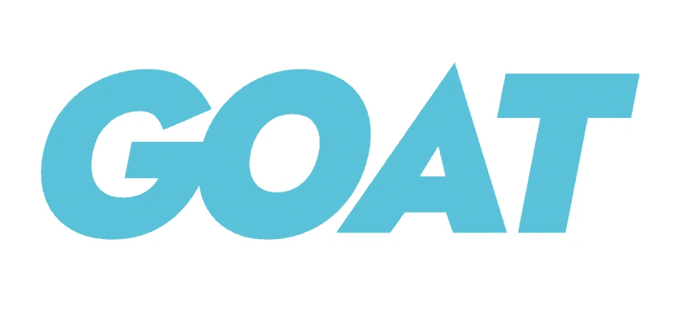

# 一个关于围棋更美好未来的命题

> 原文：<https://itnext.io/a-proposition-for-a-better-future-for-go-a0d0b43d086a?source=collection_archive---------2----------------------->

这是一篇由 3 篇文章组成的系列文章的总结文章，提出了围棋更美好的未来。在之前的文章中，我们[讨论了语言的强势一面](https://medium.com/@avivcarmis/what-makes-go-the-best-language-159322c2206a)，[展示了有问题的一面](https://medium.com/@avivcarmis/we-need-to-talk-about-the-bad-sides-of-go-568a1e5adbc6)。如果你错过了这些，我建议回头看看，因为它们为这一个提供了重要的背景。

## 本系列的更多内容

*   [是什么让 Go 成为最好的语言](https://medium.com/@avivcarmis/what-makes-go-the-best-language-159322c2206a)
*   我们需要谈谈围棋的不好的一面
*   [一个更美好未来的命题](https://medium.com/@avivcarmis/a-proposition-for-a-better-future-for-go-a0d0b43d086a)

如果您将社区约定和命名问题与前一篇文章中提出的异步返回值问题结合起来，您最终会得到**非常流行的库**发布代码，其中包含复杂的 100 多行函数，使用单字母的未记录变量，在包的另一端声明。这是非常不可读和不可维护的，而且非常普遍。此外，与其他现代语言不同，Go 不提供任何类型的运行时值安全。这导致了许多**与值相关的运行时问题**，这些问题很容易避免。

我认为作为一种语言和一个社区，Go 非常努力地让自己与众不同。一种“*其他语言也有不好的地方，* ***我们会做一切不同的事情*** ”的方法。其他语言有没有犯设计错误？当然，不可否认的是，C# 和 Java 中的[空指针](https://en.m.wikipedia.org/wiki/Tony_Hoare#Apologies_and_retractions)和检查异常[是被设计者认为是错误的**决策的常见例子。**](https://www.artima.com/articles/the-trouble-with-checked-exceptions)

这些年来，面向对象的方法被滥用了吗？最可怕的事情发生了！在[他的著名演讲](https://commandcenter.blogspot.com/2012/06/less-is-exponentially-more.html)中，罗布·派克(围棋的共同设计者)说

> 如果说 C++和 Java 是关于类型层次和类型分类的，那么 Go 就是关于组合的。

事实上，组合和继承只是克服代码重复的不同方法。构图有其[的好处](https://en.wikipedia.org/wiki/Composition_over_inheritance#Benefits)和[的弊端](https://en.wikipedia.org/wiki/Composition_over_inheritance#Drawbacks)。在 Pike 的声明发表 10 年后，我听到很多地鼠抨击 Java 或 C++以及他们的 OOP 方法，声称人们滥用继承。让我们明确一点——人们也会滥用作文。给他们时间。😌由于函数式编程**的兴起，几十年来组合相对于继承的优势可能会达到这个目的。与此同时，我看不出它有什么好处**盲目拒绝好的实践**和来自其他语言的约定。相反，我们应该**仔细检查我们应该采用什么**。几十年的其他语言的经验一定是有价值的。在我看来，他们做了很多。**

# 对更美好未来的主张

我希望看到一个编译时环境，它看起来更像 Go，但是允许开发者更富于表现力，以获得可维护性和运行时安全性。但与此同时，允许 Go 语言本身基本保持不变，而不是像我们许多地鼠担心的那样演变成新的东西。作为地鼠，**为什么我们的工具集中没有两个工具**？🔧🪛

goat——Go 编程语言的扩展版本，旨在提高安全性和可维护性

[介绍—**色鬼**](https://github.com/goatlang/goat) **。一个新的编译时环境将产生标准的、兼容的、高性能的 Go 文件，这些文件与任何其他 Go 项目完全兼容。这意味着他们可以导入常规的 Go 文件，也可以安全地从任何其他 Go 文件导入。想围绕山羊的设计和规格点燃一场彻底的讨论，听听大家的看法。地鼠和非地鼠。**快来** [**加入讨论**](https://github.com/goatlang/goat/issues) ，我们需要你的投入！**

Goat 可以以多种方式实现，从完全透明的编程语言到简单的 **Go 代码生成工具**。然而，在这一点上，我们有意避免深入研究实现细节，并希望将重点放在 spec 上。想象你自己在这样一个令人兴奋的 Go-code 环境的无限可能性空间中，你看到了什么？通过开放新的 GitHub 问题来提出新的语法和约定规则，或者通过在开放问题中加入讨论来加入讨论。为了提高安全性和可维护性，你会对 Go 的编译时间做什么改变，并对 Goat 的锻造规范提出你的看法。

## 碎片化呢

让我们花一点时间回顾一下上一篇文章中提出的解决方案，并讨论它们的一致性和简单性。让我们确保为 Go 留有空间，以保持简单、一致和碎片整理。我们不应该有超过一种可能的方式来表达一些东西。

*   添加可见性修饰符——为了保持碎片整理，可见性应该只由可见性修饰符派生**。换句话说，大写和小写符号不会影响它们的可见性。**
*   将内置符号移动到限定了作用域的方法和函数中——内置函数的行为(例如`cap`、`len`和`make`)应该只作为它们各自类型的方法和函数来提供。获取切片长度的唯一方式应该是通过调用`slice.Len()`。内置符号将不可用。
*   添加严格的 nil 支持——在不同的复杂程度下，有几种不同的方法可以实现这一点。不管怎样，编译器应该**防止给不可空的变量**赋值零值，并防止**在没有初始检查的情况下取消对可空变量**的引用。对于那些不熟悉类似机制的人来说，可能需要一两分钟才能掌握。无论哪种方式，都不应该在过程中引入碎片。
*   添加 enum 支持——enum 支持不应与 Go 中当前存在的任何机制重叠。当你声明一个类型**必须**持有几个可能值中的一个时——enum 应该是你的选择，因为没有其他机制支持它。
*   支持结构中的初始值—强制结构字段初始值的机制必须集成到现有机制中。换句话说，我们应该支持**在当前结构语法**中计算和提供结构字段的初始值。不应引入重复或分割。
*   添加常量赋值——变量的每个声明都应该**指出它是常量还是变量**。关于这一点，我要补充的是，它需要**移除对速记变量赋值** ( `:=`操作符)的支持，这目前在 Go 语法中造成了碎片。
*   添加对`go`关键字的承诺支持——需要注意的是，添加对承诺的支持不会引入新的并发模型。相反，它应该简单地提供内置支持来跟踪被触发的 goroutines 的执行并获取它们的结果。这是 Go 目前不支持的，添加它应该是一致的，并进行碎片整理。

不同意什么？提交一期[新山羊](https://github.com/goatlang/goat/issues/new)让我们知道。

## 其他类似 Go 的语言呢？

完全披露——我只是在撰写本系列时才了解到 [vlang](https://vlang.io/) 项目。在写这些文字的时候，我仍然在学习 vlang 的细节，并且我一直在寻找类似的项目。据我所知，vlang 是一种神奇而强大的语言，拥有设计精美的编译时和运行时环境。话虽如此，`vlang`和类似的举措和山羊**还是有本质区别的。当其他项目致力于创造新的令人兴奋的语言时， **Goat 则致力于增强现有语言的能力**。我相信 Go 是一种神奇的语言，有强大的运行时和令人惊叹的生态系统。我不想失去这些。**

# 摘要

在总结了 Go 的优点和缺点之后，我们想把精力集中在定义 Goat 的规范上——Go 的扩展版本，旨在提高安全性和可维护性。这个项目将允许 Go 保持简单和高效，同时允许社区尝试一种扩展的风格。Goat spec 应该由社区来驱动，所以它需要任何 Gopher 和非 Gopher 的意见和贡献。[来加入讨论](https://github.com/goatlang/goat/issues)。❤️