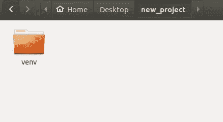
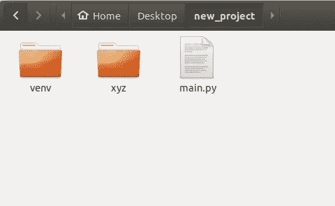
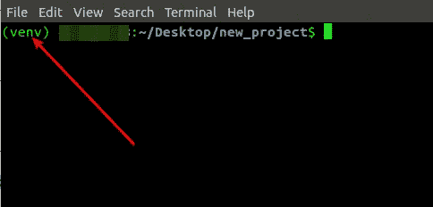

# 如何设置 Python 虚拟环境的快速指南[Windows、Linux 和 Mac]

> 原文：<https://itnext.io/a-quick-guide-on-how-to-setup-a-python-virtual-environment-windows-linux-mac-bf662c2c77d3?source=collection_archive---------1----------------------->


设置虚拟环境

这篇文章最初发表在我的博客上——https://thecodingpie.com

虚拟环境是一种工具，它有助于将您当前的项目及其所有依赖项与您的主系统和您正在处理的其他项目隔离开来。

为了更清楚一点，想象一下这个场景——您有两个 Django 项目，即`ProjectOne`和`ProjectTwo`。不幸的是，你的`ProjectOne`想在 Django 1.0 中运行，而你的`ProjectTwo`需要 Django 3.0。你会怎么做？如果您在系统上全局安装 Django，那么就不可能满足上述条件。这就是虚拟环境概念派上用场的地方。如果你为你的两个项目设置了一个虚拟环境，那么每个项目和它的所有依赖项将会在它自己的虚拟环境中相互隔离，两者不会混淆。所以你的`ProjectOne`可以在自己的环境中使用 Django 1.0，而`ProjectTwo`可以在 Django 3.0 中工作。因此，我们可以在任何时候放心地进行我们的项目！明白了吗？

**为每一个新的 Python 项目创建一个新的虚拟环境总是一个好的做法。**

通过使用不同的 python 模块，有许多方法可以创建虚拟环境，例如:

*   **virtualenv**
*   **pyvenv**
*   **venv**

但是我们要用的是 **venv** 模块。如果您使用的是较新版本的 Python，那么 [**venv**](https://docs.python.org/3/library/venv.html) 模块是创建和管理虚拟环境的首选方式。幸运的是， **venv** 默认包含在 **Python 3.4** 及更高版本中。

**因此，在继续之前，请满足以下要求，然后继续:**

1.  你应该已经安装了最新版本的 **Python** (任何高于 Python 3.4 的版本)。
2.  您应该已经将 Python 添加到您的**环境路径**变量中。
3.  你应该已经安装了 **venv** 。如果你用的是最新版本的 Python，就不用担心这个了。

如果你**满足所有这三个条件**，那么你就可以**着手创建虚拟环境**、**，否则请先完成它们，然后继续。**

有了这些东西，现在您就可以在 Windows、Linux 和 macOS 中使用 **venv** 安装和**激活**python 3 虚拟环境了。

所以让我们这样做吧…

# 步骤 1:创建虚拟环境

现在我们都在同一个页面上，我们都有最新版本的 **Python** (或至少 3.4+)，我们已经将 Python 添加到了**环境路径**变量中，并且我们已经安装了 **venv** 。

是时候创建一个虚拟环境了。

*   打开您的终端窗口，并导航到您想要设置虚拟环境的文件夹。然后键入:

```
python3 -m venv name_of_your_venv
```

记住用您想给虚拟环境起的任何名字替换`name_of_your_venv`。

*   现在，您应该有一个目录，其名称如下所示:



我把我的虚拟环境命名为“venv”

**注意:**我总是在我正在做的项目的根目录下创建 **venv** 文件夹。例如，如果我的项目根目录的名称是 **new_project** ，如上所示，那么我将直接在我的根文件夹中创建虚拟环境文件夹。有些人在 **venv** 文件夹中创建文件，不要这样做，**不要在 venv 文件夹中创建你的项目文件。相反，将这个 **venv** 文件夹作为**兄弟文件夹**，并在这个 **venv** 文件夹之外创建您的项目文件和其他文件夹，如下所示:**



您不必创建这些文件和文件夹

# 步骤 2:激活您的虚拟环境

确保您仍然在终端的同一个目录中。

根据您的操作系统和您使用的 shell，激活虚拟环境会有所不同，因此，以下任何一项符合您的规范。

# Windows 操作系统

*   如果您使用的是 **cmd** ，请执行以下操作:

```
name_of_your_venv\Scripts\activate.bat
```

*   如果您使用的是 **PowerShell** ，那么:

```
name_of_your_venv\Scripts\Activate.ps1
```

*   如果您使用的是 **PowerShell Core** ，那么:

```
name_of_your_venv/bin/Activate.ps1
```

# Linux/Mac

*   如果您使用的是 Linux/Mac，如果您使用的是 **bash/zsh** ，那么键入以下内容:

```
source name_of_your_venv/bin/activate
```

*   如果你正在使用**鱼**，那么:

```
source name_of_your_venv/bin/activate.fish
```

*   如果你 **csh/tcsh** ，那么:

```
source name_of_your_venv/bin/activate.csh
```

就是这样！

如果您正确完成了上述所有步骤，那么您将会看到类似如下的内容:



如果您看到前缀名为 _of_your_venv，那么您已经成功激活了虚拟环境

现在，您可以安装任何您想要的依赖项，它将被隔离在您现在创建的虚拟环境中。

*   最后，如果您想离开虚拟环境，只需键入:

```
deactivate
```

既然**前缀**早就没了。

# 包扎

希望这个指南能帮助你建立自己的虚拟环境。并且永远记住为你工作的每一个新的 Python 项目使用一个新的虚拟环境。

如果你有任何错误，请在下面评论。

谢谢大家！