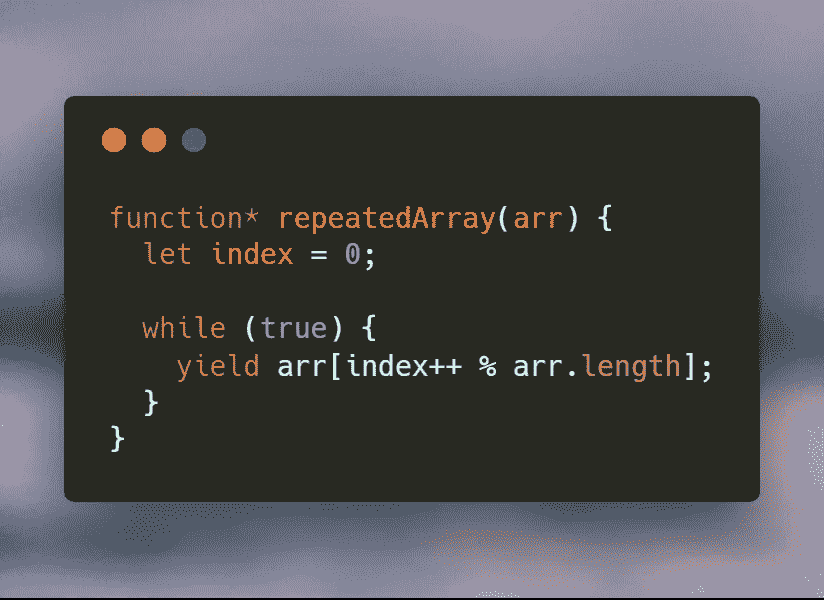

# ES6 发电机的快速实用用例

> 原文：<https://itnext.io/a-quick-practical-use-case-for-es6-generators-building-an-infinitely-repeating-array-49d74f555666?source=collection_archive---------1----------------------->

## 构建无限重复的数组

# 前言

您可能听说过 ES6 生成器，也许您甚至学习过语法，您可能想知道它们在现实生活中到底有什么用。

## 定义(从 [MDN](https://developer.mozilla.org/en-US/docs/Web/JavaScript/Reference/Statements/function*)

> *发电机是可以退出并在以后重新进入的功能。它们的上下文(变量绑定)将在重入时被保存。*

你可能会想，“*好吧，但是我为什么要这么做呢？*“事实证明，有从简单到复杂的一系列用例，其中许多都涉及到承诺异步请求(async/await 构建在生成器之上)。我的目标是通过一个简单的、真实的例子，向您提供理解它们如何工作的第一步，以便您开始注意到什么时候生成器是您自己代码中问题的最合适的解决方案。开始了。

# 用例

我正在构建一个应用程序，我的用户可以计算 3 周的锻炼周期，并设置在周期内每周工作 3 至 7 天。每个个人健身程序都基于以下 4 个举重项目中的一个:*深蹲*、*卧推*、*硬举*和*头顶推举*，并且每个连续的健身程序都必须基于按此顺序的下一个举重项目:

*   蹲着的
*   长凳，长椅
*   硬拉
*   高架压力机
*   蹲着的
*   长凳，长椅
*   硬拉
*   高架压力机
*   …

你大概可以看到这是怎么回事。

我需要我的代码来说，“*给我下一次锻炼的电梯，然后下一次，然后下一次，等等。当到达列表的末尾时，从头开始，永远重复，直到我生成了 3 周周期的所有锻炼。*“这是我最初实现它的简化版本，**没有**生成器:

不算太差，但可以更具宣示性。如果我们不必直接在我们的锻炼生成代码中跟踪那个*当前生活指数*不是很好吗？它降低了代码的可读性，感觉它属于自己的功能。下面是使用生成器函数的代码，我将在下面解释。

在这里，代码更具声明性和可读性。我们将索引跟踪逻辑抽象成一个通用的实用函数，称为 *repeatedArray* 。 *function ** 语法告诉 JavaScript 这是一个生成器函数。我们所要做的就是请求“重复数组”中的下一项，我们的生成器会将它交给我们。最好的部分是**我们不必担心它是如何在我们的生成器函数之外发生的。**

事情是这样的:

当我们在第 9 行调用 repeatedArray 函数本身(读取两次)时， *repeatedArray* 返回一个**迭代器**对象*。迭代器存储在名为 *nextLiftGenerator* 的变量中。理解函数中的代码此时还没有被执行是很重要的。只有当我们在 *nextLiftGenerator* 迭代器上调用 *next()* 函数时，该函数才会被执行，并且直到它达到 *yield* 时才会被执行。我们的生成器给我们这个值，然后等待直到下一个调用继续执行，直到它达到另一个 *yield* ，然后返回这个值。有道理吗？就是这样！*

这显然是一个非常简单的例子，但希望它能帮助您理解生成器是如何工作的，以及为什么生成器是 JavaScript 中如此强大的功能。

如果你喜欢这篇文章，请在 [Twitter](https://twitter.com/ReisnerShawn) 和 [Instagram](https://www.instagram.com/shawn.webdev/) 上关注我，了解更多有趣的内容！

编码快乐！