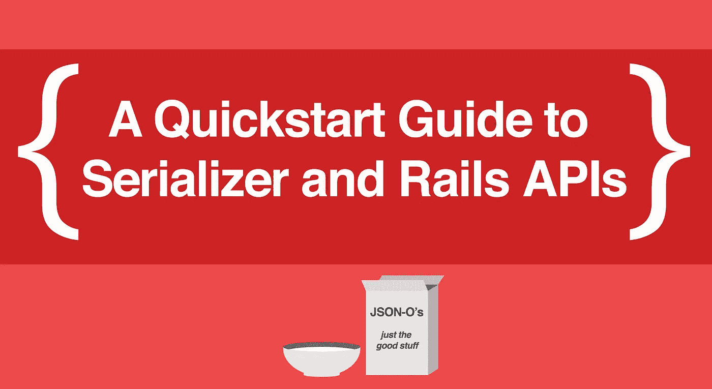
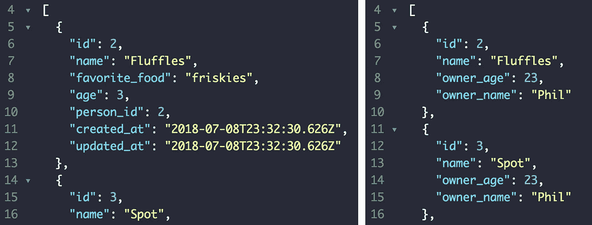

# 在 Ruby on Rails API 中使用序列化程序的快速入门指南

> 原文：<https://itnext.io/a-quickstart-guide-to-using-serializer-with-your-ruby-on-rails-api-d5052dea52c5?source=collection_archive---------0----------------------->



Ruby on Rails 是 API 的绝佳选择，因为渲染 JSON 就像`render :json`一样简单。然而，开箱即用，Rails 提供了一些非常难看的数据。进入[序列化器](https://github.com/rails-api/active_model_serializers/blob/v0.10.6/docs/general/getting_started.md)，gem 允许我们格式化我们的 JSON 而不需要在前端动一根手指。我们可以只选择*我们想要的*信息，也可以通过一个请求访问我们的关系。看一下这个简单的例子，比较一下结果:



左边是标准，右边是序列化

# 装置

在您完成设置您的 [API Rails 项目](https://hashrocket.com/blog/posts/how-to-make-rails-5-api-only)之后，您只需要将序列化程序 gem 添加到您的 gem 文件`gem 'active_model_serializers'`中，然后运行`bundle install`。感谢 Rails 的魔力，这就是它所需要的一切。

# 建立我们的标准文件

对于这个例子，我们将保持简单，只有人和他们的猫，在这种情况下，一个“属于”“有很多”的关系。所以，以下是你应该模仿的所有东西:

复制之后，不要忘记创建、迁移和播种您的数据库。

# 设置序列化程序文件

首先，让我们得到所有的猫，只有他们的名字，身份证，和最喜欢的食物。为此，要么使用`rails g serializer cat`，要么手动创建一个包含以下内容的/app/serializer/cat _ serializer . Rb 文件:

```
class CatSerializer < ActiveModel::Serializer
  attributes :id, :name, :favorite_food
end
```

因为您安装了序列化程序，所以 Rails 现在会在呈现资源之前查看这个文件夹。每个模型在这个文件夹中都需要一个相应的序列化程序文件。这是因为当你将一个对象传递给控制器中的一个`render :json`行时，现在是由序列化程序决定实际显示哪些属性。通过访问您的`/cats`路线来测试一下，看看 JSON 得到了什么渲染，然后移除`favorite_food`属性。现在，尝试为 Person 构建序列化程序。

# 引入关系

你*能不能*做这样的事去见猫的主人:

```
class CatSerializer < ActiveModel::Serializer
  attributes :id, :name, :person
end 
```

这很好，Rails 知道每个`Cat`都属于一个`Person`，所以它会渲染出完整的对象…但这是序列化器的全部意义。我们不需要****完整的**对象，只需要我们需要的属性。为此，我们可以使用自定义函数来缩小搜索范围:**

```
class CatSerializer < ActiveModel::Serializer
  attributes :id, :name, :owner 
  def owner
    {owner_id: self.object.person.id, 
     owner_name: self.object.person.name}
  end 
end
```

**在我们的属性中，我们告诉序列化程序使用`owner`方法，然后我们将其定义为返回一个结构化散列。这种方法的另一个好处是，我们可以将模糊的“人”头衔重新定义为前端的“所有者”。我们的`Person`类也可以以类似的方式显示他们的每只猫:**

```
class PersonSerializer < ActiveModel::Serializer
  attributes :id, :cats
  def cats 
    self.object.cats.map do |cat|
      {name: cat.name, 
       age: cat.age,
       favoriteFood: cat.favorite_food}
    end 
  end 
end
```

**这里我们得到了真正的*花式并覆盖了默认的`cats`方法以更好地适应我们的需要。因为我们的前端是 JS，所以我们也给我们的散列键一个有效的 JS 变量名，`favoriteFood,`，这样一旦它到达那里就可以很容易地[析构](/how-to-use-object-destructuring-in-modern-javascript-59758ebfb778)。***

***关系不一定只是“属于”“有很多”的关系，“多对多”也可以，还有“有一个”的关系。***

# ***那是什么东西呢？***

***你会注意到我们正在通过`self.object`做所有这些。这里的`self`指的是`<CatSerializer>`(或`<PersonSerializer>`)实例，它有一个名为`object`的属性，这个属性是它当前正在经历的 JSON 对象。我之所以说现在，是因为序列化程序本质上是遍历所有给它的东西。如果它在一个索引路径上，它将遍历内部的每个对象并格式化它，但是它将对来自`show`路径的单个对象做同样的事情。还有，我喜欢显式，但你不一定要，那个`self`不放就是隐式。***

# ***这些只是基础***

***您可以使用一个 [ApplicationSerializer 文件或一些 show 方法来给出一个 html 模板](https://www.youtube.com/watch?v=Ah5SaN1linA)，为不同的路由创建多个自定义序列化器，或者跳转到[文档以获得更多信息](https://github.com/rails-api/active_model_serializers/blob/v0.10.6/docs/general/serializers.md)，但是我在这里概述的内容应该足以让您的 API 同时起步。***

***大家编码快乐，***

***麦克风***