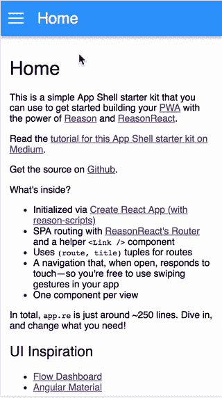
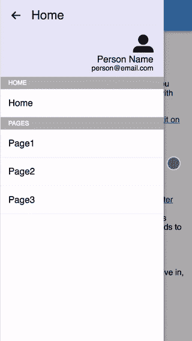

# ReasonML 教程:构建应用程序外壳

> 原文：<https://itnext.io/a-reasonml-tutorial-building-an-app-shell-dd7cc617d0c5?source=collection_archive---------3----------------------->

> *注意:这是关于从反应过渡到理性的“理性之旅”系列的一部分。敬请关注。还会有更多这样的事情发生！* [*<上一篇*](https://medium.com/@RRafatpanah/a-journey-to-reason-c408a87a54de)*|*[*<<从第 1 部分开始*](https://medium.com/netscape/a-journey-to-reason-2c2c4cddc012)



[*点击这里在 LinkedIn 上分享这篇文章*](https://www.linkedin.com/cws/share?url=https%3A%2F%2Fitnext.io%2Fa-reasonml-tutorial-building-an-app-shell-dd7cc617d0c5)

让我们构建一个应用程序外壳，它可以作为您的 web 应用程序的起点。

首先，我们将介绍 [Reason App Shell Start Kit](https://github.com/persianturtle/reason-app-shell-starter-kit) 项目，并展示如何使用和定制它。

然后，我们将展示一个 Reason & ReasonReact 教程，在其中我们使用 [Create React App](https://github.com/reasonml-community/reason-scripts) 作为基础来构建这个项目。本教程假设对[原因](https://reasonml.github.io/)原因&原因[原因反应](https://reasonml.github.io/reason-react/)有一个基本的了解，并有反应的背景。

> 如果你想知道 ReasonML 是什么，为什么像我这样的前端 web 开发人员对使用它感兴趣，请查看本系列的第一篇文章。

# 原因介绍-应用程序-外壳-入门套件

github:[https://github . com/persianturtle/reason-app-shell-starter-kit](https://github.com/persianturtle/reason-app-shell-starter-kit)

该项目旨在作为 web 应用程序的起点。它带有以下内容:

*   [react 内置路由器](https://reasonml.github.io/reason-react/docs/en/router.html)
*   与路由器一起工作的助手组件
*   保持我们的**路线** & **页面标题**同步的好方法
*   一个**导航** **抽屉**，当它打开时，对触摸有很好的反应

该项目使用 [Create React App](https://github.com/reasonml-community/reason-scripts) ， [Reason](https://reasonml.github.io/) ，[Reason React](https://reasonml.github.io/reason-react/)&[Sass](https://sass-lang.com/)，没有其他依赖关系。它有意保持简单和小巧，以便易于编辑来满足您的需求。

# 如何使用它

1.  克隆[回购](https://github.com/persianturtle/reason-app-shell-starter-kit)

2.`npm install && npm start`

3.在`app.re`内做一些编辑

*   自定义您的应用程序的**路线**类型。

```
type **route** =
| Home
| Page1
| Page2
| Page3;
```

> 注意:**路线**是 OCaml/Reason 中的变体类型。如果这对你来说听起来很陌生，那就看一看[文档](https://reasonml.github.io/docs/en/variant.html)。

*   定制路由器的 **watchUrl** 函数，将各种路径映射到组件。点击阅读 ReasonReact 路由器[的威力。](https://reasonml.github.io/reason-react/docs/en/router.html)

```
subscriptions: self => [
  Sub(
    () =>
      ReasonReact.Router.**watchUrl**(url =>
        switch url.path {
        | ["page1"] => self.send(**Navigate**((Page1, "Page1")))
        | ["page2"] => self.send(**Navigate**((Page2, "Page2")))
        | ["page3"] => self.send(**Navigate**((Page3, "Page3")))
        | _ => self.send(**Navigate**((Home, "Home")))
        }
      ),
    ReasonReact.Router.unwatchUrl
  )
],
```

**导航**是一个[动作](https://reasonml.github.io/reason-react/docs/en/state-actions-reducer.html)，接受一个 **routeWithTitle** 并设置 app 当前 **route** &页面标题。

```
type **routeWithTitle** = (**route**, string);
```

正如您可能已经怀疑的那样， **routeWithTitle** 是一个[元组](https://reasonml.github.io/docs/en/tuple.html)，它将**路由**类型与页面标题配对。这保证了我们在导航到一条路线时不会忘记设置页面标题。

> 到目前为止，我们只更改了应用程序状态。现在让我们更新使用该状态的渲染函数。

*   定制渲染功能，根据当前**路径**有条件地渲染组件。

```
<main>
  (
    switch **route** {
    | Home => <Home />
    | Page1 => <Page1 />
    | Page2 => <Page2 />
    | Page3 => <Page3 />
    }
  )
</main>
```

> 注意:按理说，`<Home />`映射到一个名为`home.re`的文件，不需要手动“包含”`home.re`。

*   自定义渲染功能以更改导航抽屉中的菜单。

```
<label> (ReasonReact.stringToElement("home")) </label>
<ul> <li> <**Link** **href**="/" **label**="Home" /> </li> </ul>
<label> (ReasonReact.stringToElement("pages")) </label>
<ul>
  <li> <**Link** **href**="/page1" **label**="Page1" /> </li>
  <li> <**Link** **href**="/page2" **label**="Page2" /> </li>
  <li> <**Link** **href**="/page3" **label**="Page3" /> </li>
</ul>
```

> `<Link href="..." label="..." />`组件使用一个点击处理程序呈现一个`<a href={href}>{label}</a>`,该处理程序调用 [ReasonReact。Router.push(href)](https://reasonml.github.io/reason-react/docs/en/router.html) 并更新 URL。

就是这样！

随意用你的自定义风格编辑`app.scss`，或者项目的任何其他部分。创建您的定制组件(*例如* `<Page1 />`)，并享受构建您的 web 应用程序的乐趣！

我很想听听你是如何根据自己的需求定制的。如果你想帮助改进这个项目，我们非常欢迎[拉请求。](https://github.com/persianturtle/reason-app-shell-starter-kit)

# 让我们建造它！

我们将从[创建 React App](https://github.com/reasonml-community/reason-scripts) 开始，一起构建这个项目。

首先，我们将构建一个不响应触摸的基本应用程序外壳，然后我们将致力于触摸功能。触摸功能包括:

*   打开时，导航抽屉应响应触摸移动事件(如[演示](https://s3.amazonaws.com/persianturtle/demo.gif)所示)
*   如果用户在 50%阈值(半开)后移动导航抽屉，抽屉应该关闭，否则保持打开
*   如果用户以某个最小速度滑动，抽屉应该关闭——即使还没有达到 50%的阈值

我们现在要开发的功能包括:

*   激活导航抽屉
*   当导航抽屉打开时，动画显示隐藏主要内容的覆盖图
*   导航抽屉打开时防止正文滚动
*   当路线改变时，关闭导航抽屉
*   在外部点击时关闭导航抽屉

> 注意:如果您还没有，[安装原因-cli](https://reasonml.github.io/docs/en/global-installation.html) & [设置您的编辑器](https://reasonml.github.io/docs/en/editor-plugins.html)。另外，通过`npm install -g bs-platform`安装 BuckleScript。

## 用 [Create React App](https://github.com/reasonml-community/reason-scripts) 初始化你的开发者环境

`yarn create react-app my-app --scripts-version reason-scripts`

## 移除`index.re`中<app>的信息道具</app>

在第 5 行，变成了

## 用以下内容替换 app.re:

现在这是一个有状态的组件，它只是呈现:

此处包含`app.scss`([回购](https://github.com/persianturtle/reason-app-shell-starter-kit)已经配置为使用 SASS)。

这里包括`index.css`。

运行`npm run start`，我们应该会看到一个空白页。太好了！让我们回顾一下`app.re`里发生了什么。

> 在继续之前，确保你已经阅读了[有状态组件文档](https://reasonml.github.io/reason-react/docs/en/state-actions-reducer.html)。

目前有两种可能的操作:

1.  **导航(路径宽度标题)**
2.  **切换菜单(bool)**

在国务院，我们关心两件事:

```
type **routeWithTitle** = (**route**, string);type **nav** = {isOpen: bool};...type **state** = {
  ...,
  **routeWithTitle**,
  **nav**
};
```

首先， **routeWithTitle** 包含当前路径和页面标题。第二， **nav** 包含导航抽屉的状态。

我们的**减速器**和**渲染**字段目前大部分是占位符。让我们现在解决这些问题。

这看起来很多，但这可能是因为我已经内联了 SVG。让我们来关注一下亮点:

```
let (**route**, title) = self.state.**routeWithTitle**;
```

还记得 **routeWithTitle** 是一个元组吗？我们可以就这样破坏当前的**路线**和标题。

```
className=("App" ++ (self.state.**nav**.isOpen ? " overlay" : ""))
```

就像在 ReactJS 中，我们可以基于状态有条件地添加 CSS 类。在这种情况下，`app.re`呈现以下两种情况之一:

`<div class=”App”>`

或者

`<div class=”App overlay”>`

以及相应的 CSS:

因此，当导航抽屉打开时，`<App />`获得了`overlay`类，这导致一个覆盖淡入到`<App/>`的内容上。

> 注意:对于`overlay`类，**变换不在`.App:after`上转换**。但是，如果没有`overlay`类，它就是——有一个延迟。这是因为我们希望覆盖图在导航抽屉关闭之前保持正确。否则，覆盖将突然消失，而不是很好地淡出。

当导航抽屉应该打开时，`<nav />`元素获取`active`类。

```
<nav className=(self.state.**nav**.isOpen ? "active" : "")
```

在标题中，单击锚标记会调度一个动作:

```
<header>
  <a
    **onClick**=(
      **event** => {
        ReactEventRe.Mouse.stopPropagation(event);
        **self.send**(**ToggleMenu**(! self.state.**nav**.isOpen));
      }
    )>
```

动作是 **ToggleMenu(！self.state.nav.isOpen)** 。接下来会发生什么？就像 Redux 中一样，reducer 处理所有的状态变化。您向**减速器**发送一个**动作**，然后，基于该动作，**状态**发生变化。

我们可以采取什么行动？它们是在我们的动作类型中定义的。

```
type **action** =
  | **Navigate**(**routeWithTitle**)
  | **ToggleMenu**(bool);
```

在**渲染**功能中，我们`self.send(...)`了一个动作，它调用了我们的**减速器**:

```
**reducer**: (**action**, **state**) =>
  switch **action** {
  | **Navigate**(_routeWithTitle) => **ReasonReact.NoUpdate**
  | **ToggleMenu**(isOpen) =>
    ReasonReact.Update({
      ...state,
      nav: {
        isOpen: isOpen
      }
    })
  },
```

如果**动作**是**切换菜单**，我们将 **state.nav.isOpen** 设置为**切换菜单**的参数。

但是——我们可以做得更好！让我们在导航抽屉打开时防止正文滚动。

在正常的 HTML5 世界中，这意味着在`<html>`元素上设置`overflow: hidden`。但我们不能理智地这么做，对吗？

我们可以。

> ReasonML 太神奇了。为什么？因为尽管它适合复杂的应用程序，但当你想构建简单的东西时，它不会妨碍你。

让我们看看解决这个问题的两种方法。

**解决方案 1** : *Raw* JavaScript

而不是 **ReasonReact。更新**，我们将使用 **ReasonReact。UpdateWithSideEffects** ，采用回调做副作用。点击了解更多关于[的信息。](https://reasonml.github.io/reason-react/docs/en/state-actions-reducer.html#state-update-through-reducer)

在回调中，我们将根据导航的状态设置`<html>`元素的样式。

什么？我们是不是在 Reason 里面写了原始的 JavaScript？是的。


**解决方案 2** :类型安全

当运行原始 JavaScript 时，我们把类型安全扔出了窗外。有时候这很好，有时候不太理想。理由让你来决定。

此外，有时只使用 JavaScript 并在以后弄清楚如何转换成类型安全的方法也不错。

这里，我们通过 BuckleScript 的**外部**声明绑定到`documentElement`。在 reducer 中，我们使用 [Reason 的对象语法](https://reasonml.github.io/docs/en/object.html)来设置`documentElement`的样式。

> 注意:Reason/OCaml 通过 BuckleScript 与 JavaScript 有极好的互操作性。点击了解更多关于那个[的信息。](https://bucklescript.github.io/)

好了，让我们实现减速器的**导航**箱。

```
| **Navigate**(**routeWithTitle**) =>
  **ReasonReact**.**UpdateWithSideEffects**(
    {...state, **routeWithTitle**},
    (self => **self**.**send**(**ToggleMenu**(false)))
  )
```

我们用当前的路线和页面标题更新状态，并再次调用一个副作用，在这里我们调度另一个动作来关闭导航。

我们也可以像这样直接更新导航状态:

```
| **Navigate**(**routeWithTitle**) =>
  **ReasonReact**.**Update**({
    ...state,
    **routeWithTitle**,
    **nav**: {
      isOpen: false
    }
  })
```

而且，由于我们正在应用程序状态中更改当前路由，我们可以基于该状态有条件地呈现组件。

```
<main>
  (
    switch **route** {
    | Home => <Home />
    | Page1 => <Page1 />
    | Page2 => <Page2 />
    | Page3 => <Page3 />
    }
  )
</main>
```

只要确保您已经在`home.re`、`page1.re`、`page2.re`和`page3.re`中定义了组件。

这里有一个简单的无状态`<Page1 />`组件:

恭喜你。我们现在有一个简单的应用程序外壳，带有一个导航抽屉和一个路由器。应用程序外壳根据当前路线呈现一个“主”组件。此外，如果你想*比如说*在每条路线上渲染多个组件，你可以在你的渲染函数中使用任何你想要的逻辑。

> 注意:因为我们对 **routeWithTitle** 使用了一个元组，所以我们保证我们的路由和页面标题永远不会不同步(当然，除非我们在分派`self.send(Navigate((Home, "Wrong Title")))`时简单地包含了错误的标题)。但是`self.send(Navigate(Home))`将在编译时失败——因为 **Navigate** 只接受类型为 **routeWithTitle** 的参数。

只要有可能，就使用对你有利的类型系统来为你提供更强的保证。关于这方面的更多信息，请查看以下讲座:

*   理查德·费尔德曼的《让不可能的国家变得不可能》
*   [Patrick Stapfer:让不合理的状态成为不可能](https://youtu.be/P7dTPoxCg4w)
*   [有效毫升](https://youtu.be/-J8YyfrSwTk)

# 让我们添加触摸功能！

现在来看看酷的东西。

让我们想想我们想要什么。我们希望导航抽屉能对触摸做出反应，但具体是如何做到的呢？

我们知道，当用户在打开的抽屉上滑动时，我们希望导航抽屉移动。让我们从那里开始，重新审视。

将以下字段添加到 **state.nav** 中:

```
type **nav** = {
  isOpen: bool,
  **isSwiping**: ref(bool),
  **position**: list(float)
};
```

> 注意:请务必更新您的**初始状态**以反映这些新字段。

注意`isSwiping: ref(bool)` — **中的`ref`是一个*实例变量*。更新此变量不会导致 React 重新渲染。点击了解更多关于[的信息。](https://reasonml.github.io/reason-react/docs/en/instance-variables.html)**

**位置**是一个[列表](https://reasonml.github.io/docs/en/list-and-array.html)，我们将用它来跟踪触摸事件的 **clientX** 。

添加以下**动作**变型:

```
type **action** =
  | Navigate(routeWithTitle)
  | ToggleMenu(bool)
  | **TouchStart**(float)
  | **TouchMove**(float)
  | **TouchEnd**(float);
```

在我们的减速器中，我们将设置**状态。当导航抽屉打开时，在**触摸开始**动作时，导航正在擦拭**为**真**，在**触摸结束**动作时，设置**假**。

在**触摸开始**动作时，我们会将 **state.nav.position** 设置为一个只包含一个 **clientX** 值的列表。在**触摸移动**动作上，我们将把 **clientX** 值添加到列表中。

部分来自**减速器**场

既然我们现在有了一个 **clientX** 的列表，我们可以用`List.hd(...)`得到第一个元素，用`List.hd(List.rev(...))`得到最后一个元素。

我们称`x`为第一项(第一次触摸)，称`x'` ( *x* *质数*)为最后一次触摸。那么，`x’ -. x`就是用户滑动的距离。我们将使用这个距离通过 CSS 的`translateX`来转换导航抽屉。

然而，如果用户向右滑动，我们不希望翻译导航抽屉，因为它已经被打开到最大。

因此，我们首先检查`x' -. x`是否为正(向右滑动)，如果是，则返回`0.0`。

`x’ -. x > 0.0 ? 0.0 : x’ -. x`

部分来自**渲染**字段

瞧啊。我们现在翻译导航抽屉与用户的滑动同步。多酷啊！



…但是，它关不上！

现在，我们希望当用户的滑动达到或超过“半闭”标记时，导航抽屉关闭。那很简单！现在让我们假设导航抽屉的宽度是 300 像素。

> 注意:除了硬编码宽度，您还可以使用 ReactRef in Reason 来获取对 DOM 中导航抽屉的引用，并读取它的 clientWidth 属性。

我们可以只更新我们的 **TouchEnd** 动作来检查最新的 clientX 是否小于导航抽屉宽度的一半，如果是，则将 **state.nav.isOpen** 设置为 **false** 。

```
| **TouchEnd**(**clientX**) =>
  state.nav.isSwiping := false;
  if (**clientX** < **300.0 /. 2.0**) {
    ReasonReact.Update({
      ...state,
      **nav**: {
        ...state.nav,
        **isOpen**: **false**
      }
    });
  } else {
    ReasonReact.Update(state);
  };
```

快好了！最后一个目标是当用户用力滑动，但没有滑过“半闭”标记时，能够关闭导航。

为此，我们需要记录时间。

我们更新我们的位置列表以跟踪 **clientX** 以及**时间**。

```
type **nav** = {
  isOpen: bool,
  isSwiping: ref(bool),
  **position**: list(**(float, float)**)
};
```

> 注意:列表的参数是一个元组，所以我们需要双括号。

我们绑定 JavaScript 的`performance.now()`，并更新我们的**缩减器**。

在 **TouchEnd** 中，我们将使用以下公式计算最新两个位置对的速度:

`velocity = **Δx / Δt =** (x' -. x) / (t' -. t)`

事实证明，`-0.3 px/ms`或更小的速度是我觉得合适的阈值。同样，这是一个负数，因为用户应该只在左滑动时关闭导航抽屉。

我遇到的一个“陷阱”是当我试图做这样的事情时:

```
| **TouchEnd**(**clientX**) =>
  let **x'** = clientX;
  let **t'** = now();
  let velocity =
    switch state.nav.position {
    | [] => 0.0
    | [(**x**, **t**), ..._] => **(x' -. x) /. (t' -. t)**
    };
```

问题是 **TouchEnd** 的 **clientX** 和最后一个 **TouchMove** 的 **clientX** 是一样的，这样总会导致**速度**为 **0.0** 。

使用位置列表中的最后两个元素效果很好。

```
| TouchEnd(clientX) =>
  let velocity =
    switch state.nav.position {
    | [] => 0.0
    | [_] => 0.0
    | [(**x'**, **t'**), (**x**, **t**), ..._] => **(x' -. x) /. (t' -. t)**
    };
```

现在你知道了！用 Reason 和 ReasonReact 构建的支持离线的应用程序外壳。尽情享受吧！

检查[源代码](https://github.com/persianturtle/reason-app-shell-starter-kit)以查看最新的实现。

一如既往，敬请期待更多！