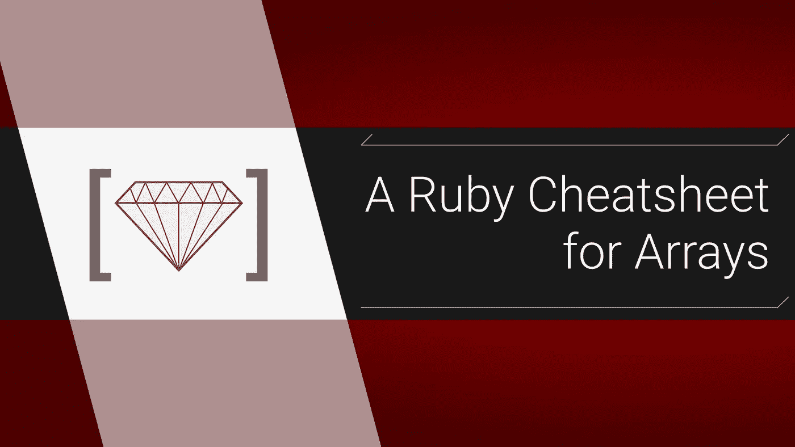

# 用于数组的 Ruby 备忘单

> 原文：<https://itnext.io/a-ruby-cheatsheet-for-arrays-c8e5275155b5?source=collection_archive---------1----------------------->

## 初学者和健忘的专业人士的参考



简单地说，在你面前有大量方便的 Ruby 数组方法。它很长，但我试图包括所有真正有用的东西。当使用一种方法时，一定要检查文档以获得更多信息。为了简短起见，我将在注释中写返回值，所以`arr # -> "stuff"`意味着`arr`的返回值是`“stuff”`。

# 创建数组

**创建一个新的空数组:** [数组#new](https://ruby-doc.org/core-2.5.0/Array.html#method-i-each_index)

```
**arr** = []
**arr2** = **Array.**new
```

**用值创建一个新数组:**

```
**arr_with_stuff** = [*"value"*, "*separated* *by* *comma*"] 
**arr_with_stuff2** = **Array**.new(["*a"*, "*b*", "*c*"])
**range_to_arr** = (1..9).to_a 
```

**创建重复值数组:**有时用多个重复值填充数组会很有帮助:

```
**arr** = **Array**.new(5, " ")
# -> [" ", " ", " ", " ", " "]
```

**使用快捷方式创建字符串数组:**使用`%w`快捷方式创建不带引号或逗号的字符串数组:

```
**arr** = **%w**(cat dog mouse 1 2)
*# ->* [*"cat", "dog", "mouse"*, "*1*", "*2*"]
```

**将字符串转换成数组:** [#split](https://ruby-doc.org/core-2.4.0/String.html#method-i-split) 将一个字符串拆分成一个数组。它需要一个字符串参数来决定在哪里拆分数组项，否则就按空格拆分。要单独获取每个字符，请指定`“”`作为参数:

```
**arr** = "this is a string”.split 
**arr** *# -> ["this", "is", "a", "string"]* *"hey"*.**split**("") *# -> ["h","e","y"]*
```

**奖励:将数组转换为字符串:** [#join](https://ruby-doc.org/core-2.5.0/Array.html#method-i-join) 做相反的事情，从数组创建一个新的字符串。它将一个字符串作为可选参数，该字符串将被插入值之间:

```
**arr** = **%w**(cat dog mouse)
**str** = **arr**.join(", ")
**str** *# -> "cat, dog, mouse"***str2** = **arr**.join
**str2** #-> "*catdogmouse*"
```

# 读取/获取值

**获取数组的长度:****和#size 都是别名**

```
**arr** = %w(cat dog mouse cow pig)
**arr.**length *# -> 5*
**arr.**size # *-> 5*
```

****获取索引值****

```
**arr**[0] # -> *"cat"*
**arr**[1] # -> *"dog"*
**arr**[100] # -> *nil*
```

****获取一个值的索引:**[#索引](https://ruby-doc.org/core-2.5.0/Array.html#method-i-index)**

```
**arr**.index("*dog*") # -> *1* **arr**.index("asdaf") # -> *nil*
```

****从后面获取索引处的值:**可以从数组的后面开始，使用负数:**

```
**arr**[-1] # -> *"pig"*
**arr**[-2] # -> *"cow"*
**arr**[-100] # -> *nil*
```

****获取索引处的值或默认值:** [#fetch](https://apidock.com/ruby/Array/fetch) 将返回索引处的值，或者它将给出默认参数，或代码块值。**

```
**arr**.fetch(0) # *-> "cat"*
**arr**.fetch(-1) # -> *"pig"*
**arr**.fetch(100) # -> raise a KeyError 
**arr**.fetch(100, "*nothing there*") # -> "nothing there" 
**arr**.fetch(100) { |**key**| "nothing at index #{**key**}" }
*# -> "nothing at index 100"*
```

****获取数组的一部分:**可以使用逗号或者[范围](http://www.tutorialspoint.com/ruby/ruby_ranges.htm):**

```
**arr** = [*"cat", "dog", "mouse", "cow", "pig"*]
**arr**[1,3] *# -> ["dog", "mouse", "cow"]*
**arr**[1..3] *# -> ["dog", "mouse", "cow"]*
**arr**[1...3] *# -> ["dog", "mouse"]*
**arr**[1..-1] *# -> ["dog", "mouse", "cow", "pig"]*
```

****检查数组中是否有值:** [#include？](https://ruby-doc.org/core-2.6.3/Array.html#method-i-include-3F)**

```
**arr** = %w(cat dog mouse)
**arr**.include?("*cat*") # *-> true* **arr**.include?("*zzz*") #*-> false*
```

# **添加和更新值**

****改变索引值:****

```
**arr** = **%w**(cat dog mouse)
**arr**[0] = *"lynx"*
**arr** *# -> ["lynx", "dog", "mouse"]*
```

****在数组末尾加一个值:**<<称为[铲运算符](https://stackoverflow.com/questions/10569529/ruby-difference-between-array-and-arraypush)，但也可以使用 [#push](https://ruby-doc.org/core-2.6.3/Array.html#method-i-push) 。这些方法修改原始数组:**

```
**arr** = %w(cat dog mouse)
**arr** << *"cobra"* 
*# returns changed array*
# -> ["cat", "dog", "mouse", "cobra"]**arr**.push("crow") 
*# returns changed array*
*# -> ["cat", "dog", "mouse", "cobra", "crow"]*# push can take multiple, << can't 
**arr**.push("*cow*", *"bee"*)
*# returns changed array*
*# -> ["cat", "dog", "mouse", "cobra", "crow", "cow", "bee"]*
```

****在数组的开头加一个值:** [#unshift](https://ruby-doc.org/core-2.6.3/Array.html#method-i-unshift)**

```
**arr** = %w(cat dog mouse)
**arr.unshift**(*"clam"*) 
*# returns changed array**# -> ["clam", "cat", "dog", "mouse"]***arr.**unshift(*"cow", "bee"*)
*# returns changed array*
*# -> ["cow", "bee", "clam", "cat", "dog", "mouse"]*
```

****在数组中间加一个值:**[#插入](https://ruby-doc.org/core-2.6.3/Array.html#method-i-insert)**

```
**arr** = %w(cat dog mouse)
**arr**.insert(1, "*cow*")
*# returns changed array
# -> ["cat", "cow", "dog", "mou*se"]**arr.**insert(1, *"bee", "pig"*)
*# returns changed array
# -> ["cat", "bee", "pig", "cow", "dog", "mouse"]*
```

# ****移除和删除数值****

****按值删除:**[#删除](https://ruby-doc.org/core-2.6.3/Array.html#method-i-delete)**

```
**arr** = %w(cat dog mouse)
**arr**.delete("*cat*") 
*# -> returns "cat"
arr # -> ["dog", "mouse"]***arr**.delete(*"cat"*) 
*# -> returns nil
arr # -> ["dog", "mouse"]***arr**.delete(*"whaaa?"*) { *"not found"* }   
*# -> "not found"**# leave original alone by subtracting arrays
# also lets you delete more than one item*
**arr** = %w(cat dog mouse pig cow)
**arr2** = **arr** - [*"cat", "mouse"*]
**arr2** *# -> ["dog", "pig", "cow"]*
**arr** *# -> ["cat", "dog", "mouse", "pig", "cow"]*
```

****按任意索引删除:** [#delete_at](https://ruby-doc.org/core-2.6.3/Array.html#method-i-delete_at)**

```
**arr** = %w(cat dog mouse)
**arr**.delete_at(0) *# -> "cat"*
**arr** # -> [*"dog", "mouse"*]
**arr**.delete_at(100) *# -> nil*
```

****删除最后一个值:** [#pop](https://ruby-doc.org/core-2.6.3/Array.html#method-i-pop)**

```
arr = %w(cat dog mouse)
arr.pop # -> *"mouse"*
**arr** *# -> ["cat", "dog"]*
**arr**.pop # *-> "dog"*
**arr**.pop *# -> "cat"* 
**arr**.pop *# -> nil*
```

****删除第一个值:** [#shift](https://ruby-doc.org/core-2.5.0/Array.html#method-i-shift)**

```
**arr** = %w(cat dog mouse)
**arr**.shift # -> "cat"
**arr** # -> [*"dog", "mouse"*]
**arr**.shift *# -> "dog"* 
**arr**.shift *# -> "mouse"*
**arr**.shift # *-> nil*
```

# **改变顺序**

****排序数组:**[#排序](https://ruby-doc.org/core-2.6.3/Array.html#method-i-sort)**

```
**arr_num** = [4,12,9,1]
**arr_alpha** = %w(ba aa cb bb)**arr_num**.sort # -> [1, 4, 9, 12]
**arr_alpha**.sort # -> [*"aa", "ba", "bb", "cb,"*]*# permanently change original arr*
**arr_num**.sort!
**arr_alpha**.sort!
```

****反转顺序:**[#反转](https://ruby-doc.org/core-2.6.3/Array.html#method-i-reverse)**

```
**arr** = %w(first mid last)**arr**.reverse # -> [*"last", "mid", "first"*]
**arr** # -> [*"first", "mid", "last"*]# permanently change original arr
**arr**.reverse!# useful for sorting in reverse order
**arr**.sort.reverse
```

****随机化顺序:** [**#** 洗牌](https://ruby-doc.org/core-2.6.3/Array.html#method-i-shuffle)和#洗牌！随机化元素的顺序，洗牌只是一个副本，然后洗牌！在阵列本身上:**

```
**arr** = [1,2,3,4]
**arr**.shuffle *# -> [2, 1, 3, 4]*
**arr** *# -> [1, 2, 3, 4]***arr**.shuffle! # *-> [4, 2, 1, 3]*
**arr** # -> *[4, 2, 1, 3]*
```

****奖励:从数组中选取随机值:** [#sample](https://ruby-doc.org/core-2.6.3/Array.html#method-i-sample) 从数组中返回随机值:**

```
[1,2,3,4].sample *# -> 1*
[1,2,3,4].sample *# -> 3*
```

# ****#每个和#地图****

**这两种方法及其变体可能是 ruby 中最重要的数组方法。它们都将迭代(遍历)一个数组，但主要区别是`#each`将总是返回原始数组，而`#map`将返回一个新数组。**

****遍历数组:**[#每一个](https://ruby-doc.org/core-2.6.3/Array.html#method-i-each)**

```
**arr** = %w(a b c)
**arr.**each do |**val**| 
  puts "value is #{**x**}"
end 
*# will put each value but return:
# ["a", "b", "c"]*
```

****用索引遍历数组:** [#each_with_index](https://ruby-doc.org//core-2.6.3/Enumerator.html#method-i-each_with_index)**

```
**arr** = %w(a b c)
**arr**.each_with_index do |**val, idx**| 
  puts *“index #{****idx****}: #{****val****}”* 
end 
*# still returns:
# ["a", "b", "c"]*
```

****用每个对象创建一个新对象**:[# each _ with _ object](https://ruby-doc.org//core-2.6.3/Enumerator.html#method-i-each_with_object)是一个有用的方法，可以让你在每次迭代中添加给定的对象。最后，不是返回原始数组，而是返回这个对象。**

```
**arr** = %w(a b c)
**arr**.each_with_object(**{}**) do |**value**, **result**|
  **result**[**value**] = **value**.upcase
end
*# returns: 
# {"a"=>"A", "b"=>"B", "c"=>"C"}*
```

**你也可以使用`#with_object`将`#each_with_index`链接在一起，例如将数组快速缝合到对象中:**

```
**arr** = %w(a b c)**arr**
  .each_with_index
  .with_object(**{}**) do |(**value, idx**), **result**|
    **result**[**value.to_sym**] = "I was index #{idx}"
  end*# returns:* # {
#   "a"=>"I was index 0", 
#   "b"=>"I was index 1", 
#   "c"=>"I was index 2"
# }
```

****遍历数组并创建一个新数组:** [#map](https://ruby-doc.org/core-2.6.3/Array.html#method-i-map)**

```
**arr** = %w(a b c) 
**arr2** = arr.map do |**value**| 
  “#{**value**}!!” 
end **arr2** *# -> [ “a!!”, “b!!”, “c!!”]*
**arr** *# ->[ “a”, “b”, “c” ]*
```

**正如 ruby 中常见的“！”意味着不返回副本，#map！将改变原始数组:**

```
**arr** = %w(a b c) 
**arr**.map! do |**value**| 
 * “#{***value***}!!”* 
end**arr** *# -> [ “a!!”, “b!!”, “c!!”]*
```

****#map.with_index:** 通过链接 [#with_index](https://apidock.com/ruby/Enumerator/with_index) ，可以像以前一样访问索引。请注意，#map 和#with_index 是两个独立的方法，与#each_with_index 不同:**

```
**arr** = %w(a b c)
**arr**.map.with_index do |**value, idx**|
 *"index #{***idx***} is '#{***value***}'"*
end*#returns: 
# [
#   "index 0 is 'a'", 
#   "index 1 is 'b'", 
#   "index 2 is 'c'"
# ] * 
```

# **其他有用的方法**

****检查数组是否为空:**[#空？](https://ruby-doc.org/core-2.6.3/Array.html#method-i-empty-3F)**

```
 **arr**.empty? *# returns true or false*
```

****连接(组合)数组:**注意数组相加的顺序很重要**

```
**arr1** = [1, 2, 3]
**arr2** = [4, 5, 6]
**arr3** = [7, 8, 9]# leaves originals alone 
**arr1** + **arr3** + **arr2**
*# returns: 
# [1, 2, 3, 7, 8, 9, 4, 5, 6]**# if you want to permanently alter original 
# use concat*
**arr1**.concat(arr2)
**arr1** # -> *[1, 2, 3, 4, 5, 6]*
```

****查看是否有符合条件的值:** [#any？](https://apidock.com/ruby/Enumerable/any%3F)返回 true 或 false，如果*数组中至少有*项满足条件，则为 true，否则为 false:**

```
**arr** = [1,2,3,4]   
**arr**.any? do |**num**| 
  **num** > 2   
end      
*# returns true*
```

****查看所有值是否符合条件:**使用 [#all](https://apidock.com/ruby/Enumerable/all%3F) 检查每个单项是否符合条件，反之使用 [#none](https://apidock.com/ruby/Enumerable/none%3F)**

```
**arr** = [1,2,3,4]   
**arr**.all? do |**num**| 
  **num** < 100
end      
*# returns true**# check for the reverse with none?* **arr** = [1,2,3,4]   
**arr**.none? do |**num**| 
  **num** < 100
end
*# returns false*
```

****查找匹配条件的第一个值:**[#查找](https://apidock.com/ruby/Enumerable/find)**

```
[1, 2, 3, 4].find do |**num**| 
  **num**.even? 
end 
*# returns 2*
```

****返回符合条件的所有值:** [#select](https://ruby-doc.org/core-2.6.3/Array.html#method-i-select)**

```
[1, 2, 3, 4].select do |**num**| 
  **num**.even? 
end 
*# returns [2, 4]*
```

**如果你只关心满足条件的元素数量，那么使用 [#count](https://apidock.com/ruby/String/count) 。它只返回值的数量:**

```
[1, 2, 3, 4, 5, 6].count do |**num**| 
  **num**.even? 
end 
*# returns 3*
```

****删除重复值或零值** : [#uniq](https://ruby-doc.org/core-2.6.3/Array.html#method-i-uniq) 剔除重复值，[# contact](https://ruby-doc.org/core-2.6.3/Array.html#method-i-compact)剔除零值。它们都返回数组的副本，使用#uniq！还是#紧凑！要永久改变原始阵列:**

```
[1, 2, 3, 1, 2, 4].uniq 
# returns [1, 2, 3, 4][1, nil, 2, nil, 3].compact# returns [1, 2, 3]
```

**仅此而已！我的意思是，这不是所有的方法，只是我有空间的方法。**

**大家编码快乐，**

**麦克风**