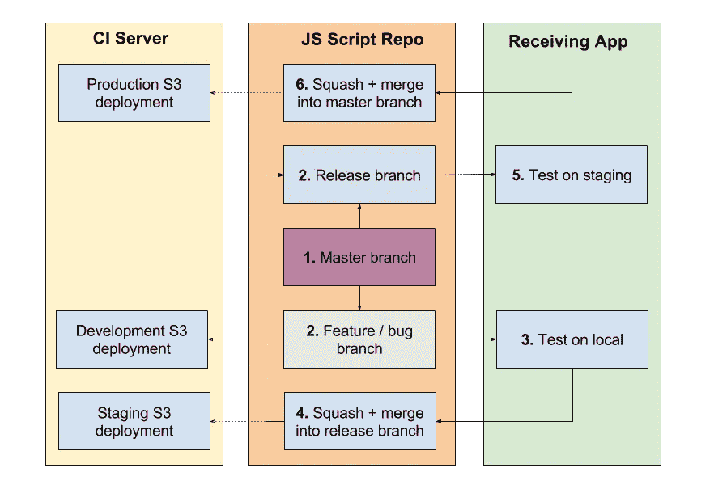
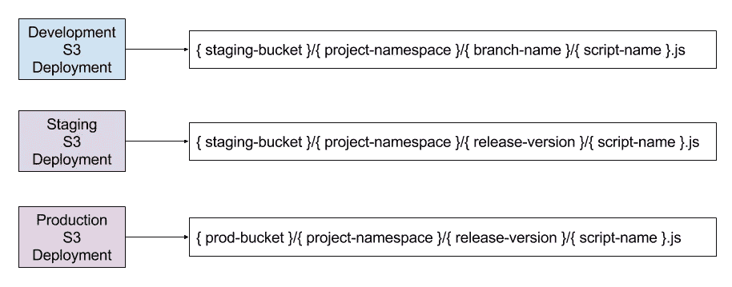
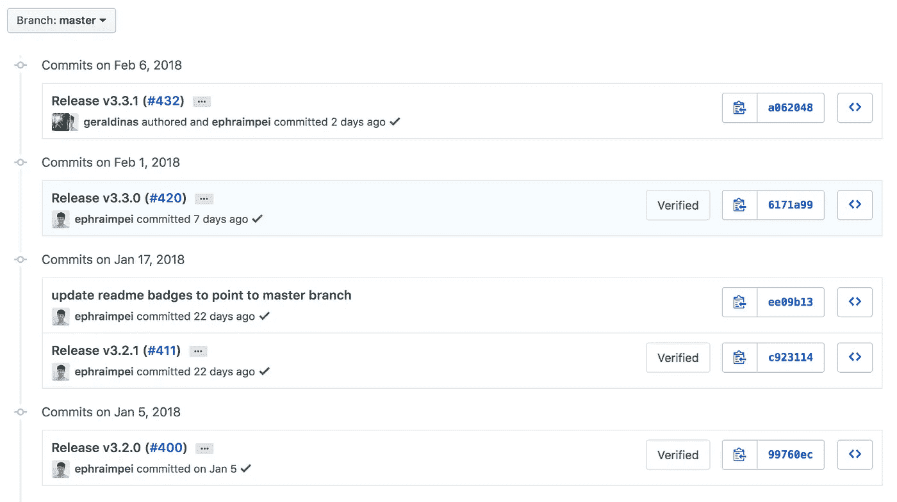

# 可扩展的 JS 脚本部署工作流

> 原文：<https://itnext.io/a-scalable-js-script-deployment-workflow-c206bc3cf8f6?source=collection_archive---------3----------------------->

你有一个团队为一个可发布的 JS 脚本做贡献吗？你是否认为你的开发和部署过程过于复杂？这篇文章也许能帮到你。

[*点击这里在 LinkedIn* 上分享这篇文章](https://www.linkedin.com/cws/share?url=https%3A%2F%2Fitnext.io%2Fa-scalable-js-script-deployment-workflow-c206bc3cf8f6)

假设有几个人在编写一个 JS 脚本，这个脚本需要在一个或多个目标应用程序的特定页面上运行。你的开发过程是什么样的？你如何测试特定的特性？你如何测试和部署一个完整的版本？没有完美的工作流，尤其是当越来越多的人加入到这个组合中来为同一个代码库做出贡献的时候。然而，我在这里分享一个过程和使能技术，它们正在为我在 VICE 的小团队工作。

在我们开始之前，这里有一些**需求、假设、**和**工具**来实现这个工作流:

**要求**:

*   必须能够轻松地允许多个开发人员在同一个代码库工作
*   必须能够轻松测试特定的错误修复或功能
*   必须能够在接收应用程序的试运行环境中轻松测试下一个版本
*   必须能够轻松触发试运行/生产部署
*   必要时必须能够轻松回滚

**假设**:

1.  接收应用程序有一个暂存环境
2.  自动气象站 S3 桶的前端是一个 CDN

**启用工具**:

1.  持续集成服务(Travis CI)
2.  云存储(AWS S3)
3.  云代码库(Github)
4.  一些简单的可执行脚本(Bash)

明白要点了吗？好的，酷，我们开始吧。

# 概观

首先，我们需要规划我们试图实现的工作流程。下面我创建了一个彩色的流程图，我希望不会太混乱…

开发和部署工作流

以下是上述步骤的概要:

1.  总支是起点
2.  从主分支创建的发布分支
    特性/从主分支创建的 bug 分支→ *触发 S3 部署*
3.  在接收应用程序上测试功能/缺陷(本地环境)
4.  特性/bug 分支被**挤压+合并**到发布分支→ *触发 S3 部署*
5.  一旦所有的功能和错误都在，发布将在接收应用程序(暂存环境)上进行测试
6.  发布分支**被压扁+合并**到主分支→ *触发 S3 部署*

现在我们有了一个高层次的概述，下面是 AWS S3 部署过程中幕后发生的事情…

AWS S3 部署路径

请注意上图中的开发 S3 部署也使用了 staging bucket(除了使用此 bucket 的 staging 部署之外)。其原因将在测试部分讨论。

现在，让我们来看看实现这一过程所需的项目…

# 设置分发(或构建)文件夹

启用这个工作流首先需要的是建立`dist`文件夹的*开发、试运行、*和*生产*构建。

1.  `npm run build-dev` → `./dist/{branch-name}/{bundle-name}.js`
2.  `npm run build-staging` → `./dist/{release-version}/{bundle-name}.js`
3.  `npm run build-prod` → `./dist/{release-version}/{bundle-name}.js`

尽管`staging`和`prod`构建将构建工件发送到同一个`dist`路径，但是假设这些构建在幕后是完全不同的。例如，`prod`构建已经缩减了代码，而`staging`构建没有。您可以有几个 Webpack 配置来启用这些不同的构建。此外，这里有一些提示可以帮助您构建所需的`dist`路径。

1.  **Branch name →** 您可以简单地访问`TRAVIS_BRANCH`环境变量(记住，构建将在 CI 服务器中执行)
2.  **发布版本** →可以导入`package.json`，从那里抓取`version`属性(假设更新到当前发布版本)。

您应该设置构建，以便它们也可以在本地执行以进行测试。因此，您应该能够在 Travis 上或在本地环境中提取分支名称。这里有一个简单的脚本来`echo`在 Travis 服务器或本地工作的分支名称:

在 Travis 上，我们需要执行一个`build_dist.sh`脚本，它将根据分支名称检测要执行哪个构建:

请注意，该脚本使用正则表达式匹配来检测分支是否是发布分支。我建议对发布分支有一个分支命名约定，这样这个检测是可能的。在这种情况下，惯例是`release-v#.#.##`。任何具有该名称的分支都被认为是一个发布，因此将执行阶段构建。

一旦构建完成，我们就可以继续前进了。

# 自动化 S3 部署

接下来，我们希望实现自动化 S3 部署。

*先决条件:*

*   构建工件可以按照上一节的说明构建到`dist`文件夹路径中
*   为存储库启用了 Travis CI
*   Travis CI 配置为执行 AWS S3 CLI 命令(*访问密钥*和*秘密访问密钥*可用)

1.创建一个可执行的`deploy_script.sh` bash 脚本，如下所示:

2.更新`travis.yml`以包括`build_dist.sh`和`deploy_script.sh`脚本，如下所示:

当构建在 Travis 上运行时，`build_dist.sh`脚本将使构建工件在`dist`文件夹中可用，`deploy_script.sh`脚本将触发 S3 部署。`deploy_script.sh`脚本将确定以哪个存储桶为目标，并使用 AWS S3 CLI `sync`命令将`dist`文件夹与该存储桶同步。假设我们在上一节中正确地设置了我们的构建，我们应该可以开始了。

# **测试功能/缺陷修复**

请注意，开发工作流部署到分段存储桶，并使用功能/ bug 分支名称作为附加的名称空间。这有两个好处:

1.  您可以轻松地修改`src`来测试接收应用程序中的脚本:
    `` *这里提到 CDN 域是因为它假设 S3 桶由 CDN 或边缘服务器提供(从而防止 S3 桶被公开访问，启用缓存、SSL 等)。)
2.  你不需要第三个发展 S3 桶。您只需要两个，一个暂存区和一个生产区。

一旦验证了特性/缺陷修复在接收应用程序中正常工作，就可以将分支**挤压** + **合并**到发布分支中。推入发布分支的提交将启动阶段部署，并允许测试下一个发布。

# 测试下一版本

一旦下一个版本在特性和错误修复方面被锁定，它需要在部署前被彻底测试。有了这个工作流，就像在`src`中更新版本路径一样简单，您的 JS 脚本在接收应用程序的暂存环境中下载:

``

通常有一个 QA 团队和/或一些由 Selenium/Cucumber 支持的自动化浏览器测试来接管发布测试。一旦一切看起来都很好，每个人都很高兴，**挤压+合并*** 发布分支成为主触发生产 S3 部署！所有接收应用程序还需要将更新后的`src`路径部署到它们的生产环境中。

*我更喜欢这里的**压扁+合并**的主要原因就是因为这个:

在主服务器上提交历史记录

在 master 上有这样一个提交历史的主要好处是发布被完全封装到一个提交中。这使得缩小与特定版本相关的回归或问题以及执行回滚变得更加容易…这就引出了我的下一个主题！

# 执行回滚

哦，糟糕……有东西爆炸了！

在惊慌失措了一会儿并得出结论认为不可能轻松修复之后，是时候回滚了！使用此工作流，您可以让接收应用程序更新`src`路径以反映先前的版本，从而完成回滚。与此同时，您和您的团队可以继续发布后续补丁。太简单了，感觉像作弊！

# 结论

使用这个部署工作流，您可以让几个人在同一个项目上无缝地工作，同时无论在什么环境下都可以自信地测试和部署变更。您可以像对待任何其他第三方脚本一样对待该脚本。如果当前版本是坏的，你可以简单地下载另一个已知稳定的版本。我的团队开发了 VICE Video Embedded Web Player，它本质上是一个运行在嵌入式页面(iframes)上的 JS 脚本。这个团队由三个人组成，这个过程对我们来说非常有效。

我希望你喜欢这本书，并学到一些新东西！欢迎在评论区留下任何问题、评论或建议！