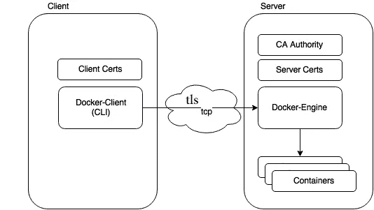

# 保护 Docker 守护程序连接的脚本

> 原文：<https://itnext.io/a-script-to-secure-docker-daemon-connections-c3d77fb9d260?source=collection_archive---------4----------------------->

安全总是很重要，尤其是当你在上网的时候。

在这里找到代码: [**GITHUB**](https://github.com/hosein-yousefii/docker-daemon-tls)


如今，管理员更喜欢远程连接到 docker 守护进程来完成他们的工作，但是，如果没有 TLS，这将是一个大错误。

我们希望对 docker 守护进程实现 TLS(自签名),以保护远程连接。

**为什么它很重要？！！**

从安全角度来看，互联网上任何没有加密的东西都是危险的。想象一下，你连接到 docker 守护进程，一个黑客在中间监听，所以，黑客可以读取你发送到 docker 守护进程的所有信息，这一点都不好！



在这幅图中，我们用 TLS 保护了与服务器的连接，以便加密客户机和 docker 引擎之间的流量。

我写了一个脚本来帮助实现 TLS 到 docker 守护进程。从我的 [**GITHUB**](https://github.com/hosein-yousefii/docker-daemon-tls) 下载。

**首先:** 我们需要更改“/etc/docker/daemon.json”中的 docker 引擎配置文件，以添加几行代码来使用 tls。

```
if [[ -e /etc/docker/daemon.json  ]]
then

 cp /etc/docker/daemon.json /etc/docker/daemon.json.bk

 if [[ $(grep -ari 'tls' /etc/docker/daemon.json) ]]
 then echo "INFO: Probably your docker already has tls configuration"
  echo "INFO: Please check /etc/docker/daemon.json, and ensure there isn't any tls configuration." rm -rf /etc/docker/daemon.json.bk
  exit 0 else sed -i '2 i \"tls\": true,\n' /etc/docker/daemon.json
  sed -i '2 i \"tlscacert\": \"/etc/docker/tls/ca.pem\",\n' /etc/docker/daemon.json
  sed -i '2 i \"tlscert\": \"/etc/docker/tls/server-cert.pem\",\n' /etc/docker/daemon.json
  sed -i '2 i \"tlskey\": \"/etc/docker/tls/server-key.pem\",\n' /etc/docker/daemon.json
  sed -i '2 i \"tlsverify\": false,\n' /etc/docker/daemon.json fi

 if [[ ! $(grep -ari 'hosts' /etc/docker/daemon.json) ]]
 then sed -i '2 i \"hosts\": [\"fd://\",\"unix:///var/run/docker.sock\",\"tcp://0.0.0.0:2376\"],\n' /etc/docker/daemon.json fiif [[ ! $(grep -ari 'live-restore' /etc/docker/daemon.json) ]]
 then sed -i '2 i \"live-restore\": true,\n' /etc/docker/daemon.json fielse echo -e "{\n  \"live-restore\": true,\n  \
  \"hosts\": [\"fd://\",\"unix:///var/run/docker.sock\",\"tcp://0.0.0.0:2376\"],\n  \
  \"tls\": true,\n  \
  \"tlscacert\": \"/etc/docker/tls/ca.pem\",\n  \
  \"tlscert\": \"/etc/docker/tls/server-cert.pem\",\n  \
  \"tlskey\": \"/etc/docker/tls/server-key.pem\",\n  \
  \"tlsverify\": false\n  \
  }" >> /etc/docker/daemon.jsonfi
```

**其次:** 我们应该根据 docker 主机 IP 地址为服务器、客户端和 CA(证书颁发机构)创建密钥和证书，因为它是自签名的。

```
### CA certificate                             
openssl genrsa -out ca-key.pem 4096 &> /dev/null                             openssl req -new -x509 -days 365 -key ca-key.pem -sha256 -out ca.pem -subj "/CN=$DOCKER_ADDRESS" &> /dev/null ### SERVER certificate                             
openssl genrsa -out server-key.pem 4096 &> /dev/null                             openssl req -subj "/CN=$DOCKER_ADDRESS" -sha256 -new -key server-key.pem -out server.csr &> /dev/null echo subjectAltName = DNS:IP:127.0.0.1,IP:$DOCKER_ADDRESS > extfile.cnf                             
echo extendedKeyUsage = serverAuth >> extfile.cnf openssl x509 -req -days 365 -sha256 -in server.csr -CA ca.pem -CAkey ca-key.pem   -CAcreateserial -out server-cert.pem -extfile extfile.cnf &> /dev/null ### CLIENT certificate                             
openssl genrsa -out key.pem 4096 &> /dev/null                             openssl req -subj '/CN=client' -new -key key.pem -out client.csr &> /dev/null echo extendedKeyUsage = clientAuth > extfile-client.cnf openssl x509 -req -days 365 -sha256 -in client.csr -CA ca.pem -CAkey ca-key.pem   -CAcreateserial -out cert.pem -extfile extfile-client.cnf &> /dev/null chmod 0400 ca-key.pem key.pem server-key.pem ca.pem server-cert.pem cert.pem
```

**最后:** 重启 docker 守护进程后，将客户端证书复制到“/etc/docker/tls/client”中你想要远程连接的地方。
然后使用以下命令连接到 docker 守护程序:

```
docker -H tcp://$(hostname -I|awk '{print $1}'):2376 --tlsverify --tlscacert=ca.pem --tlscert=cert.pem --tlskey=key.pem ps
```

祝贺你，现在你可以安全地连接到守护进程了。

建议使用脚本来实现 TLS。

祝你今天过得愉快！