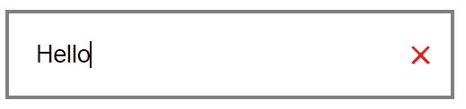
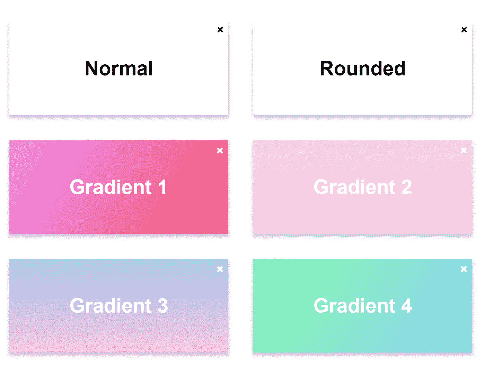
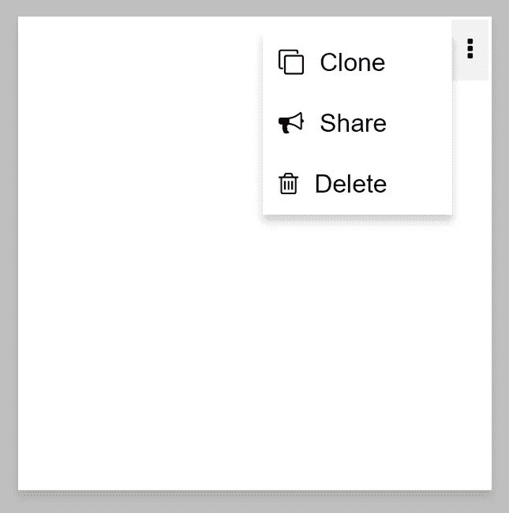
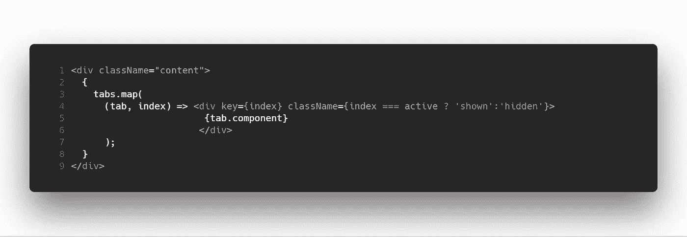

# 满足您日常需求的手工 React 组件清单

> 原文：<https://itnext.io/a-short-list-of-handmade-react-components-that-will-fit-your-daily-needs-81a1e2c9e032?source=collection_archive---------1----------------------->

[JESHOOTS.COM](https://unsplash.com/@jeshoots?utm_source=medium&utm_medium=referral)在 [Unsplash](https://unsplash.com?utm_source=medium&utm_medium=referral) 上的照片

我使用 React 已经有一段时间了，但我仍然对它缺乏帮助构建健壮和直观界面的日常组件包感到惊讶。

我发现，不管 React 社区有多大，我在搜索社区制作的组件上花费的时间比自己制作的组件多得多。

本文将介绍解决前端开发中日常需求的一些小组件。

没有图书馆，只有手工制作的东西，你可以随时定制。
随 Codepen 演示一起提供的完整源代码。

# 1.可擦除输入

仅当输入不为空时，十字才会显示

**工作原理:**

*   一个`div`包含一个`input`和一个`span`
*   `input`占据了所有的空间，并有填充以防止文本出现在删除按钮下。
*   `span`是删除按钮，位于输入的顶部，有条件地显示。单击时，输入将被清除并消失。

**解决的问题/优点:**

*   摆脱桌面和手机上的键盘。
*   在手机上，触摸输入并一直按下`delete`键直到所有东西都被清理干净是一件痛苦的事情。

**演示:**

开始打字！ [✍](https://emojipedia.org/writing-hand/)

# 2.卡片

那些花哨的渐变来自 https://webgradients.com/

由于材料设计和值得使用，卡片无疑受到了欢迎。

**工作原理:**

*   卡片只是一个带`box-shadow`的长方形
*   删除按钮*(可选)*相对于卡片放置在右上角([见此了解其工作原理](https://dmware.fr/4-css-tricks-ive-learnt-the-hard-way/))

**解决的问题/优点:**

*   显示相似打包信息的列表。
*   非常通用的组件(它可以托管按钮、图像、标签等等)。
*   使用`CSS Flexbox`或`CSS Grid`很容易提供一个响应性的结构化布局。
*   易于动画制作和定制，适用于任何类型的内容(员工详细信息、航班信息、旅游展示、feed)

**演示:**

点击删除按钮！

# 3.下拉菜单

您可以使用右上角的省略号按钮|材质来切换

我把它和一张⬜️.卡片结合在一起

**工作原理:**

*   一个`div`有一个孩子`div`是切换按钮，另一个孩子`div`是实际的菜单。
*   切换按钮是一个带有一些`padding`的`div`，使得点击更容易(比如在更大的表面上)。单击时，组件的状态会切换一个`active`属性，该属性决定菜单是否显示以及切换按钮是否有灰色背景。
*   菜单是一个包含一个`ul`的`div`。`active`状态的属性决定了这个`div`是`expanded`还是`collapsed`(又名显示或隐藏)。
*   **菜单项通过使用对象数组的属性传递，这些对象包含:** `**label | icon | onClick**` **，其中** `**onClick**` **为实际函数。**

**解决的问题/优点:**

*   为任何组件提供一个易于集成的菜单(类似于上下文菜单)
*   当没有更多可用空间来显示菜单时非常有用。
*   不引人注目且易于定制。

**演示:**

# 4.选项卡式窗格

具有自动生成的按钮和活动样式的导航栏

**警告:**

我的方法一次只渲染一个组件。

这意味着，如果您填写了一个表单并更改了 tab，当您返回时，该表单将是空的。

这很容易绕过，就像使用导航按钮一样，您可以这样做:

**工作原理:**

*   一个`TabbedPane`有一个`tabs`组件的属性，和一个`active`状态的属性，该属性决定显示哪个选项卡。
*   `tabs`是由:`label | component`表示的对象数组，其中`component`是实际的 JSX 组件。`label`决定导航栏中显示的内容。
*   一次只有一个选项卡被呈现为 T2，导航按钮更新状态的属性

**解决的问题/优势:**

*   无需换页即可显示多块板。
*   非常适合多步骤流程，如注册(个人信息、公司信息、银行信息)。
*   可以用于任何类型的导航(侧栏，顶栏，底栏)。
*   开箱即用，处理活动链接样式。

**演示:**

我共享的一些组件可能有库，但是:

*   从定制到功能，控制你所使用的是一个真正的游戏规则改变者。
*   如果有什么东西坏了，你是唯一的责任人。
*   如果你想扩展一个组件，你会知道怎么做，因为你是自己做的。

# 感谢阅读

我很高兴分享这些组件，并希望它能帮助你👌。

我可以建议你看一下我的上一篇文章吗？

[**制作自己的类似 Youtube 的进度条**](https://dmware.fr/make-your-own-youtube-like-progress-bar/)

欢迎联系☕️的[**https://DM ware . fr**](https://dmware.fr)

[吴怡](https://unsplash.com/@takeshi2?utm_source=medium&utm_medium=referral)在 [Unsplash](https://unsplash.com?utm_source=medium&utm_medium=referral) 上的《白色马克杯里的卡布奇诺，白色泡沫艺术在木桌上》